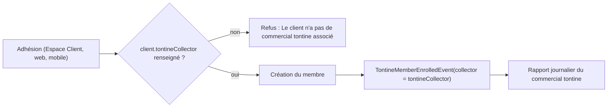

# Rattacher l'adhésion tontine au rapport du commercial tontine

## Ce que j'ai compris

- Aujourd'hui, `TontineService.registerMember` impute l'adhésion au rapport de `savedMember.getCreatedBy()`, c'est-à-dire la personne qui a fait la saisie. Quand le client s'inscrit lui-même depuis l'Espace Client, c'est son propre identifiant (ex. `93047800`) : un rapport journalier est donc créé à son nom (votre capture).
- Règle cible : le rapport journalier ne concerne que les commerciaux. Une adhésion est toujours comptée dans le rapport du **commercial tontine du client** (`client.tontineCollector`), quelle que soit la source (Espace Client, web ou mobile). `createdBy` ne sert plus jamais à choisir le rapport, et il n'y a pas de repli sur le commercial crédit (`collector`).
- Si le client n'a pas de commercial tontine, l'adhésion est **refusée** avec un message, comme pour les collectes tontine (`resolveCollectionCommercialUsername`).
- Les rapports déjà créés au nom de clients restent tels quels : la correction ne vaut que pour l'avenir.

## Impact vérifié

- Espace Client : à l'activation, un commercial tontine est obligatoirement attribué au client (`ClientRegistrationAdminService` l. 107-111). Pas de blocage pour un client actif.
- Mobile : à la synchronisation, le client reçoit `tontineCollector = commercial` (`client-sync.service.ts`, `synchronization.service.ts`). En synchro groupée (`registerMembers`), un membre refusé tombe dans la liste `fail` sans bloquer les autres.
- Web : le formulaire client contient déjà le champ commercial tontine. Seuls les anciens clients sans commercial tontine seront refusés, et ils ne pouvaient déjà pas recevoir de collectes.

## Modifications

1. [backend/src/main/java/com/optimize/elykia/core/service/tontine/TontineService.java](backend/src/main/java/com/optimize/elykia/core/service/tontine/TontineService.java)
   - Je reprends les changements déjà faits avant votre retour (repli sur `collector` puis `createdBy`, et log quand aucun commercial n'est trouvé).
   - Dans `registerMember`, juste après `clientService.getById(...)` et avant toute écriture, je résous le commercial tontine. S'il est vide, une `CustomValidationException` est levée : « Le client n'a pas de commercial tontine associé : impossible d'enregistrer l'adhésion. »
   - L'événement publie ce `tontineCollector` (après trim) à la place de `savedMember.getCreatedBy()`.
   - Je retire la méthode `resolveEnrollmentCommercialUsername` ajoutée plus tôt et la remplace par une résolution stricte, sur le modèle de `resolveCollectionCommercialUsername`.
2. [backend/src/test/java/com/optimize/elykia/core/service/tontine/TontineServiceTest.java](backend/src/test/java/com/optimize/elykia/core/service/tontine/TontineServiceTest.java)
   - Je remplace les tests ajoutés plus tôt par ceux-ci :
     - Espace Client avec `tontineCollector` : l'événement porte le commercial tontine, pas `createdBy = 93047800`.
     - Saisie par le personnel avec `tontineCollector` : idem, l'opérateur n'est pas utilisé.
     - Client sans `tontineCollector` : exception, aucun enregistrement du membre et aucun événement publié.
   - Les tests existants (`createMember_withUseRegistrationDateTrue...`, `registerMember_withCustomerSpaceSource...`) utilisent un client sans `tontineCollector` : j'en renseigne un pour qu'ils passent.
   - Lancer `TontineServiceTest`, puis `CustomerPortalServiceTest` (inscription depuis l'Espace Client).
3. Guide utilisateur : la nouvelle règle de refus est visible par l'utilisateur.
   - [user-guide/docs/commercial/tontine.md](user-guide/docs/commercial/tontine.md) (section « Inscrire un nouveau membre ») et [user-guide/docs/commercial/mobile_app.md](user-guide/docs/commercial/mobile_app.md) (section B) : une phrase métier indiquant que le client doit avoir un commercial tontine pour être inscrit.
   - Régénérer l'index utilisé par Elykia IA : `python user-guide/generate_rag_index.py`.
   - Régénérer le guide HTML du frontend : `python -m mkdocs build -f user-guide/mkdocs.yml -d ../frontend/src/user-guide`.
4. Version et changelog : passer le backend en PATCH dans `backend/pom.xml` et ajouter une entrée `Fixed` sous `## Backend` dans [docs/CHANGELOG.md](docs/CHANGELOG.md).

## Hors périmètre

- Pas de migration ni de nettoyage des rapports déjà créés au nom de clients.
- Pas de changement des autres événements du rapport : ventes, collectes, commandes et livraisons utilisent déjà le commercial rattaché au client ou à l'opération, jamais `createdBy`.
- Pas de changement de schéma, donc rien à mettre à jour dans le catalogue de schéma d'Elykia IA.