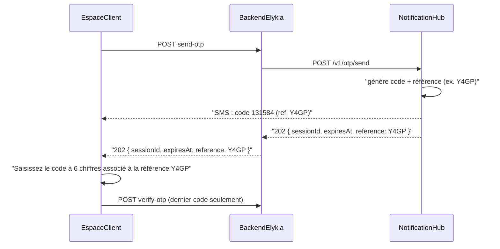

---
todos:
  - id: hub-reference
    status: completed
    content: 'Notification Hub : génération centralisée de la référence (4 car.), {{reference}} dans le SMS, champ reference dans OtpSendResponse (+ starter), tests, doc, push main puis CD promote'
  - id: be-otp-reference
    status: completed
    content: 'Backend ELYKIA : lire reference de la réponse hub et la renvoyer dans send-otp, tests'
  - id: be-localities
    status: completed
    content: 'Backend ELYKIA : GET /api/customer/auth/localities + validation quarter = localité existante + tests, bump 1.24.0'
  - id: cs-resend
    status: completed
    content: 'Customer-space : bouton Renvoyer le code (délai 60 s) + affichage de la référence, mobile + desktop'
  - id: cs-scroll
    status: completed
    content: 'Customer-space : wrapper ion-content desktop + SCSS pour défilement du formulaire'
  - id: cs-locality-picker
    status: completed
    content: 'Customer-space : ElykLocalityPickerComponent (recherche) + getLocalities + libellé Ma zone (Localités)'
  - id: cs-hint
    status: completed
    content: 'Customer-space : nouveau message d''accueil (mobile + desktop)'
  - id: cs-tests
    status: completed
    content: Specs AuthPage/picker + e2e register-onboarding (mock localities + référence)
  - id: release
    status: in_progress
    content: 'Guide connexion.md + regen RAG, bump 0.10.0, CHANGELOG, tests, commit/push, vérif clients-test (SMS test avec référence)'
name: Auth espace client v0.10
overview: 'Connexion et inscription de l''espace client : bouton « Renvoyer le code » ; référence alphanumérique à 4 caractères générée par le Notification Hub pour chaque OTP, incluse dans le SMS et renvoyée à l''application pour affichage ; défilement du formulaire d''inscription en desktop ; « Ma zone (Localités) » choisie dans une liste fournie par le backend ; nouveau message d''accueil.'
isProject: false
---

# Espace client : renvoi OTP avec référence, défilement desktop, Ma zone (Localités), message d'accueil

## Constats

- **OTP côté hub** (fournisseur `internal` sur Contabo) :
  - chaque envoi **remplace** la session du numéro, et ELYKIA vérifie par numéro : **seul le dernier code est valide** ; la référence permet de repérer ce dernier SMS ;
  - le texte du SMS vient de `otp.sms-body-template`, qui ne connaît que `{{code}}` et `{{ttlMinutes}}` : il faut une évolution du hub pour y ajouter la référence ;
  - le hub impose **60 s** entre deux envois (`OTP_RESEND_COOLDOWN_SECONDS`, erreur 429 déjà traduite par ELYKIA) : le délai du bouton « Renvoyer » passe à 60 s.
- **Défilement** : en desktop, `<app-auth-desktop>` est rendu hors de tout `ion-content` dans [auth.page.html](customer-space/src/app/features/auth/auth.page.html). La page Ionic masque ce qui dépasse.
- **Localités** : le changement n'a jamais été fait. Partout dans l'app, `client.quarter` contient déjà un nom de localité ; on garde ce champ. Environ 90 localités (87 en test, 93 en prod) : il faut une liste avec recherche. `/api/customer/auth/**` est déjà accessible avant connexion.

## 1. Notification Hub : référence centralisée (déployé en premier)

La référence est générée par le hub, pour que toutes les applications clientes en profitent sans développement supplémentaire.

- `OtpReferenceGenerator` (à côté de `OtpCodeGenerator`) : 4 caractères `SecureRandom` dans l'alphabet sans caractères ambigus `ABCDEFGHJKLMNPQRSTUVWXYZ23456789` ; longueur configurable `otp.reference-length` (`OTP_REFERENCE_LENGTH`, 4 par défaut).
- `InternalOtpProvider.send` :
  - génère la référence avec le code ;
  - remplace `{{reference}}` dans le texte du SMS ;
  - l'ajoute aux métadonnées de la notification (`otpReference`) et à l'audit.
- Texte SMS par défaut (`OTP_SMS_BODY_TEMPLATE`) : `Votre code de verification est {{code}} (ref. {{reference}}). Valide {{ttlMinutes}} minutes.` Un texte personnalisé sans `{{reference}}` continue de fonctionner.
- `OtpSendResponse` : nouveau champ `reference`, ajouté en fin de record pour garder la compatibilité ; les constructeurs existants sont conservés.
  - fournisseur `twilio-verify` : `reference = null`, car Twilio génère et envoie lui-même le SMS ;
  - WhatsApp (modèle Meta/Twilio) : la référence est renvoyée mais n'est pas dans le message ; c'est documenté.
- Starter `sb-notification-hub-starter` ([mvn/](../notification-hub/mvn)) : champ `reference` dans son `OtpSendResponse`.
- La copie email du mode test reprend le texte du SMS, donc la référence y figure.
- Tests unitaires : générateur, texte du SMS, présence de la référence dans la réponse. Doc [OTP_CLIENT_INTEGRATION.md](../notification-hub/backend/docs/OTP_CLIENT_INTEGRATION.md) : champ `reference` et recommandation d'affichage « code associé à la référence XXXX ».
- Commit et push sur `main` (la CI construit l'image), puis `gh workflow run cd.yml -f action=promote` (déploiement du hub de prod Contabo) et vérification avec un envoi test.

## 2. Backend ELYKIA (1.23.0 vers 1.24.0)

- [NotificationHubOtpModels.java](backend/src/main/java/com/optimize/elykia/core/notificationhub/NotificationHubOtpModels.java) : champ `reference` dans `OtpSendResponse` (inconnu toléré tant que le hub n'est pas à jour).
- `CustomerOtpSendResponse` : nouveau champ `reference`, rempli dans [CustomerAuthService.java](backend/src/main/java/com/optimize/elykia/core/service/customer/CustomerAuthService.java) `sendOtp` à partir de la réponse du hub ; la référence apparaît dans le log « OTP envoyé ».
- [CustomerAuthController.java](backend/src/main/java/com/optimize/elykia/core/controller/customer/CustomerAuthController.java) : `GET /api/customer/auth/localities`, liste publique `[{id, name}]` triée par nom (DTO `CustomerLocalityDto`).
- [CustomerRegistrationService.java](backend/src/main/java/com/optimize/elykia/core/service/customer/CustomerRegistrationService.java) : inscription refusée si `quarter` n'est pas une localité existante, avec le message « Veuillez choisir votre zone dans la liste. ».
- Tests unitaires : référence du hub transmise à l'application ; localité inconnue refusée ; liste triée.

## 3. Customer-space (0.9.3 vers 0.10.0)

- **Référence et renvoi** (mobile et desktop, écrans `otp` et `register-otp`) :
  - sous-titre : « Saisissez le code à 6 chiffres reçu par SMS associé à la référence **Y4GP** » (référence mise en évidence, `data-testid="e2e-auth-otp-reference"`) ; sans référence renvoyée, on garde « Un code a été envoyé par SMS » ;
  - lien-bouton « Renvoyer le code » désactivé 60 s, avec le libellé « Renvoyer le code (45 s) » ;
  - au clic : nouvel envoi, champ vidé, nouvelle référence affichée et message « Nouveau code envoyé. Seul le code de référence Y4GP est valide. » ;
  - `data-testid="e2e-auth-otp-resend"` ; entrées `otpReference`, `resendCountdown` et sortie `resendOtp` dans [auth-desktop.component.ts](customer-space/src/app/features/auth/desktop/auth-desktop.component.ts) ;
  - mode E2E (OTP court-circuité) : référence fictive `E2E1`.
- **Défilement desktop** : `<ion-content>` autour de `<app-auth-desktop>`, et ajustement de [auth-desktop.component.scss](customer-space/src/app/features/auth/desktop/auth-desktop.component.scss) (`min-height: 100%`, pas de centrage vertical forcé quand le formulaire est long).
- **Ma zone (Localités)** :
  - composant partagé `ElykLocalityPickerComponent` ([shared/ui](customer-space/src/app/shared/ui)) :
    - il s'utilise comme un champ de formulaire normal (`formControlName="quarter"`) et se présente comme les autres champs ;
    - il ouvre une fenêtre avec une barre de recherche ; les zones de clic font au moins 44 px ;
    - `data-testid="e2e-auth-register-quarter"` ;
  - `CustomerApiService.getLocalities()` : chargement à l'étape `register-form`, avec un indicateur de chargement et un bouton « Réessayer » en cas d'erreur.
- **Message d'accueil** : « Pas encore de compte ? Saisissez simplement votre numéro de téléphone et laissez-vous guider. »
- Tests : specs `AuthPage` (référence, renvoi et délai, localités) et spec du composant de sélection ; e2e [register-onboarding.spec.ts](customer-space/e2e/specs/auth/register-onboarding.spec.ts) (bouchon des localités et sélection de la zone).

## Livraison

- Guide [user-guide/docs/customer/connexion.md](user-guide/docs/customer/connexion.md) :
  - référence affichée et présente dans le SMS ;
  - « Renvoyer le code » : seul le dernier code est valide ;
  - « Ma zone » choisie dans la liste ;
  - nouveau message d'accueil.
- Puis `python user-guide/generate_rag_index.py`.
- Montées de version, `docs/CHANGELOG.md`, tests backend et customer-space.
- Ordre de livraison :
  1. hub (push, puis CD promote) ;
  2. ELYKIA (push, puis CD test) ;
  3. vérification sur `clients-test` : la référence de l'écran doit être identique à celle de l'email reçu sur `sms@optimizesolux.com`.
