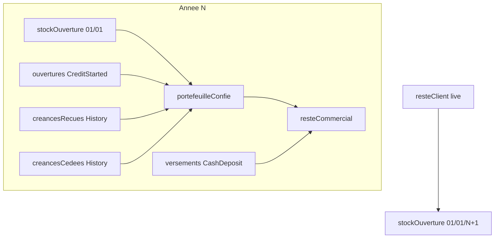

# Bilan annuel — option B (portefeuille avec stock au 01/01)

## Règle métier figée

Pour commercial `C` et année `N` (journalier **intact**) :

```
stockOuverture     = Σ remaining des crédits détenus par C au 01/01/N 00:00
ouvertures         = Σ creditSalesAmount journaliers de C sur N   (inchangé)
creancesRecues     = Σ totalAmountRemaining des passations vers C en N
creancesCedees     = Σ totalAmountRemaining des passations depuis C en N
portefeuilleConfie = stockOuverture + ouvertures + creancesRecues − creancesCedees
versements         = Σ totalCreditAmountDeposited journaliers de C sur N  (inchangé)
resteCommercial    = portefeuilleConfie − versements
resteClient        = Σ totalAmountRemaining live, collector = C, remaining > 0  (pont N→N+1)
```

**Choix KPI** : un seul « Reste chez le commercial » = `portefeuilleConfie − versements`, avec les composantes visibles en second plan (hints / sous-KPI).



## Backend

### 1. Étendre le DTO

[`CommercialYearlySummaryDto.java`](backend/src/main/java/com/optimize/elykia/core/dto/report/CommercialYearlySummaryDto.java) :

- Ajouter : `openingStockAmount`, `creditsReceivedAmount`, `creditsCededAmount`, `entrustedPortfolioAmount`
- Garder : `totalCreditSalesAmount` (= ouvertures), `totalCreditDepositedAmount`, `totalCreditSalesCount`
- Redéfinir : `remainingAtCommercialAmount` = `entrustedPortfolioAmount − totalCreditDepositedAmount`
- Redéfinir : `remainingAtClientAmount` = somme live **tous crédits** chez C (plus seulement `beginDate` dans N)
- `totalCreditPaidOnCreditsAmount` : restreindre aux crédits **actuellement** chez C (info secondaire), ou le retirer de l’UI primaire

### 2. Créances reçues / cédées

Dans [`CreditCollectorHistoryRepository.java`](backend/src/main/java/com/optimize/elykia/core/repository/CreditCollectorHistoryRepository.java) :

```sql
-- TOUTES les passations de l'année (pas DISTINCT ON latest)
SUM(total_amount_remaining) WHERE new_collector = :C AND change_date in [01/01/N, 01/01/N+1)
SUM(total_amount_remaining) WHERE old_collector = :C AND change_date in [01/01/N, 01/01/N+1)
```

Ne **pas** réutiliser `aggregateByCollectorPair` (latest-per-credit) : une double passation dans l’année doit compter chaque reste à sa date.

### 3. Stock d’ouverture au 01/01/N

Nouvelle requête (native ou JPQL + service) :

1. **Titulaire au 01/01/N** pour chaque crédit `ENABLED` / `CREDIT` :
   - dernière passation avec `change_date < 01/01/N` → titulaire = `new_collector`
   - sinon aucune passation avant N → titulaire = collector actuel **si** aucune passation en N+… wait: if first transfer is after 01/01, holder at 01/01 was `old_collector` of the first transfer after 01/01; if never transferred, holder = current `credit.collector`
2. **Reste au 01/01/N** :
   - `GREATEST(0, total_amount − COALESCE(SUM(timeline.amount) WHERE date < 01/01/N), …)`  
   - S’aligner sur la façon dont `totalAmountPaid` est alimenté (timeline + avance) ; tests de non-régression sur un crédit avec avance + collectes.

Fichiers : [`CreditRepository`](backend/src/main/java/com/optimize/elykia/core/repository/CreditRepository.java) + éventuellement timeline.

### 4. Reste client live + modal

- Adapter `sumRemainingAtClients` / listes paginées : filtre `collector = C`, `remaining > 0`, **sans** contrainte `beginDate` dans l’année (ou paramètre `year` optionnel retiré pour ce KPI).
- PDF / modal « Reste chez le client » : même périmètre (crédits encore dus chez C, toutes années d’origine).
- Sous-titre UI : préciser « soldes live du portefeuille actuel ».

### 5. Service yearly summary

Refactor [`CommercialReportMonthlyService.getYearlySummary`](backend/src/main/java/com/optimize/elykia/core/service/report/CommercialReportMonthlyService.java) (ou service dédié `CommercialYearlyPortfolioService`) pour assembler les 4 briques + versements + KPIs dérivés. **Aucun** write sur `DailyCommercialReport`.

### 6. Tests

- Scénario A démarre 100k, verse/collecte 40k, cède 60k → A : ouvertures 100k, cédées 60k, portefeuille 40k, versements 40k, reste commercial ≈ 0 ; B : reçues 60k, reste commercial 60k.
- Passation 15/12/N, versement B en N+1 → reçu compté en N chez B ; versement en N+1 ; stock ouverture N+1 chez B ≈ reste live.
- Double passation A→B→D dans N : sommes cumulées des restes à chaque date.

## Frontend

[`daily-report.component.html`](frontend/src/app/report/pages/daily-report/daily-report.component.html) + model TS :

- Bande KPI élargie (ou 2 rangées) :
  - Ventes (ouvertures) | Versements | Portefeuille confié | Reste commercial | Reste client (cliquable)
- Hints sous portefeuille / reste commercial : `stock + ouvertures + reçues − cédées`
- Modal : libellés alignés sur le nouveau périmètre live

## Hors scope

- Pas de modification des daily reports ni des flux de passation (`changeCollector`)
- Pas de table de snapshot annuelle (reconstruction à la volée) ; un job de snapshot pourra être ajouté plus tard si perf insuffisante

## Versions

- Backend patch + Frontend patch + [`docs/CHANGELOG.md`](docs/CHANGELOG.md)
