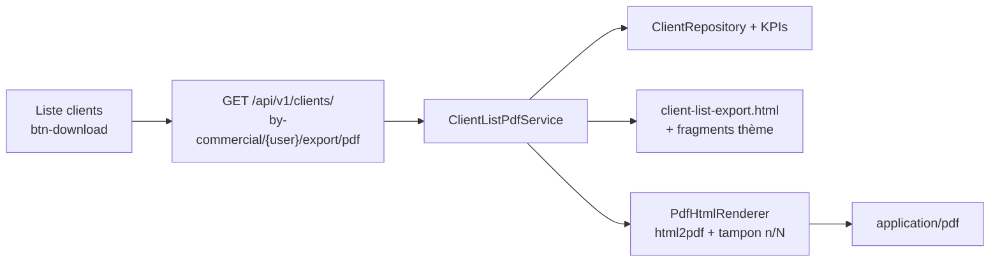

# Export PDF Fiche Client + thème navy réutilisable

## Contexte

Les PDF existants (Thymeleaf + iText 7 `HtmlConverter`) n’ont **pas** de pied de page `n/N`, et le nom d’entreprise est recopié dans chaque template. La liste clients ([client-list.component.html](frontend/src/app/client/client-list/client-list.component.html)) n’a pas d’export. Le domaine `client` est **déjà lazy-loaded** — pas de migration routing.

Le bouton PDF n’apparaît que si `selectedCommercial` est non nul (même règle que l’export tontine). Un promoteur auto-sélectionné verra donc le bouton.

Le PDF contient **tous** les clients actifs du commercial (pas seulement la page / la recherche courante).

## Architecture

## 1. Thème PDF partagé (à réutiliser ensuite)

Ne pas migrer les anciens templates. Extraire le style **une fois** pour ce PDF et tous les suivants.

**Identité entreprise** dans [PdfDocumentIdentity.java](backend/src/main/java/com/optimize/elykia/core/service/report/PdfDocumentIdentity.java) :

- Nom : `AMENOUVEVE-YAVEH`
- Adresse : `TOKOIN HÔPITAL`
- Téléphone : `96186822`
- Couleur primaire : `#003366` (navy frontend)

**Rendu** [PdfHtmlRenderer.java](backend/src/main/java/com/optimize/elykia/core/service/report/PdfHtmlRenderer.java) :

- `htmlToPdf(html)` via iText 7 `HtmlConverter` + `PdfDocument`
- Après conversion, tamponner chaque page : bande navy en bas + `i/total` à droite (ex. `1/30`, `10/30`)
- Marges `@page` assez basses pour que le tableau ne chevauche pas le footer

**Fragments Thymeleaf** sous `backend/src/main/resources/templates/pdf/` :

- `pdf-theme.css` — tokens navy (`#003366`, `#002244`, `#e8eef6`, `#f0f4f9`, `#dde3ec`)
- `fragments.html` — en-tête obligatoire : bande navy, nom, adresse, téléphone, **titre du document** (ex. `Fiche Client`)

**Skill Cursor** [`.cursor/skills/elykia-pdf-style/SKILL.md`](.cursor/skills/elykia-pdf-style/SKILL.md) : tout nouveau PDF doit passer par `PdfHtmlRenderer` + fragments + `PdfDocumentIdentity`. Ne pas recréer un CSS ad hoc.

## 2. Mise en page « Fiche Client »

En-tête (fragment) puis bloc document :

- Commercial (prénom + nom si trouvable, sinon username)
- Date de génération `dd/MM/yyyy HH:mm`

**KPIs** (déjà exposés par `ClientService.getClientKpis`) en 4 cartes :

- Clients enregistrés
- Crédit en cours
- Membres tontine
- Sans crédit ni tontine

**Tableau** groupé par quartier (`quarter`), tri nom/prénom. Colonnes : `#` | Nom | Prénom | Téléphone | Adresse | Crédit | Tontine.

Pied de page répété : `AMENOUVEVE-YAVEH · Fiche Client` à gauche, `n/N` à droite.

## 3. Backend

- Requête dédiée dans [ClientRepository.java](backend-lib/elykia-client/src/main/java/com/optimize/elykia/client/repository/ClientRepository.java) : tous les clients `ENABLED` / `CLIENT` du commercial (`collector` **ou** `tontineCollector` **ou** `recoveryCollector`), tri quartier + nom. Nécessaire car `ClientRespDto` n’a pas `isTontineMember`.
- [ClientListPdfService.java](backend/src/main/java/com/optimize/elykia/core/service/client/ClientListPdfService.java) : charge la liste + KPIs, construit le DTO, rend le template.
- Endpoint dans un contrôleur core (même base `api/v1/clients` que [ClientCollectorAssignmentController](backend/src/main/java/com/optimize/elykia/core/controller/client/ClientCollectorAssignmentController.java)) :

`GET api/v1/clients/by-commercial/{commercial}/export/pdf` → `application/pdf`, `Content-Disposition: attachment; filename=fiche_client_{commercial}.pdf`

- Test unitaire : `PdfHtmlRenderer` (HTML 2 pages → texte `1/2` et `2/2`) + `ClientListPdfService` (mocks, HTML contient le titre et le commercial).

## 4. Frontend

- [client.service.ts](frontend/src/app/client/service/client.service.ts) : `exportClientsPdf(commercial): Observable<Blob>` (`responseType: 'blob'`).
- Bouton `.btn-download` dans `.filter-actions` (après Réinitialiser), `*ngIf="selectedCommercial"`, désactivé pendant le téléchargement. Style navy comme [stock-return-list.component.scss](frontend/src/app/stock/pages/stock-return-list/stock-return-list.component.scss).
- Téléchargement blob (même pattern que les retours stock).
- Pas de changement de routing.

## 5. Versions et changelog

- Frontend `2.16.6` → `2.16.7` (PATCH, bouton sur page existante)
- Backend `1.9.6` → `1.9.7`
- Entrées [docs/CHANGELOG.md](docs/CHANGELOG.md) : export Fiche Client + thème PDF navy réutilisable
