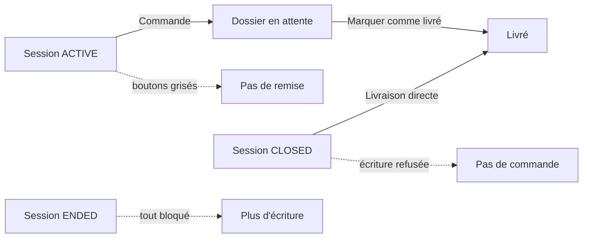

---
todos:
  - id: mobile-gate
    status: completed
    content: 'Session ACTIVE — Commande active, Livraison directe et Marquer comme livré grisés. Session CLOSED — remise active, Commande grisée. Session ENDED — les deux bloqués.'
  - id: backend-gate
    status: completed
    content: 'createDelivery seulement si ACTIVE. distribute et deliver seulement si CLOSED. Refus explicite sinon, avec tests.'
  - id: web-guide-changelog
    status: in_progress
    content: 'Aligner le bouton web Marquer comme Livré, le guide utilisateur, l''index RAG et le changelog'
name: Commande tontine session
overview: 'Autoriser la commande tontine seulement tant que la session est ouverte, et n’autoriser la livraison directe ainsi que « Marquer comme livré » que lorsque la session est CLOSED.'
isProject: false
---

# Commande tontine avant clôture, livraison après

Aujourd’hui, sur le mobile, **Commande** et **Livraison directe** sont toujours proposées ensemble dans [delivery-creation.page.ts](mobile/src/app/features/tontine/pages/delivery-creation/delivery-creation.page.ts), et **Marquer comme livré** dépend seulement du statut du dossier dans [member-detail.page.ts](mobile/src/app/features/tontine/pages/member-detail/member-detail.page.ts). Le contrôle backend « session CLOTUREE » dans [TontineDeliveryService.java](backend/src/main/java/com/optimize/elykia/core/service/tontine/TontineDeliveryService.java) est commenté : l’API accepte donc aussi une remise pendant une session `ACTIVE`.

Une session `CLOSED` n’accepte plus d’écriture (cotisation, inscription, commande). C’est le moment de la remise. `ENDED` (31 décembre, ou quand tous les membres sont livrés) n’accepte plus ni commande ni remise.

Règle visée :

- **Commande** (`POST /deliveries`, statut `PENDING`) : seulement si la session est `ACTIVE`.
- **Livraison directe** (`POST /deliveries/distribute`) et **Livrer** (`PATCH /{id}/deliver`) : seulement si la session est `CLOSED`.
- Session `ENDED` : aucune de ces écritures.

## Mobile

- Ajouter `ENDED` au type de session dans [tontine.model.ts](mobile/src/app/models/tontine.model.ts). Dans [tontine-delivery-status.util.ts](mobile/src/app/core/utils/tontine-delivery-status.util.ts) : `canCreateTontineOrder` vrai seulement pour `ACTIVE` ; `canPhysicallyDeliverTontine` vrai seulement pour `CLOSED`.
- Écran de création :
  - Session `ACTIVE` : **Commande** actif, **Livraison directe** visible mais grisé (« disponible une fois la session clôturée »).
  - Session `CLOSED` : **Livraison directe** actif, **Commande** visible mais grisé (« la session est clôturée »).
  - Session `ENDED` : les deux grisés.
  - Garde dans `processDelivery` selon le mode.
- Fiche membre : **Marquer comme livré** (carte et menu) visible mais désactivé tant que la session n’est pas `CLOSED`. **Livraison Fin d'Année** reste ouvert en session `ACTIVE` pour la commande, et en session `CLOSED` pour la remise. Garde aussi dans `markAsDelivered()`.

## Backend

- `createDelivery` : refuser si la session n’est pas `ACTIVE`.
- `distributeTontineDelivery` et `deliverDelivery` : refuser si la session n’est pas `CLOSED`.
- Message métier explicite dans les deux cas.
- Tests dans [TontineDeliveryServiceTest.java](backend/src/test/java/com/optimize/elykia/core/service/TontineDeliveryServiceTest.java) : commande acceptée en `ACTIVE`, refusée en `CLOSED` ; livraison directe et livrer acceptés en `CLOSED`, refusés en `ACTIVE` et en `ENDED`.

## Web (même règle de remise)

- **Marquer comme Livré** seulement si la session est `CLOSED`.
- **Préparer la Livraison** reste réservé à une session `CLOSED` : ce n’est pas le parcours commande du mobile.

## Guide et versions

- Mettre à jour [user-guide/docs/commercial/mobile_app.md](user-guide/docs/commercial/mobile_app.md) : la commande se fait pendant la campagne ouverte ; une fois la session clôturée, plus de commande, seulement la livraison directe et « Marquer comme livré ». Aligner [user-guide/docs/commercial/tontine.md](user-guide/docs/commercial/tontine.md).
- Régénérer l’index RAG et le guide HTML frontend.
- Changelog + bump de version mobile et backend.
