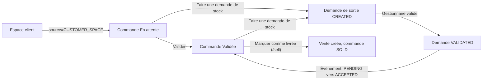

---
todos:
  - id: db-migration
    status: completed
    content: 'Migration V009 : orders.source + backfill CUSTOMER_SPACE + table stock_request_order'
  - id: order-source
    status: completed
    content: 'Enum OrderSource, champ Order.source, createOrder(dto, source), CustomerPortalService en CUSTOMER_SPACE, filtre source sur GET /orders et /kpis'
  - id: link-service
    status: completed
    content: Entite StockRequestOrderLink + OrderStockRequestService.createFromOrders (groupement par commercial) + POST /api/stock-requests/from-orders + activeStockRequest transient
  - id: validate-event
    status: completed
    content: StockRequestValidatedEvent + listener PENDING->ACCEPTED ; copie des liens sur reliquat de livraison partielle ; linkedOrderReferences
  - id: backend-tests
    status: completed
    content: Tests unitaires OrderStockRequestService et listener ; maj schema-catalog.json
  - id: front-shared
    status: completed
    content: 'Types/service orders (source, activeStockRequest, STOCK_REQUEST) + OrderStockRequestModalComponent reutilisable'
  - id: front-pages
    status: completed
    content: 'Routes /orders/online, dashboard/details pilotes par source (libelles, actions), action-bar multi-selection, badge En ligne, commandes liees sur demandes de sortie'
  - id: sidebar
    status: completed
    content: Sous-menu Commandes sous Services en ligne + logique active/ouverture dans sidebar.component.ts
  - id: guide-docs
    status: in_progress
    content: 'Guide utilisateur (manager, commercial), index RAG, build mkdocs frontend, CHANGELOG + versions, builds/tests'
name: Commandes en ligne et demandes de stock
overview: 'Distinguer les commandes passées depuis l''espace client (nouvelle colonne source), ajouter le sous-menu « Commandes » dans « Services en ligne » avec une page dédiée, et créer une fonctionnalité « Faire une demande de stock » réutilisable (unitaire et multi-sélection) sur la page en ligne et l''ancienne page Commandes. Quand le gestionnaire valide la demande de stock, les commandes liées encore en attente passent automatiquement à « Validée ».'
isProject: false
---

# Commandes en ligne et demandes de stock depuis les commandes

## Décisions retenues
- L'ancienne page « Commandes » continue d'afficher **toutes** les commandes, avec un badge « En ligne » sur celles de l'espace client. La nouvelle page n'affiche **que** les commandes en ligne.
- Multi-sélection avec des commerciaux différents : **une demande de stock par commercial** (le commercial du client), créées dans une seule transaction.
- Quantités **reprises des commandes** : articles regroupés, quantités additionnées. Une fenêtre de confirmation affiche le récapitulatif.
- Commandes éligibles : statut `PENDING` ou `ACCEPTED`, et sans demande de stock active (`CREATED`, `VALIDATED` ou `DELIVERED`). Une demande annulée ou refusée rend la commande de nouveau éligible.
- « Valider » correspond au statut existant `ACCEPTED`. « Marquer comme livrée » appelle l'existant `POST /api/v1/orders/{id}/sell`, qui passe la commande à `SOLD` et crée la vente. Aucun nouveau statut de commande.

## Backend
- **Migration `V009__order_source_and_stock_request_link.sql`** :
  - `orders.source VARCHAR(30) NOT NULL DEFAULT 'STAFF'` avec un CHECK sur (`STAFF`, `CUSTOMER_SPACE`).
  - Rattrapage des anciennes commandes en `CUSTOMER_SPACE` par jointure `customer_user_mapping` (`username = orders.reg_user_id` et même `client_id`). La correspondance du format username sera vérifiée pendant l'implémentation.
  - Nouvelle table `stock_request_order` (`id`, `stock_request_id` FK, `order_id` FK, colonnes d'audit, index sur `order_id`).
- **Source de la commande** :
  - Nouvel enum `OrderSource` (`STAFF`, `CUSTOMER_SPACE`), sur le modèle de `ClientRegistrationSource`.
  - Champ `source` dans [Order.java](backend/src/main/java/com/optimize/elykia/core/entity/sale/Order.java), visible dans le JSON.
  - Surcharge `createOrder(OrderDto, OrderSource)` dans [OrderService.java](backend/src/main/java/com/optimize/elykia/core/service/order/OrderService.java). L'actuelle `createOrder(dto)` délègue avec `STAFF`, et `CustomerPortalService.submitOrder` passe `CUSTOMER_SPACE`.
- **Filtre par source** :
  - `GET /api/v1/orders?status=&source=`, avec `source` optionnel (absent = toutes les commandes).
  - Nouvelles requêtes `findByStatusAndSource` et `findByStatusAndSourceAndClientCollector` dans `OrderRepository`.
  - Même paramètre optionnel sur `GET /kpis`.
- **Lien demande de stock / commande** :
  - Entité `StockRequestOrderLink` et son repository : recherche des liens par demande, demande active par commande, et chargement en lot pour la liste des commandes.
  - Champ `@Transient activeStockRequest` (`id`, `reference`, `status`) sur `Order`, rempli dans `getAllOrders` et `getById` en une seule requête.
- **Service réutilisable `OrderStockRequestService.createFromOrders(orderIds, forNextMonth)`** :
  - Vérifie le statut (PENDING ou ACCEPTED), l'absence de demande active, le commercial du client renseigné, et l'accès au portefeuille (même règle que `assertOrderPortfolioAccess`).
  - Regroupe les commandes par `client.collector` et, pour chaque commercial, additionne les quantités par article.
  - Construit une `StockRequest` avec la note « Commandes CMD-x, CMD-y », puis appelle l'existant `StockRequestService.createRequest(request, forNextMonth)`, ce qui conserve toutes les règles de prix et de référence.
  - Enregistre les liens et renvoie la liste des demandes créées.
- **Endpoint** : `POST /api/stock-requests/from-orders` dans [StockRequestController.java](backend/src/main/java/com/optimize/elykia/core/controller/stock/StockRequestController.java), corps `{ orderIds: number[], forNextMonth: boolean }`.
- **Validation de la demande** :
  - `validateRequest` dans [StockRequestService.java](backend/src/main/java/com/optimize/elykia/core/service/stock/StockRequestService.java) publie un `StockRequestValidatedEvent(requestId)`. Un événement évite la dépendance circulaire avec `OrderService`.
  - `OrderStockRequestListener` (`@EventListener`, même transaction) prend les commandes liées encore `PENDING` et appelle `orderService.updateOrderStatus(ids, ACCEPTED)`. Cela réutilise l'historique, la résolution de la notification et la notification client.
  - Les commandes déjà `ACCEPTED` ne changent pas. Les commandes `DENIED`, `CANCEL` ou `SOLD` sont ignorées.
- **Livraison partielle** (`deliverRequest`) : la demande de reliquat recopie les liens vers les commandes, pour garder la traçabilité.
- **Liens côté demande** : `GET /api/stock-requests/{id}` expose les références des commandes liées (`@Transient linkedOrderReferences`), affichées côté gestionnaire.
- **Tests unitaires** :
  - `OrderStockRequestService` : regroupement par commercial, quantités additionnées, refus des statuts non éligibles ou d'une demande déjà active.
  - Listener : PENDING passe à ACCEPTED, ACCEPTED ne change pas.
- **Catalogue IA** : dans [schema-catalog.json](backend/src/main/resources/ai/schema-catalog.json), ajouter `orders` (avec `source`), `order_items` et `stock_request_order`.

## Frontend (code partagé entre les deux pages)
- **Routes** dans [orders-routing.module.ts](frontend/src/app/orders/orders-routing.module.ts) :
  - `online` vers `OrderDashboardComponent` et `online/details/:id` vers `OrderDetailsComponent`, avec `data: { source: 'CUSTOMER_SPACE' }`.
  - Les composants lisent `source` depuis `ActivatedRoute` : titre « Commandes en ligne », pas de bouton « Nouvelle commande » ni de modification, et libellés adaptés (« Valider », « Validée », « Marquer comme livrée », « Livrée »).
- **Types et service** :
  - [order.types.ts](frontend/src/app/orders/types/order.types.ts) : `source`, `activeStockRequest`, nouvelle action `OrderAction.STOCK_REQUEST`.
  - [order.service.ts](frontend/src/app/orders/services/order.service.ts) : `getOrders` et `getKPIs` acceptent `source`.
- **Composant réutilisable `OrderStockRequestModalComponent`** et méthode `createStockRequestFromOrders(orderIds, forNextMonth)` :
  - Le modal affiche le récapitulatif par commercial (articles et quantités additionnées) et la case « Pour le mois prochain ».
  - Utilisé par le tableau de bord (multi-sélection) et le détail (unitaire), sur les deux pages.
- **Barre d'actions groupées** ([order-action-bar.component.ts](frontend/src/app/orders/components/order-action-bar/order-action-bar.component.ts)) :
  - « Faire une demande de stock » apparaît si toutes les commandes sélectionnées sont PENDING ou ACCEPTED (mélange autorisé) et qu'aucune n'a de demande active.
- **Tableau et badges** :
  - Badge « En ligne » sur les commandes `CUSTOMER_SPACE` de l'ancienne page.
  - Référence et statut de la demande de stock liée affichés dans le tableau et dans le détail.
  - Correction au passage de `err.error?.messgae` dans `order-dashboard.component.ts`.
- **Sidebar** ([sidebar.component.html](frontend/src/app/layout/sidebar/sidebar.component.html)) :
  - Sous-menu « Commandes » (`routerLink="/orders/online"`, icône `shopping_cart`, `ROLE_CONSULT_ORDER`/`ROLE_EDIT_ORDER`) sous « Services en ligne ».
  - Dans [sidebar.component.ts](frontend/src/app/layout/sidebar/sidebar.component.ts) : `/orders/online` ajouté aux 3 endroits qui gèrent l'ouverture et l'état actif de « Services en ligne », et exclu de l'état actif du menu principal « Commandes ».
- **Demandes de sortie** : la liste des demandes affiche « Commandes liées » quand il y en a (pour que le gestionnaire sache que la validation validera ces commandes).

## Guide, index RAG, versions
- **Guide utilisateur** :
  - `manager/operations.md` (Services en ligne) : nouvelle section « Commandes » avec Valider, Faire une demande de stock (unitaire et multi-sélection), Marquer comme livrée.
  - `commercial/sales_orders.md` §11 : action « Faire une demande de stock » et badge « En ligne », plus correction des inexactitudes relevées (nombre d'onglets, « Vendre »).
  - `manager/stock_sales.md` §3 : mention « Commandes liées ».
- Régénérer avec `python user-guide/generate_rag_index.py`, puis `python -m mkdocs build -f user-guide/mkdocs.yml -d ../frontend/src/user-guide`.
- **Versions** : Backend 1.26.2 vers 1.27.0, Frontend 2.26.4 vers 2.27.0, avec les entrées correspondantes dans [docs/CHANGELOG.md](docs/CHANGELOG.md).
- **Vérification** : `mvn -q test` ciblé sur les nouveaux tests, puis `npx ng build` côté frontend.
