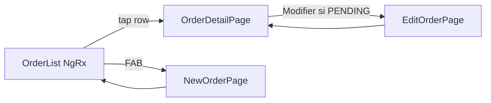

# Commandes mobile — feature-complete + DS

## Constat

Le module `[mobile/src/app/features/orders/](mobile/src/app/features/orders/)` est incomplet :

- Liste vide : appelle `OrderService.getOrders()` → `of([])` alors que NgRx + `getOrdersPaginated` existent
- Pas d’écran détail ; edit/delete depuis la liste seulement
- Edit cassé : `getOrderById` sans jointure client → pas de client ; `updateOrderLocally` n’écrit pas `clientId`
- UI legacy (`color="primary"`) ; statuts UI (`CONFIRMED`/`DELIVERED`) hors enum backend

Enum backend à respecter : `PENDING` | `ACCEPTED` | `DENIED` | `CANCEL` | `SOLD`.

## Décisions figées

- **Détail = page** `/tabs/orders/detail/:id` (lignes articles + actions) — pas une modal
- **Édition / suppression** uniquement si `status === 'PENDING'` (aligné backend : update seulement en PENDING)
- **Create/edit** restent sur `base-transaction` ; on restyle ce shell commun (bénéfice aussi distributions)
- Labels à préserver : `CRÉER LA COMMANDE`, `MODIFIER LA COMMANDE`, `Sélectionner un Client`, titres existants

## 1. Liste fonctionnelle + item compact

**Fichiers :** `[order-list.page.ts/html/scss](mobile/src/app/features/orders/pages/order-list/)`, nouveau `components/order-item/`

- Brancher NgRx : `loadFirstPageOrders` / `loadNextPageOrders` + `selectPaginatedOrders` (filtres search via actions existantes)
- Shell DS : hero compact, search overlap, empty/loading, infinite-scroll, FAB (comme distributions)
- `**app-order-item**` calqué sur `[distribution-item](mobile/src/app/tabs/distributions/components/distribution-item/)` :
  - Date | référence + client (`clientName`) + N articles | montant + badge statut + sync | chevron
  - Tap → détail (plus d’icônes edit/delete sur la ligne)

## 2. Page détail

**Nouveau :** `pages/order-detail/` + route `detail/:id` dans `[orders-routing.module.ts](mobile/src/app/features/orders/orders-routing.module.ts)`

- Charge `getOrderById` + `getOrderItems` (+ client via repo/`Client` join ou `clientId` → lookup)
- Affiche : ref, date, client, statut/sync, lignes (nom, qté, PU, total), total
- Footer : **Modifier** / **supprimer** si `PENDING` ; sinon lecture seule
- Hero compact + `.elyk-card` / badges soft

## 3. Édition et service fiables

**Fichiers :** `[edit-order.page.ts](mobile/src/app/features/orders/pages/edit-order/)`, `[order.service.ts](mobile/src/app/core/services/order.service.ts)`, éventuellement repository

- Hydrater le client à l’ouverture (charger client par `order.clientId` si `order.client` absent)
- `updateOrderLocally` : persister aussi `clientId` (et recalcul cohérent `totalAmount` / items)
- Bloquer navigation edit si statut ≠ `PENDING` (garde dans edit + détail)
- Delete : rester local ; depuis détail uniquement si PENDING (toast clair si refusé)
- Corriger stub `[goToNewOrder()](mobile/src/app/tabs/distributions/distributions-list.page.ts)` → `navigate(['/tabs/orders/new'])`

## 4. Design system create / edit

**Fichier :** `[base-transaction.component.html/scss](mobile/src/app/shared/components/base-transaction/)`

- Remplacer toolbar Material par hero compact + `elyk-content` + footer sticky `elyk-btn-navy`
- Conserver textes submit et flux métier (stock/avance désactivés pour ORDER)

## 5. Statuts UI

Mapper labels FR :

| Enum     | Label      |
| -------- | ---------- |
| PENDING  | En attente |
| ACCEPTED | Acceptée   |
| DENIED   | Refusée    |
| CANCEL   | Annulée    |
| SOLD     | Vendue     |

Badges soft (navy / orange / muted) — pas de workflow changement de statut mobile (back-office).

## 6. Version

Bump mobile **2.27.0 → 2.28.0** (`package.json`, `environment.ts`, `environment.prod.ts`) + entrée `[docs/CHANGELOG.md](docs/CHANGELOG.md)`.

## Hors scope

- Transitions de statut (ACCEPTED/SOLD) côté mobile
- Sync online-first de l’update (garde update local + `isSync=false` comme aujourd’hui, sync batch existante)
- Refonte profonde stock / avance dans `base-transaction`
- Nouveaux `data-testid` (sauf si un test casse)

