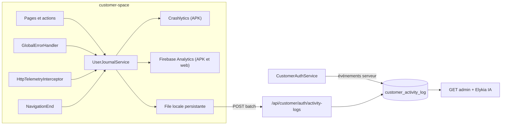

---
todos:
  - id: cs-telemetry-core
    status: completed
    content: 'customer-space : deps @capacitor-firebase/crashlytics + analytics, firebase-app partagé, TelemetryContext, CrashReporter, UserJournalService (sanitizer, file persistante, batch)'
  - id: cs-error-http
    status: completed
    content: 'customer-space : GlobalErrorHandler + unhandledrejection, HttpTelemetryInterceptor (en-têtes corrélation, HTTP_ERROR, SESSION_EXPIRED), branchement app.module'
  - id: cs-events
    status: completed
    content: 'customer-space : événements AUTH (auth.page, session, logout), SCREEN_VIEW routeur, événements métier (onboarding, paiement, tontine, panier/commande, mise à jour app)'
  - id: be-activity-log
    status: completed
    content: 'Backend : V006 customer_activity_log, entité/repo/service async, POST /api/customer/auth/activity-logs (anti-usurpation, limites), vérifier permitAll'
  - id: be-server-events
    status: completed
    content: 'Backend : événements serveur dans CustomerAuthService, filtre MDC, GET admin paginé, purge planifiée, schema-catalog.json'
  - id: ci-firebase
    status: completed
    content: 'CI : configure-android-firebase.sh dans l''action APK release et le job debug, validation pipeline, FIREBASE_SETUP.md (prérequis console + procédure de debug)'
  - id: tests-release
    status: completed
    content: 'Tests unitaires front/back, bump customer-space 0.8.0 + backend, CHANGELOG'
name: Crashlytics et journal customer-space
overview: 'Intégrer Firebase Crashlytics (crashs natifs et erreurs non fatales) et Analytics dans customer-space, plus un journal complet des actions utilisateur, du premier essai de connexion à la déconnexion. Le journal est envoyé à la fois vers Firebase et vers une table d''audit côté backend. Les événements sont corrélés par identifiant d''appareil, de session et de client.'
isProject: false
---

# Crashlytics et journal des actions — customer-space

## Constat actuel

- customer-space : Ionic 8, Angular 20, Capacitor 8. L'app est livrée en APK (le dossier `android/` est généré en CI) et en build web.
- Le SDK web `firebase` est déjà présent, mais seulement pour Remote Config ([customer-space/src/app/shared/services/feature-flag.service.ts](customer-space/src/app/shared/services/feature-flag.service.ts)).
- Aucun `ErrorHandler` global, aucun logger. Un seul intercepteur existe ([customer-space/src/app/core/interceptors/customer-auth.interceptor.ts](customer-space/src/app/core/interceptors/customer-auth.interceptor.ts)).
- L'application mobile a déjà le câblage Crashlytics :
  - le plugin `@capacitor-firebase/crashlytics` ;
  - le script Gradle [.github/scripts/configure-android-firebase.sh](.github/scripts/configure-android-firebase.sh), qui ajoute aussi `firebase-analytics`.
- Ce script n'est pas appelé dans [.github/actions/build-customer-space-apk/action.yml](.github/actions/build-customer-space-apk/action.yml).
- Backend : les tentatives de connexion ne sont ni journalisées ni persistées ([CustomerAuthService.java](backend/src/main/java/com/optimize/elykia/core/service/customer/CustomerAuthService.java)). La dernière migration Flyway est `V005`.

## Architecture cible

Corrélation : chaque événement porte les champs suivants.

- `deviceId` : UUID persistant en `localStorage`.
- `sessionId` : UUID généré à chaque lancement de l'app.
- `clientId` : renseigné après la connexion.
- `phone` : avant la connexion.

L'intercepteur ajoute aussi `deviceId` et `sessionId` à chaque requête HTTP, dans les en-têtes `X-Elykia-Device-Id`, `X-Elykia-Session-Id` et `X-Request-Id`. Le backend les place dans le MDC, ce qui permet de relier le journal client aux logs serveur.

Limite importante : les logs Crashlytics (fil d'Ariane) ne sont visibles que s'ils sont attachés à un crash ou à une erreur non fatale. Le parcours complet se consulte donc :

- dans la table backend ;
- dans Analytics (DebugView et événements par `user_id`).

## Taxonomie d'événements (catégorie : type)

- AUTH : `APP_OPEN`, `PHONE_SUBMITTED`, `CUSTOMER_SPACE_UNAVAILABLE`, `PIN_LOGIN_ATTEMPT`, `LOGIN_SUCCESS`, `LOGIN_FAILED`, `OTP_SEND_REQUESTED`, `OTP_SENT`, `OTP_VERIFY_ATTEMPT`, `OTP_VERIFIED`, `OTP_FAILED`, `PIN_SETUP`, `REGISTER_SUBMITTED`, `SESSION_EXPIRED`, `LOGOUT`.
- NAVIGATION : `SCREEN_VIEW`, avec une route normalisée (`/purchases/:id`).
- BUSINESS :
  - `ONBOARDING_DOC_UPLOADED`, `INITIAL_DEPOSIT_SUBMITTED` ;
  - `MM_PAYMENT_SUBMITTED` / `_FAILED` ;
  - `TONTINE_JOIN`, `TONTINE_PAYMENT_SUBMITTED` ;
  - `CART_ADD`, `CART_REMOVE`, `ORDER_SUBMITTED` / `_FAILED` ;
  - `APP_UPDATE_CHECK`, `APP_UPDATE_DOWNLOAD`.
- ERROR : `APP_ERROR` (exception JS), `UNHANDLED_REJECTION`, `HTTP_ERROR` (méthode, chemin sans query, statut, durée).

Confidentialité :

- Un sanitizer central supprime `pin`, `otp`, `code`, `password`, `token` et les contenus de fichiers.
- Le téléphone est masqué dans Firebase. On garde le `+` éventuel, les 4 premiers et les 4 derniers chiffres, et on remplace le milieu par `****`. Par exemple, `+22890001234` devient `+2289****1234`. Un numéro de 8 chiffres ou moins est entièrement masqué. Le numéro complet n'est stocké que dans la table backend.

## 1. customer-space

**Dépendances** : `@capacitor-firebase/crashlytics` et `@capacitor-firebase/analytics` en version 8.x, compatibles Capacitor 8. On ajoute aussi un flag `telemetryEnabled` dans les trois environnements, à `false` en e2e.

Nouveaux fichiers dans `src/app/core/telemetry/` :

- `firebase-app.ts` : on extrait `getFirebaseApp()` de `FeatureFlagService` pour le partager avec Analytics web.
- `telemetry-context.service.ts` : `deviceId`, `sessionId`, plateforme, `APP_VERSION`, `clientId` et téléphone masqué.
- `crash-reporter.service.ts` : en natif uniquement (`Capacitor.isNativePlatform()`), il appelle `setEnabled`, `setUserId(clientId)`, `setCustomKey` (sessionId, appVersion, écran courant), `log` et `recordException`. Sur le web, il ne fait rien.
- `user-journal.service.ts` : `track(type, category, props)`.
  - Il sanitise l'événement, puis envoie un breadcrumb Crashlytics et un `logEvent` Analytics.
  - Il ajoute l'événement à une file persistante (`localStorage`, 500 événements max).
  - La file est vidée par lot de 50, toutes les 10 s, et lors du passage en arrière-plan (`@capacitor/app` `appStateChange` et `visibilitychange`). Les renvois se font sur un `eventId` UUID, ce qui permet le dédoublonnage côté serveur.
- `global-error-handler.ts` : `ErrorHandler` Angular et `unhandledrejection`. Il appelle `recordException` et `track(APP_ERROR)`.
- `core/interceptors/http-telemetry.interceptor.ts` : il ajoute les en-têtes de corrélation et journalise `HTTP_ERROR` (0, 4xx, 5xx). Sur un 401 authentifié, il journalise `SESSION_EXPIRED`. Il exclut l'endpoint du journal lui-même, pour éviter une boucle.

Branchements :

- [customer-space/src/app/app.module.ts](customer-space/src/app/app.module.ts) :
  - un `APP_INITIALIZER` de télémétrie, placé avant les feature flags ;
  - le provider `ErrorHandler` ;
  - le second intercepteur.
- `AppComponent` : `track(APP_OPEN)` et l'écoute du Router pour `SCREEN_VIEW` (Analytics `screen_view` et breadcrumb).
- `CustomerSessionService.saveSession/clearSession` : `setUserId`, custom keys et `LOGIN_SUCCESS` / `LOGOUT`.
- Événements explicites, dans les versions mobile et desktop des pages concernées :
  - `features/auth/auth.page.ts` : `submitPhone`, `submitPin`, `startOtp`, `submitOtp`, `submitSetupPin`, `submitRegisterPin`, `extractError` ;
  - les méthodes `logout()` du profil et de la sidebar ;
  - onboarding, payment, tontines, cart, order-confirmation ;
  - `app-update.service.ts`.

## 2. Backend

- `V006__customer_activity_log.sql`, table `customer_activity_log` :
  - colonnes : `id`, `event_id` (uuid unique), `occurred_at`, `received_at`, `source` (CLIENT_APP ou SERVER), `category`, `event_type`, `client_id`, `phone`, `device_id`, `session_id`, `platform`, `app_version`, `screen`, `http_status`, `message`, `metadata` (jsonb), `ip`, `user_agent` ;
  - index sur (client_id, occurred_at), (phone, occurred_at), (device_id, occurred_at) et (session_id).
- Couches : entité, repository et `CustomerActivityLogService`, avec insertion asynchrone `saveAll` et dédoublonnage sur `event_id`. Même approche que `core/ai/audit/AiQueryLog*`.
- `POST /api/customer/auth/activity-logs`, dans `CustomerAuthController` :
  - endpoint public, parce qu'il doit accepter des événements avant la connexion ;
  - 50 événements max par lot, taille des champs bornée.
  - Si le Bearer est valide, `clientId` est pris du token. Sinon le `clientId` envoyé par l'app est ignoré, pour empêcher l'usurpation.
  - À vérifier : le `permitAll` de `/api/customer/auth/**` dans la configuration de sécurité de la lib commune.
- Événements serveur dans `CustomerAuthService`, avec IP, user-agent et en-têtes de corrélation : `CHECK_PHONE`, `LOGIN_SUCCESS` / `LOGIN_FAILED` (avec la raison), `OTP_SENT` / `OTP_SEND_FAILED`, `OTP_VERIFIED` / `OTP_FAILED`, `PIN_SETUP`, `REGISTER`. Ils restent tracés même si le journal client est perdu.
- Filtre MDC (`deviceId`, `sessionId`, `requestId`) pour les logs serveur.
- `GET` admin paginé, filtrable par `clientId`, `phone`, `deviceId`, `sessionId`, `from` et `to`. Il réutilise le mécanisme de permission des contrôleurs admin existants, à identifier au moment de l'implémentation.
- Purge planifiée, configurable par `elykia.customer.activity-log.retention-days` (180 par défaut).
- Mise à jour de [backend/src/main/resources/ai/schema-catalog.json](backend/src/main/resources/ai/schema-catalog.json) avec la nouvelle table, ses synonymes FR (« journal client », « activité espace client ») et la relation `client_id` vers `client`.

## 3. CI et Firebase

- Appeler `../.github/scripts/configure-android-firebase.sh android` après `cap sync` :
  - dans [.github/actions/build-customer-space-apk/action.yml](.github/actions/build-customer-space-apk/action.yml) ;
  - dans le job APK debug de [.github/workflows/ci-customer-space.yml](.github/workflows/ci-customer-space.yml).
- Ajouter la vérification correspondante dans `.github/scripts/validate-customer-space-pipeline.sh`.
- Prérequis console Firebase, côté projet customer-space :
  - activer Crashlytics et Analytics ;
  - vérifier que `CUSTOMER_SPACE_GOOGLE_SERVICES_JSON` contient `com.optimize.elykia.customer` ;
  - ajouter `measurementId` à `CUSTOMER_SPACE_FIREBASE_WEB_CONFIG` pour Analytics web.
- Documenter dans [customer-space/docs/FIREBASE_SETUP.md](customer-space/docs/FIREBASE_SETUP.md) la procédure pour enquêter sur une anomalie : chercher par `clientId` dans Crashlytics, dans Analytics DebugView, puis dans le journal backend.

## 4. Tests, version et livraison

- Tests unitaires Karma :
  - le sanitizer (aucun PIN ni OTP ne sort) ;
  - le masquage du téléphone (`+22890001234` donne `+2289****1234`, avec et sans `+`, et un numéro court entièrement masqué) ;
  - la file (persistance, lots, renvoi) ;
  - l'intercepteur (en-têtes, pas de boucle) ;
  - le no-op web de Crashlytics.
- Tests backend :
  - lot au-delà de 50 refusé ;
  - `clientId` usurpé ignoré ;
  - dédoublonnage `event_id` ;
  - événements serveur à la connexion.
- Versions : customer-space `0.7.2` passe à `0.8.0` (via `package.json` puis `sync:version`). La version du backend est incrémentée. Une entrée est ajoutée dans [docs/CHANGELOG.md](docs/CHANGELOG.md).
- User-guide : pas de changement visible pour le client (télémétrie invisible), donc exception à la règle. Si une page admin de consultation est ajoutée plus tard, il faudra mettre à jour le guide et l'index RAG.
- Hors périmètre de ce lot : l'écran admin frontend de consultation du journal. La lecture passera par l'API admin et par Elykia IA.

