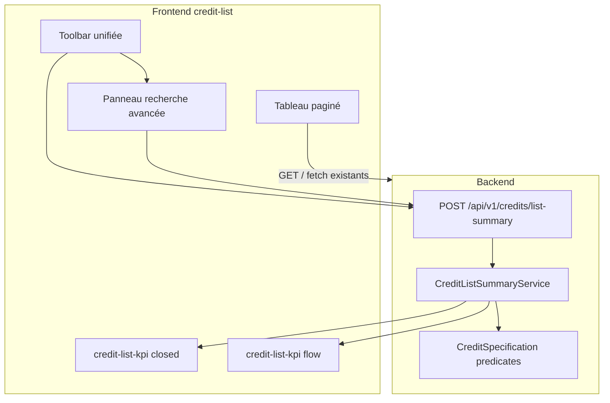

# Refonte liste des ventes — KPIs métier + UI standard

## Objectif

Transformer [`credit-list.component.html`](frontend/src/app/credit/credit-list/credit-list.component.html) en page conforme au [skill frontend-ui-style](.cursor/skills/frontend-ui-style/SKILL.md), avec des KPIs **décisionnels** :

| Bloc | Périmètre | Métriques par carte |
|------|-----------|---------------------|
| **Ventes clôturées** | `status = SETTLED`, date de clôture dans la période | N ventes · CA (FCFA) · Marge (FCFA) |
| **Par type** | Crédit / Cash / Tontine (même règle clôture) | Idem |
| **Crédit en cours** | `status = INPROGRESS` + `type = CREDIT` — **snapshot** (hors période, confirmé) | N · CA · Marge attendue · sous-ligne « reste à payer » |
| **Recouvré** | Somme des `CreditTimeline.amount` sur la période | Montant FCFA · nb de mises |

Palette KPI strictement **navy / cyan / green / orange** — pas de violet, pas de Material primary.

---

## Règles métier (backend)

### Date de clôture

```sql
COALESCE(effective_end_date, accounting_date, begin_date) BETWEEN :startDate AND :endDate
AND status = 'SETTLED'
AND state = 'ENABLED'
```

Aligné avec [`Credit.java`](backend/src/main/java/com/optimize/elykia/core/entity/sale/Credit.java) : crédit soldé via `effectiveEndDate` ; cash/tontine peuvent n’avoir que `accountingDate`.

### Marge

```sql
COALESCE(profit_margin, total_amount - total_purchase, 0)
```

Champ déjà maintenu par [`CreditEnrichmentService`](backend/src/main/java/com/optimize/elykia/core/service/sale/CreditEnrichmentService.java) ; fallback identique au rapport mensuel.

### Recouvré

Somme des lignes [`CreditTimeline`](backend/src/main/java/com/optimize/elykia/core/entity/sale/CreditTimeline.java) filtrées par `createdDate` dans la période, jointure `credit` pour appliquer les filtres recherche (cash/tontine passent aussi par timeline via `filledRecovery` dans [`CreditService`](backend/src/main/java/com/optimize/elykia/core/service/sale/CreditService.java)).

### Recherche avancée

Réutiliser la logique de [`CreditSpecification`](backend/src/main/java/com/optimize/elykia/core/repository/spec/CreditSpecification.java) :

- **Appliquer** : `commercial`, `type`, `clientType`, `keyword`, `clientId`
- **Ignorer** : `status` (les KPIs imposent leur propre statut)
- **Promoteur** : forcer `commercial = username` courant (comme la liste)

### Période (frontend)

| Preset | Plage |
|--------|-------|
| Jour | Aujourd’hui |
| Semaine | Lundi → aujourd’hui (semaine calendaire) |
| Mois | 1er du mois → aujourd’hui (**défaut**) |
| Personnalisé | `dateFrom` / `dateTo` saisis |

Persister le preset + dates custom dans `sessionStorage` (unifier avec la persistance liste du skill).

---

## Architecture



**Un seul appel** `list-summary` à chaque changement de période, recherche avancée ou refresh — indépendant de la pagination du tableau.

---

## Backend — fichiers à créer / modifier

### DTO de réponse

Nouveau package dto, ex. `CreditListSummaryDto` :

```java
record SalesTypeSummary(long count, double totalAmount, double totalMargin) {}
record CreditListSummaryDto(
  LocalDate startDate, LocalDate endDate,
  SalesTypeSummary closedTotal,
  SalesTypeSummary closedCredit,
  SalesTypeSummary closedCash,
  SalesTypeSummary closedTontine,
  SalesTypeSummary inProgressCredit,  // + totalAmountRemaining en champ optionnel
  long collectedCount,
  double collectedAmount
) {}
```

### Service

Nouveau [`CreditListSummaryService`](backend/src/main/java/com/optimize/elykia/core/service/sale/CreditListSummaryService.java) :

- 3 agrégations JPA/native inspirées de [`MonthlyReportAggregationService.buildSalesSummary`](backend/src/main/java/com/optimize/elykia/core/service/report/monthly/MonthlyReportAggregationService.java) (lignes 78–119)
- Prédicats communs extraits ou réutilisés depuis `CreditSpecification` (refactor léger : méthode `applySearchFilters(dto, ignoreStatus)`)
- Requête encours : `status = INPROGRESS AND type = CREDIT` + filtres (sans date)
- Requête recouvré : `SUM(ct.amount)` + `COUNT(ct.id)` avec join credit + filtres

### Controller

Ajouter dans [`CreditController`](backend/src/main/java/com/optimize/elykia/core/controller/sale/CreditController.java) :

```
POST api/v1/credits/list-summary
Body: { startDate, endDate, search?: CreditSearchDto }
```

### Tests

Nouveau `CreditListSummaryServiceTest` : jeux de données couvrant clôture par type, snapshot encours, recouvré période, filtre commercial ignoré status.

---

## Frontend — fichiers à créer / modifier

### Types + service

- [`credit.service.ts`](frontend/src/app/credit/service/credit.service.ts) : méthode `getListSummary(startDate, endDate, searchDto?)`
- Nouveau `credit-list-summary.types.ts`

### Composant KPI enfant

Nouveau `credit-list-kpi/` (pattern [`credit-late-kpi`](frontend/src/app/credit/credit-late/components/credit-late-kpi/credit-late-kpi.component.html)) :

**Strip 1 — Ventes clôturées · [période]** (grille 4 colonnes) :

| Carte | Classe | Contenu |
|-------|--------|---------|
| Synthèse | `kpi-total` | Total clôturées · CA · Marge |
| Crédit | `kpi-amount` | Idem |
| Cash | `kpi-green` | Idem |
| Tontine | `kpi-delai` | Idem |

Valeur principale = **marge FCFA** (DM Mono) ; sous-lignes = N ventes + CA.

**Strip 2 — Encours & recouvrement** (grille 2 colonnes) :

| Carte | Classe | Contenu |
|-------|--------|---------|
| Crédit en cours | `kpi-total` | N · CA · Marge · sub « Reste : X FCFA » |
| Recouvré · période | `kpi-amount` | Montant · sub « X mises · vs CA clôturé Y FCFA » |

Comparaison vendu/recouvré : afficher les deux montants en sous-titre, **sans ratio trompeur** (un crédit clôturé en mars peut avoir été encaissé sur plusieurs mois).

### Refonte page principale

[`credit-list.component.ts/html/scss`](frontend/src/app/credit/credit-list/) :

- Structure obligatoire skill : breadcrumb · header-card · kpi · toolbar · **panneau recherche** · table-card
- `ViewEncapsulation.None`, classe racine `.credit-list-page`
- SCSS : reprendre variables/animations de [`credit-late.component.scss`](frontend/src/app/credit/credit-late/credit-late.component.scss) et [`client-list.component.scss`](frontend/src/app/client/client-list/client-list.component.scss) (pas de duplication 800 lignes non préfixées)
- Toolbar : sélecteur période (boutons jour/semaine/mois + dates custom) · toggle recherche avancée · actions existantes (refresh, nouvelle vente, bulk collector)
- Remplacer `ngx-spinner` global par états `loading`/`empty` conformes sur le tableau
- Boutons Material → `.btn-refresh`, `.btn-primary`, `.btn-detail` (actions ligne)
- `currentDate` / `lastUpdate` / `setInterval` / `ngOnDestroy`
- Migrer persistance vers `sessionStorage` unique `creditListState` (recherche, pagination, période, panneau ouvert) — remplacer les 3 clés `localStorage` actuelles
- `loadSummary()` appelé en parallèle de `loadCredits()` sur init, refresh, changement période, recherche avancée

### Recherche avancée — fusion visuelle

Composant unique consommateur : [`app-advanced-search`](frontend/src/app/credit/components/advanced-search/) (utilisé **uniquement** par credit-list). Refonte complète du style pour qu’il ne ressemble plus à un bloc isolé (gradient navy + badge or + mat-icons).

**Placement dans la page**

```
.toolbar.a4          ← période + btn toggle + actions
.advanced-search-panel.a4b   ← panneau dépliable, collé visuellement à la toolbar
.table-card.a5
```

Le panneau partage la même carte blanche que la toolbar : bordure commune, `border-top: none` sur le panneau, `border-radius` uniquement en bas — effet « accordéon intégré » (comme les filtres des pages liste standard, pas un mat-accordion Material).

**Changements HTML** ([`advanced-search.component.html`](frontend/src/app/credit/components/advanced-search/advanced-search.component.html))

- Supprimer l’en-tête gradient (`search-header` navy + icône or `#ffd700`)
- Supprimer le bouton fermer interne (le toggle toolbar suffit)
- Remplacer les `mat-icon` décoratifs par des labels `.toolbar-label` uppercase (skill)
- Grille de champs alignée sur `.filter-group` / `.search-input` de client-list
- Actions : `.btn-clear` (réinitialiser) + `.btn-primary` (rechercher) — pas de `.btn-reset` gris ni animation ripple
- Badge « X filtre(s) actif(s) » déplacé sur le **bouton toggle** dans la toolbar parente (`.filter-count-badge`), pas dans le panneau

**Changements SCSS** ([`advanced-search.component.scss`](frontend/src/app/credit/components/advanced-search/advanced-search.component.scss))

- `ViewEncapsulation.None` + sélecteurs préfixés `.credit-list-page .advanced-search-panel`
- Fond blanc `--bg-white`, bordure `--border`, ombre `--shadow-sm` — **supprimer** le `linear-gradient` navy et le badge or animé
- Inputs / ng-select : mêmes tokens que client-list (`--navy-xpale` focus, bordure `--border`, radius `--radius-sm`)
- ng-select : tags sélection navy (OK), dropdown hover `--navy-xpale` — retirer le bleu Material `#e3f2fd` / `#1976d2`
- Responsive : grille 2 col → 1 col &lt; 768px (conservé)

**Changements TS** ([`advanced-search.component.ts`](frontend/src/app/credit/components/advanced-search/advanced-search.component.ts))

- `@Output() activeFiltersCountChange` (optionnel) pour alimenter le badge du bouton toggle parent
- Conserver la logique métier existante (promoteur, compteur filtres, émissions search/reset)
- Animation `slideDown` conservée mais adoucie (opacity + max-height, pas de translateY agressif)

**Intégration credit-list**

- Bouton toggle : `.btn-filter-toggle` avec état `.active` quand panneau ouvert ou filtres actifs
- Le panneau s’insère **entre** toolbar et table-card, pas au-dessus de la toolbar
- `showAdvancedSearch` persisté dans `creditListState`
- Les filtres actifs restent visibles sur le toggle même panneau fermé (badge discret navy, pas or)

**Tests**

- Vérifier rendu panneau ouvert/fermé dans `credit-list.component.spec.ts`
- Conserver les interactions search/reset existantes ; ajouter `data-testid="e2e-credit-advanced-search"` sur le panneau

### Module

Déclarer `CreditListKpiComponent` dans le module credit existant.

### Tests frontend

- [`credit-list.component.spec.ts`](frontend/src/app/credit/credit-list/credit-list.component.spec.ts) : mock summary, presets période
- Nouveau `credit-list-kpi.component.spec.ts`
- Conserver les `data-testid` e2e existants (`e2e-credit-row`, etc.) ; ajouter `e2e-credit-list-kpi-closed`, `e2e-credit-list-kpi-collected`

---

## UX / libellés

- Sous-titre page : *« Ventes clôturées et recouvré sur la période · Encours crédit en temps réel · Filtres conservés à la navigation »*
- Mention explicite : *« KPIs ventes clôturées : statut Réglé · hors filtre statut recherche avancée »*
- Format montants : pipe `currency` XOF ou `number` + « FCFA » (cohérent avec le reste du module credit)

---

## CHANGELOG

Mettre à jour [`docs/CHANGELOG.md`](docs/CHANGELOG.md) (section `Unreleased` / date du jour) : refonte UI liste ventes + endpoint summary + KPIs clôturées/encours/recouvré + recherche avancée intégrée à la toolbar.

---

## Hors scope (volontaire)

- Pas de refonte fonctionnelle des modals (bulk collector, daily stake)
- Pas de duplication du dashboard BI (endpoint dédié léger à la liste, pas réutilisation BI complète)
- Pas de KPI violet / Material primary sur les cartes
- Pas de réutilisation du composant advanced-search ailleurs (refonte ciblée credit-list uniquement)
