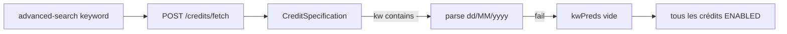

# Recherche crédits par référence + lien stock mensuel

## Diagnostic (demande 1)

La recherche liste passe par `POST /api/v1/credits/fetch` → [`CreditSpecification.build`](backend/src/main/java/com/optimize/elykia/core/repository/spec/CreditSpecification.java).

Toute keyword contenant `-` (ex. `RAT-YVG7ZNJ3`) entre dans la branche « plage de dates `dd/MM/yyyy-dd/MM/yyyy` ». Le parse échoue, le commentaire dit « fall through », mais le `LIKE` est dans le `else` — **le filtre mot-clé n’est jamais appliqué**. Résultat : tous les crédits `ENABLED` (plus les autres filtres).

Les KPI liste ([`CreditSearchSqlFilter`](backend/src/main/java/com/optimize/elykia/core/service/sale/CreditSearchSqlFilter.java)) appliquent déjà un `LIKE` sur la keyword complète, d’où un écart tableau vs KPI.

## 1. Recherche : correctif + case à cocher

**Backend**

- Refactorer [`CreditSpecification`](backend/src/main/java/com/optimize/elykia/core/repository/spec/CreditSpecification.java) : n’appliquer la plage de dates **que si** les deux parties parsent vraiment en `dd/MM/yyyy`. Sinon, même logique string/numérique qu’aujourd’hui (dont `LIKE` sur `reference`, client, collector…).
- Ajouter `Boolean searchByReference` à [`CreditSearchDto`](backend/src/main/java/com/optimize/elykia/core/dto/CreditSearchDto.java) (dernier champ, `null` = false).
- Si `searchByReference` : uniquement `LOWER(reference) LIKE %keyword%` (pas client, collector, dates). Les autres filtres (statut, commercial…) restent en AND.
- Aligner [`CreditSearchSqlFilter`](backend/src/main/java/com/optimize/elykia/core/service/sale/CreditSearchSqlFilter.java) (KPI) sur le même flag.
- Tests : nouvelle spec/test unitaire du hyphen (`RAT-YVG7ZNJ3` → prédicat `reference` LIKE) + `searchByReference` ; mettre à jour les `new CreditSearchDto(...)` existants ([`CreditListSummaryServiceTest`](backend/src/test/java/com/optimize/elykia/core/service/sale/CreditListSummaryServiceTest.java), [`CreditListSummaryService.emptySearch`](backend/src/main/java/com/optimize/elykia/core/service/sale/CreditListSummaryService.java)).

**Frontend** (credit déjà lazy-loadé : pas de migration)

- Case à cocher dans [`advanced-search.component.html`](frontend/src/app/credit/components/advanced-search/advanced-search.component.html) sous le champ mot-clé, libellé **« Rechercher uniquement par référence »**.
- Propager `searchByReference` dans le form, `CreditSearchDto` TS, `onSearch` / `onReset`, compteur de filtres (ne compte pas sans keyword), persistance `creditListState` déjà via `currentSearchDto`.
- Style checkbox aligné toolbar (navy, pas de `mat-checkbox` brut si le panneau n’en utilise pas).

Sans la case, `RAT-YVG7ZNJ3` trouvera déjà 1 crédit grâce au correctif hyphen. La case sert aux recherches partielles / collisions.

## 2. Fiche crédit → stock mensuel → modal ventes

Le lien réel est `credit_articles.stock_item_id` → `commercial_monthly_stock` (cas `RAT-YVG7ZNJ3` : stock **id 6**, COM007, **février 2026**). `GET /credit/{id}` renvoie l’entité, avec `articles[].stockItemId`, mais **sans** mois/année/id du stock.

**Backend**

- Ne pas modifier `GenericService.getById` (trop d’usages internes).
- Enrichir uniquement [`CreditController.getOne`](backend/src/main/java/com/optimize/elykia/core/controller/sale/CreditController.java) via une méthode dédiée (ex. `getByIdWithSourceStocks`) :
  - charger le crédit ;
  - résoudre les `stockItemId` distincts via [`CommercialMonthlyStockItemRepository.findByIdWithArticle`](backend/src/main/java/com/optimize/elykia/core/repository/CommercialMonthlyStockItemRepository.java) (ajouter un `findAllByIdInWithMonthlyStock` pour éviter N+1) ;
  - exposer une liste dédupliquée `@Transient` sur [`Credit`](backend/src/main/java/com/optimize/elykia/core/entity/sale/Credit.java) : `{ id, collector, month, year }` (Jackson sérialise les getters `@Transient` JPA).

**Frontend**

- Sur [`credit-details.component.html`](frontend/src/app/credit/credit-details/credit-details.component.html), carte **Agent collecteur** (vers L161) : chip cliquable `Stock {collector} — {mois} {année}` (ex. `Stock COM007 — février 2026`). Masqué si aucun stock source.
- Clic : `navigate(['/stock/my-stock'], { queryParams: { collector, year, month, openSales: 1 } })`.
- Sur [`my-stock-dashboard.component.ts`](frontend/src/app/stock/pages/my-stock-dashboard/my-stock-dashboard.component.ts) :
  - lire les query params au `ngOnInit` ;
  - pré-sélectionner l’agent, activer l’historique si le mois n’est pas le mois courant ;
  - charger le stock via `CommercialStockService.getStockByDate` (déjà `GET /api/commercial-stocks/{collector}/{year}/{month}`) pour **éviter la pagination** ;
  - appeler `openSoldSales(stock)` (même `StockSoldSalesDialogComponent`) ;
  - nettoyer `openSales` des query params après ouverture pour ne pas réouvrir au refresh.

Les deux domaines (`credit`, `stock`) sont déjà lazy-loadés.

## 3. Versions et changelog

- Frontend `2.16.4` → `2.16.5` ([`frontend/package.json`](frontend/package.json))
- Backend `1.9.4` → `1.9.5` ([`backend/pom.xml`](backend/pom.xml))
- [`docs/CHANGELOG.md`](docs/CHANGELOG.md) : Fixed (recherche `RAT-*`) + Added (case référence, lien stock mensuel)
