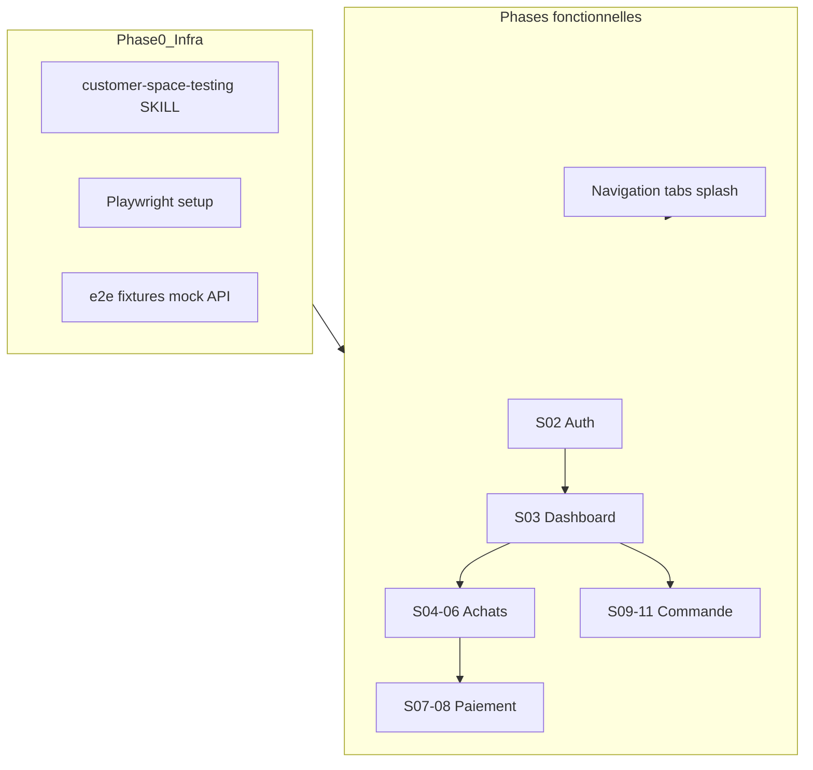
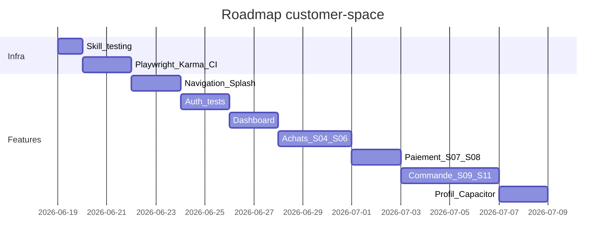

# Plan développement mobile customer-space + skill tests automatiques

## Contexte et état actuel

Le module [`customer-space/`](customer-space/) est une app Ionic indépendante du back-office [`frontend/`](frontend/) et de l'app commerciale [`mobile/`](mobile/).

| Zone | État |
|------|------|
| Backend `/api/customer/*` | Implémenté (auth PIN/OTP, dashboard, achats, recouvrements, articles, commandes, mobile-money) |
| Auth wizard S-02 | Fonctionnel (Firebase + API) — [`auth.page.ts`](customer-space/src/app/features/auth/auth.page.ts) |
| Dashboard S-03 | Logique API OK, UI basique — [`dashboard.page.ts`](customer-space/src/app/features/dashboard/dashboard.page.ts) |
| Achats S-04/05/06 | Liste + détail + timeline partiels (inline templates, peu alignés maquettes) |
| Paiement S-07/08 | Formulaire + état succès présents — [`payment.page.html`](customer-space/src/app/features/payment/payment.page.html) |
| Catalogue S-09 | Grille produits OK, panier local `Map` non partagé |
| Panier S-10 | **Stub TODO** — [`cart.page.ts`](customer-space/src/app/features/cart/cart.page.ts) |
| Commande S-11 | Écran statique sans appel API |
| Profil / order-tracking | Minimal |
| Tests | 2 specs Karma (`app.component`, `home.page`) — **aucun Playwright, aucun CI** |
| Référence E2E | [`mobile/playwright.config.ts`](mobile/playwright.config.ts) : viewport Pixel 5, port 8100, mock API |



---

## 1. Nouveau skill : `customer-space-testing`

**Fichier à créer :** [`.cursor/skills/customer-space-testing/SKILL.md`](.cursor/skills/customer-space-testing/SKILL.md)  
**Complément optionnel :** [`e2e-conventions.md`](.cursor/skills/customer-space-testing/e2e-conventions.md) (mapping `data-testid`, fixtures)

### Contenu du skill (règles impératives)

**Quand l'appliquer :** toute tâche touchant `customer-space/` (feature, service, guard, composant shared, correction de bug visible).

**Definition of Done — aucune fonctionnalité livrée sans :**

1. **Tests unitaires** (Karma/Jasmine, `ng test --watch=false --browsers=ChromeHeadless`)
   - Co-localisés : `*.page.spec.ts`, `*.service.spec.ts`, `*.guard.spec.ts`, `*.component.spec.ts`
   - Services HTTP : `HttpClientTestingModule` + `HttpTestingController`
   - Firebase : mock de [`FirebaseAuthService`](customer-space/src/app/shared/services/firebase-auth.service.ts) via `jasmine.createSpyObj`
   - Pages : `TestBed` + `RouterTestingModule` + mocks API/session
   - Utils purs ([`phone-normalizer.ts`](customer-space/src/app/shared/utils/phone-normalizer.ts)) : tests sans `TestBed`

2. **Tests E2E fonctionnels** (Playwright, 1 spec minimum par feature)
   - Dossier : `customer-space/e2e/specs/<feature>/`
   - Viewport mobile : `devices['Pixel 5']` (aligné [`mobile/playwright.config.ts`](mobile/playwright.config.ts))
   - Sélecteurs : `data-testid="e2e-<feature>-<element>"` sur tout élément interactif ou assertion clé
   - Parcours : happy path + au moins 1 cas d'erreur/état vide pertinent
   - Auth E2E : **interception Playwright** des routes `/api/customer/**` (pas de Firebase réel en CI) + injection session JWT mock via fixture [`e2e/fixtures/customer-auth.ts`](customer-space/e2e/fixtures/customer-auth.ts)

3. **CHANGELOG** : entrée dans [`docs/CHANGELOG.md`](docs/CHANGELOG.md) (skill [`keep-changelog`](.cursor/skills/keep-changelog/SKILL.md))

**Complémentarité avec les skills existants :**
- UI → [`customer-space-ui-style`](.cursor/skills/customer-space-ui-style/SKILL.md) + `data-testid` du skill testing
- Pas de conflit avec [`frontend-ui-style`](.cursor/skills/frontend-ui-style/SKILL.md)

---

## 2. Phase 0 — Infrastructure tests (prérequis)

### 2.1 Playwright dans customer-space

S'inspirer de [`mobile/package.json`](mobile/package.json) et [`mobile/playwright.config.ts`](mobile/playwright.config.ts) :

| Fichier | Rôle |
|---------|------|
| [`customer-space/playwright.config.ts`](customer-space/playwright.config.ts) | `testDir: e2e/specs`, port **8100**, Pixel 5, `webServer` dev ou build statique CI |
| [`customer-space/e2e/fixtures/mock-customer-api.ts`](customer-space/e2e/fixtures/mock-customer-api.ts) | Réponses JSON dashboard, purchases, articles, orders, mobile-money |
| [`customer-space/e2e/fixtures/customer-auth.ts`](customer-space/e2e/fixtures/customer-auth.ts) | `loginAsCustomer(page)` : mock auth + `localStorage` session |
| [`customer-space/e2e/specs/smoke/app-boot.spec.ts`](customer-space/e2e/specs/smoke/app-boot.spec.ts) | Smoke : redirect auth si non connecté |

**Scripts `package.json` à ajouter :**
```json
"start:e2e": "ng serve --port 8100 --host 0.0.0.0",
"build:e2e": "ng build --configuration=development",
"serve:e2e:static": "http-server www -p 8100 -c-1 --silent",
"start:e2e:ci": "npm run build:e2e && npm run serve:e2e:static",
"test:unit": "ng test --watch=false --browsers=ChromeHeadless",
"test:e2e": "playwright test",
"test:e2e:smoke": "playwright test --grep @smoke"
```

**DevDependencies :** `@playwright/test`, `http-server` (comme mobile).

### 2.2 Karma headless + couverture minimale

- Configurer [`karma.conf.js`](customer-space/karma.conf.js) : `ChromeHeadless`, reporter coverage sur `shared/services`, `shared/guards`, `features/**`
- Seuil initial modeste (ex. 60 % lignes sur fichiers touchés) — augmenter par phase

### 2.3 Environment E2E

- [`customer-space/src/environments/environment.e2e.ts`](customer-space/src/environments/environment.e2e.ts) : `apiUrl` pointant vers mock ou backend de test, `firebase` désactivé / stub
- Flag `window.__E2E__` injecté par Playwright `addInitScript` pour court-circuiter OTP Firebase en tests

### 2.4 CI GitHub Actions — workflow découplé (ne bloque pas les autres pipelines)

**Principe :** customer-space suit le même modèle que [`ci-mobile.yml`](.github/workflows/ci-mobile.yml) — **fichier workflow séparé**, **hors** du deploy gate [`ci.yml`](.github/workflows/ci.yml) et **hors** de [`cd.yml`](.github/workflows/cd.yml).

| Règle | Détail |
|-------|--------|
| Fichier dédié | [`.github/workflows/ci-customer-space.yml`](.github/workflows/ci-customer-space.yml) — **ne pas** ajouter de job customer-space dans `ci.yml` |
| Isolation des échecs | Un échec des tests customer-space **ne bloque pas** le CI backend/frontend, le CD, ni les E2E back-office (`e2e.yml`) |
| Déclenchement ciblé | `dorny/paths-filter` sur `customer-space/**` uniquement ; job `if: changes == true'` (skip si aucun changement) |
| Pas de `needs` croisé | Aucune dépendance `needs: [ci, cd, …]` depuis ou vers les autres workflows |
| Commentaire en tête | Même commentaire explicite que mobile : *« decoupled from deploy gate — failure does not block CD »* |

**Structure du workflow** (calquée sur `ci-mobile.yml`) :

```yaml
name: ELYKIA CI Customer Space Pipeline
# Customer-space CI is decoupled from the deploy gate (ci.yml).
# A customer-space failure does not block CD.

on:
  push:
    branches: [ main, develop, 'release/**', 'prod/**' ]
  pull_request:
    branches: [ main, develop, 'release/**' ]

jobs:
  changes:
    # paths-filter: customer-space/**

  test-customer-space:
    needs: changes
    if: ${{ needs.changes.outputs.customer_space == 'true' }}
    defaults:
      run:
        working-directory: ./customer-space
    steps:
      # npm ci → test:unit → playwright install → test:e2e → upload playwright-report
```

**Étapes du job :**
1. `npm ci` + `npm run test:unit`
2. `npx playwright install --with-deps chromium`
3. `npm run test:e2e` avec `CI=true`
4. Upload `playwright-report` en artefact (même en cas d'échec, `if: always()`)

**Documentation croisée (lors de l'implémentation) :**
- Ajouter une ligne dans le commentaire d'en-tête de [`ci.yml`](.github/workflows/ci.yml) : *« Customer-space runs in ci-customer-space.yml and does not block CD. »*
- Idem dans [`cd.yml`](.github/workflows/cd.yml) si pertinent

**Hors scope initial :** pas de `build-customer-space-apk.yml` couplé au CD (contrairement à `build-mobile-apk.yml`) tant que l'APK client n'est pas en production — évite une dépendance supplémentaire entre pipelines.

---

## 3. Phases fonctionnelles (par feature, tests inclus)

Chaque phase suit le même rituel : **implémenter UI (skill UI) → unit tests → E2E spec → CHANGELOG**.

### Phase 1 — Coque navigation + Splash S-01

**Objectif :** structure mobile cohérente (tabs ou menu bas) reliant dashboard, achats, catalogue, profil.

| Fichiers | Travail |
|----------|---------|
| [`app.component.ts/html`](customer-space/src/app/app.component.ts) | Splash court + redirect |
| Nouveau `shared/components/customer-tabs/` ou `ion-tabs` | Navigation persistante post-auth |
| Routes [`app.routes.ts`](customer-space/src/app/app.routes.ts) | Enfants sous shell tab si besoin |

**Tests :**
- Unit : guard redirect, tabs visibility selon session
- E2E `@smoke` : boot → splash → auth ou dashboard

### Phase 2 — Auth S-02 (finalisation + couverture)

**État :** wizard déjà en place ; compléter alignement maquette [`02-login.png`](customer-space/docs/wireflow/screens/02-login.png).

| Travail | Détail |
|---------|--------|
| `data-testid` | `e2e-auth-phone`, `e2e-auth-pin`, `e2e-auth-otp`, etc. |
| Gestion erreurs | Téléphone inconnu, PIN invalide, OTP expiré |
| `environment.prod.ts` | Config Firebase réelle (hors repo secrets) |

**Tests unitaires :**
- [`phone-normalizer.spec.ts`](customer-space/src/app/shared/utils/phone-normalizer.spec.ts)
- [`customer-auth.guard.spec.ts`](customer-space/src/app/shared/guards/customer-auth.guard.spec.ts)
- [`customer-session.service.spec.ts`](customer-space/src/app/shared/services/customer-session.service.spec.ts)
- [`auth.page.spec.ts`](customer-space/src/app/features/auth/auth.page.spec.ts) : transitions d'étapes

**Tests E2E :** `e2e/specs/auth/login-pin.spec.ts` — check-phone → login PIN (API mockée) ; `setup-pin.spec.ts` (OTP mocké via `__E2E__`)

### Phase 3 — Dashboard S-03

| Fichiers | Travail |
|----------|---------|
| [`dashboard.page.html/scss`](customer-space/src/app/features/dashboard/dashboard.page.html) | KPI crédit, prochaine échéance, CTA achats/commande — maquette S-03 |
| [`credit-progress-card`](customer-space/src/app/shared/components/credit-progress-card/) | Affiner selon wireflow |

**Tests :**
- Unit : rendu KPI, états loading/empty/error
- E2E : `dashboard.spec.ts` — cartes visibles, navigation vers purchases/catalog

### Phase 4 — Parcours Achats S-04 / S-05 / S-06

| Écran | Travail |
|-------|---------|
| S-04 [`purchases.page`](customer-space/src/app/features/purchases/) | Filtres statut, empty state, `data-testid` par ligne |
| S-05 [`purchase-detail.page`](customer-space/src/app/features/purchase-detail/) | Extraire template inline → fichiers `.html/.scss`, barre progression |
| S-06 [`recovery-timeline`](customer-space/src/app/features/recovery-timeline/) + [`recovery-pills`](customer-space/src/app/shared/components/recovery-pills/) | Pastilles 1-N, CTA « Payer la prochaine mise » |

**Tests E2E :** `purchases-flow.spec.ts` — liste → détail → timeline → lien payment

### Phase 5 — Paiement Mobile Money S-07 / S-08

| Travail | Détail |
|---------|--------|
| [`payment.page.ts`](customer-space/src/app/features/payment/payment.page.ts) | Pré-remplir `expectedAmount` / `installmentNumber` depuis route ou service |
| Validation formulaire | Montant min, référence obligatoire |
| État S-08 | Écran succès déjà présent — ajouter `data-testid` |

**Tests :**
- Unit : validation reactive form, appel `submitMobileMoneyPayment`
- E2E : soumission formulaire → écran confirmation (API mockée POST mobile-money)

### Phase 6 — Commande S-09 / S-10 / S-11

**Gap principal :** panier non implémenté, état non partagé entre catalog et cart.

| Composant | Travail |
|-----------|---------|
| Nouveau [`CartService`](customer-space/src/app/shared/services/cart.service.ts) | `BehaviorSubject<Map<articleId, qty>>`, persistance `sessionStorage`, total FCFA |
| [`catalog.page.ts`](customer-space/src/app/features/catalog/catalog.page.ts) | Déléguer au `CartService` |
| [`cart.page.ts`](customer-space/src/app/features/cart/cart.page.ts) | Liste lignes, +/- quantité, total, CTA commander |
| [`order-confirmation.page.ts`](customer-space/src/app/features/order-confirmation/order-confirmation.page.ts) | Appel `POST /api/customer/orders`, afficher référence commande |
| [`order-tracking.page.ts`](customer-space/src/app/features/order-tracking/) | Suivi statut INITIÉ |

*Note : NgRx mentionné dans [`SPECIFICATIONS.md`](customer-space/docs/wireflow/SPECIFICATIONS.md) — **reporter** ; `CartService` + RxJS suffit pour le scope actuel (moins de boilerplate).*

**Tests :**
- Unit : `cart.service.spec.ts` (add/remove/total/persist)
- E2E : `order-flow.spec.ts` — catalog → add → cart → submit → confirmation

### Phase 7 — Profil + déconnexion

| Fichier | Travail |
|---------|---------|
| [`profile.page.ts`](customer-space/src/app/features/profile/profile.page.ts) | Infos session, logout, lien support |

**Tests E2E :** logout → redirect `/auth`

### Phase 8 — Capacitor Android

| Fichier | Travail |
|---------|---------|
| [`capacitor.config.ts`](customer-space/capacitor.config.ts) | `appId: 'com.optimize.elykia.customer'`, `appName: 'ELYKIA Client'` |
| Splash / icônes | Assets brand ELYKIA |
| [`README.md`](customer-space/README.md) | Section tests + Firebase + build APK |

Validation manuelle device (hors scope tests auto) après `npx cap sync android`.

---

## 4. Matrice tests par fonctionnalité

| Feature | Unit (fichiers cibles) | E2E (spec) |
|---------|---------------------|------------|
| Auth | guard, session, phone-normalizer, firebase-auth, auth.page | `auth/login-pin.spec.ts`, `auth/setup-pin.spec.ts` |
| Dashboard | dashboard.page, credit-progress-card | `dashboard/dashboard.spec.ts` |
| Achats | purchases, purchase-detail, recovery-timeline, recovery-pills | `purchases/purchases-flow.spec.ts` |
| Paiement | payment.page | `payment/mobile-money.spec.ts` |
| Commande | catalog, cart, cart.service, order-confirmation | `order/order-flow.spec.ts` |
| Profil | profile.page | `profile/logout.spec.ts` |
| Smoke | app.component, customer-auth.guard | `smoke/app-boot.spec.ts` |

**5 parcours E2E** (alignés [`SPECIFICATIONS.md`](customer-space/docs/wireflow/SPECIFICATIONS.md) § Prochaines étapes) :
1. Connexion PIN
2. Consultation dashboard
3. Historique achat → timeline mises
4. Soumission paiement Mobile Money
5. Nouvelle commande catalogue → panier → confirmation

---

## 5. Conventions techniques transverses

- **`data-testid`** : préfixe `e2e-`, kebab-case, documentés dans le skill
- **Intercept API E2E** : `page.route('**/api/customer/**', handler)` — pas de dépendance backend en CI smoke
- **Tests unitaires Firebase** : jamais d'appel réseau ; spy sur `signInWithPhoneNumber` / `verifyOtp`
- **Ordre d'exécution local** : `npm run test:unit && npm run test:e2e`
- **Agents Cursor** : appliquer `customer-space-ui-style` + `customer-space-testing` + `keep-changelog` sur chaque PR feature

---

## 6. Ordre d'implémentation recommandé



**Priorité critique :** Phase 0 (skill + Playwright) **avant** toute nouvelle feature — sinon dette de tests immédiate sur auth/dashboard déjà codés.

---

## 7. Livrables finaux

1. Skill [`.cursor/skills/customer-space-testing/SKILL.md`](.cursor/skills/customer-space-testing/SKILL.md)
2. Infra `customer-space/e2e/**` + `playwright.config.ts` + scripts npm
3. 11 écrans alignés maquettes S-01 à S-11
4. `CartService` + flux commande bout-en-bout
5. ≥ 15 fichiers `*.spec.ts` unitaires + ≥ 7 specs E2E
6. Workflow CI **découplé** [`ci-customer-space.yml`](.github/workflows/ci-customer-space.yml) (échec isolé, n'impacte pas `ci.yml` / `cd.yml`)
7. README et CHANGELOG à jour
