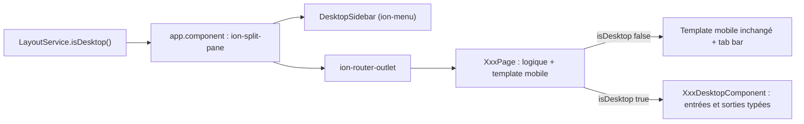

---
todos:
  - id: foundation
    status: completed
    content: 'Socle : LayoutService (web + 1024px), tokens et mixins breakpoints, coque ion-split-pane + DesktopSidebar, colonne centrée pour le web étroit, masquage tab bar et FAB en desktop'
  - id: shared-desktop-ui
    status: completed
    content: 'Composants desktop partagés : elyk-desktop-page, elyk-kpi-card, styles .elyk-table et .elyk-aside-sticky, états hover et focus'
  - id: screens-auth
    status: completed
    content: 'Vues desktop Auth (écran partagé, inscription en 2 colonnes) et Onboarding (étapes + formulaire, import de pièce)'
  - id: screens-home
    status: completed
    content: 'Vues desktop Dashboard (chiffres clés, grille, tableau des activités) et Profil (2 colonnes, mise à jour in-app masquée sur le web)'
  - id: screens-purchases
    status: completed
    content: 'Vues desktop Mes achats (tableau), Détail (panneau récap), Suivi des mises, Paiement Mobile Money + état soumis'
  - id: screens-order
    status: completed
    content: 'Vues desktop Catalogue (filtres + grille + mini-panier), Panier (tableau + résumé), Confirmation, Suivi de commande'
  - id: screens-tontine
    status: completed
    content: 'Vues desktop Mes tontines, Rejoindre, Détail, Historique, Paiement tontine'
  - id: tests
    status: completed
    content: 'Tests unitaires (LayoutService, barre latérale, bascule des pages) + projet Playwright Desktop Chrome avec la suite e2e/specs/desktop'
  - id: docs-release
    status: in_progress
    content: 'Mise à jour du skill UI (volet desktop), guide utilisateur customer + index RAG régénéré, customer-space en 0.7.0 + CHANGELOG'
name: Customer-space responsive desktop
overview: 'Ajouter à l''espace client une vraie expérience desktop (barre latérale, mises en page multi-colonnes, tableaux, panneaux latéraux) pour les 17 écrans. Elle s''active uniquement sur le web à partir de 1024px. Les applications Android et iOS gardent exactement l''interface mobile actuelle.'
isProject: false
---

# Espace client : expérience desktop responsive

## Constat

- Les 17 écrans ([`customer-space/src/app/features/`](customer-space/src/app/features/)) suivent tous le même modèle mobile : `ion-content`, puis le hero `app-elyk-page-header` de 200px, un contenu d'une seule colonne (`.elyk-typec-body`), un bouton d'action fixé en bas dans un `ion-footer` et la barre d'onglets `app-customer-tab-bar` recopiée dans chaque page.
- Aucune media query ni largeur maximale n'existe dans [`global.scss`](customer-space/src/global.scss). Sur desktop, tout s'étire donc sur toute la largeur de l'écran.
- La plateforme est déjà détectée avec `Capacitor.getPlatform() === 'web'` dans le dashboard, le profil et `app-update.service`.

## Décisions

- **Le desktop ne s'active que si deux conditions sont réunies** : on est sur le web, et l'écran fait au moins 1024px de large. Les apps natives Android et iOS, y compris sur tablette, restent toujours en mode mobile.
- **Web entre 0 et 1023px** : on garde l'interface mobile, mais le contenu est limité à une colonne centrée de 640px maximum, pour qu'une fenêtre étroite ou une tablette dans un navigateur ne s'étire pas.
- **Aucune modification des templates mobiles.** Chaque page devient un « conteneur » : elle garde toute sa logique (TypeScript) et son template mobile actuel. Elle affiche une vue desktop dédiée (composant de présentation) seulement quand `isDesktop()` est vrai. Aucun risque de régression sur les apps natives.
- Le déploiement sur `client.amenouveve-yaveh.com` fera l'objet d'un plan séparé. Ce plan couvre seulement le responsive et les ajustements d'interface propres au web.

## Phase 1 : socle desktop

- **`LayoutService`** (nouveau, `shared/layout/layout.service.ts`) : un signal `isDesktop` = plateforme `web` ET `matchMedia('(min-width: 1024px)')`, recalculé à chaque redimensionnement. Il ajoute ou retire la classe `elyk-desktop` sur `<body>`.
- **Tokens et mixins** : ajouter à [`variables.scss`](customer-space/src/theme/variables.scss) `--elyk-desktop-max-width: 1280px`, `--elyk-sidebar-width: 264px` et une échelle typographique desktop. Créer un fichier `theme/_breakpoints.scss` avec les mixins `desktop` et `narrow-web`.
- **Coque de l'application** : dans [`app.component.html`](customer-space/src/app/app.component.html), placer `ion-split-pane` avec `[when]="layout.isDesktop()"` et `contentId="main-content"`. La barre latérale est désactivée sur `/auth` et hors session.
- **`DesktopSidebarComponent`** (`shared/layout/desktop-sidebar/`) contient :
  - la marque AMENOUVEVE-YAVEH / Elykia ;
  - la navigation Accueil, Achats, Tontine, Commander, Profil ;
  - le lien Panier avec son badge (via `CartService`) ;
  - la carte utilisateur (nom, téléphone) et le bouton Se déconnecter ;
  - la version de l'application.
- **Composants partagés desktop** (`shared/ui/desktop/`) :
  - `app-elyk-desktop-page` : conteneur centré de largeur maximale, avec fil d'Ariane, titre en Playfair, sous-titre, emplacement pour les actions et bouton Retour ;
  - `app-elyk-kpi-card` : libellé, montant et variante ;
  - les styles `.elyk-table` (tableau de données avec survol de ligne et ligne cliquable) ;
  - `.elyk-aside-sticky` : panneau latéral qui reste visible au défilement.
- **Règles globales en mode desktop** : masquer `app-customer-tab-bar`, `.elyk-pay-fab` et `.elyk-sticky-cta`. Ajouter les états `:hover` et `:focus-visible` sur les cartes et boutons, `cursor: pointer`, et limiter la largeur des états vides.

## Phase 2 : écrans desktop (une vue `desktop/xxx-desktop.component.*` par page)

**Authentification et dossier**
- **Auth** (connexion, OTP, PIN, inscription) : écran partagé en deux. À gauche, un panneau navy (motif ribbons, marque, 3 avantages). À droite, une carte formulaire de 440px. Le formulaire d'inscription passe en grille de 2 colonnes, avec un libellé « Choisir une photo » au lieu de « Prendre une photo ».
- **Onboarding** : étapes en colonne à gauche, formulaire à droite. La pièce d'identité se dépose en glisser-déposer ou via un bouton d'import. Le bouton d'action est dans la carte, pas dans un `ion-footer`.

**Accueil et profil**
- **Dashboard** :
  - une rangée de 4 cartes chiffres clés (crédit total, payé, restant, prochaine échéance) ;
  - la carte crédit (8 colonnes), à côté d'un panneau d'actions rapides (4 colonnes) ;
  - les activités récentes en tableau ;
  - la bannière « Compte en attente » sur toute la largeur.
- **Profil** : carte d'identité à gauche, informations et paramètres à droite. Le bouton « Mettre à jour l'application » est masqué sur le web, quelle que soit la largeur. Aujourd'hui, il affiche un toast « Android uniquement ».

**Achats**
- **Mes achats** : filtres en onglets, puis un tableau (Référence, Articles, Montant, Progression, Mises, Statut). Cliquer sur une ligne ouvre le détail.
- **Détail d'un achat** : à gauche, le tableau des articles (quantité, prix unitaire, total). À droite, un panneau récapitulatif qui reste visible, avec les boutons « Payer une mise » et « Voir le suivi des mises ». Pas de bouton flottant.
- **Suivi des mises** : grille de pastilles élargie et tableau des mises (numéro, date, montant, statut), plus le panneau récapitulatif et le bouton Payer.
- **Paiement Mobile Money** : à gauche, les instructions (numéros de dépôt, destinataires, étapes). À droite, la carte formulaire avec le bouton de validation intégré. L'état « Paiement soumis » s'affiche dans une carte centrée.

**Commander**
- **Catalogue** : filtres de catégories dans une colonne à gauche, recherche en haut, grille de 4 colonnes. Un mini-panier reste visible à droite (lignes, total, « Voir le panier »).
- **Panier** : tableau des lignes avec les boutons de quantité, plus un panneau résumé qui reste visible, avec le bandeau d'information crédit et le bouton « Passer la commande ».
- **Confirmation de commande** et **Suivi de commande** : carte centrée avec les prochaines étapes et les boutons d'action.

**Tontine**
- **Mes tontines** : la carte de session et la section « Comment ça marche » (3 étapes à l'horizontale) côte à côte, puis les tontines en grille de 2 à 3 cartes.
- **Rejoindre une tontine** : formulaire à gauche, récapitulatif à droite (mise, estimation, règles).
- **Détail d'une tontine** : chiffres clés (total, disponible, mise journalière, progression), carnet des 10 mois en grande grille, boutons d'action dans l'en-tête de la page.
- **Historique des mises** : tableau.
- **Paiement tontine** : même mise en page que le paiement Mobile Money.

Conventions :
- Réutiliser les mêmes `data-testid` pour les actions métier dans les vues desktop.
- La barre latérale utilise des identifiants `e2e-nav-*`.
- Les vues desktop reçoivent l'état par des entrées Angular (`input()`) et remontent les actions par des sorties (`output()`). Les formulaires (`FormGroup`) sont transmis par la page conteneur : aucune logique n'est dupliquée.

## Phase 3 : tests, documentation, livraison

- **Tests unitaires** : `LayoutService` (combinaisons web / natif et largeurs), barre latérale, et un test par page vérifiant qu'elle bascule bien entre la vue mobile et la vue desktop.
- **Playwright** : ajouter un projet `Desktop Chrome` (1440x900) dans [`playwright.config.ts](customer-space/playwright.config.ts)` avec une suite `e2e/specs/desktop/` : navigation par la barre latérale, parcours commande, paiement, tontine. La suite mobile (Pixel 5) reste inchangée.
- **Skill UI** : mettre à jour [`design-system.md`](.cursor/skills/customer-space-ui-style/design-system.md) et [`screens.md`](.cursor/skills/customer-space-ui-style/screens.md) avec un volet desktop (coque, grilles, règles), sans créer un 4e type de page mobile.
- **Guide utilisateur** : ajouter des sections « Sur ordinateur » dans `user-guide/docs/customer/*.md` (connexion, achats et commandes, tontine), puis lancer `python user-guide/generate_rag_index.py`.
- **Version et changelog** : passer customer-space en `0.7.0` et ajouter l'entrée correspondante dans [`docs/CHANGELOG.md`](docs/CHANGELOG.md).

## Hors périmètre

- Le déploiement web (image nginx, compose, Traefik, CD vers `client.amenouveve-yaveh.com`) : plan séparé.
- Toute modification du backend ou de l'API.
