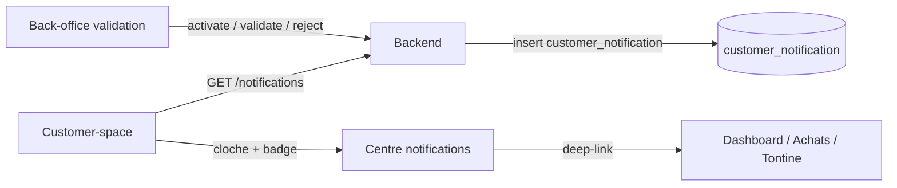

# Plan — Centre de notifications (Espace Client)

## Contexte

Aujourd’hui, [`AppNotification`](backend/src/main/java/com/optimize/elykia/core/entity/notification/AppNotification.java) sert le **back-office** (cloche admin) : le client déclare un paiement / commande → le commercial est alerté.

Il manque le **sens inverse** : le BO valide → le **client** est alerté dans customer-space. Après validation d’inscription, le client peut encore rester sur un écran « en attente » (corrigé séparément via refresh `ionViewWillEnter`) ; un centre de notifications formalise ces événements métier.

## Objectif produit

Quand l’agence (BO) traite une opération, le client voit une notification claire dans l’app :

| Événement BO | Type proposé | Message type (FR métier) | Deep-link |
|--------------|--------------|--------------------------|-----------|
| Validation inscription | `REGISTRATION_ACTIVATED` | « Votre compte est activé. Bienvenue ! » | `/dashboard` |
| Refus inscription | `REGISTRATION_REJECTED` | « Votre inscription n’a pas pu être validée. » | `/onboarding` |
| Validation paiement crédit (recouvrement MM) | `CREDIT_PAYMENT_VALIDATED` | « Paiement de X F validé » | `/purchases/:creditId` ou `/payment/...` |
| Refus paiement crédit | `CREDIT_PAYMENT_REJECTED` | « Paiement refusé — contactez votre agence » | `/purchases` |
| Validation collecte tontine MM | `TONTINE_PAYMENT_VALIDATED` | « Cotisation tontine validée » | `/tontines` |
| Refus collecte tontine | `TONTINE_PAYMENT_REJECTED` | « Cotisation refusée » | `/tontines` |
| Commande validée / en livraison / livrée | `ORDER_STATUS_CHANGED` | « Commande CMD-… : Validée » | `/purchases/:id` ou détail commande |

Hors v1 (à noter, pas à construire tout de suite) : push native, email, WebSocket temps réel.

## Architecture proposée

**Séparation volontaire** d’`app_notification` (audience staff) :

- Table dédiée `customer_notification` (audience = `client_id`)
- Pas de filtre PROMOTER / rôles internes
- Textes déjà prêts pour l’affichage client (pas de jargon technique)

Réutiliser le pattern `app_notification` + `app_notification_read` évite de mélanger audiences et permissions JWT (staff vs customer).

## Modèle de données

Migration Flyway (ex. `V1xx__customer_notification.sql`) :

**`customer_notification`**

- `id`, audit `BaseEntity`, `state`
- `type` (`REGISTRATION_ACTIVATED` | `REGISTRATION_REJECTED` | `CREDIT_PAYMENT_VALIDATED` | `CREDIT_PAYMENT_REJECTED` | `TONTINE_PAYMENT_VALIDATED` | `TONTINE_PAYMENT_REJECTED` | `ORDER_STATUS_CHANGED`)
- `client_id` (obligatoire, index)
- `entity_id` / `entity_reference` (soumission, order, credit…)
- `title`, `message`
- `amount` (nullable), `operation_date` (nullable)
- `link_path`, `link_query`
- `created_at` (déjà dans BaseEntity)

**`customer_notification_read`**

- PK `(notification_id, client_id)`, `read_at`
- Ou colonne `read_at` nullable directement sur `customer_notification` si 1 lecteur = 1 client (plus simple en v1)

Recommandation v1 : **`read_at` sur la ligne** (un seul destinataire = le client). Table de lecture séparée seulement si on ajoute plus tard des destinataires multiples (ex. conjoint).

## Hooks backend (points d’insertion)

| Service existant | Méthode | Action |
|------------------|---------|--------|
| `ClientRegistrationAdminService` | `activate` | create `REGISTRATION_ACTIVATED` |
| `ClientRegistrationAdminService` | `reject` | create `REGISTRATION_REJECTED` |
| `CustomerMobileMoneySubmissionAdminService` | validate / reject | create `CREDIT_PAYMENT_*` |
| `CustomerTontineMmSubmissionAdminService` | validate / reject | create `TONTINE_PAYMENT_*` |
| Flux commande BO (statut order) | passage PENDING → VALIDATED / DELIVERED / … | create `ORDER_STATUS_CHANGED` |

Nouveau service : `CustomerNotificationService` (create, listForClient, unreadCount, markRead, markAllRead).

Schema catalog IA : **non** (table technique hors chat DATA), sauf si reporting métier demandé plus tard.

## API customer-space

Sous `/api/customer/notifications` (JWT client) :

- `GET /` — page récente (ex. 50), tri `created_at DESC`
- `GET /unread-count` — badge
- `POST /{id}/read` — marquer lu
- `POST /read-all` — tout marquer lu

Sécurité : toujours filtrer par `contextService.requireClient()` → `client_id` de la session ; jamais d’id client en query libre.

## UX customer-space

1. **Cloche** dans le header Accueil (à côté du profil) + éventuellement Profil
2. **Badge** rouge si `unreadCount > 0`
3. Page **`/notifications`** : liste chronologique, icône par type, swipe / tap = marquer lu + deep-link
4. **Polling** léger (ex. 60 s) sur Accueil + refresh à `ionViewWillEnter` (même pattern que le correctif activation)
5. Empty state : « Aucune notification pour le moment »

Alignement design : tokens customer-space existants (navy / cream / Playfair), pas de jargon (« original », IDs techniques).

## Phasage

### Phase 1 — MVP (à livrer en premier)

1. DDL + entity + repo + `CustomerNotificationService`
2. Hooks inscription + paiements crédit + tontine
3. API list / unread / mark-read
4. UI cloche + page liste + deep-links dashboard / purchases / tontines
5. Tests unitaires backend + specs Angular + e2e smoke badge
6. Guide utilisateur (`user-guide/docs/` profil client) + `python user-guide/generate_rag_index.py`
7. Changelog Customer-space + Backend (semver)

### Phase 2 — Enrichissements

- Hook commandes (tous les changements de statut utiles)
- Capacitor Push Notifications (FCM) sur les mêmes événements
- Préférences client (activer / couper par type)

## Hors scope explicite

- Ne pas réutiliser la cloche admin frontend pour le client
- Pas de WebSocket v1
- Pas de modification du modèle `AppNotification` staff (sauf si on ajoute un champ `audience` plus tard — **non recommandé** pour v1)

## Critères d’acceptation (MVP)

1. Après validation BO d’une inscription, le client voit une notif « compte activé » (et le dashboard ACTIVE grâce au refresh déjà livré).
2. Après validation / refus d’un paiement MM crédit ou tontine, une notif apparaît avec deep-link correct.
3. Le badge reflète le nombre de non-lus ; « Tout marquer comme lu » remet le badge à 0.
4. Un client A ne voit jamais les notifications du client B.
5. Guide utilisateur et index RAG à jour.
