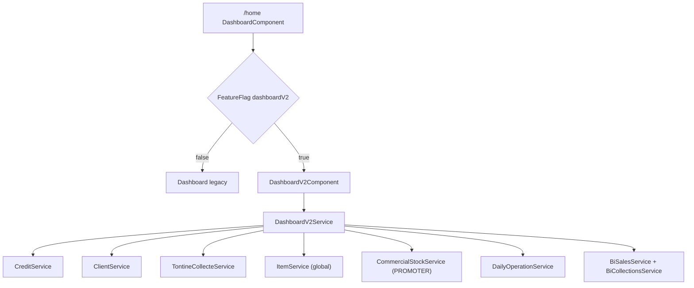

# Dashboard V2 — Page d'accueil pilotage

## Contexte actuel

- [`frontend/src/app/dashboard/dashboard.component.ts`](frontend/src/app/dashboard/dashboard.component.ts) : KPIs statiques (jamais chargés), graphiques dormants, tables rupture stock pour `ROLE_STOREKEEPER` uniquement.
- Les vraies métriques existent déjà via APIs dispersées :
  - Crédit encours/recouvré : `POST /api/v1/credits/list-summary` → `InProgressCreditSummaryDto` (`count`, `totalAmount`, `totalMargin`, `totalAmountRemaining`)
  - Clients : `GET /api/v1/clients/kpis?username=` → `totalRegistered`, `withActiveCredit`
  - Tontine : `GET /api/v1/tontine-collections/web/summary` → `totalMontant`, `totalMises`
  - Stock **magasin (global)** : `GET /api/v1/articles/stock-kpis` → `inStockCount`, `purchaseTotal`, `creditSaleTotal`, etc.
  - Stock **commercial (PROMOTER)** : `GET /api/commercial-stocks/current/{collector}` ou `/{collector}/{year}/{month}` → `CommercialMonthlyStock.items[]` avec `quantityRemaining`, `weightedAverageUnitPrice` (déjà utilisé par [`my-stock-dashboard`](frontend/src/app/stock/pages/my-stock-dashboard/my-stock-dashboard.component.ts))
  - Activité : `GET /api/daily-operations` (PROMOTER auto-scopé côté backend)
  - Dernières ventes : `POST /api/v1/credits/fetch` (tri date desc, size 5)
  - Graphiques tendances : `GET /api/v1/bi/sales/trends` + `GET /api/v1/bi/collections/trends` (accessibles sans `ROLE_REPORT` côté API)

## Architecture cible



## Feature flag

Ajouter `DashboardV2 = 'dashboardV2'` dans [`frontend/src/app/shared/service/feature-flag.service.ts`](frontend/src/app/shared/service/feature-flag.service.ts) (default `false`).

Dans [`dashboard.component.html`](frontend/src/app/dashboard/dashboard.component.html) :

```html
<app-dashboard-v2 *ngIf="dashboardV2Enabled; else legacyDashboard"></app-dashboard-v2>
<ng-template #legacyDashboard>… contenu actuel inchangé …</ng-template>
```

`dashboard.component.ts` : souscription `flags$` + `isFeatureEnabled(FeatureFlags.DashboardV2)`.

Configurer la clé `dashboardV2` dans Firebase Remote Config (hors code).

## Nouveau module Dashboard V2

Créer `frontend/src/app/dashboard/dashboard-v2/` :

| Fichier | Rôle |
|---------|------|
| `dashboard-v2.component.ts/html/scss` | Layout maquette : header, sélecteur mois, 4 KPI, 2 graphiques, 2 panneaux bas |
| `dashboard-v2.service.ts` | Orchestration `forkJoin` des appels API |
| `utils/operation-message.util.ts` | Phrases naturelles à partir de `OperationType` + `amount` + `reference` |
| `components/dashboard-kpi-card/` | Carte KPI (icône, valeur, sous-titre, option trend) |
| `components/recent-sales-panel/` | Table 5 dernières ventes |
| `components/recent-activity-panel/` | Timeline activité |
| `components/sales-evolution-chart/` | Ligne Crédits vs Recouvrements (ng2-charts) |
| `components/stock-status-chart/` | Donut En stock / Faible / Rupture |

Déclarer dans [`app.module.ts`](frontend/src/app/app.module.ts) + importer `NgChartsModule`, `MatDatepickerModule` (sélecteur mois).

**Style UI** : suivre [frontend-ui-style SKILL](.cursor/skills/frontend-ui-style/SKILL.md) — `breadcrumb-bar`, `page-header-card`, tokens navy/cyan ; cartes KPI enrichies comme la maquette (icône colorée, valeur DM Mono, sous-titre).

## KPI — 4 cartes (ligne du haut)

| Carte | Données | Source | Sous-titre |
|-------|---------|--------|------------|
| **Crédits en cours** | `count`, `totalAmount`, `totalMargin` | `list-summary.inProgressCredit` | ex. « 42 crédits · marge X FCFA » (marge masquée si PROMOTER, comme [`credit-list-kpi`](frontend/src/app/credit/credit-list/components/credit-list-kpi/credit-list-kpi.component.html)) |
| **Recouvrement encours** | recouvré = `totalAmount - totalAmountRemaining` ; restant = `totalAmountRemaining` | même DTO | ex. « Recouvré X · Restant Y FCFA » (**portefeuille snapshot**, choix validé) |
| **Tontine** | `totalMontant` collecté ; `totalSocietyShare` part société | `tontine-collections/web/summary` | ex. « N mises · part société X FCFA » |
| **Clients** | `totalRegistered` actifs ; `withActiveCredit` avec crédit | `clients/kpis` | ex. « X actifs · Y avec crédit » |
| **Stock** (5e carte) | **PROMOTER** : lignes en stock + valorisation restante · **autres profils** : stock magasin global | voir section Stock ci-dessous | ex. « 24 articles · 1,2 M FCFA » ou « Stock magasin » |

> Note layout : la maquette montre 4 cartes ; regrouper **Clients + Stock** en une carte double-métrique ou passer à une grille `kpi-strip-5` — préférer **5 cartes** sur 2 rangées (4+1) pour lisibilité des 5 métriques demandées.

## Scoping PROMOTER

Pattern identique à [`daily-report.component.ts`](frontend/src/app/report/pages/daily-report/daily-report.component.ts) et [`client-list.component.ts`](frontend/src/app/client/client-list/client-list.component.ts) :

```typescript
const collector = isPromoter ? currentUser.username : undefined;
// credits list-summary
search: { commercial: collector, ... }
// tontine summary, client kpis
getSummary(from, to, collector)
getClientKpis(collector)
// daily-operations : backend force déjà le username PROMOTER
```

// daily-operations : backend force déjà le username PROMOTER
```

### Stock — double source selon le profil

| Profil connecté | Source | KPI affichés | Libellé carte |
|-----------------|--------|--------------|---------------|
| **PROMOTER** | [`CommercialStockService`](frontend/src/app/stock/services/commercial-stock.service.ts) | Stock **du commercial connecté** (mois sélectionné) | « Mon stock commercial » |
| **Gestionnaire, secrétaire, admin, magasinier, etc.** | [`ItemService.getArticleStockKpis`](frontend/src/app/article/service/item.service.ts) | Stock **magasin global** (entrepôt / articles) | « Stock magasin » |

**PROMOTER — appel et calculs** (réutiliser la logique de [`my-stock-dashboard`](frontend/src/app/stock/pages/my-stock-dashboard/my-stock-dashboard.component.ts)) :

```typescript
// Mois courant ou mois du sélecteur dashboard
commercialStockService.getStockByDate(username, year, month)
  .catch(() => commercialStockService.getCurrentStock(username))

// Depuis stock.items :
articleLinesInStock = items.filter(i => i.quantityRemaining > 0).length
totalUnits = sum(quantityRemaining)
valuation = sum(quantityRemaining * weightedAverageUnitPrice)  // identique getTotalStockValue()
```

Créer `utils/commercial-stock-kpi.util.ts` pour centraliser count / valorisation / segments donut.

**Alignement sélecteur de mois** : si l'utilisateur choisit « Mai 2026 », appeler `GET /api/commercial-stocks/{collector}/2026/5` ; si pas de stock ce mois-là → KPI à 0 + message discret « Aucun stock pour cette période ».

**Sécurité** : le backend scoping PROMOTER existe déjà sur `GET /api/commercial-stocks` (liste paginée) dans [`CommercialMonthlyStockService.queryStocks`](backend/src/main/java/com/optimize/elykia/core/service/commercial/CommercialMonthlyStockService.java). Le frontend passe toujours `currentUser.username` pour un PROMOTER (ne pas exposer le sélecteur commercial sur le dashboard accueil).

**Pas de nouvel endpoint backend obligatoire** pour le stock commercial : les données sont déjà dans `CommercialMonthlyStock`. Option phase 2 : `GET /api/commercial-stocks/{collector}/kpis` si on veut alléger le payload (aujourd'hui la réponse inclut tous les items + recoverySummary).

## Graphiques (section milieu)

### Évolution ventes / recouvrements
- Toggle **Mois / Trimestre / Année** recalcule `startDate`/`endDate`.
- Appels parallèles :
  - `BiSalesService.getSalesTrends({ startDate, endDate })` → série « Crédits » (`totalAmount` par jour)
  - `BiCollectionsService.getSalesTrends` (ou endpoint collections trends) → série « Recouvrements »
- Agrégation frontend par mois/trimestre si granularité jour trop fine.
- Réutiliser la config Chart.js de [`line-chart.component.ts`](frontend/src/app/bi/components/line-chart/line-chart.component.ts) (copie légère dans dashboard-v2 pour éviter couplage BiModule).

### Stock par statut (donut) — branche selon profil

**Profils non-PROMOTER (stock magasin)** :
- Données depuis `articles/stock-kpis` + **`lowStockCount`** (extension backend).
- Segments : En stock (`inStockCount - lowStockCount`), Faible stock (`lowStockCount`), Rupture (`outOfStockCount`).

**PROMOTER (stock commercial du mois)** :
- Segments calculés sur `CommercialMonthlyStock.items` (seuil faible stock = `quantityRemaining <= 5 && > 0`, aligné magasin) :
  - **En stock** : `quantityRemaining > 5`
  - **Faible stock** : `1..5`
  - **Rupture** : `quantityRemaining === 0` (lignes épuisées ce mois)
- Centre donut : % disponible = unités en stock / total unités prises (`quantityTaken`).

Titre du widget adapté : « Mon stock par statut » vs « Stock magasin par statut ».

## Panneaux bas

### Dernières ventes (5)
- `creditService.searchCredits({ commercial: collector }, 0, 5)` avec tri `beginDate,desc` (vérifier param sort côté API ; sinon tri client).
- Colonnes : client (initiales + référence `#CR-…`), montant, badge statut (`statusBadge` pipe existant), date.
- Lien « Voir tout » → `/credit-list`.

### Activité récente (5)
- `dailyOperationService.getOperations(startOfMonth, today, collector, 0, 5)`.
- Formatter via `operation-message.util.ts` :

```typescript
// Exemples
// CREDIT_COLLECTION + amount → « ges003 a enregistré un recouvrement de 45 000 F pour Marie Kouassi »
// NEW_CLIENT → « ges003 a ajouté le client Marie Kouassi »
// TONTINE_COLLECTION → « ges003 a collecté 12 000 F (tontine) pour … »
```

Priorité : `description` backend si présente, sinon template par `OperationType`. Horodatage relatif (« Il y a 2 min ») via pipe `timeAgo` léger.

Lien « Voir tout l'historique » → `/daily-report` ou route journal existante.

## Extensions backend (minimales)

### 1. Part société tontine sur la période
**Problème** : `TontineCollectionKpiDto` n'expose que `totalMontant` / `totalMises` ; la part société n'est pas stockée par collecte.

**Solution** :
- Migration : colonne `society_share_amount` sur `tontine_collection` (default 0).
- Dans [`TontineService.processCollectionAllocation`](backend/src/main/java/com/optimize/elykia/core/service/tontine/TontineService.java) : persister `amountForSociety` sur l'entité lors de `recordCollection`.
- Étendre [`TontineCollectionKpiDto`](backend/src/main/java/com/optimize/elykia/core/dto/TontineCollectionKpiDto.java) avec `totalSocietyShare`.
- Requête SUM dans [`TontineCollectionRepository`](backend/src/main/java/com/optimize/elykia/core/repository/TontineCollectionRepository.java) + [`TontineCollectionWebService.getKpiSummary`](backend/src/main/java/com/optimize/elykia/core/service/tontine/TontineCollectionWebService.java).

### 2. Faible stock pour le donut **magasin uniquement**
- Ajouter `lowStockCount` dans [`ArticlesService.getArticleStockKpis`](backend/src/main/java/com/optimize/elykia/core/service/store/ArticlesService.java) : `countByStockQuantityLessThanEqualAndStockQuantityGreaterThan(6, 0)` (seuil aligné sur `nextOutOfStock`).
- Mettre à jour l'interface `ArticleStockKpis` côté frontend.
- **Stock commercial PROMOTER** : pas d'extension backend — segments calculés côté frontend depuis `CommercialMonthlyStock.items`.

### 3. (Optionnel phase 2) Scoping PROMOTER sur tendances BI
Hors scope initial : graphiques globaux pour tous les rôles. Documenter comme limitation ; filtre `collector` sur trends BI si besoin ultérieur.

## Comportements conservés

- **Flag désactivé** : dashboard legacy 100 % inchangé (y compris tables magasinier).
- **Flag activé + `ROLE_STOREKEEPER`** : réafficher en bas de DashboardV2 les 2 tables rupture stock existantes (extraire le markup/TS actuel en composant `dashboard-stockkeeper-alerts` partagé entre legacy et v2).

## Tests

- **Unitaire** : `dashboard-v2.service.spec.ts` (mock APIs, vérif calcul recouvré = total - remaining), `operation-message.util.spec.ts`.
- **Composant** : `dashboard.component.spec.ts` — bascule flag on/off.
- Pas d'E2E obligatoire (hors scope customer-space/mobile).

## Livrables docs

- Mettre à jour [`docs/CHANGELOG.md`](docs/CHANGELOG.md) (section `[Unreleased]` / date du jour) : Dashboard V2, feature flag, extension part société tontine.

## Fichiers principaux touchés

**Frontend**
- [`feature-flag.service.ts`](frontend/src/app/shared/service/feature-flag.service.ts)
- [`dashboard.component.ts/html`](frontend/src/app/dashboard/dashboard.component.ts)
- Nouveau dossier `dashboard/dashboard-v2/**`
- [`app.module.ts`](frontend/src/app/app.module.ts)
- [`item.service.ts`](frontend/src/app/article/service/item.service.ts) (interface `lowStockCount`)
- [`commercial-stock.service.ts`](frontend/src/app/stock/services/commercial-stock.service.ts) (réutilisé tel quel)
- `dashboard/dashboard-v2/utils/commercial-stock-kpi.util.ts` (nouveau)

**Backend**
- Migration SQL `society_share_amount`
- [`TontineCollection.java`](backend/src/main/java/com/optimize/elykia/core/entity/tontine/TontineCollection.java)
- [`TontineService.java`](backend/src/main/java/com/optimize/elykia/core/service/tontine/TontineService.java)
- [`TontineCollectionKpiDto.java`](backend/src/main/java/com/optimize/elykia/core/dto/TontineCollectionKpiDto.java)
- [`ArticlesService.java`](backend/src/main/java/com/optimize/elykia/core/service/store/ArticlesService.java)
