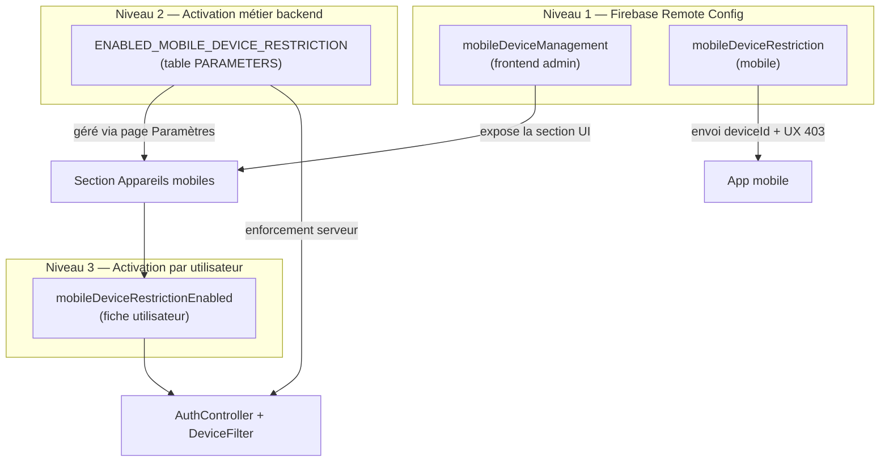
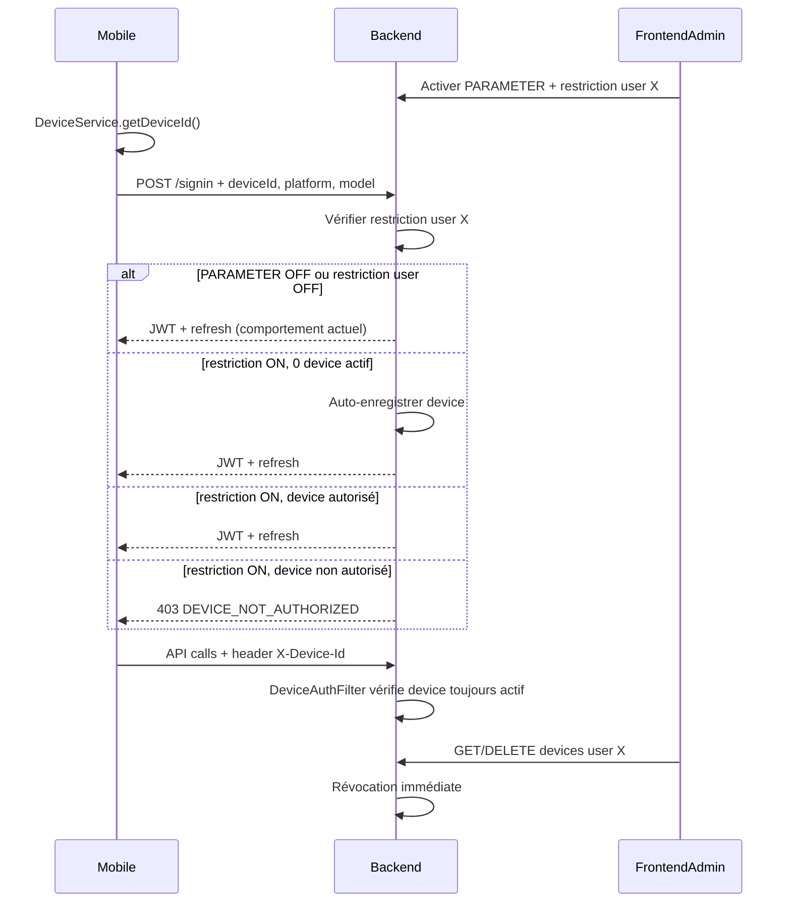
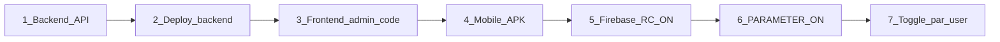

# Plan — Contrôle des appareils autorisés (mobile)

## Contexte actuel

- **Mobile** : login via `POST /api/auth/signin` avec `{ username, password }` uniquement ([`auth.service.ts`](mobile/src/app/core/services/auth.service.ts)). Aucun identifiant d'appareil. Mode offline-first : en cas d'échec API, fallback sur credentials locaux.
- **Backend** : JWT stateless + refresh tokens en DB. Pas de registre device/session ([`AuthController.java`](backend-lib/common-securities/src/main/java/com/optimize/common/securities/controllers/AuthController.java)).
- **Frontend admin** : fiche utilisateur existante ([`user-details`](frontend/src/app/user/user-details/)) — permissions, activation/désactivation.
- **Feature flags** : Firebase Remote Config côté clients (visibilité / capacités UI) ; `PARAMETERS` table côté backend (enforcement métier) — **deux mécanismes distincts, ne pas les confondre**.

## Stratégie des feature flags — 3 niveaux distincts

La fonctionnalité repose sur **trois couches indépendantes**. Chacune a un rôle, une source de vérité et un gestionnaire différent.



### Niveau 1 — Feature flags Firebase Remote Config (déploiement client)

**Rôle** : contrôler la **disponibilité du code côté client** (affichage UI, envoi du deviceId, messages UX). Ce ne sont **pas** des flags de sécurité — le backend ne les consulte jamais.

| Clé Firebase | Client | Défaut | Effet |
|--------------|--------|--------|-------|
| `mobileDeviceManagement` | Frontend admin | `false` | Affiche/masque la section « Appareils mobiles » sur la fiche utilisateur |
| `mobileDeviceRestriction` | Mobile | `false` | Active l'envoi systématique du `deviceId` au login + header `X-Device-Id` + gestion UX du 403 |

**Gestionnaire** : console Firebase Remote Config (ou `firebase deploy --only remoteconfig`). Permet un rollout progressif des APK / builds frontend **sans activer la restriction**.

**Rétrocompatibilité** : anciennes versions sans ce code → flag ignoré, comportement inchangé.

### Niveau 2 — Activation métier backend (PARAMETERS)

**Rôle** : **source de vérité pour l'enforcement serveur**. Quand `false`, le backend ignore totalement les devices (même si l'app en envoie).

| Clé | Table | Défaut | Effet |
|-----|-------|--------|-------|
| `ENABLED_MOBILE_DEVICE_RESTRICTION` | `PARAMETERS` | `false` | Active la logique de vérification device dans `UserAuthorizedDeviceService`, `AuthController`, `DeviceAuthorizationFilter` |

**Gestionnaire** : page **Paramètres** du frontend admin ([`parameters/`](frontend/src/app/parameters/)) — toggle booléen via API `/api/parameters`. **Pas Firebase.**

**Visibilité UI** : le toggle sur la page Paramètres n'est visible que si le flag Firebase `mobileDeviceManagement` est `true` (le code UI existe, mais l'admin choisit quand activer côté serveur).

### Niveau 3 — Activation par utilisateur (fiche utilisateur)

**Rôle** : restreindre **un compte spécifique** aux appareils autorisés.

| Champ | Table | Défaut | Effet |
|-------|-------|--------|-------|
| `mobileDeviceRestrictionEnabled` | `USERS` | `false` | Si `true` + niveau 2 actif → enforcement pour cet utilisateur |

**Gestionnaire** : toggle sur la fiche utilisateur ([`user-details`](frontend/src/app/user/user-details/)), visible uniquement si :
1. Firebase `mobileDeviceManagement` = `true` (section UI déployée)
2. `ENABLED_MOBILE_DEVICE_RESTRICTION` = `true` (backend prêt à enforcer)

### Matrice de comportement combinée

| Firebase UI | PARAMETER backend | Toggle user | Comportement |
|-------------|-------------------|-------------|--------------|
| OFF | * | * | Comportement actuel — aucune UI, aucun contrôle |
| ON | OFF | OFF | Section UI visible en lecture ; devices listés si l'app en envoie ; **aucun blocage** |
| ON | ON | OFF | Admin peut gérer la liste devices ; **aucun blocage** pour cet user |
| ON | ON | ON | **Enforcement actif** — seuls les devices autorisés peuvent se connecter |

> **Règle clé** : la sécurité repose exclusivement sur **niveau 2 + niveau 3** (backend). Firebase (niveau 1) ne fait que déployer progressivement le code client.

## Architecture cible



## Modèle de données (nouveau)

Migration Flyway `V63__user_authorized_devices.sql` dans [`backend/src/main/resources/db/migration/`](backend/src/main/resources/db/migration/) :

**Table `user_authorized_device`**
| Colonne | Description |
|---------|-------------|
| `id` | PK |
| `user_id` | FK → `USERS.USEID` |
| `device_id` | Identifiant stable (hash SHA-256 côté serveur recommandé) |
| `device_label` | Nom lisible (ex. "Samsung A54 — Jean") |
| `platform` | `android` / `ios` / `web` |
| `model` | Modèle appareil |
| `app_version` | Version APK au moment de l'enregistrement |
| `registered_at` | Date 1ère connexion |
| `last_seen_at` | Dernière activité |
| `active` | `true` / `false` (révocation sans suppression) |
| `registered_by` | `SYSTEM` (auto-enroll) ou username admin |

**Colonne sur `USERS`** : `mobile_device_restriction_enabled BOOLEAN NOT NULL DEFAULT false`

Contrainte unique : `(user_id, device_id)`.

## Règles d'enforcement (rétrocompatibilité)

L'enforcement est évalué **uniquement côté backend** (niveaux 2 et 3). Les flags Firebase n'interviennent pas.

| Condition | Comportement |
|-----------|--------------|
| `ENABLED_MOBILE_DEVICE_RESTRICTION` (PARAMETERS) = `false` | Aucun contrôle device — comportement actuel, même si Firebase ON |
| PARAMETER ON + `mobileDeviceRestrictionEnabled` = `false` pour l'utilisateur | Aucun contrôle ; devices enregistrés en lecture seule pour visibilité admin |
| PARAMETER ON + restriction user ON + 0 device actif | **Auto-enregistrement** au 1er login online réussi, puis enforcement |
| PARAMETER ON + restriction user ON + devices actifs | Seuls les devices actifs autorisés |
| Ancienne APK (pas de `deviceId`) + restriction user ON | **403** — message invitant à mettre à jour l'app |
| Compte désactivé (`UserAccount.active = false`) | Refus login existant — **complémentaire** à la restriction device |

Le toggle par utilisateur (choix validé) garantit que les comptes existants ne sont pas impactés tant qu'un admin n'active pas explicitement la restriction.

## Backend — composants à créer/modifier

### 1. Entité et services (`backend-lib/common-securities`)

- `UserAuthorizedDevice` (JPA entity + repository)
- `UserAuthorizedDeviceService` :
  - `validateAndRegisterOnLogin(userId, deviceInfo)` — logique d'enforcement
  - `isDeviceAuthorized(userId, deviceId)`
  - `revokeDevice(userId, deviceId)`
  - `listDevices(userId)`, `updateLastSeen(userId, deviceId)`
- Étendre [`User`](backend-lib/common-securities/src/main/java/com/optimize/common/securities/models/User.java) avec `mobileDeviceRestrictionEnabled`

### 2. Auth — points d'entrée

**[`LoginRequest`](backend-lib/common-securities/src/main/java/com/optimize/common/securities/payload/request/LoginRequest.java)** — champs optionnels :
```java
private String deviceId;
private String deviceLabel;
private String platform;
private String model;
private String appVersion;
```

**[`AuthController.authenticateUser`](backend-lib/common-securities/src/main/java/com/optimize/common/securities/controllers/AuthController.java)** — après authentification réussie et avant émission JWT :
- Appeler `UserAuthorizedDeviceService.validateAndRegisterOnLogin(...)`
- En cas de refus : `403` + body `{ "code": "DEVICE_NOT_AUTHORIZED", "message": "..." }`

**[`AuthController.refreshtoken`](backend-lib/common-securities/src/main/java/com/optimize/common/securities/controllers/AuthController.java)** — même vérification (sinon contournement via refresh token).

### 3. Filtre HTTP pour les appels API authentifiés

Nouveau `DeviceAuthorizationFilter` (après `AuthTokenFilter`) :
- Lit header `X-Device-Id` sur les requêtes authentifiées
- Si restriction active pour l'utilisateur courant → vérifie device toujours actif en DB
- Met à jour `last_seen_at`
- Exclure : `/actuator/**`, `/api/auth/**`, endpoints publics
- Retourne `403 DEVICE_NOT_AUTHORIZED` → permet révocation **immédiate** même avec JWT valide

### 4. API admin — gestion des devices

Nouveau controller `UserDeviceController` sous `/api/v1/users/{userId}/devices` :

| Méthode | Route | Rôle |
|---------|-------|------|
| `GET` | `/` | Liste des devices d'un user |
| `PATCH` | `/{deviceId}/revoke` | Révoquer un device |
| `PATCH` | `/{deviceId}/restore` | Réactiver (optionnel) |
| `DELETE` | `/{deviceId}` | Supprimer définitivement |
| `PATCH` | `/restriction` | `{ "enabled": true/false }` — toggle restriction user |

Sécuriser avec `@PreAuthorize("hasRole('ROLE_EDIT_USER')")`.

### 5. Paramètre métier backend (niveau 2 — pas Firebase)

Ajouter dans [`application.yml`](backend-lib/common-securities/src/main/resources/application.yml) `init-data` :
```yaml
key: ENABLED_MOBILE_DEVICE_RESTRICTION
value: false
description: Activer le contrôle des appareils autorisés pour l'application mobile
```

Utiliser `ParameterService.isEnabled(...)` dans le service device. Ce paramètre est la **seule source de vérité** pour l'enforcement serveur.

### 6. Exception handler

Dans [`AdviceController`](backend-lib/common-securities/src/main/java/com/optimize/common/securities/controllers/AdviceController.java) : handler `DeviceNotAuthorizedException` → HTTP 403 structuré.

## Mobile — modifications

### 1. Identifiant d'appareil

- Ajouter dépendance `@capacitor/device` dans [`mobile/package.json`](mobile/package.json)
- Nouveau `DeviceIdentityService` :
  - `Device.getId()` sur natif (ANDROID_ID / identifierForVendor)
  - Fallback : UUID persistant en `Preferences` (`elykia_installation_id`) pour web/tests
  - `Device.getInfo()` pour model/platform

### 2. Login

- Étendre `LoginRequest` dans [`auth.model.ts`](mobile/src/app/models/auth.model.ts)
- [`AuthService.login()`](mobile/src/app/core/services/auth.service.ts) : envoyer device info **si** flag Firebase `mobileDeviceRestriction` = `true` (niveau 1 — capacité client). Le backend décide seul s'il enforce (niveau 2+3).
- Gérer erreur `403 DEVICE_NOT_AUTHORIZED` : message utilisateur clair, pas de fallback offline

### 3. Intercepteur HTTP

[`auth.interceptor.ts`](mobile/src/app/core/interceptors/auth.interceptor.ts) : ajouter header `X-Device-Id` sur les requêtes authentifiées **si** flag Firebase `mobileDeviceRestriction` = `true`.

Nouveau handler dans un intercepteur (ou extension de `network-error.interceptor.ts`) :
- Sur `403` + `code === 'DEVICE_NOT_AUTHORIZED'` → logout forcé + toast/alerte

### 4. Mode offline — limite connue et mitigations

Le mode offline **ne peut pas** vérifier le device côté serveur. Mitigations :
- **Ne pas autoriser le fallback offline** si la réponse API est `DEVICE_NOT_AUTHORIZED` (distinct du timeout/réseau)
- Stocker localement `deviceRestrictionActive: boolean` après login online réussi
- Si `deviceRestrictionActive` et tentative offline login → refuser avec message "Connexion internet requise pour vérifier l'appareil"
- À la reconnexion, le filtre API révoque immédiatement les sessions locales

Documenter cette limite : un commercial révoqué peut encore utiliser l'app **offline** jusqu'à la prochaine connexion réseau — acceptable si combiné avec désactivation du compte.

### 5. Feature flag Firebase (niveau 1 — mobile)

Ajouter dans [`feature-flag.service.ts`](mobile/src/app/core/services/feature-flag.service.ts) :
```typescript
MobileDeviceRestriction = 'mobileDeviceRestriction'  // default: false
```

**Rôle** : activer côté client l'envoi du deviceId et la gestion UX du 403. **Ne contrôle pas l'enforcement** — c'est le PARAMETER backend qui décide.

### 6. Version bump

Incrémenter version mobile (skill `mobile-version-bump`) — changement significatif → **mineur** (`2.10.0`).

## Frontend admin — gestion UI

### 1. Feature flag Firebase (niveau 1 — visibilité UI)

Ajouter `MobileDeviceManagement = 'mobileDeviceManagement'` dans [`feature-flag.service.ts`](frontend/src/app/shared/service/feature-flag.service.ts) (default `false`). Créer le paramètre dans Firebase Remote Config.

**Rôle** : expose ou masque toute la section « Appareils mobiles » et le toggle sur la page Paramètres. Sans ce flag, l'admin ne voit rien — même si le backend est prêt.

### 2. Activation métier (niveau 2 — page Paramètres)

Sur la page [`parameters/`](frontend/src/app/parameters/), ajouter un toggle pour `ENABLED_MOBILE_DEVICE_RESTRICTION` :
- Visible uniquement si Firebase `mobileDeviceManagement` = `true`
- Appelle `PUT /api/parameters` pour activer/désactiver l'enforcement serveur
- Libellé explicite : « Activer le contrôle des appareils mobiles (sécurité serveur) »

### 3. Section « Appareils mobiles » sur fiche utilisateur (niveau 3)

Dans [`user-details.component`](frontend/src/app/user/user-details/) — visible si Firebase `mobileDeviceManagement` = `true` :

- **Bandeau info** si PARAMETER backend OFF : « Fonctionnalité visible mais non active — activez le contrôle dans Paramètres »
- **Toggle** « Restreindre les connexions à des appareils autorisés » → `PATCH /api/v1/users/{id}/devices/restriction` — **désactivé** si PARAMETER backend OFF
- **Tableau** des devices : label, plateforme, modèle, version app, dernière activité, statut
- **Actions** : Révoquer / Réactiver (ROLE_EDIT_USER)
- État vide : « Aucun appareil enregistré — le premier login enregistrera automatiquement l'appareil »

### 4. Service API

Étendre [`user.service.ts`](frontend/src/app/user/service/user.service.ts) ou créer `user-device.service.ts` avec les appels CRUD.

## Scénario métier : commercial qui quitte la boîte

1. Admin **désactive le compte** (contrôle principal existant)
2. Admin **révoque le device** sur la fiche utilisateur (défense en profondeur)
3. Si le commercial tente de se reconnecter online → `403 DEVICE_NOT_AUTHORIZED`
4. S'il avait une session offline active → bloquée au prochain appel API online

## Ordre de déploiement recommandé



1. Déployer backend (PARAMETER = `false` → aucun impact)
2. Déployer frontend admin (Firebase UI flag OFF → section masquée)
3. Distribuer nouvelle APK mobile (Firebase mobile flag OFF → pas d'envoi deviceId)
4. **Firebase Remote Config** : activer `mobileDeviceManagement` (admin) + `mobileDeviceRestriction` (mobile) — déploie le code client sans activer la sécurité
5. **Page Paramètres admin** : activer `ENABLED_MOBILE_DEVICE_RESTRICTION` — active l'enforcement serveur
6. Sur chaque commercial concerné : activer le toggle restriction (niveau 3) + gérer/révoquer devices

## Tests à prévoir

| Couche | Tests |
|--------|-------|
| Backend | Unit : règles enforcement (flag off, user off, auto-enroll, revoke) ; intégration : signin/refreshtoken/filter 403 |
| Mobile | Unit : `DeviceIdentityService` ; spec : login envoie deviceId, 403 → pas de fallback offline |
| Frontend | Unit : section devices masquée si flag off ; affichage liste + revoke |
| E2E | Login autorisé / révoqué (mock API) |

## Fichiers principaux impactés

| Zone | Fichiers clés |
|------|---------------|
| Backend | `V63__user_authorized_devices.sql`, `UserAuthorizedDevice*`, `UserDeviceController`, `DeviceAuthorizationFilter`, `AuthController`, `LoginRequest`, `User.java`, `application.yml` |
| Mobile | `device-identity.service.ts`, `auth.service.ts`, `auth.model.ts`, `auth.interceptor.ts`, `feature-flag.service.ts`, `package.json` |
| Frontend | `user-details/*`, `user-device.service.ts`, `feature-flag.service.ts` |
| Docs | `docs/CHANGELOG.md`, `docs/api-contracts-backend.md` |

## Risques et décisions

- **Device ID Android** : `ANDROID_ID` peut changer après factory reset — comportement attendu (nouvel enregistrement requis).
- **iOS** : `identifierForVendor` change si toutes les apps du vendor sont désinstallées.
- **Pas de JWT device claim** dans la v1 : vérification DB à chaque requête via header (révocation immédiate, léger coût DB acceptable).
- **Ne pas confondre Firebase et sécurité** : un flag Remote Config ON sans PARAMETER backend ON ne bloque personne. L'inverse (PARAMETER ON sans Firebase) est valide : le backend enforce mais l'admin ne voit pas encore l'UI.
