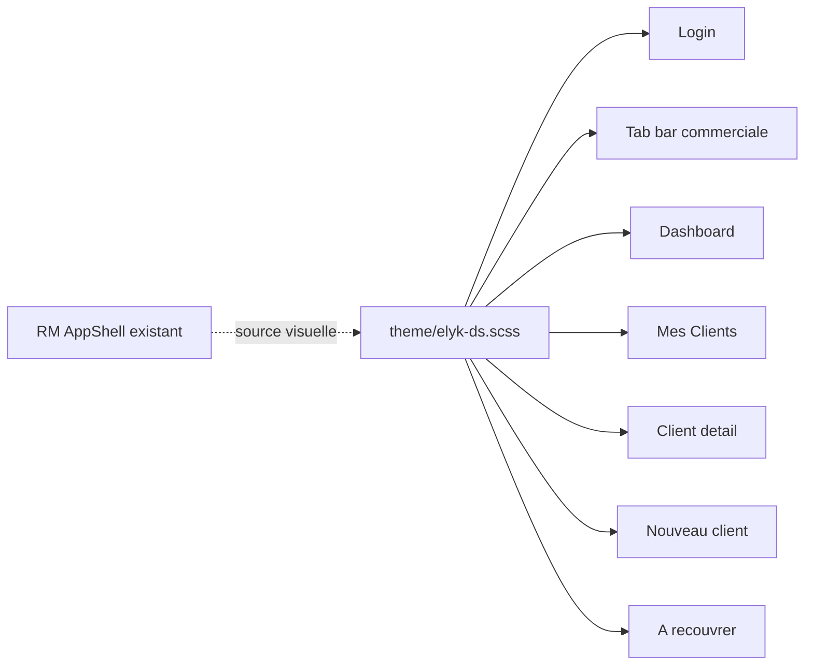

# Design system mobile phase 1 (langue RM)

## Constat

L’app commerciale vit sous `[mobile/src/app/tabs/](mobile/src/app/tabs/)` avec une UI **Material blue `#1976D2`** (tokens locaux, `ion-list`, tab bar Ionic brute). Le chef de recouvrement a déjà un langage premium dans `[mobile/src/app/rm-tabs/](mobile/src/app/rm-tabs/)` : navy `#003366`, hero en dégradé 160°, surtitres uppercase, KPI à bande gauche, cartes 16px, searchbar arrondie, tab bar blanche.

Ce langage RM **n’est pas un design system** : les tokens `--rm-`* sont recopiés page par page. La phase 1 le centralise, l’améliore un cran, et l’applique aux 6 surfaces commerciales (plus la tab bar, validée).

**Hors scope (volontaire)** : Distributions, Plus, formulaire recouvrement, écrans RM eux-mêmes. Changer `--ion-color-primary` en navy teintera toutefois les `ion-toolbar color="primary"` restants (alignement progressif, pas une refonte).

**Inchangé** : filtres, pagination, infinite scroll, navigation, `data-testid` E2E, feature flags.

## Langage visuel (source RM, pas Espace Client)

Pas de gold / Playfair (réservés à `customer-space/`). Police : **Roboto** Ionic actuelle, comme RM.

| Token              | Valeur                         | Rôle                              |
| ------------------ | ------------------------------ | --------------------------------- |
| `--elyk-navy`      | `#003366`                      | Primaire, titres, tab sélectionné |
| `--elyk-navy-dark` | `#002244`                      | Fin de dégradé, pressed           |
| `--elyk-navy-pale` | `#e8eef6`                      | Chips on, avatars                 |
| `--elyk-bg`        | `#f2f4f8`                      | Fond page                         |
| `--elyk-muted`     | `#6b7a99`                      | Secondaire                        |
| `--elyk-border`    | `#dde3ec`                      | Cartes / tab bar                  |
| `--elyk-orange`    | `#c75000`                      | Dû / à recouvrer                  |
| `--elyk-green`     | `#1d8a3c`                      | Sync / soldes positifs            |
| radius cartes      | `16px`                         | Hero bas `20–24px`, pills `999px` |
| ombre              | `0 2px 8px rgba(0,51,102,.05)` | Cartes / KPI                      |

**Upgrade « meilleur du monde » par rapport à une copie brute RM :**

- Tokens **uniques** + classes réutilisables (RM continue de marcher ; aliases `--rm-`* → `--elyk-`* optionnels pour éviter la divergence).
- Login : hero navy + **carte blanche overlap** (pattern éprouvé, plus premium que le cercle emoji `📱`).
- Dashboard : bande identité **frost** (comme `[rm-session-bar](mobile/src/app/features/rm/session-bar/rm-session-bar.component.scss)`) + KPI à bande 4px + chips période style RM.
- Listes : **cartes clientes** (comme `[rm-clients](mobile/src/app/rm-tabs/clients/rm-clients.page.html)`) à la place des `ion-item`.
- Formulaires : champs stacked navy + footer CTA sticky (référence pour Nouveau client, réutilisable plus tard sur recouvrement).

## Architecture fichiers

1. **Tokens Ionic** — `[mobile/src/theme/variables.scss](mobile/src/theme/variables.scss)` : `--ion-color-primary` `#1976D2` → `#003366` (shade/tint/rgb alignés). Success/warning/danger calés sur green/orange RM.
2. **Primitives** — nouveau `[mobile/src/theme/elyk-ds.scss](mobile/src/theme/elyk-ds.scss)` importé dans `[global.scss](mobile/src/global.scss)` :
  - `.elyk-hero` / `.elyk-surtitle`
  - `.elyk-kpi-strip` / `.elyk-kpi` + variants navy/orange/green/cyan
  - `.elyk-card` / `.elyk-client-card`
  - `.elyk-chip` (état `.on`)
  - `.elyk-searchbar` (copie du search RM)
  - `.elyk-empty` / `.elyk-fab`
  - `.elyk-field` (label stacked + input radius 12px, focus navy)
  - `.elyk-footer-bar` (CTA sticky Annuler outline / Enregistrer navy)
  - `.elyk-tab-bar` (copie de `[.rm-tab-bar](mobile/src/app/rm-tabs/rm-tabs.page.scss)`)
3. **Pas de nouveaux composants Angular** en phase 1 (évite le churn NgModule). Les pages composent les classes.

## Écrans

### Tab bar commerciale

`[tabs.page.html](mobile/src/app/tabs/tabs.page.html)` + `[tabs.page.scss](mobile/src/app/tabs/tabs.page.scss)` (aujourd’hui vide) : même traitement que RM (`class="elyk-tab-bar"`, navy selected, ombre haute). Labels inchangés.

### Login (partagé RM + commercial)

`[login.page.html](mobile/src/app/features/auth/login/login.page.html)` / SCSS :

- Fond `linear-gradient(160deg, navy, navy-dark)` + safe-area.
- Header : monogramme **E** (cercle blanc, navy) à la place de l’emoji ; surtitre `AMENOUVEVE-YAVEH` ; titre `ELYKIA`.
- Carte formulaire overlap (`margin-top: -56px`, radius 20px, ombre navy).
- CTA plein navy `SE CONNECTER` ; secondaires outline navy (web / restore).
- Pastille online/offline style RM (vert / muted).
- Logique `onLogin` / backup / version **inchangée**.

### Dashboard commercial

`[dashboard.page.html](mobile/src/app/tabs/dashboard/dashboard.page.html)` :

- Remplacer le header Material par un **hero** : surtitre `Espace commercial`, `h1` = nom, frost row (avatar + En ligne/Hors ligne + sync/menu).
- Chips Jour/Semaine/Mois/Année en `.elyk-chip` (plus `color="primary"` Ionic).
- 6 KPI en grille 2×3, bande gauche (navy / green / orange), montants `font-weight: 800` + `tabular-nums`.
- Carte Tendances + grille Actions Rapides en `.elyk-card` (icônes navy, pas de pastilles Material colorées).
- Conserver `data-testid` (`e2e-action-recovery`, `e2e-action-new-client`, `e2e-action-tontine`).
- Purger les tokens locaux `--primary-color: #1976D2` du SCSS page.

### Mes Clients

`[clients.page.html](mobile/src/app/tabs/clients/clients.page.html)` :

- Abandonner le double `ion-toolbar color="primary"`.
- Hero `Mes clientes` + searchbar `.elyk-searchbar` + chips filtres existants (Tous / Crédit / Nouveau / Quartier).
- Lignes → `.elyk-client-card` : avatar initiales navy-pale, nom, quartier/téléphone, solde tabular, badges Crédit / Local / Sync (soft tints RM).
- FAB navy ; empty-state `.elyk-empty`.
- Infinite scroll, action sheet « Clients à Recouvrer », `trackBy` **inchangés**.

### Détail cliente

`[client-detail.page.html](mobile/src/app/features/clients/pages/client-detail/client-detail.page.html)` :

- Hero navy : back + menu, photo/initiales, nom 800, adresse + appel.
- Segments en pills navy-pale / navy (pas toolbar Material).
- Cartes info / crédits / timeline en `.elyk-card` ; barres de progrès navy.
- Onglets et actions (popover, call, recovery) **inchangés**.

### Clients à recouvrer

`[recovery-client-list.page.html](mobile/src/app/features/recovery-client-list/recovery-client-list.page.html)` + SCSS **vide à remplir** :

- Hero `À recouvrer` + searchbar.
- Groupes quartier comme RM dashboard (`h2` 13px navy + cartes), pas `ion-item-divider` brut.
- Montant dû en **orange** `--elyk-orange` (pas `color="danger"` rouge Ionic).
- Empty : « Tous les comptes sont à jour ».
- Tap → `/recovery?clientId=` inchangé.

### Nouveau client

`[new-client.page.html](mobile/src/app/features/clients/new-client/new-client.page.html)` / SCSS (route `/tabs/clients/new-client`) :

Aujourd’hui : `ion-toolbar color="primary"`, `ion-card` Material, champs `ion-item` gris, emoji 📷, footer Ionic brut. FormGroup, validateurs (âge 18, téléphone unique, GPS, modal localités) et `data-testid="e2e-new-client-submit"` **inchangés**.

- Remplacer le toolbar par un **hero** compact : back, surtitre `Fiche cliente`, `h1` Nouveau client.
- Fond `--elyk-bg` ; chaque bloc (photo, perso, pièce, adresse, contact, compte) en `.elyk-card` avec icône navy + titre 600.
- Zone photo : cercle dashed navy-pale, preview plein, bouton outline navy « Prendre une photo » (plus d’emoji).
- Champs `.elyk-field` : labels stacked muted, inputs blancs radius 12px, focus bordure navy, `*` orange/rouge uniquement sur required.
- Toggle GPS / saisie manuelle et bouton « Obtenir la position » en style RM (outline navy) ; coordonnées en `tabular-nums` muted.
- Modal localités : searchbar `.elyk-searchbar`, liste cartes/lignes navy (pas toolbar Material).
- Footer sticky `.elyk-footer-bar` + safe-area : Annuler outline muted, Enregistrer plein navy (disabled pale). Pas `color="danger"` sur Annuler.

## Qualité / livrables annexes

- **Version mobile MINEUR** `2.22.1` → `2.23.0` (3 fichiers, skill `mobile-version-bump`).
- Entrée `[docs/CHANGELOG.md](docs/CHANGELOG.md)` `## Mobile — [2.23.0]`.
- Préserver `data-testid` et sélecteurs E2E existants ; smoke visuel login / dashboard / clients / nouveau client / à recouvrer.
- Safe-area `env(safe-area-inset-*)` sur heroes et tab bar.

## Ce qui ne sera pas fait

- Refonte Distributions / Plus / stock / tontine / formulaire recouvrement (le flux *nouveau client* est dans le scope).
- Migration des pages RM vers `elyk-ds` (elles restent la référence visuelle ; tokens partagés seulement).
- Maquettes Figma / DESIGN.md BMAD (implémentation directe sur le code RM).

