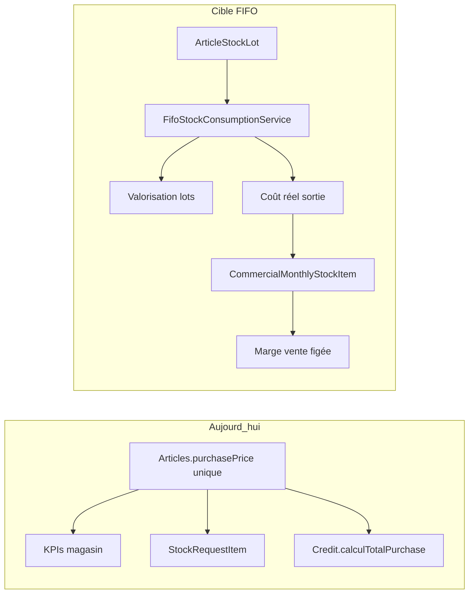
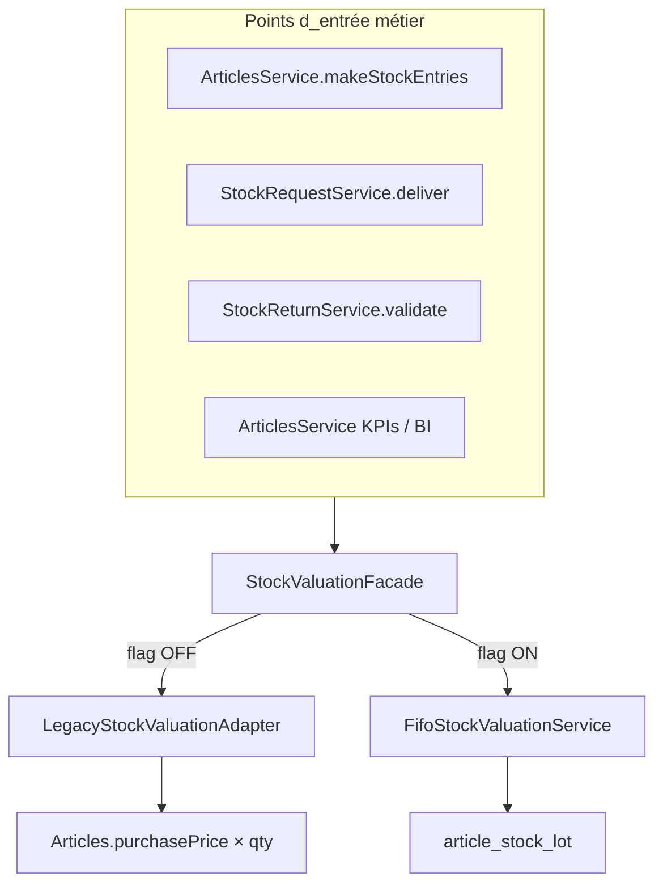
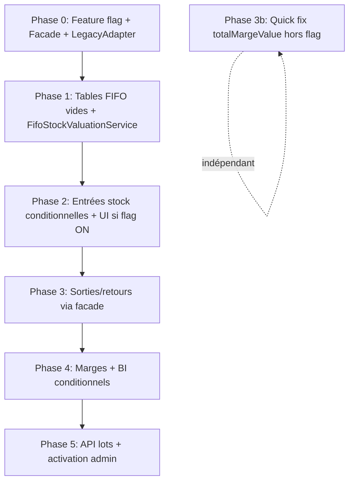

# Plan : Valorisation FIFO du stock magasin

## Diagnostic (état actuel)

Le modèle [`Articles`](backend/src/main/java/com/optimize/elykia/core/entity/article/Articles.java) ne conserve qu'un **prix d'achat unique** (`purchasePrice`) et une quantité globale. Toute la chaîne aval s'appuie dessus :

| Zone | Comportement actuel | Problème |
|------|---------------------|----------|
| Entrées magasin (`makeStockEntries`) | Incrémente `stockQuantity` ; `StockReceptionItem.unitPrice` enregistre le PU mais **ne met pas à jour** `Articles.purchasePrice` | Le frontend n'envoie même pas `unitPrice` (voir [`inventory-add.component.ts`](frontend/src/app/inventory/inventory-add/inventory-add.component.ts)) |
| KPIs / BI | `SUM(purchasePrice * stockQuantity)` ([`ArticlesRepository`](backend/src/main/java/com/optimize/elykia/core/repository/ArticlesRepository.java), [`DailyBusinessSnapshotService`](backend/src/main/java/com/optimize/elykia/core/service/bi/DailyBusinessSnapshotService.java)) | Tout le stock est valorisé au dernier prix catalogue |
| Sorties commerciales | `StockRequestItem.purchasePrice` figé à la création depuis `article.getPurchasePrice()` ([`StockRequestService`](backend/src/main/java/com/optimize/elykia/core/service/stock/StockRequestService.java) L151) | Ignore les lots à 200 FCFA encore en stock |
| Marge crédit | `Credit.calculTotalPurchase()` = `article.purchasePrice * qty` ([`Credit.java`](backend/src/main/java/com/optimize/elykia/core/entity/sale/Credit.java) L213-217) | Marge faussée à la vente |
| Stock commercial | PMP achat/vente sur `CommercialMonthlyStockItem` | **Déjà correct en théorie**, mais alimenté par un mauvais coût magasin en amont |

**Exemple utilisateur** (10 u @ 200, puis 5 u @ 250, revente à 350) :
- Aujourd'hui : marge estimée = `350 - 250 = 100` sur tout le stock
- Attendu FIFO : les 10 premières unités vendues coûtent 200 (marge 150), les 5 suivantes coûtent 250 (marge 100)

### Vérification `totalMargeValue` vs `totalSoldValue` (demande utilisateur)

**Résultat de l'audit code** : `totalSoldValue - totalMargeValue` **n'est utilisé nulle part** (ni frontend, ni backend, ni SQL métier). Aucun écran ne déduit la marge par soustraction.

| Consommateur | Champ utilisé | Usage |
|--------------|---------------|-------|
| [`my-stock-dashboard`](frontend/src/app/stock/pages/my-stock-dashboard/my-stock-dashboard.component.ts) | `totalSoldValue` uniquement | CA vendu + recouvrement |
| [`sales-details-dialog`](frontend/src/app/stock/components/sales-details-dialog/sales-details-dialog.component.html) | `totalSoldValue` | Résumé ventes par article |
| [`CommercialMonthlyStockRecoveryService`](backend/src/main/java/com/optimize/elykia/core/service/stock/CommercialMonthlyStockRecoveryService.java) | `totalSoldValue` | Calcul du total dû |
| Rapports / BI | `CommercialStockMovement.marginAmount` | Marge par mouvement (correct L685) |
| Schéma IA | `total_marge_value` | Exposé pour requêtes futures, pas de formule inverse |

**Sémantique attendue de `totalMargeValue`** (confirmée par [`CommercialMonthlyStockCashSalePricing`](backend/src/main/java/com/optimize/elykia/core/util/CommercialMonthlyStockCashSalePricing.java) L79 et migration [`V50`](backend/src/main/resources/db/migration/V50__backfill_cash_sale_stock_item_valuation.sql)) :

```
totalMargeValue = Σ (qty_vendue × (prix_vente - prix_achat_PMP))
```

**Bug confirmé — ventes crédit uniquement** : [`CreditService`](backend/src/main/java/com/optimize/elykia/core/service/sale/CreditService.java) L655 écrit le **coût d'achat cumulé** (`qty × purchasePmp`) au lieu de la **marge** (`qty × (salePrice - purchasePmp)`). Les ventes cash passent par `CommercialMonthlyStockCashSalePricing.applySoldValueAndMargin` et sont **correctes**.

Conséquence : pour un article avec ventes cash + crédit, `totalMargeValue` est un mélange incohérent (marge + coût). Mais comme personne n'affiche ce champ aujourd'hui, l'impact UI est nul ; l'impact est sur les données stockées et les futures requêtes IA/rapports.

**Décision plan** : correction **autorisée et recommandée en quick fix** (indépendant du FIFO), car aucun consommateur ne repose sur `totalSoldValue - totalMargeValue`.



---

## Solution retenue : FIFO par lots (magasin) + coût figé en aval

### Principe

1. **Chaque entrée magasin** crée un **lot** : `(article, quantité, prix d'achat unitaire, date, référence réception)`.
2. **Chaque sortie magasin** consomme les lots **du plus ancien au plus récent** (FIFO strict).
3. Le **coût de sortie** (COGS) = somme des `qty_consommée × prix_lot` ; ce coût est **figé** sur la ligne métier (demande de sortie, ligne crédit).
4. `Articles.purchasePrice` devient le **dernier prix d'achat saisi** (référence catalogue), plus la base de valorisation du stock.

Le stock commercial conserve son PMP existant ; sous flag FIFO, il sera **alimenté par le coût FIFO réel** sorti du magasin.

---

## Feature flag — coexistence legacy / FIFO

### Objectif

Déployer le code FIFO **sans l'activer** pour les utilisateurs. Tant que le flag est `false`, le comportement actuel doit rester **strictement identique**. Les deux implémentations cohabitent via une façade unique.

### Source de vérité (backend)

S'aligner sur le pattern existant [`ParameterService`](backend-lib/common-securities/src/main/java/com/optimize/common/securities/service/ParameterService.java) + [`ParameterController`](backend-lib/common-securities/src/main/java/com/optimize/common/securities/controllers/ParameterController.java) :

| Élément | Valeur |
|---------|--------|
| Clé | `ENABLED_FIFO_STOCK_VALUATION` |
| Défaut | `false` (jamais activé automatiquement) |
| Seed | [`application.yml`](backend/src/main/resources/application.yml) `init-data` + migration SQL |
| Activation | Page admin **Paramètres** ([`/parameters`](frontend/src/app/parameters/parameter-list/parameter-list.component.ts)) — toggle `true` par un gestionnaire |
| Lecture API | `GET /api/parameters/enabled/ENABLED_FIFO_STOCK_VALUATION` (déjà disponible) |

**Pas de Firebase Remote Config pour la logique métier** — le backend est la seule source de vérité (contrairement à `DualCreditAuthorization` qui est UI-only). Le frontend lit le paramètre backend pour adapter les formulaires.

### Architecture — Strategy + Facade



**Nouveau** `StockValuationFacade` :
```java
public boolean isFifoEnabled() {
    return parameterService.isEnabled("ENABLED_FIFO_STOCK_VALUATION");
}
// registerEntry, consume, getStockValuation, getEstimatedMargin
// → délègue à legacy ou fifo selon isFifoEnabled()
```

**Nouveau** `LegacyStockValuationAdapter` : extrait **sans modification** la logique actuelle (aucun lot, `article.getPurchasePrice()`, comportement identique à aujourd'hui). Aucun appel FIFO quand flag OFF.

### Règles de coexistence par point d'entrée

| Point d'entrée | Flag OFF (legacy) | Flag ON (FIFO) |
|----------------|-------------------|----------------|
| `makeStockEntries` | Comportement actuel ; `unitPrice` optionnel (fallback `purchasePrice`) | Crée lot ; `unitPrice` **obligatoire** |
| `StockRequestService.deliver` | `purchasePrice` figé à la création depuis `article.purchasePrice` | Consomme lots FIFO ; coût réel à la livraison |
| `StockReturnService.validate` | `makeEntry` simple sans lot | Crée lot retour au coût commercial |
| KPIs `getDetailedStockValues` | `SUM(purchasePrice × stockQuantity)` | `SUM(lot.remaining × lot.unitPrice)` |
| `Credit.calculTotalPurchase` | `article.purchasePrice × qty` | `unitPurchaseCost` figé (FIFO amont) |
| Endpoints lots (`/stock-lots`) | 404 ou liste vide + header indiquant flag off | Données réelles |

### Données et activation

- **Migration V63** : crée les tables FIFO **vides** uniquement — **pas de backfill automatique** au déploiement.
- **À l'activation du flag** (première fois `false → true`) : déclencher un **backfill idempotent** :
  1. Reconstituer les lots depuis `stock_reception_item` (ordre chronologique) si historique disponible
  2. Sinon lot synthétique `MIGRATION` : `qty = stock_quantity`, `PU = purchase_price`
  3. Vérifier `SUM(lots.remaining) == article.stockQuantity` ; bloquer l'activation si écart
- Implémentation : `FifoStockActivationService.activate()` appelé depuis un endpoint admin `POST /api/v1/stock/fifo/activate` (rôle GESTIONNAIRE) **ou** hook sur mise à jour du paramètre.
- **Désactivation** (`true → false`) : **non supportée en v1** — documenter que les lots restent en base mais ne sont plus consommés ; risque d'incohérence. Message d'avertissement dans l'UI paramètres.

### Frontend (conditionnel au flag backend)

**Nouveau** `StockFifoFeatureService` :
```typescript
isFifoEnabled(): Observable<boolean> {
  return this.http.get<boolean>(`${apiUrl}/api/parameters/enabled/ENABLED_FIFO_STOCK_VALUATION`);
}
```
Cache en mémoire (refresh au login ou sur demande).

| Écran | Flag OFF | Flag ON |
|-------|----------|---------|
| [`inventory-add`](frontend/src/app/inventory/inventory-add/inventory-add.component.html) | UI actuelle (qté seule) | Colonne **PU achat** par ligne (voir règles UX ci-dessous) |
| [`quick-stock-entry`](frontend/src/app/article/details/components/quick-stock-entry/quick-stock-entry.component.ts) | Qté seule | Qté + PU achat prérempli |
| Fiche article — onglet lots | Masqué | Tableau lots ouverts |
| KPI inventaire | « Valeur stock » actuelle | + « Valeur FIFO » si flag on |

Pas de `FeatureFlagGuard` sur les routes existantes — les écrans actuels restent accessibles ; seuls des **éléments UI supplémentaires** apparaissent quand le flag est ON.

#### Règles UX — saisie PU achat (flag ON)

Le PU de la réception **n'est pas saisi à vide** : il est **prérempli** avec le `purchasePrice` catalogue de l'article (`Articles.purchasePrice`), **modifiable librement** par le magasinier avant validation du formulaire.

| Règle | Détail |
|-------|--------|
| Source du défaut | `article.purchasePrice` (prix d'achat catalogue), **pas** `sellingPrice` ni `creditSalePrice` |
| Préremplissage | À la sélection de l'article (ou à l'ouverture du dialog si article déjà connu) |
| Modifiable | Champ `input type="number"` éditable ; l'utilisateur peut corriger si le fournisseur facture un PU différent (ex. catalogue 200, réception réelle 215) |
| Re-sélection article | Si l'utilisateur change d'article sur une ligne, **réinitialiser** le PU au `purchasePrice` du nouvel article (écrase la valeur précédente) |
| Validation | `unitPrice > 0` requis avant submit ; hint : « Prix catalogue : X FCFA — modifiable si différent » |
| Payload API | Toujours envoyer `unitPrice` dans `StockEntry` (valeur affichée au moment du submit, préremplie ou modifiée) |

**Par écran** :

- **`quick-stock-entry`** : à l'init, `unitPrice = data.article.purchasePrice` ; champ visible + éditable à côté de la quantité.
- **`inventory-add` + `article-selector`** (mode `inventory`, flag ON) :
  - Ajouter `unitPrice` au `FormGroup` de chaque ligne (`createArticle()`)
  - `valueChanges` sur `articleId` → `patchValue({ unitPrice: selectedArticle.purchasePrice })`
  - Nouvel `@Input() capturePurchasePrice = false` (ou dérivé de `fifoEnabled` passé par le parent) pour ne pas impacter les autres usages du sélecteur (crédit, tontine)
  - Afficher colonne « PU achat » avec `[showPrices]` adapté au mode entrée stock
- **Ne pas** mettre à jour le `purchasePrice` catalogue côté frontend — seule la réception backend (flag ON) met à jour le catalogue **après** validation, avec le `unitPrice` effectivement envoyé.

### Tests obligatoires (double couverture)

| Suite | Flag | Assertion |
|-----|------|-----------|
| `LegacyStockValuationTest` | OFF | Entrée/sortie/KPIs = comportement snapshot actuel |
| `FifoStockValuationTest` | ON | Scénario 10@200 + 5@250 + FIFO |
| `StockValuationFacadeTest` | les deux | Bon adaptateur invoqué selon `ParameterService` mocké |

Utiliser `@MockBean ParameterService` + `when(isEnabled("ENABLED_FIFO_STOCK_VALUATION")).thenReturn(true/false)`.

### Phase 3b (`totalMargeValue`) — hors scope FIFO flag

Le correctif L655 reste **indépendant du flag FIFO** : c'est un bug sur les ventes crédit existant, sans impact sur le chemin legacy/FIFO magasin. Livrable sans activer `ENABLED_FIFO_STOCK_VALUATION`.

---

## Phase 1 — Modèle de données et service FIFO central

### Nouvelles entités

**`ArticleStockLot`** (table `article_stock_lot`)
- `article_id`, `quantity_initial`, `quantity_remaining`
- `unit_purchase_price` (obligatoire)
- `entry_date`, `stock_reception_item_id` (nullable, lien traçabilité)
- `source_type` (`STOCK_RECEPTION`, `STOCK_RETURN`, `MIGRATION`, `INVENTORY_ADJUSTMENT`)
- `status` (`OPEN`, `DEPLETED`)

**`ArticleStockLotConsumption`** (table `article_stock_lot_consumption`)
- `lot_id`, `quantity`, `unit_purchase_price` (copie au moment de la conso)
- `movement_type` (`WAREHOUSE_RELEASE`, `LOSS`, `ADJUSTMENT`)
- `source_type` + `source_id` (ex. `STOCK_REQUEST` / requestId, `STOCK_TONTINE_REQUEST`, etc.)
- Permet d'auditer **quel lot** a servi **quelle sortie**

### Service métier : `FifoStockValuationService`

Méthodes clés :
- `registerEntry(article, qty, unitPrice, source)` → crée lot + vérifie `sum(lots.remaining) == article.stockQuantity`
- `consume(article, qty, movementType, sourceType, sourceId)` → parcourt lots `ORDER BY entry_date ASC, id ASC`, crée consommations, retourne `FifoConsumptionResult` (coût total, coût unitaire moyen de la ligne, détail par lot)
- `getStockValuation(articleId)` → `SUM(quantity_remaining * unit_purchase_price)`
- `getEstimatedMargin(articleId, salePrice)` → `SUM(quantity_remaining * (salePrice - unit_purchase_price))`

### Migration Flyway `V63__article_stock_lot_fifo.sql`
- Création des tables + index `(article_id, entry_date)` où `quantity_remaining > 0`
- **Pas de backfill** dans cette migration (réservé à l'activation du flag via `FifoStockActivationService`)
- Seed paramètre `ENABLED_FIFO_STOCK_VALUATION = false` dans la même migration ou `application.yml`

---

## Phase 2 — Entrées de stock magasin

### Backend — [`ArticlesService.makeStockEntries`](backend/src/main/java/com/optimize/elykia/core/service/store/ArticlesService.java)

Via `StockValuationFacade` :

**Flag OFF** — chemin legacy inchangé :
- `articles.makeEntry(qty)` ; pas de lot
- `unitPrice` optionnel pour `StockReceptionItem` / dépense (fallback `purchasePrice`)

**Flag ON** — chemin FIFO :
1. **Exiger** `stockEntry.unitPrice` (sinon `CustomValidationException`)
2. `facade.registerEntry(...)` avant `articles.makeEntry()`
3. `articles.purchasePrice = unitPrice` (dernier prix connu)
4. `StockMovement.unitCost` = PU de l'entrée
5. Lier le lot à `StockReceptionItem`

### Frontend (uniquement si flag ON côté backend)

Voir **Règles UX — saisie PU achat** (section Feature flag) : préremplissage `purchasePrice` catalogue, modifiable avant submit.

Implémentation ciblée :
- [`inventory-add`](frontend/src/app/inventory/inventory-add/inventory-add.component.html) : passer `fifoEnabled` + `[capturePurchasePrice]="fifoEnabled"` au sélecteur
- [`quick-stock-entry`](frontend/src/app/article/details/components/quick-stock-entry/quick-stock-entry.component.ts) : `unitPrice` initial = `article.purchasePrice`
- [`article-selector`](frontend/src/app/credit/components/article-selector/article-selector.component.ts) : champ `unitPrice` par ligne + auto-fill sur changement `articleId` (mode entrée stock uniquement)

### DTO — [`StockEntry`](backend/src/main/java/com/optimize/elykia/core/dto/StockEntry.java)
- `unitPrice` = prix d'achat **effectif de cette réception** (souvent égal au catalogue, parfois différent si modifié par l'utilisateur)
- Validation `@NotNull` + `> 0` **conditionnelle** côté service (si flag ON) ; le backend n'infère pas le PU depuis le catalogue si le client l'omet — c'est le frontend qui doit toujours l'envoyer prérempli

---

## Phase 3 — Sorties magasin et propagation vers le commercial

Via `StockValuationFacade` dans chaque service :

### [`StockRequestService.deliverRequest`](backend/src/main/java/com/optimize/elykia/core/service/stock/StockRequestService.java)

**Flag OFF** — legacy : logique actuelle (L151 fige `purchasePrice` à la création ; L270-271 fallback `article.purchasePrice`)

**Flag ON** — FIFO :
- À la livraison : `facade.consume(article, qty, ...)`
- `StockRequestItem.purchasePrice` = coût unitaire FIFO (`totalCost / qty`)
- PMP commercial recalculé avec ce coût réel (L443-448)

Même traitement pour [`StockTontineRequestService`](backend/src/main/java/com/optimize/elykia/core/service/stock/StockTontineRequestService.java).

### Retours magasin — [`StockReturnService.validateReturn`](backend/src/main/java/com/optimize/elykia/core/service/stock/StockReturnService.java)

**Flag OFF** : `makeEntry` simple (actuel)
**Flag ON** : `facade.registerEntry` nouveau lot au coût commercial retourné

### [`StockMovementService`](backend/src/main/java/com/optimize/elykia/core/service/stock/StockMovementService.java)

**Flag OFF** : `unitCost = article.getPurchasePrice()` (actuel)
**Flag ON** : `unitCost` = coût FIFO moyen de la consommation via facade

---

## Phase 3b — Quick fix `totalMargeValue` (ventes crédit, sans attendre le FIFO)

Correction isolée, livrable avant ou en parallèle du FIFO :

1. **Code** — [`CreditService.checkAndUpdateStockCommercial`](backend/src/main/java/com/optimize/elykia/core/service/sale/CreditService.java) L655 :
   - Remplacer par la même formule que les ventes cash :
     `totalMargeValue += qty × (saleUnitPrice - weightedAveragePurchasePrice)`
   - Idéalement factoriser dans `CommercialMonthlyStockCashSalePricing` (méthode partagée `addSoldValueAndMargin`) pour éviter une 3e divergence.

2. **Migration `V64__backfill_credit_sale_total_marge_value.sql`** — recalculer les lignes impactées :
   ```sql
   -- Pour les stock items avec ventes crédit : recalcul depuis commercial_stock_movement
   UPDATE commercial_monthly_stock_item cmsi
   SET total_marge_value = sub.margin_sum
   FROM (
     SELECT stock_item_id, SUM(margin_amount) AS margin_sum
     FROM commercial_stock_movement
     WHERE movement_type = 'CREDIT_SALE'
     GROUP BY stock_item_id
   ) sub
   WHERE cmsi.id = sub.stock_item_id;
   ```
   Puis fusionner avec la marge cash déjà correcte (mouvements `CASH_SALE`) si besoin.

3. **Test** — `CreditServiceMarginTest` ou test d'intégration : après distribution crédit, `totalMargeValue == qty × (sale - purchasePmp)`.

---

## Phase 4 — Marges ventes et rapports

### Figer le coût sur les ventes

**`CreditArticles`** : ajouter `unitPurchaseCost` (nullable, figé à la distribution/vente)

- [`CreditService.distributeArticlesV2`](backend/src/main/java/com/optimize/elykia/core/service/sale/CreditService.java) : `unitPurchaseCost = stockItem.getWeightedAveragePurchasePrice()` (alimenté par FIFO amont après Phase 3)
- [`Credit.calculTotalPurchase`](backend/src/main/java/com/optimize/elykia/core/entity/sale/Credit.java) : priorité à `unitPurchaseCost` figé, fallback legacy `article.purchasePrice`

### Valorisation magasin / BI

Via facade — **flag OFF** : requêtes actuelles inchangées ; **flag ON** :
- [`ArticlesRepository.getDetailedStockValues`](backend/src/main/java/com/optimize/elykia/core/repository/ArticlesRepository.java) → lots FIFO
- [`DailyBusinessSnapshotService`](backend/src/main/java/com/optimize/elykia/core/service/bi/DailyBusinessSnapshotService.java)
- [`ArticlesService.getDetailedStockValues`](backend/src/main/java/com/optimize/elykia/core/service/store/ArticlesService.java)

### Rapports mensuels

Les [`CommercialStockMovement`](backend/src/main/java/com/optimize/elykia/core/entity/stock/CommercialStockMovement.java) enregistrent déjà `unitPurchasePrice` et `marginAmount` — vérifier cohérence après propagation FIFO ; enrichir le rapport général ([`monthly-report-general.html`](backend/src/main/resources/templates/monthly-report-general.html)) si besoin d'un détail par lot.

---

## Phase 5 — API, UI magasin et garde-fous

### Nouveaux endpoints (consultation, flag ON)
- `GET /api/v1/articles/{id}/stock-lots` — lots ouverts (vide / 403 si flag OFF)
- `GET /api/v1/articles/stock-valuation` — KPIs FIFO
- `POST /api/v1/stock/fifo/activate` — backfill + validation (admin, lors de l'activation)

### UI article / inventaire
- Fiche article : tableau des lots (date, PU, qté restante, valeur)
- KPI stock : « Valeur d'achat FIFO » vs « Dernier prix d'achat » (deux métriques distinctes)

### Garde-fous
- Transaction atomique : consommation FIFO + `makeRelease` dans la même `@Transactional`
- Si stock insuffisant en lots mais `stockQuantity` OK → erreur de réconciliation (signal d'incohérence post-migration)
- Job de réconciliation optionnel : `article.stockQuantity` vs `SUM(lots.remaining)`

---

## Tests à prévoir

| Test | Scénario |
|------|----------|
| `LegacyStockValuationTest` | Flag OFF — entrée/sortie/KPIs = comportement actuel inchangé |
| `StockValuationFacadeTest` | Mock `ParameterService` → bon adaptateur invoqué |
| `FifoStockValuationServiceTest` | Flag ON — entrée 10@200 + 5@250 ; conso 12 → coût 2500 |
| `StockEntryFrontendTest` (e2e ou unit) | PU prérempli catalogue ; modification avant submit → lot créé au PU modifié |
| `FifoStockActivationServiceTest` | Backfill idempotent à l'activation |
| `StockRequestServiceFifoTest` | Flag ON — livraison au coût FIFO |
| `CreditServiceMarginTest` | Flag ON — marge vente après scénario FIFO |
| Régression | `CommercialMonthlyStockCashSalePricingTest` inchangé |

---

## Ordre d'implémentation recommandé



**Déploiement sans risque** : livrer P0–P3 avec flag `false` → zéro changement utilisateur. Activer via Paramètres quand prêt (+ `POST /fifo/activate` pour backfill).

---

## Fichiers principaux impactés

| Fichier | Changement |
|---------|------------|
| [`application.yml`](backend/src/main/resources/application.yml) | `ENABLED_FIFO_STOCK_VALUATION: false` dans init-data |
| **Nouveau** `StockValuationFacade.java`, `LegacyStockValuationAdapter.java` | Routage flag OFF/ON |
| **Nouveau** `FifoStockActivationService.java` | Backfill à l'activation |
| **Nouveau** `StockFifoFeatureService.ts` (frontend) | Lecture `GET /api/parameters/enabled/...` |
| **Nouveau** `ArticleStockLot.java`, `ArticleStockLotConsumption.java` | Modèle FIFO |
| **Nouveau** `FifoStockValuationService.java` | Cœur métier |
| [`ArticlesService.java`](backend/src/main/java/com/optimize/elykia/core/service/store/ArticlesService.java) | Entrées + KPIs |
| [`StockRequestService.java`](backend/src/main/java/com/optimize/elykia/core/service/stock/StockRequestService.java) | Coût FIFO à la livraison |
| [`CreditArticles.java`](backend/src/main/java/com/optimize/elykia/core/entity/sale/CreditArticles.java) | `unitPurchaseCost` |
| [`Credit.java`](backend/src/main/java/com/optimize/elykia/core/entity/sale/Credit.java) | `calculTotalPurchase` |
| [`CreditService.java`](backend/src/main/java/com/optimize/elykia/core/service/sale/CreditService.java) | Fix marge + figer coût |
| [`article-selector`](frontend/src/app/credit/components/article-selector/article-selector.component.ts) | `unitPrice` par ligne, auto-fill `purchasePrice` si `capturePurchasePrice` |
| Frontend inventory + quick-stock-entry | PU prérempli catalogue, modifiable (`StockFifoFeatureService`) |
| `docs/CHANGELOG.md` | Entrée Keep a Changelog |

---

## Note sur `ArticlePriceHistory`

[`ArticlePriceHistory`](backend/src/main/java/com/optimize/elykia/core/entity/article/ArticlePriceHistory.java) reste dédié aux **changements manuels de tarification catalogue** (achat/vente/crédit). Les lots FIFO portent la **valorisation comptable du stock physique** — les deux notions coexistent sans conflit.
