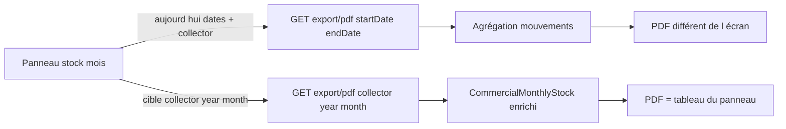

# Corriger données et bouton PDF stock mensuel

## Diagnostic

**Données** — Le bouton du panneau ([my-stock-dashboard.component.ts](frontend/src/app/stock/pages/my-stock-dashboard/my-stock-dashboard.component.ts) `onExportPdf`) envoie une plage `startDate`/`endDate` + `collector`. Le backend ([StockExportService.generateDashboardPdfExport](backend/src/main/java/com/optimize/elykia/core/service/stock/StockExportService.java)) **reconstruit** le rapport en agrégeant :

- sorties magasin `DELIVERED` du mois calendaire
- retours `RECEIVED` du mois
- mouvements de vente du mois

Ce n’est **pas** le `CommercialMonthlyStock` affiché (report de stock, PMP, `quantityRemaining` / `totalSoldValue` persistés). D’où le décalage avec le tableau du panneau.

Le dashboard tontine fait déjà le bon choix : export par `collector` + `year` depuis l’entité stock.

**Bouton** — Dans le HTML, le bouton a `mat-raised-button class="historic-btn"`. Le navy de `.historic-btn` n’est défini que sous `[.filter-row](frontend/src/app/stock/pages/my-stock-dashboard/my-stock-dashboard.component.scss)` ; le bouton d’export est dans `.panel-export-bar`. Il reste donc le style Material (fond blanc, ombre lourde). Le skill UI interdit `mat-raised-button` au profit de `.btn-download`.

Le domaine `stock` est déjà lazy-loaded — pas de migration routing.

## 1. Backend — exporter le stock mensuel du panneau

Changer le contrat de `GET /api/commercial-stocks/export/pdf` (utilisé uniquement par ce dashboard) :

- Params : `collector`, `year`, `month` (plus `startDate`/`endDate`)
- Controller : déléguer à une nouvelle méthode `generateDashboardPdfExport(collector, year, month)`
- Charger via `CommercialMonthlyStockService.findEnrichedByCollectorAndMonthAndYear` (même source que l’écran)
- 404 si le stock n’existe pas ; `resolveCollector` inchangé pour les promoteurs
- Mapper chaque `CommercialMonthlyStockItem` vers `CommercialStockDashboardExportDTO` :
  - nom article = `commercialName + " " + name` (comme le HTML)
  - `unitPrice` = `weightedAverageUnitPrice`
  - `quantityTaken` / `quantitySold` / `quantityReturned` depuis l’entité
  - `soldValue` = `totalSoldValue`
  - restant / valeur restante via les getters existants du DTO (`taken - sold - returned` et `remaining * unitPrice`) — aligné sur l’écran
- Période affichée : 1er → dernier jour du mois (`yyyy-MM-dd` ou libellé « Août 2026 »)
- Pas de KPI recouvrement dans le PDF (tableau articles uniquement)

Injecter `CommercialMonthlyStockService` dans `StockExportService`.

## 2. Template PDF navy

Mettre à jour [commercial-stock-dashboard-export.html](backend/src/main/resources/templates/commercial-stock-dashboard-export.html) (skill `elykia-pdf-style`, template modifié) :

- Fragments `pdf/fragments :: styles` + `header`
- `PdfDocumentIdentity.applyTo` avant `templateEngine.process`
- Classes `.pdf-meta` / `.data-table` — retirer le CSS ad hoc et la mention « Basé sur les dates de livraison… »
- Titre : `Rapport de Stock Commercial`

## 3. Frontend — appel + bouton

- [commercial-stock.service.ts](frontend/src/app/stock/services/commercial-stock.service.ts) : `exportPdf(collector, year, month)`
- [my-stock-dashboard.component.ts](frontend/src/app/stock/pages/my-stock-dashboard/my-stock-dashboard.component.ts) : `onExportPdf(stock)` appelle `exportPdf(stock.collector, stock.year, stock.month)` ; supprimer `getMonthRange` / moment pour l’export
- HTML : remplacer `mat-raised-button` + `historic-btn` par `type="button" class="btn-download"` + icône SVG (comme [client-list](frontend/src/app/client/client-list/client-list.component.html))
- SCSS : styles `.btn-download` navy (`#003366`, hover `#002244`, ombre légère, pas d’ombre Material) dans `.panel-export-bar`

Les boutons Historique / Retour stock du `.filter-row` restent inchangés.

## 4. Tests + changelog

- Étendre [StockExportServicePdfTest](backend/src/test/java/com/optimize/elykia/core/service/stock/StockExportServicePdfTest.java) : mock du stock mensuel ; le PDF contient les quantités de l’entité (pas d’appels `findAggregatedStockRequests` / ventes) ; pagination `1/N`
- PATCH : frontend `2.16.7` → `2.16.8`, backend `1.9.8` → `1.9.9`, [docs/CHANGELOG.md](docs/CHANGELOG.md)

