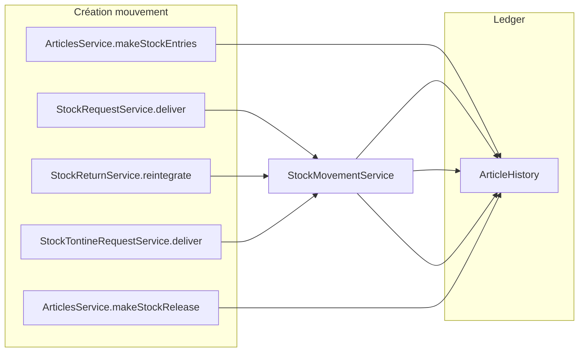

# Historique mouvements : bénéficiaire et lien demande

## Constat actuel

L'historique affiché sur [`frontend/src/app/article/details/details.component.html`](frontend/src/app/article/details/details.component.html) passe par `app-movement-table` et charge `GET /api/v1/articles/{id}/history`.

```172:182:frontend/src/app/article/details/details.component.html
      <app-movement-table [movements]="articleHistory" [limit]="6" [articleName]="article.name"></app-movement-table>
```

La colonne **Par** affiche uniquement `operationUser` (auteur magasinier), sans lien vers la demande :

```28:29:frontend/src/app/article/details/components/movement-table/movement-table.component.html
                    <td>{{ formatDate(m.operationDate) }}</td>
                    <td class="col-user">{{ m.operationUser }}</td>
```

Côté backend, `ArticleHistory` possède déjà `referenceType`, `referenceId`, `reason` (migration [`V80__article_history_trajectory.sql`](backend/src/main/resources/db/migration/V80__article_history_trajectory.sql)), mais seuls les ajustements inventaire les remplissent aujourd'hui. Le DTO [`ArticleHistoryDto`](backend/src/main/java/com/optimize/elykia/core/dto/ArticleHistoryDto.java) ne les expose pas.



## Stratégie retenue

- **Nouveaux mouvements uniquement** (pas de backfill) — choix confirmé.
- **Deep link retours** : `/stock/return?id={id}` ouvre le modal détail sur la liste — choix confirmé.
- **Bénéficiaire** : nouveau champ dénormalisé `beneficiary` sur `article_history`.
- **Référence demande** : réutiliser `referenceType` + `referenceId` existants + nouveau champ `reference_label` (texte affiché, ex. `DS-2024-001`).
- **ENTREE** : `beneficiary = operationUser` (auteur = bénéficiaire).
- **SORTIE / RETURN liés à une demande** : `beneficiary = collector` de la demande.

## 1. Backend — schéma et modèle

**Migration Flyway** `V81__article_history_beneficiary.sql` :
- `ALTER TABLE article_history ADD COLUMN beneficiary VARCHAR(255)`
- `ALTER TABLE article_history ADD COLUMN reference_label VARCHAR(100)`
- Index optionnel sur `(reference_type, reference_id)` si utile pour debug

**Fichiers** :
- [`ArticleHistory.java`](backend/src/main/java/com/optimize/elykia/core/entity/article/ArticleHistory.java) : champs `beneficiary`, `referenceLabel`
- [`StockHistoryReferenceType.java`](backend/src/main/java/com/optimize/elykia/core/enumaration/StockHistoryReferenceType.java) : ajouter `STOCK_TONTINE_REQUEST`, `STOCK_TONTINE_RETURN`

## 2. Backend — enregistrement à la création

Introduire un petit DTO interne `ArticleHistoryContext` (ou record Java) portant `beneficiary`, `referenceType`, `referenceId`, `referenceLabel` et l'injecter dans `StockMovementService` lors de l'écriture `ArticleHistory`.

**Point d'extension central** : [`StockMovementService.buildArticleHistory()`](backend/src/main/java/com/optimize/elykia/core/service/stock/StockMovementService.java) — surcharger `recordMovement` / `recordMovementWithSnapshot` pour accepter un contexte optionnel.

| Source | Type | Bénéficiaire | referenceType | referenceId | referenceLabel |
|--------|------|--------------|---------------|-------------|----------------|
| [`ArticlesService.makeStockEntries`](backend/src/main/java/com/optimize/elykia/core/service/store/ArticlesService.java) | ENTREE | `username` | — | — | — |
| [`StockRequestService`](backend/src/main/java/com/optimize/elykia/core/service/stock/StockRequestService.java) livraison | SORTIE | `request.collector` | `STOCK_REQUEST` | `request.id` | `request.reference` |
| [`StockReturnService.reintegrateToWarehouse`](backend/src/main/java/com/optimize/elykia/core/service/stock/StockReturnService.java) | RETURN | `stockReturn.collector` | `STOCK_RETURN` | `stockReturn.id` | `stockReturn.reference` |
| [`StockTontineRequestService`](backend/src/main/java/com/optimize/elykia/core/service/stock/StockTontineRequestService.java) livraison | SORTIE | `request.collector` | `STOCK_TONTINE_REQUEST` | `request.id` | `request.reference` |
| [`InventoryReconciliationService`](backend/src/main/java/com/optimize/elykia/core/service/store/InventoryReconciliationService.java) | INVENTORY_ADJUSTMENT | `username` | `INVENTORY` (déjà) | id inventaire | libellé inventaire si dispo |
| [`ArticlesService.makeStockRelease`](backend/src/main/java/com/optimize/elykia/core/service/store/ArticlesService.java) (vente crédit) | SORTIE | `connectedUser` (hors scope demande) | — | — | — |

Hors scope demande : les sorties crédit/comptant restent sans lien demande (pas de `referenceType`), bénéficiaire = auteur.

## 3. Backend — API

Étendre [`ArticleHistoryDto`](backend/src/main/java/com/optimize/elykia/core/dto/ArticleHistoryDto.java) :

```java
private String beneficiary;
private StockHistoryReferenceType referenceType;
private Long referenceId;
private String referenceLabel;
// operationUser conservé = auteur
```

Mapper dans [`ArticleHistoryService.getByArticleId()`](backend/src/main/java/com/optimize/elykia/core/service/store/ArticleHistoryService.java).

Tests unitaires ciblés sur `StockMovementService` + un test d'intégration léger sur la livraison `StockRequestService` vérifiant que `ArticleHistory` reçoit bien `beneficiary` et `referenceLabel`.

## 4. Frontend — modèle et tableau

**Interface** [`ArticleHistoryItem`](frontend/src/app/article/service/item.service.ts) :

```typescript
beneficiary?: string;
referenceType?: string;
referenceId?: number;
referenceLabel?: string;
operationUser: string; // auteur conservé
```

**Tableau** [`movement-table.component.html`](frontend/src/app/article/details/components/movement-table/movement-table.component.html) :

Remplacer la colonne unique **Par** par deux colonnes :

| Colonne | Contenu |
|---------|---------|
| **Pour** | `beneficiary ?? operationUser` |
| **Demande** | `referenceLabel` + lien `routerLink` si `referenceType` + `referenceId` |

Helper `getReferenceLink(m)` dans [`movement-table.component.ts`](frontend/src/app/article/details/components/movement-table/movement-table.component.ts) :

| referenceType | Route |
|---------------|-------|
| `STOCK_REQUEST` | `/stock/request/edit/{id}` |
| `STOCK_RETURN` | `/stock/return` + `queryParams: { id }` |
| `STOCK_TONTINE_REQUEST` | `/stock-tontine/request` + `queryParams: { id }` |
| `STOCK_TONTINE_RETURN` | `/stock-tontine/return` + `queryParams: { id }` |
| `INVENTORY` | `/inventory` (optionnel, si id inventaire connu) |

Afficher l'auteur en texte secondaire sous **Pour** : `par {{ operationUser }}` uniquement quand `beneficiary !== operationUser`.

Styles dans [`movement-table.component.scss`](frontend/src/app/article/details/components/movement-table/movement-table.component.scss) : cellule empilée (bénéficiaire, auteur atténué, lien demande).

## 5. Frontend — deep links listes

Pour que les liens fonctionnent, ajouter la lecture de `?id=` dans :

- [`stock-return-list.component.ts`](frontend/src/app/stock/pages/stock-return-list/stock-return-list.component.ts) : au `ngOnInit`, si `id` en query param → `getById` + `showDetails()`
- [`stock-tontine-request-list`](frontend/src/app/stock-tontine/pages/stock-tontine-request-list/) et [`stock-tontine-return-list`](frontend/src/app/stock-tontine/pages/stock-tontine-return-list/) : même pattern (modal existant `showDetails`)

## 6. Changelog

Mettre à jour [`docs/CHANGELOG.md`](docs/CHANGELOG.md) (sections Backend + Frontend) via le skill keep-changelog.

## Résultat attendu dans l'UI

Exemple pour une sortie liée à une demande :

```
Pour          | Demande
ges003        | DS-2026-0142
par mag001    | [voir la demande →]
```

Exemple pour une entrée manuelle :

```
Pour          | Demande
mag001        | —
```

Les mouvements historiques (avant déploiement) continueront d'afficher `operationUser` comme bénéficiaire (fallback) et sans lien demande.
