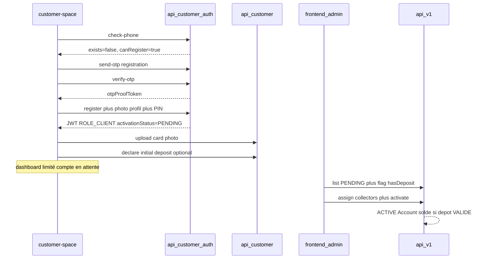

---
todos:
  - id: ddl-activation-deposit
    status: completed
    content: Migration activation_status + table customer_initial_deposit_submission + schema-catalog
  - id: auth-register
    status: completed
    content: API check-phone/OTP/register + provisioning self-reg + wizard customer-space
  - id: portal-onboarding
    status: completed
    content: 'Garde PENDING, upload CNI, dépôt initial, dashboard limité'
  - id: bo-validate
    status: in_progress
    content: 'API + page frontend inscriptions (filtre dépôt, commerciaux, activate/reject)'
  - id: docs-changelog-tests
    content: 'Tests, user-guide + RAG, changelog/versions'
    status: pending
name: Inscription client portal
overview: 'Auto-inscription customer-space par numéro inconnu (OTP → fiche + photo profil → PIN), complétion KYC + dépôt initial déclaratif en accès limité, puis validation back-office avec association commerciaux et création du compte/solde.'
isProject: false
---

# Plan — Inscription client customer-space + validation BO

## Contexte actuel

- Auth portal : `[CustomerAuthController](backend/src/main/java/com/optimize/elykia/core/controller/customer/CustomerAuthController.java)` + wizard `[auth.page](customer-space/src/app/features/auth/auth.page.ts)` (`phone` → `pin` | `otp` → `setup-pin`).
- Numéro inconnu → message « Contactez votre agence » (`check-phone` exige un `User` + mapping).
- OTP actuel **uniquement** si user existe et `pinConfigured=false` — à étendre pour l’inscription.
- Client créé aujourd’hui via admin/mobile (`[ClientDto](backend-lib/elykia-client/src/main/java/com/optimize/elykia/client/dto/ClientDto.java)` : identité, pièce, `collector` obligatoire).
- Provisioning portal (`[CustomerUserProvisioningService](backend/src/main/java/com/optimize/elykia/core/service/customer/CustomerUserProvisioningService.java)`) : `CLIENT` + `State.ENABLED` seulement.
- Déclarations MM crédit **inadaptées** (exigent `creditId`) — nouveau flux dépôt initial inspiré du pattern tontine MM + validate qui applique un effet métier.

## Décisions figées

| Sujet                | Choix                                                                                                                                                       |
| -------------------- | ----------------------------------------------------------------------------------------------------------------------------------------------------------- |
| Accès pré-activation | Limité : profil, KYC (CNI), dépôt initial déclaratif ; **pas** crédits / commandes / échéances                                                              |
| OTP                  | Obligatoire avant création du compte                                                                                                                        |
| Dépôt initial        | Déclaration MM (transfert puis saisie détails) → solde compte à la validation BO, **pas** un paiement crédit                                                |
| Activation           | Back-office : revue inscription, association commerciaux, activation                                                                                        |
| Commercial           | Obligatoire à l’activation BO (`collector` ; `tontineCollector` optionnel si UI l’expose déjà)                                                              |
| Modèle statut        | Nouveau champ `activationStatus` sur `Client` : `PENDING` (auto-inscrit) / `ACTIVE` (défaut pour créations staff existantes) — `State` reste le soft-delete |

## Flux cible

## 1. Modèle données (backend)

**Migration Flyway** (nouvelle version sous `backend/src/main/resources/db/migration/`) :

- Colonne `client.activation_status` (`PENDING` | `ACTIVE`), default `ACTIVE`, backfill `ACTIVE` pour l’existant.
- Table `customer_initial_deposit_submission` : `id`, `client_id`, `mobile_money_phone`, `mobile_money_amount`, `mobile_money_reference`, `notes`, `status` (`INITIE`/`VALIDE`/`REJETE`), audit (`validated_by`, `validated_at`, `rejected_by`, `rejected_at`, `rejection_reason`), timestamps.
- Contrainte métier : **au plus une** soumission `INITIE` ou `VALIDE` par client (pas de multi-dépôts concurrents).

**Entités / enums** :

- `ClientActivationStatus` + champ sur `[Client](backend-lib/elykia-client/src/main/java/com/optimize/elykia/client/entity/Client.java)`.
- `CustomerInitialDepositSubmission` + repository (miroir du pattern tontine MM).

**Schema catalog IA** : maj `[schema-catalog.json](backend/src/main/resources/ai/schema-catalog.json)` pour `activation_status` et la nouvelle table.

## 2. Auth / inscription (backend + customer-space)

### Backend auth

Étendre `[CustomerAuthService](backend/src/main/java/com/optimize/elykia/core/service/customer/CustomerAuthService.java)` :

- `check-phone` : si aucun client/user → `{ exists: false, canRegister: true }` (plus d’erreur « non reconnu » côté app).
- `send-otp` / `verify-otp` : branche **registration** (numéro non provisionné) en plus de la branche activation PIN.
- Nouveau `POST /api/customer/auth/register` (public) :
  - Input : `otpProofToken`, téléphone, champs fiche (prénom, nom, adresse, quartier, date naissance, occupation, `cardType`, `cardID` — **sans** `collector`), photo profil (base64/URL comme create client), PIN + confirm.
  - Effets : créer `Client` (`CLIENT`, `State.ENABLED`, `activationStatus=PENDING`, collector null temporaire), créer `User`/`UserAccount`/`CustomerUserMapping` (extraire logique depuis provisioning pour ne plus exiger ENABLED-only sur ce chemin, ou méthode `provisionSelfRegistered`), `pinConfigured=true`, login JWT.
  - Unicité téléphone / `cardID` inchangée.

### Customer-space UI

Étendre le wizard `[auth.page](customer-space/src/app/features/auth/auth.page.ts)` + modèles/API :

- Étapes : `phone` → si `canRegister` → `register-otp` → `register-form` (identité + capture photo profil) → `register-pin` → session.
- Réutiliser styles/composants photo existants (mobile/admin patterns) ; respecter a11y customer-space.
- E2E : nouveaux mocks dans `[e2e/fixtures/customer-auth.ts](customer-space/e2e/fixtures/customer-auth.ts)` + specs register.

## 3. Portail post-login (accès limité + KYC + dépôt)

### Garde métier backend

Sur `[CustomerApiController](backend/src/main/java/com/optimize/elykia/core/controller/customer/CustomerApiController.java)` / services :

- Si `activationStatus=PENDING` : **autoriser** profil, upload photo CNI, dépôt initial, éventuellement lecture statut onboarding.
- **Bloquer** (403 métier clair) : crédits, commandes, échéances, MM de recouvrement crédit/tontine.

### KYC (étape 2)

- Endpoint dédié (ex. `POST /api/customer/onboarding/id-document`) : `cardType`/`cardID` si besoin de correction + `cardPhoto` → MinIO (`cardPhotoUrl` / thumb), réutiliser le pipeline photo client.
- UI : écran onboarding / profile « Compléter mon dossier » + bandeau « Compte en attente de validation ».

### Dépôt initial

- `GET /api/customer/onboarding/mobile-money-recipients` : réutiliser config Mobile Money existante (même source que paiements, sans `creditId`).
- `POST /api/customer/onboarding/initial-deposit` : crée soumission `INITIE` ; bornes montant alignées enrolment web (500–2 000 000 FCFA).
- `GET` statut dépôt pour l’UI (aucune / INITIE / VALIDE / REJETE).
- UI formulaire proche de `[mobile-money-form.ts](customer-space/src/app/shared/utils/mobile-money-form.ts)`.

Dashboard limité : CTA « Déposer pour accélérer l’activation », statut KYC, statut dépôt.

## 4. Back-office (frontend + API admin)

### API admin

Nouveau module (à côté de `[customer-payments](frontend/src/app/customer-payments/)`) :

- `GET /api/v1/client-registrations?status=PENDING&hasInitialDeposit=&page=` — liste enrichie (client, photos, dépôt `INITIE`/`VALIDE`, dates).
- `POST /api/v1/client-registrations/{clientId}/activate` : body `{ collector, tontineCollector? }` — **collector obligatoire** ; set `activationStatus=ACTIVE` ; créer/activer `Account` :
  - si dépôt `VALIDE` (ou `INITIE` validé dans la même action) → `accountBalance` = montant validé, statut `ACTIF` (ou `CREATED` puis activate selon convention `AccountService`), publier `AccountCreatedEvent` pour cohérence reporting « dépôt initial nouveau compte » ;
  - sinon → compte à solde 0 / `CREATED` comme flux staff partiel, activable ensuite.
- `POST .../initial-deposits/{id}/validate` | `reject` : pattern `[CustomerTontineMmSubmissionAdminService](backend/src/main/java/com/optimize/elykia/core/service/customer/CustomerTontineMmSubmissionAdminService.java)` ; validate crédite/crée le solde **sans** activer le client seul (activation reste l’action BO explicite, ou validate+activate combinés depuis la fiche — **une seule action « Valider l’inscription »** qui exige commercial + optionnellement valide le dépôt en cours).

Permission : nouvelle `ROLE_VALIDATE_CLIENT_REGISTRATION` (grant aux profils gestionnaire / admin existants via migration SQL profils) ; consultation liée à `ROLE_CONSULT_CLIENT` / `ROLE_EDIT_CLIENT`.

### Frontend admin

- Route + menu sidebar « Inscriptions clients » (filtre : avec dépôt / sans dépôt).
- Fiche détail : identité, photo profil, photo CNI, dépôt MM, select commerciaux (réutiliser composants assign collector), actions Valider / Rejeter inscription (rejet : motif, client reste `PENDING` ou passe en `REJECTED` — **retenir `REJECTED`** pour ne plus réafficher comme file active ; login portal alors message « inscription refusée, contactez l’agence »).
- Étendre enum `activationStatus` : `PENDING` | `ACTIVE` | `REJECTED`.

## 5. Impacts transverses

- Login / JWT claims ou endpoint `GET /api/customer/me` : exposer `activationStatus`, flags `idDocumentUploaded`, `initialDepositStatus` pour le guard UI.
- Ne pas casser création staff/mobile : clients créés BO restent `ACTIVE` + provisioning actuel.
- Notifications admin : type `CLIENT_REGISTRATION` / `INITIAL_DEPOSIT` (optionnel v1 : liste BO suffit ; notifier si pattern `AppNotificationService` déjà simple à étendre).
- Tests unitaires auth register, garde PENDING, validate dépôt+activate.
- Guide utilisateur (`user-guide/docs/`) profils concernés + `python user-guide/generate_rag_index.py`.
- Changelog + bump versions customer-space / frontend / backend (skill keep-changelog).

## Fichiers clés à toucher

- Backend auth : `CustomerAuthController`, `CustomerAuthService`, OTP service, nouveaux DTOs register.
- Client lib : `Client`, migration, `AccountService` hooks activation.
- Portal : `CustomerApiController`, nouveau service onboarding + entity dépôt.
- Admin : nouveau package `client-registrations` + permissions + sidebar.
- customer-space : `auth.page`, onboarding pages, `customer-api.service`, guards dashboard.

## Hors scope (volontaire)

- Preuve photo du transfert MM (pas dans les MM existants).
- Choix du commercial par le client à l’inscription.
- Modification du flux création client mobile/admin (hors activationStatus default ACTIVE).

