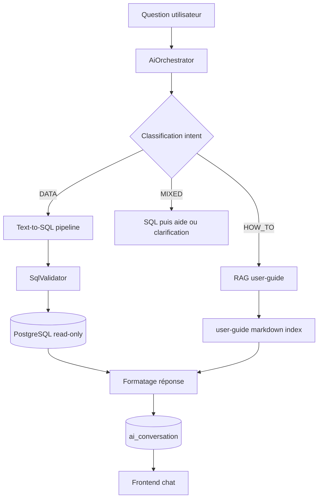
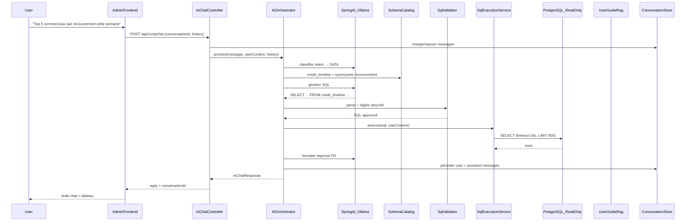
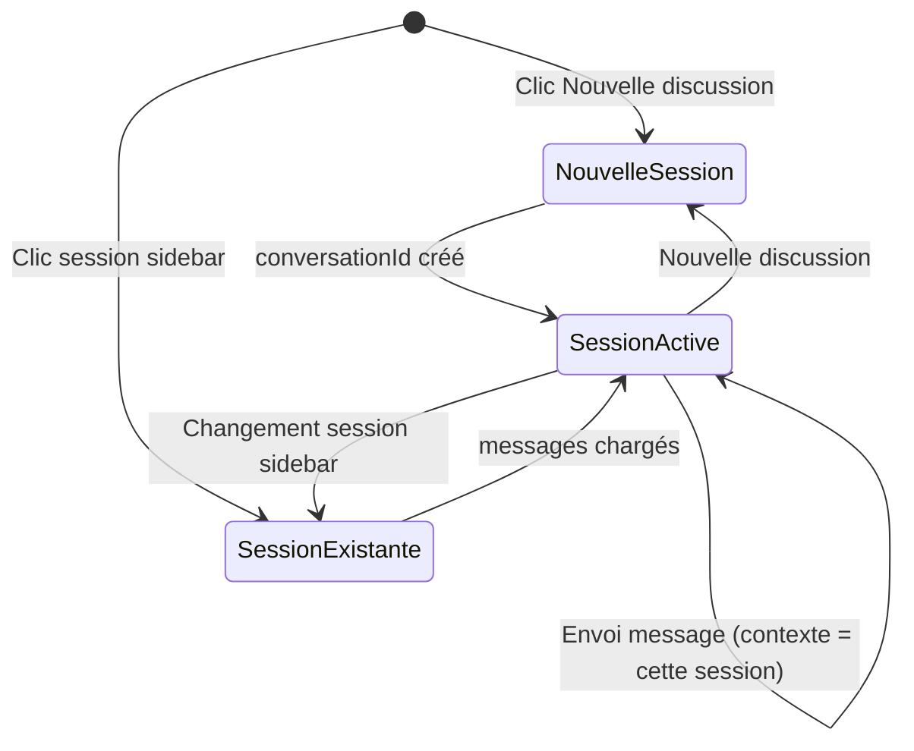

# Plan d'intégration Elykia IA

## Contexte produit

ELYKIA gère vente à crédit, recouvrement, tontines et BI via **Angular 18 admin** + **Spring Boot 3.3 / PostgreSQL**. La valeur recherchée de l'IA n'est **pas** de répliquer les endpoints BI existants, mais de **répondre à des questions ad-hoc** pour lesquelles aucun service backend n'a encore été développé — en interrogeant directement la base via langage naturel.

**Décisions validées :**
- **Périmètre MVP** : admin frontend uniquement
- **LLM dev/test** : **Spring AI + Ollama** (local, sans coût API) ; prod : provider cloud via la même abstraction Spring AI
- **Double capacité MVP** :
  1. **Données** — Text-to-SQL sécurisé (lecture seule) pour questions ad-hoc
  2. **Aide applicative** — RAG sur [`user-guide/`](user-guide/docs/) pour « comment faire X dans l'application ? »
- **Recouvrement crédit** : table **`credit_timeline`** (chaque ligne = un paiement/mise sur un crédit)
- **Historique** : **une session = une conversation** — chaque « Nouvelle discussion » crée un fil indépendant ; la sidebar liste les sessions, jamais un historique global unique

---

## Vision cible

L'utilisateur clique sur **« Ask AI »** (header) ou **« Elykia IA »** (sidebar) → page chat :

> Bonjour {username}, de quoi avez-vous besoin aujourd'hui ?

Il pose une question libre. Le backend **classifie l'intention** puis route vers l'un des deux pipelines :

| Type de question | Exemple | Pipeline |
|------------------|---------|----------|
| **DATA** | « Top 5 commerciaux par recouvrement cette semaine » | Text-to-SQL → PostgreSQL read-only |
| **HOW_TO** | « Comment enregistrer une mise sur un crédit ? » | RAG sur `user-guide/` → réponse + lien vers la page |





---

## Principe architectural clé : Text-to-SQL sécurisé en v1

| Approche | Valeur pour ELYKIA | Rôle dans le plan |
|----------|-------------------|-------------------|
| **Text-to-SQL** | Répond à des questions non couvertes par l'API | **Pipeline DATA** — cœur MVP |
| **RAG user-guide** | Guide l'utilisateur dans l'application sans lire 30 pages MkDocs | **Pipeline HOW_TO** — cœur MVP |
| **Tool calling sur services existants** | Redondant avec navigation BI | Hors scope MVP |

Le LLM reçoit un **catalogue schéma enrichi** et produit du **SQL PostgreSQL en lecture seule**. Pour le recouvrement d'un crédit, la table de référence est **`credit_timeline`** (et non `recovery` qui est une entité legacy mobile) — chaque ligne représente un paiement/mise avec `amount`, `collector`, `date_reg`, `credit_id`, solde restant, etc.

Référence schéma existante : [`backend/src/main/resources/oec_schema.sql`](backend/src/main/resources/oec_schema.sql), migrations Flyway, entités JPA (`Credit`, `CreditTimeline`, `TontineSession`…).

---

## Pipeline Text-to-SQL (backend)

Nouveau package : `com.optimize.elykia.core.ai`

```
ai/
├── config/              AiProperties, AiDataSourceConfig, SpringAiConfig
├── controller/          AiChatController, AiConversationController
├── dto/                 AiChatRequest, AiChatResponse, SqlQueryResult, ConversationDto
├── llm/                 via Spring AI ChatClient
│   ├── Ollama (profil dev)    # spring-ai-starter-model-ollama
│   ├── OpenAI/Gemini (prod)
│   └── StubChatClient (CI)
├── orchestration/       AiOrchestratorService, IntentClassifier
├── help/                UserGuideRagService, UserGuideIndexer
├── schema/              SchemaCatalogService, SchemaCatalogGenerator
├── sql/                 SqlGenerationService, SqlValidator, SqlRowLevelFilter, SqlExecutionService
├── conversation/        AiConversationService, entités JPA ai_conversation/ai_message
├── security/            AiAccessPolicy, AiRateLimiter
└── audit/               AiQueryAuditLog
```

### Étapes du pipeline DATA (Text-to-SQL)

1. **Enrichissement contexte** : rôle utilisateur, date du jour, timezone, filtres row-level applicables
2. **Génération SQL** : LLM + `schema-catalog.json` + few-shot examples (3–5 requêtes types ELYKIA)
3. **Validation** : parse AST, règles bloquantes (voir section sécurité)
4. **Injection row-level** : ajout programmatique de `WHERE` selon le profil (ex. commercial → `collector = :currentUsername`)
5. **Exécution** : `JdbcTemplate` ou `EntityManager` sur datasource **read-only**, `SET statement_timeout`, `LIMIT` forcé
6. **Auto-correction** : si erreur SQL PostgreSQL, renvoyer l'erreur au LLM (max 2 retries)
7. **Formatage réponse** : second appel LLM (ou template) pour traduire rows en français + tableau markdown/HTML

### Interface LLM : Spring AI `ChatClient`

Pas d'interface custom — utiliser `ChatClient` de Spring AI avec sélection par profil Spring (`@Profile("dev")` → Ollama, `@Profile("prod")` → cloud).

```yaml
elykia:
  ai:
    enabled: true
    provider: ollama|openai|gemini|stub
    model: qwen2.5-coder:7b
    max-tokens: 4096
    rate-limit-per-user-per-minute: 15
    conversation:
      max-history-messages: 20      # contexte envoyé au LLM
      retention-days: 90            # purge conversations
    sql:
      max-rows: 500
      timeout-seconds: 10
      max-retries: 2
      expose-sql-to-user: false
    help:
      user-guide-path: classpath:ai/user-guide-index/
      top-k-chunks: 5
```

### Spring AI + Ollama (dev/test) — recommandation

**Oui, excellent choix pour dev/test/MVP local.** Spring AI fournit l'abstraction `ChatClient` native — pas besoin d'une interface `LlmClient` custom.

| Avantage | Détail |
|----------|--------|
| Zéro coût API en dev | Ollama local ou serveur interne |
| Données sensibles | Prompts SQL ne quittent pas l'infra |
| Abstraction unifiée | Même `ChatClient` : Ollama (dev) → OpenAI/Gemini (prod) |
| Écosystème Spring | Auto-config, tests, observabilité |

**Dépendance :** `spring-ai-starter-model-ollama` (+ `spring-ai-starter-model-openai` en prod si besoin).

**Modèles Ollama recommandés :**
- `qwen2.5-coder:7b` — SQL PostgreSQL + français (MVP local)
- `llama3.1:8b` — classification intent + formatage
- `nomic-embed-text` — embeddings RAG user-guide

**Limites :** modèles 7–8B moins fiables que GPT-4o sur SQL complexe ; le validateur + auto-correction compensent. Prod : modèle cloud pour requêtes difficiles.

**CI :** `StubChatClient` ou `@MockBean ChatClient` — pas d'Ollama en pipeline CI.

---

## Aide applicative — RAG sur user-guide (MVP)

Source : [`user-guide/docs/`](user-guide/docs/) — ~30 pages MkDocs déjà intégrées au build admin (`/user-guide`).

### Pipeline HOW_TO

1. **Indexation au build** (`UserGuideIndexer`) : parser les `.md`, découper en chunks (~500 tokens), métadonnées (titre, rôle cible : commercial/manager/storekeeper, chemin page)
2. **Recherche** : similarité cosine sur embeddings (Spring AI `EmbeddingModel` + Ollama `nomic-embed-text` en dev, ou recherche keyword BM25 en v1 simplifiée)
3. **Génération** : LLM répond **uniquement** à partir des chunks récupérés, avec **citations** :
   - « Voir le guide : [Enregistrer une mise](https://…/user-guide/commercial/…) »
   - Étapes numérotées extraites du markdown
4. **Pas de SQL** pour les questions HOW_TO — le classifieur d'intent bloque le pipeline DATA

### Exemples de questions couvertes

- « Comment créer un crédit pour un client ? »
- « Où voir les rapports journaliers du commercial ? »
- « Comment gérer une collecte tontine ? »
- « Comment faire un versement caisse ? »

### Fichiers user-guide prioritaires

| Rôle | Fichiers |
|------|----------|
| Commercial | `commercial/clients_accounts.md`, `commercial/tontine.md`, `commercial/reporting.md` |
| Manager | `manager/dashboard.md`, `manager/operations.md`, `manager/finance.md` |
| Général | `daily-cycle.md`, `tontine.md`, `reporting.md`, `administration.md` |

---

## Historique par session (conversation = fil indépendant)

**Principe :** chaque discussion est une **session distincte**. On ne fusionne **jamais** tous les échanges d'un utilisateur dans un seul fil chronologique global.

| Concept | Définition |
|---------|------------|
| **Session** | = une entrée `ai_conversation` (un fil complet, du 1er message à la fin ou abandon) |
| **Message** | = une bulle user ou assistant, **rattachée à une seule** `conversation_id` |
| **Nouvelle discussion** | Crée une **nouvelle** session vide ; le fil précédent reste intact dans la sidebar |
| **Reprise** | Clic sur une session dans la sidebar → charge **uniquement** les messages de cette session |
| **Contexte LLM** | Les N derniers messages envoyés au modèle sont **limités à la session active** — pas de mélange entre sessions |

### Ce qu'on ne fait pas

- Pas d'historique unique type « chat WhatsApp infini » regroupant toutes les questions depuis le début
- Pas de reprise implicite de la dernière session au login (on peut ouvrir une session vide ou la dernière — configurable, défaut : **nouvelle session vide** ou **dernière session active** au choix produit)
- Pas de contexte cross-session : « et hier ? » dans la session B ne voit pas les messages de la session A

### Modèle de données

```sql
CREATE TABLE ai_conversation (
  id UUID PRIMARY KEY,                    -- identifiant de session
  user_id BIGINT NOT NULL REFERENCES users(id),
  title VARCHAR(255),                     -- auto-généré depuis 1er message de CETTE session
  status VARCHAR(20) DEFAULT 'ACTIVE',    -- ACTIVE | ARCHIVED (optionnel)
  created_at TIMESTAMP,                   -- début de session
  updated_at TIMESTAMP                    -- dernier message — tri sidebar
);

CREATE TABLE ai_message (
  id UUID PRIMARY KEY,
  conversation_id UUID NOT NULL REFERENCES ai_conversation(id) ON DELETE CASCADE,
  role VARCHAR(20),                       -- USER | ASSISTANT | SYSTEM
  content TEXT,
  intent VARCHAR(20),                     -- DATA | HOW_TO
  metadata JSONB,
  created_at TIMESTAMP
);
-- Index : (conversation_id, created_at) pour charger un fil session par session
```

### Comportement

| Aspect | Détail |
|--------|--------|
| **Création session** | Bouton « Nouvelle discussion » → `POST /conversations` → `conversationId` actif ; zone centrale vidée (message d'accueil) |
| **Envoi message** | `POST /chat` avec `conversationId` obligatoire (ou création auto si 1er message d'une nouvelle session) |
| **Multi-tours** | Dans **la session active** seulement : jusqu'à 20 messages précédents renvoyés au LLM |
| **Sidebar** | Liste des sessions de l'utilisateur, triées par `updated_at` desc — **une ligne = une conversation** |
| **Titre session** | Auto-généré à partir du 1er message de cette session (« Recouvrement semaine », « Comment créer un crédit ») |
| **Suppression** | `DELETE /conversations/{id}` supprime la session et tous ses messages (cascade) |
| **Isolation** | Un utilisateur ne voit que **ses** sessions |

### Flux utilisateur



### API conversations

| Méthode | Route | Rôle |
|---------|-------|------|
| `GET` | `/api/v1/ai/conversations` | Liste des **sessions** de l'utilisateur (métadonnées : id, title, updated_at) — pas les messages |
| `GET` | `/api/v1/ai/conversations/{id}` | Messages **de cette session uniquement** |
| `POST` | `/api/v1/ai/conversations` | Créer une **nouvelle session** vide |
| `DELETE` | `/api/v1/ai/conversations/{id}` | Supprimer une session |
| `POST` | `/api/v1/ai/chat` | Envoyer message — **`conversationId` requis** (session active) |

### Frontend — layout chat (sessions dans la sidebar)

```
┌─────────────────┬──────────────────────────────────┐
│ Sessions        │  Bonjour jdoe, de quoi avez-vous   │
│ [+ Nouvelle     │  besoin aujourd'hui ?              │
│    discussion]  │  (écran vide si nouvelle session)  │
│                 │                                  │
│ ● Recouvrement  │  [bulles de LA session active      │
│   semaine       │   uniquement]                      │
│ ○ Comment créer │  [tableau / liens guide]           │
│   un crédit     │                                  │
│ ○ Stock faible  │                                  │
│                 ├──────────────────────────────────┤
│                 │  [textarea]           [Envoyer]  │
└─────────────────┴──────────────────────────────────┘
```

- `●` = session active ; `○` = sessions passées cliquables
- Changer de session = **remplace** le fil central (pas d'empilement)
- Chaque session conserve son propre historique persisté en base

---

## Garde-fous sécurité (critiques)

### 1. Connexion base en lecture seule

- Utilisateur PostgreSQL dédié `elykia_ai_readonly` avec `GRANT SELECT` uniquement sur tables/vues autorisées
- Datasource séparée dans Spring (`aiReadOnlyDataSource`) — **jamais** la datasource principale JPA en écriture
- En dev : même base mais rôle restreint ; en prod : idéalement réplica read-only

### 2. Validateur SQL (bloquant avant exécution)

Utiliser **JSqlParser** (ou équivalent) pour parser l'AST et rejeter :

| Règle | Détail |
|-------|--------|
| **SELECT only** | Rejeter `INSERT`, `UPDATE`, `DELETE`, `MERGE`, `TRUNCATE`, `DROP`, `ALTER`, `CREATE`, `GRANT`, `COPY`, `CALL` |
| **Une seule instruction** | Pas de `;` multi-statements |
| **Pas de fonctions dangereuses** | `pg_sleep`, `pg_read_file`, `lo_import`, `dblink`, extensions arbitraires |
| **Tables whitelistées** | Seules les tables/vues du catalogue sont autorisées |
| **Colonnes sensibles masquées** | Exclure : `pin_hash`, `firebase_*`, tokens, mots de passe, blobs photos binaires |
| **LIMIT obligatoire** | Injecter `LIMIT 500` si absent (configurable) |
| **Timeout** | `statement_timeout = 10s` par session |
| **Pas de sous-requêtes vers tables interdites** | Validation récursive des tables référencées |
| **Pas de `SELECT *`** | Forcer colonnes explicites (optionnel phase 2 — réduit fuite de colonnes oubliées) |

### 3. Row-level security (application layer)

Injection **programmatique** après validation, avant exécution — ne pas faire confiance au LLM pour les permissions :

| Profil | Filtre injecté |
|--------|----------------|
| `COMMERCIAL` / collecteur | `collector = :currentUsername` sur tables `credit`, `credit_timeline`, `daily_commercial_report`… |
| `GESTIONNAIRE` | périmètre agence/magasin si applicable |
| `ADMIN` / `SUPER_ADMIN` | pas de filtre additionnel |
| `RECOVERY_MANAGER` | selon périmètre recouvrement |

Si la requête ne peut pas être contrainte sans modifier sa sémantique → **rejeter** avec message explicite.

### 4. Authentification & gouvernance API

- JWT existant (`common-security-service`)
- Endpoint protégé par rôle : `ROLE_ADMIN`, `ROLE_MANAGER`, `ROLE_GESTIONNAIRE` (à affiner)
- Rate limiting par utilisateur
- Clés LLM **uniquement côté serveur**
- Audit : `user_id`, `prompt_hash`, `sql_hash`, `tables_accessed`, `row_count`, `duration_ms`, `status` — **pas** de données PII dans les logs
- Option « mode debug » : afficher le SQL généré uniquement aux admins en environnement non-prod

### 5. Anti-hallucination sur les chiffres

- Le LLM **ne doit jamais inventer** de montants : la réponse finale est ancrée sur les `rows` retournées par PostgreSQL
- Prompt de formatage : « Réponds uniquement à partir des données fournies ; si vide, dis-le clairement »

---

## Catalogue schéma (fondation Text-to-SQL)

Fichier : [`backend/src/main/resources/ai/schema-catalog.json`](backend/src/main/resources/ai/schema-catalog.json)

### Contenu par table/vue

```json
{
  "tables": [
    {
      "name": "credit",
      "description": "Vente à crédit — une ligne par opération crédit",
      "synonyms": ["vente", "crédit", "dossier"],
      "columns": [
        { "name": "total_amount", "type": "double", "description": "Montant total du crédit", "synonyms": ["chiffre", "CA", "montant"] },
        { "name": "collector", "type": "varchar", "description": "Commercial collecteur (username)" },
        { "name": "date_reg", "type": "date", "description": "Date d'enregistrement" },
        { "name": "status", "type": "enum", "values": ["INPROGRESS", "SETTLED", "..."] }
      ],
      "relations": [
        { "column": "client_id", "refTable": "client", "refColumn": "id" }
      ],
      "rowLevelFilter": "collector"
    }
  ],
  "views": [
    { "name": "credit_distribution_view", "description": "Vue agrégée distributions promoteur" }
  ],
  "enums": {
    "credit.status": ["INPROGRESS", "SETTLED"],
    "credit.client_type": ["CLIENT", "PROMOTER"]
  },
  "businessRules": [
    "Le chiffre du jour (ventes) = SUM(credit.total_amount) WHERE date_reg = CURRENT_DATE AND type = 'CREDIT'",
    "Le recouvrement d'un crédit = lignes dans credit_timeline (amount, date_reg, collector) — PAS la table recovery",
    "SUM(credit_timeline.amount) = montant recouvré sur une période"
  ]
}
```

### Entrée catalogue `credit_timeline` (recouvrement)

```json
{
  "name": "credit_timeline",
  "description": "Table de recouvrement — chaque ligne = un paiement/mise sur un crédit",
  "synonyms": ["recouvrement", "mise", "paiement", "versement", "timeline"],
  "columns": [
    { "name": "credit_id", "type": "bigint", "description": "FK vers credit.id" },
    { "name": "amount", "type": "double", "description": "Montant de la mise/paiement", "synonyms": ["mise", "recouvrement"] },
    { "name": "collector", "type": "varchar", "description": "Commercial ayant encaissé" },
    { "name": "date_reg", "type": "date", "description": "Date du paiement" },
    { "name": "total_amount_remaining", "type": "double", "description": "Solde restant après ce paiement" }
  ],
  "relations": [
    { "column": "credit_id", "refTable": "credit", "refColumn": "id" }
  ],
  "rowLevelFilter": "collector"
}
```

### Génération semi-automatique

- Script `SchemaCatalogGenerator` : introspection `information_schema` + annotations depuis entités JPA
- Enrichissement manuel : synonymes FR, règles métier, tables interdites
- CI : test de non-régression si le schéma DB change (catalogue à jour)

### Tables prioritaires MVP

| Domaine | Tables / vues |
|---------|---------------|
| Crédit | `credit`, `credit_articles`, `credit_timeline`, `credit_collector_history` |
| Clients | `client`, `account` |
| Tontine | `tontine_session`, `tontine_member`, `tontine_collection`, `tontine_delivery` |
| BI / rapports | `sales_analytics_daily`, `collection_analytics_daily`, `daily_business_snapshot`, `daily_commercial_report` |
| Stock | `articles`, `stock_movement` |
| Recouvrement | **`credit_timeline`** (principal), `recovery_manager_operation`, `cash_deposit` |
| Vues | `credit_distribution_view`, `accountancy_report_view` |

---

## Endpoints API

| Méthode | Route | Rôle |
|---------|-------|------|
| `POST` | `/api/v1/ai/chat` | Envoyer message — **`conversationId` requis** (session active) |
| `GET` | `/api/v1/ai/conversations` | Liste conversations utilisateur |
| `GET` | `/api/v1/ai/conversations/{id}` | Messages d'une conversation |
| `POST` | `/api/v1/ai/conversations` | Nouvelle conversation |
| `DELETE` | `/api/v1/ai/conversations/{id}` | Supprimer conversation |
| `GET` | `/api/v1/ai/schema/domains` | Domaines DATA pour chips UI |
| `GET` | `/api/v1/ai/health` | Statut Ollama/provider + DB read-only |

Réponse type (DATA) :

```json
{
  "data": {
    "conversationId": "uuid",
    "reply": "Cette semaine, les 5 meilleurs commerciaux par recouvrement sont…",
    "intent": "DATA",
    "rowCount": 5,
    "preview": [{ "commercial": "jdoe", "montant_recouvre": 850000 }],
    "suggestions": ["Détail par jour", "Comparer avec la semaine dernière"]
  }
}
```

Réponse type (HOW_TO) :

```json
{
  "data": {
    "conversationId": "uuid",
    "reply": "Pour enregistrer une mise sur un crédit : 1) Ouvrez la liste des crédits…",
    "intent": "HOW_TO",
    "sources": [
      { "title": "Comptes clients et crédits", "url": "/user-guide/commercial/clients_accounts.html" }
    ]
  }
}
```

---

## Architecture frontend admin

*(inchangé dans l'objectif — seule l'API backend évolue)*

### Points d'entrée

1. **Header** — [`frontend/src/app/layout/header/header.component.html`](frontend/src/app/layout/header/header.component.html) : bouton `Ask AI`
2. **Sidebar section Aide** — [`frontend/src/app/layout/sidebar/sidebar.component.html`](frontend/src/app/layout/sidebar/sidebar.component.html) : entrée `Elykia IA`

### Module `ai-chat`

```
frontend/src/app/ai-chat/
├── pages/ai-chat-page/
├── components/
│   ├── conversation-sidebar/    # liste + nouveau + suppression
│   ├── chat-message-list/
│   ├── chat-input/
│   ├── chat-suggestion-chips/
│   ├── result-table/              # preview DATA
│   └── guide-source-links/        # citations HOW_TO
└── services/ai-chat.service.ts
```

- Route `/ai-chat` + `AuthGuard`
- Username via `AuthService.getUsername()`
- **`conversationId` actif** en state Angular — toute requête chat est scopée à cette session
- **Sidebar sessions** : une entrée par conversation (`GET /conversations`), tri `updated_at` desc ; clic = charge les messages de **cette session seule**
- **« Nouvelle discussion »** : `POST /conversations` → nouveau `conversationId` → fil central réinitialisé (accueil)
- Affichage tableau collapsible si `preview` (intent DATA)
- Liens guide si `sources` (intent HOW_TO)
- Toggle admin « Voir la requête SQL » (dev uniquement)
- Feature flag `elykia.ai.enabled`

---

## Exemple bout en bout : question ad-hoc non couverte par l'API

**Question :** « Quels sont les 3 articles les plus vendus en crédit ce mois avec leur marge ? »

1. Aucun endpoint REST ne répond exactement à cette question composite
2. LLM génère (à partir du catalogue) :

```sql
SELECT a.name, SUM(ca.quantity) AS qty,
       SUM(ca.quantity * (ca.unit_price - a.purchase_price)) AS marge
FROM credit c
JOIN credit_articles ca ON ca.credit_id = c.id
JOIN articles a ON a.id = ca.articles_id
WHERE c.date_reg >= date_trunc('month', CURRENT_DATE)
  AND c.type = 'CREDIT'
GROUP BY a.id, a.name
ORDER BY qty DESC
LIMIT 3
```

3. Validateur : SELECT only, tables whitelistées, LIMIT ok
4. Row-level filter injecté si commercial
5. Exécution read-only → 3 rows
6. LLM formate : « En juin 2026, les 3 articles les plus vendus en crédit sont… »

---

## Phasage recommandé (révisé)

### Phase 0 — Fondations (2–3 semaines)

- Spring AI + Ollama (profil dev) + StubChatClient (CI)
- `IntentClassifier` (DATA vs HOW_TO)
- `SchemaCatalogGenerator` + catalogue v1 (`credit_timeline` explicite pour recouvrement)
- `SqlValidator` + `SqlExecutionService` + datasource read-only
- `UserGuideIndexer` + RAG basique sur `user-guide/`
- Tables `ai_conversation` / `ai_message` + `AiConversationService`
- `AiOrchestratorService` : routage dual pipeline

### Phase 1 — MVP utilisateur (2 semaines)

- Page chat admin avec **sidebar historique** + reprise conversations
- Header « Ask AI » + sidebar « Elykia IA »
- Row-level filters + rate limit + audit
- Feature flag + doc `AI_ASSISTANT.md`
- Docker Compose : service Ollama optionnel pour l'équipe

### Phase 2 — Qualité & confiance (2 semaines)

- Few-shot SQL par domaine + auto-correction affinée
- Embeddings vectoriels pour RAG (remplacer keyword search si insuffisant)
- Métriques : `ai.intent.distribution`, `ai.sql.latency`, `ai.help.sources_hit`
- Panel admin : requêtes fréquentes, SQL rejetés

### Phase 3 — Enrichissements (optionnel)

- Vues SQL dédiées IA (`ai_*_view`)
- Provider cloud en prod (GPT-4o / Gemini) pour SQL complexe
- Extension mobile / customer-space

---

## Fichiers principaux à créer / modifier

| Zone | Fichiers |
|------|----------|
| Backend nouveau | `core/ai/**`, `resources/ai/schema-catalog.json`, migration SQL grants read-only |
| Backend config | `application.yml` (`elykia.ai` + datasource read-only) |
| Backend tests | `SqlValidatorTest`, `SqlRowLevelFilterTest`, `AiOrchestratorServiceTest`, `AiChatControllerTest` |
| Frontend | `frontend/src/app/ai-chat/**`, header, sidebar, routing |
| Infra | Script création rôle PostgreSQL read-only (Docker / deploy) |
| Docs | `backend/docs/AI_ASSISTANT.md`, CHANGELOG |

---

## Risques et mitigations (révisés)

| Risque | Mitigation |
|--------|------------|
| SQL malveillant / injection | Validateur AST + whitelist tables + read-only DB user |
| Fuite données cross-commercial | Row-level filter programmatique, pas dans le prompt seul |
| Requêtes lentes | Timeout 10s, LIMIT 500, index existants (ex. V60) |
| Hallucinations chiffres | Réponse ancrée sur rows PostgreSQL uniquement |
| Schéma obsolète | Générateur catalogue + test CI |
| Coût LLM (2 appels) | Modèle économique, cache court requêtes identiques |
| Questions ambiguës | LLM demande clarification avant SQL ; chips suggestions |

---

## Epics & stories (backlog révisé)

**Epic E1 — Moteur Text-to-SQL**
- Story : `SchemaCatalogGenerator` + catalogue v1 crédit/recouvrement/tontine
- Story : `SqlValidator` avec suite de tests attaques (DROP, multi-stmt, tables interdites)
- Story : `SqlExecutionService` datasource read-only + timeout + limit
- Story : `SqlRowLevelFilter` par profil utilisateur
- Story : `AiOrchestratorService` pipeline complet + auto-correction

**Epic E2 — LLM, aide & conversations**
- Story : Spring AI + Ollama (dev) + Stub (CI)
- Story : `IntentClassifier` DATA / HOW_TO
- Story : `UserGuideIndexer` + `UserGuideRagService`
- Story : `AiConversationService` + API CRUD conversations
- Story : `AiChatController` + persistance messages

**Epic E3 — Admin UI Chat**
- Story : Module `ai-chat` + route `/ai-chat`
- Story : Sidebar **sessions** (1 ligne = 1 conversation) + « Nouvelle discussion »
- Story : Recharge fil central au changement de session (pas d'historique fusionné)
- Story : Header « Ask AI » + sidebar « Elykia IA »
- Story : Tableau résultats DATA + liens guide HOW_TO

**Epic E4 — Sécurité & Ops**
- Story : Rôle PostgreSQL read-only + grants
- Story : Rate limiting + feature flag
- Story : Métriques + doc opérationnelle

---

## Estimation indicative (révisée)

| Phase | Effort |
|-------|--------|
| Phase 0 (moteur Text-to-SQL + sécurité) | ~2–3 semaines |
| Phase 1 (MVP UI + provider LLM) | ~2 semaines |
| Phase 2 (qualité, audit, historique) | ~2 semaines |

**Livrable MVP utilisable** : ~4–5 semaines (1 dev full-stack expérimenté ou binôme BE/FE).
