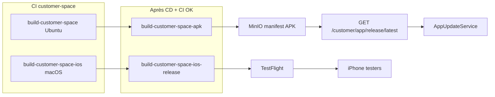
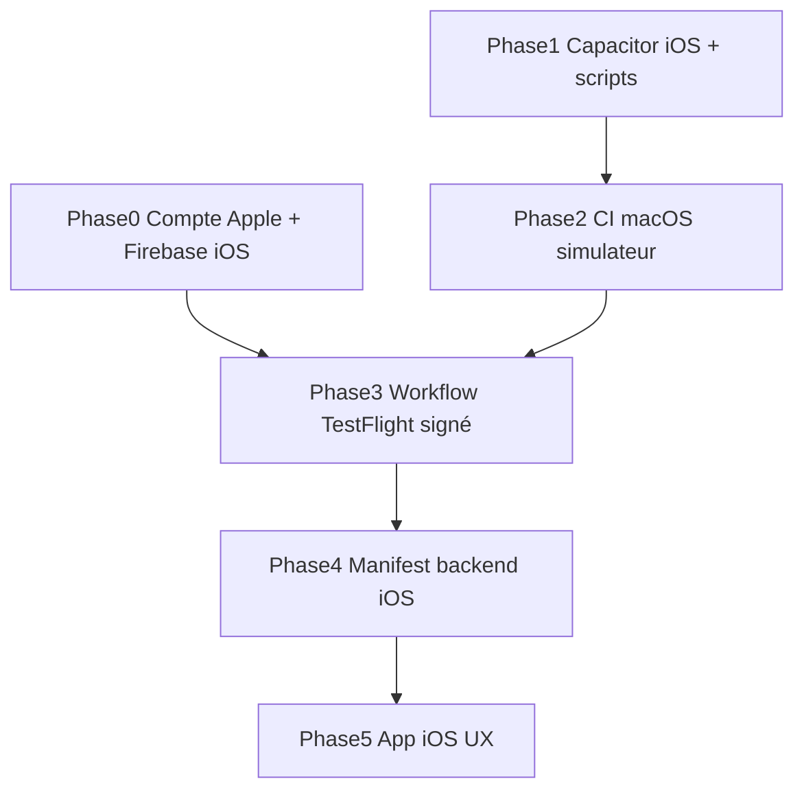

# Plan iOS TestFlight — Espace Client ELYKIA

## Contexte et objectif

Le pipeline Android est en place ([`build-customer-space-apk.yml`](.github/workflows/build-customer-space-apk.yml), action composite, MinIO + manifest). L’objectif est d’ajouter un **chemin iOS parallèle** pour les clients iPhone, avec **TestFlight uniquement** (pas d’App Store public, pas de sideload IPA).

Contraintes validées :
- Distribution : **TestFlight** (groupes internes test/prod)
- **Pas encore de compte Apple Developer** → Phase 0 bloquante avant archive signée / upload



---

## Phase 0 — Prérequis Apple (manuel, hors repo)

À faire **avant** toute archive signée ou upload CI :

1. **Inscription Apple Developer Program** (~99 USD/an) sur [developer.apple.com](https://developer.apple.com)
2. **App Store Connect** : créer l’app **ELYKIA Client**
   - Bundle ID : `com.optimize.elykia.customer` (aligné sur [`capacitor.config.ts`](customer-space/capacitor.config.ts))
   - SKU interne, nom affiché
3. **Certificats & profils** (Distribution + App Store)
   - Certificat **Apple Distribution** (.p12 exporté)
   - Profil **App Store** pour `com.optimize.elykia.customer`
4. **Clé API App Store Connect** (.p8) pour upload CI
   - Rôle minimum : **App Manager** ou **Developer** avec accès upload
   - Noter : Key ID, Issuer ID, contenu .p8
5. **TestFlight**
   - Groupe **Internal Testing** (équipe, builds immédiats) → canal **test**
   - Groupe **External** ou second groupe interne → canal **prod interne**
   - Créer / noter le **lien public TestFlight** (`https://testflight.apple.com/join/...`) pour l’app
6. **Firebase iOS** : ajouter une app iOS au projet Firebase
   - Télécharger `GoogleService-Info.plist`
   - Secret GitHub : `CUSTOMER_SPACE_GOOGLE_SERVICES_PLIST` (base64 ou contenu brut)

Livrable doc : section dans [`docs/FIREBASE_SETUP.md`](docs/FIREBASE_SETUP.md) + checklist `docs/CUSTOMER_SPACE_IOS_SETUP.md` (nouveau).

---

## Phase 1 — Capacitor iOS (peut démarrer sans compte payé)

### Dépendances et plateforme

- Ajouter `@capacitor/ios@8.x` dans [`customer-space/package.json`](customer-space/package.json) (aligné sur `@capacitor/core@8.4.0`)
- `npx cap add ios` en local (génère `customer-space/ios/`)
- **Ne pas committer** tout le projet Xcode généré ; suivre le pattern Android :
  - Dossier template [`.github/workflows/ios-config-customer-space/`](.github/workflows/ios-config-customer-space/) avec fichiers patchés en CI :
    - `Info.plist` fragments (permissions, ATS)
    - `AppDelegate.swift` / `capacitor.config` si besoin
    - Script `sync-ios-version.sh` (miroir de [`sync-android-version.sh`](.github/scripts/sync-android-version.sh)) : `CFBundleShortVersionString` + `CFBundleVersion` = `major*10000 + minor*100 + patch`

### Firebase iOS

Étendre [`customer-space/scripts/apply-firebase-config.mjs`](customer-space/scripts/apply-firebase-config.mjs) :
- Nouvelle source `CUSTOMER_SPACE_GOOGLE_SERVICES_PLIST`
- Écriture de `ios/App/App/GoogleService-Info.plist` si dossier `ios/` présent

### Validation locale (Mac + Xcode)

- `ionic build --prod && npx cap sync ios`
- Build simulateur : `xcodebuild -workspace App.xcworkspace -scheme App -destination 'platform=iOS Simulator,name=iPhone 16' build`

---

## Phase 2 — CI validation iOS (macOS, parallèle Android)

Dans [`ci-customer-space.yml`](.github/workflows/ci-customer-space.yml), ajouter un job **`build-customer-space-ios`** :

| Aspect | Android existant | iOS nouveau |
|--------|------------------|-------------|
| Runner | `ubuntu-latest` | `macos-latest` |
| Déclenchement | paths `customer-space/**` | mêmes paths + scripts iOS |
| Étapes communes | `npm ci`, E2E smoke, `ionic build --prod` | identique |
| Natif | `cap add android`, sync, config template | `cap add ios`, sync, config template, `sync-ios-version.sh` |
| Build | `assembleRelease` (APK debug CI) | `xcodebuild` simulateur (sans signature) |

Étendre [`validate-customer-space-pipeline.sh`](.github/scripts/validate-customer-space-pipeline.sh) :
- Présence des fichiers `ios-config-customer-space/`
- Test dry-run de `sync-ios-version.sh` sur fixture

**Note** : sans secrets Apple, ce job valide uniquement la compilabilité iOS — suffisant pour merger la Phase 2.

---

## Phase 3 — Workflow release TestFlight (miroir APK)

### Nouveaux fichiers

- [`.github/workflows/build-customer-space-ios.yml`](.github/workflows/build-customer-space-ios.yml) — même logique `prepare` que l’APK ([`build-customer-space-apk.yml`](.github/workflows/build-customer-space-apk.yml)) : déclenchement sur CD / ci-customer-space, résolution `target` (test|prod) et `build_sha`, promote manuel
- [`.github/actions/build-customer-space-ios/action.yml`](.github/actions/build-customer-space-ios/action.yml) — composite macOS :
  1. Inject `apiUrl` dans `environment.prod.ts` (comme APK)
  2. `npm ci`, Firebase, `ionic build --prod`
  3. `cap sync ios`, appliquer config template, `sync-ios-version.sh`
  4. Import certificat + profil (secrets)
  5. `xcodebuild archive` + `exportArchive` (méthode `app-store`)
  6. Upload TestFlight via **App Store Connect API** (`xcrun altool --upload-app` ou **fastlane `upload_to_testflight`** — fastlane recommandé pour gestion des erreurs)
  7. Artifact GitHub : `.ipa` (rétention 90 jours, comme APK)
  8. Mettre à jour le manifest MinIO (voir Phase 4)

Jobs :
- `build-ios-test` → environment `test`, `TEST_API_URL`
- `build-ios-prod` → environment `prod`, `PROD_API_URL`, promote manuel

### Secrets GitHub (environments test / prod)

| Secret | Usage |
|--------|--------|
| `APPLE_CERTIFICATE_P12_BASE64` | Certificat distribution |
| `APPLE_CERTIFICATE_PASSWORD` | Mot de passe .p12 |
| `APPLE_PROVISIONING_PROFILE_BASE64` | Profil App Store |
| `APP_STORE_CONNECT_API_KEY_ID` | Upload API |
| `APP_STORE_CONNECT_API_ISSUER_ID` | Upload API |
| `APP_STORE_CONNECT_API_KEY_BASE64` | Contenu .p8 |
| `CUSTOMER_SPACE_GOOGLE_SERVICES_PLIST` | Firebase iOS |
| `TEST_API_URL` / `PROD_API_URL` | Déjà utilisés pour APK |
| `CUSTOMER_SPACE_TESTFLIGHT_URL` | Lien join TestFlight (optionnel, peut être en config app) |

Réutiliser les mêmes secrets que mobile si un jour mobile iOS existe ; sinon secrets dédiés customer-space.

---

## Phase 4 — Backend manifest (version iOS)

Le manifest MinIO actuel ([`publish-customer-space-apk.sh`](.github/scripts/publish-customer-space-apk.sh)) est orienté APK. Étendre pour iOS :

**Option retenue (minimale)** : enrichir `manifest.json` avec champs optionnels :

```json
{
  "version": "0.2.3",
  "versionCode": 203,
  "iosVersionCode": 203,
  "testFlightUrl": "https://testflight.apple.com/join/XXXX",
  ...
}
```

Modifications :
- [`MobileAppReleaseManifestDto`](backend/src/main/java/com/optimize/elykia/core/dto/MobileAppReleaseManifestDto.java) + [`MobileAppReleaseInfoDto`](backend/src/main/java/com/optimize/elykia/core/dto/MobileAppReleaseInfoDto.java) : champs `iosVersionCode`, `testFlightUrl` (optionnels)
- [`CustomerAppReleaseService`](backend/src/main/java/com/optimize/elykia/core/service/customer/CustomerAppReleaseService.java) : sur iOS, comparer `iosVersionCode` si présent, sinon fallback `versionCode`
- Script [`publish-customer-space-ios.sh`](.github/scripts/publish-customer-space-ios.sh) : après upload TestFlight, merge manifest canal `{test|prod}/manifest.json` (ne pas écraser champs APK existants)

Pas de téléchargement IPA via API (impossible pour utilisateurs finaux) — endpoint `/download` reste Android-only.

---

## Phase 5 — Adaptation application (customer-space)

### Modèle et service

- [`app-release.model.ts`](customer-space/src/app/shared/models/app-release.model.ts) : `testFlightUrl?`, `iosVersionCode?`
- [`app-update.service.ts`](customer-space/src/app/shared/services/app-update.service.ts) :
  - `checkForUpdate()` : si `Capacitor.getPlatform() === 'ios'`, utiliser `iosVersionCode ?? versionCode`
  - Nouvelle méthode `openTestFlightUpdate(release)` : `App.openUrl({ url: release.testFlightUrl ?? environment.testFlightUrl })`
  - `downloadAndInstall()` : sur iOS → déléguer à `openTestFlightUpdate` (pas de Filesystem / plugin natif)
- [`environment.prod.ts`](customer-space/src/environments/environment.prod.ts) / `environment.ts` : `testFlightUrl` par canal si statique

### UI

- [`dashboard.page.ts`](customer-space/src/app/features/dashboard/dashboard.page.ts) et [`profile.page.ts`](customer-space/src/app/features/profile/profile.page.ts) :
  - iOS : message « Mise à jour disponible dans TestFlight » + bouton ouvrir TestFlight
  - Android : comportement actuel inchangé (download + install APK)
  - Web : pas de mise à jour in-app

### Tests (skill customer-space-testing)

- Unit : `app-update.service.spec.ts` — branches iOS vs Android
- Specs dashboard/profile : mock plateforme iOS
- Pas d’E2E TestFlight en CI (nécessite compte + appareil)

---

## Phase 6 — Versioning, CHANGELOG, doc

- Bump [`customer-space/package.json`](customer-space/package.json) (patch, ex. `0.2.3`)
- [`docs/CHANGELOG.md`](docs/CHANGELOG.md) — sections Customer-space + Backend si DTO modifiés
- Documenter ordre promote : CD promote → APK promote → **iOS promote** (même pattern que mobile)

---

## Ordre d’exécution recommandé



- **Sans compte Apple** : Phases 1, 2, 4 (DTO), 5 (code app) peuvent avancer ; Phase 3 upload reste en attente.
- **Avec compte Apple** : configurer secrets → activer Phase 3 → premier build TestFlight test.

---

## Hors scope (explicitement)

- Publication App Store production (review publique)
- Programme Enterprise / distribution ad hoc
- Hébergement IPA sur MinIO pour install directe
- Pipeline iOS pour l’app **mobile** (hors demande actuelle)

---

## Risques et mitigations

| Risque | Mitigation |
|--------|------------|
| Pas de Mac en dev Windows | CI `macos-latest` comme source de vérité build iOS |
| Quota runners macOS (minutes ×10) | Job iOS uniquement si paths customer-space changent ; archive release séparée du job CI léger |
| Review TestFlight externe (prod) | Utiliser internal testing pour prod interne ; external seulement si nécessaire |
| VersionCode iOS ≠ Android | Même formule semver partagée ; champs séparés dans manifest si dérive |
