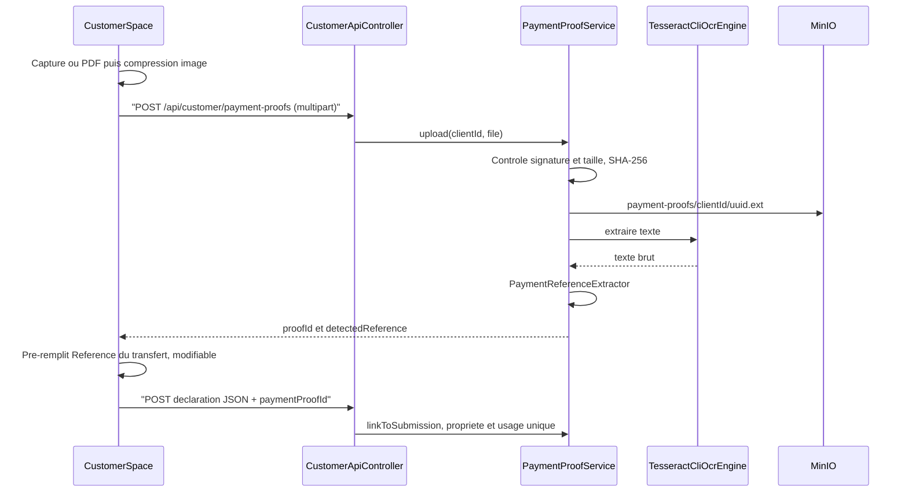

---
todos:
  - id: infra-ocr
    status: completed
    content: 'Dockerfile backend: install tesseract-ocr (fra, eng) + add PDFBox to pom.xml'
  - id: db-entity
    status: completed
    content: 'Migration V009 customer_payment_proof + payment_proof_id on 3 submission tables, entity/repository'
  - id: ocr-service
    status: completed
    content: 'TesseractOcrService (ProcessBuilder, timeout, semaphore, preprocessing, PDF text/render) + configurable PaymentReferenceExtractor + tests'
  - id: proof-service
    status: completed
    content: 'PaymentProofService: validation (magic bytes, 5 MB), SHA-256, MinIO upload, link/ownership, 24 h purge job, required flag'
  - id: customer-endpoints
    status: completed
    content: POST/DELETE /api/customer/payment-proofs multipart + paymentProofId in the 4 declaration DTOs and services
  - id: admin-endpoints
    status: completed
    content: 'GET proof streaming endpoints (credit, tontine, initial deposit) with access control + enriched DTOs (mismatch, duplicate)'
  - id: cs-picker
    status: completed
    content: 'customer-space: capture util + compression, app-payment-proof-picker component, uploadPaymentProof API'
  - id: cs-forms
    status: completed
    content: 'Integrate the picker into payment, tontine-payment, tontine-join, onboarding (mobile + desktop), non-destructive pre-fill, specs/E2E'
  - id: admin-ui
    status: completed
    content: 'Admin frontend: Justificatif column + Agrandir overlay (image/PDF) + badges in customer-payments and client-registrations'
  - id: delivery
    status: in_progress
    content: User guide + RAG index + mkdocs build frontend + versions/CHANGELOG + shared-traefik body limit check
name: Justificatif paiement OCR
overview: 'Add a mandatory proof-of-payment step (screenshot or PDF receipt) to the 4 customer-space Mobile Money declaration flows. The file is uploaded first via multipart, stored on MinIO, and run through Tesseract server-side to pre-fill the editable transfer reference. The admin can view the proof and duplicate or mismatch indicators when validating.'
isProject: false
---

# Justificatif de paiement + OCR Tesseract

## Flux cible

Pourquoi deux appels : l'OCR doit tourner avant la saisie. Le fichier n'est donc envoyé qu'une seule fois, en multipart (pas de surcoût de 33 % comme avec le base64). La déclaration reste un JSON qui ne fait que référencer le justificatif.

## Backend

**Infra OCR**

- [backend/Dockerfile](backend/Dockerfile) (`eclipse-temurin:17-jre`, Ubuntu) : ajouter `apt-get install -y --no-install-recommends tesseract-ocr tesseract-ocr-fra tesseract-ocr-eng`, puis nettoyer `/var/lib/apt/lists`. Le dépôt est modifié avant le CD, conformément à la règle Contabo.
- [backend/pom.xml](backend/pom.xml) : ajouter Apache PDFBox 3.x. Il sert à extraire le texte des PDF numériques et à rendre la page 1 en 300 DPI pour les PDF scannés. On n'utilise pas tess4j/JNA, qui pose un risque de SIGSEGV dans la JVM.
- Interface `OcrEngine` (`extractText(byte[] image)`), implémentation unique pour l'instant : `TesseractCliOcrEngine` (Tesseract installé dans l'image backend). Un futur `HttpOcrEngine` (conteneur dédié) pourra être activé par config sans toucher au métier.
- `TesseractCliOcrEngine` :
  - lance le binaire `tesseract` via `ProcessBuilder` dans un dossier temporaire, avec `-l fra+eng`, un timeout de 20 s et un sémaphore limitant à 2 OCR simultanés ;
  - pré-traite l'image : niveaux de gris, et agrandissement x2 si la largeur est inférieure à 1000 px ;
  - au démarrage, détecte si le binaire est présent. S'il manque (cas d'un poste Windows de dev), `ocrStatus=UNAVAILABLE` est renvoyé sans erreur.
- `PaymentReferenceExtractor` :
  - applique des regex ordonnées et configurables dans `application.yml` (`elykia.payment-proof.ocr.reference-patterns`) ;
  - cherche des mots-clés (Ref, Référence, ID, Txn, Transaction, N°) suivis d'un jeton alphanumérique de 6 à 30 caractères ;
  - ajoute des motifs spécifiques à Mixx by YAS et Moov Money, à calibrer sur des captures réelles ;
  - est couvert par des tests unitaires construits sur des textes d'exemple.

**Stockage et données**

- Migration `V010__customer_payment_proof.sql` (renommé depuis V009 après collision Flyway avec `main`). Elle crée la table `customer_payment_proof` avec :
  - `client_id`, `bucket`, `object_key`, `content_type`, `original_file_name`, `size_bytes` ;
  - `sha256` (indexé), `ocr_status`, `ocr_reference`, `ocr_text` ;
  - `linked_type` (CREDIT / TONTINE / INITIAL_DEPOSIT), `linked_id`, `linked_at` ;
  - les colonnes `BaseEntity`.
  Elle ajoute aussi `payment_proof_id` à `customer_mobile_money_submission`, `customer_tontine_mm_submission` et `customer_initial_deposit_submission`.
- Entité, repository et `PaymentProofService` :
  - acceptés : JPEG, PNG et PDF de 5 Mo maximum, vérifiés par magic bytes, sur le modèle de [SubmitJobApplicationUseCase.validateCv](backend/src/main/java) ;
  - envoi via `MinioStorageService.uploadObject` dans le bucket `minio.bucket` (`elykia-clients`), sous le préfixe `payment-proofs/` ;
  - lien : le justificatif doit appartenir au client et ne pas être déjà lié.
- Tâche planifiée : supprimer les justificatifs non liés de plus de 24 h, sur MinIO puis en base.
- Remplacement et unicité :
  - l'upload accepte `replacesProofId` (optionnel). Le serveur supprime l'ancien justificatif (MinIO + base) dans la même requête, s'il appartient au client et n'est pas encore lié ;
  - déduplication : même SHA-256, même client et justificatif non lié existant → il est réutilisé, sans nouvel objet MinIO ;
  - une déclaration n'a qu'un seul `payment_proof_id`, et un justificatif ne peut être lié qu'une seule fois.
- Schema catalog IA : non modifié, car ces tables restent hors périmètre du chat DATA.

**Endpoints client** dans [CustomerApiController](backend/src/main/java/com/optimize/elykia/core/controller/customer/CustomerApiController.java) (`ROLE_CLIENT`)

- `POST /api/customer/payment-proofs` (`consumes = multipart/form-data`, `@RequestPart("file") MultipartFile`). Renvoie `{ id, fileName, contentType, size, ocrStatus, detectedReference }`.
- `POST` accepte `@RequestParam(required = false) Long replacesProofId` (remplacement atomique côté serveur).
- `DELETE /api/customer/payment-proofs/{id}` : bouton « Retirer » sans remplacement, et nettoyage best-effort quand l'utilisateur quitte la page sans soumettre. Uniquement si le justificatif n'est pas encore lié.
- Ajouter `paymentProofId` à `CustomerMobileMoneyRequest`, `CustomerTontineMobileMoneyRequest`, `CustomerTontineInitialPaymentRequest` et `CustomerInitialDepositRequest`. Le lier dans `CustomerPortalService.submitMobileMoney` / `createTontineMmSubmission` et dans le service du dépôt initial.
- Caractère obligatoire : la propriété `elykia.payment-proof.required` est à `false` au premier déploiement, puis passe à `true` une fois l'APK diffusé. Les anciennes versions de l'app installées n'envoient pas le champ, et la mise à jour Android n'est pas forcée. Côté UI, le justificatif est obligatoire tout de suite.

**Endpoints admin**

- `GET .../{id}/proof` sur `CustomerMobileMoneySubmissionAdminController`, `CustomerTontineMmSubmissionAdminController` et `ClientRegistrationAdminController` (dépôts initiaux).
- Le fichier est renvoyé en flux binaire avec son `Content-Type`, comme le CV du recrutement. Cela évite les URL signées et les problèmes d'iframe cross-domain.
- Même contrôle d'accès que pour valider/rejeter (`assertAudienceOrThrow` et filtre promoteur par collecteur).
- DTO admin enrichis de :
  - `hasProof`, `proofContentType`, `ocrReference` ;
  - `referenceMismatch` : la référence lue par l'OCR diffère de la référence déclarée ;
  - `duplicateProof` : même SHA-256 ou même référence déjà vue sur une autre déclaration.

## customer-space

- Nouveau composant partagé `app-payment-proof-picker` (standalone, mobile et desktop). Il propose « Prendre / choisir une capture » et « Joindre le reçu PDF ». Pendant le traitement, il affiche un aperçu (miniature ou icône PDF) et le message « Lecture du justificatif… », puis propose « Remplacer ».
- « Remplacer » renvoie le nouveau fichier avec `replacesProofId` = justificatif courant. Quand l'utilisateur quitte la page sans soumettre (`ngOnDestroy` / `ionViewWillLeave`), l'app appelle `DELETE` en best-effort ; la purge à 24 h couvre les échecs.
- Utilitaire `payment-proof-capture.ts` :
  - `Camera.getPhoto` sur natif, sur le modèle de [profil-photo-face.ts](customer-space/src/app/shared/utils/profil-photo-face.ts) sans la détection de visage ;
  - `<input type="file" accept="image/*,application/pdf">` pour les PDF, sur le web et en E2E ;
  - compression par canvas : 1600 px maximum, JPEG qualité 0,8.
- [customer-api.service.ts](customer-space/src/app/shared/services/customer-api.service.ts) : ajouter `uploadPaymentProof(blob, fileName)` en `FormData`, sans en-tête Content-Type (les intercepteurs n'en forcent pas), et `deletePaymentProof(id)`. Mettre à jour les modèles dans `customer.model.ts`.
- Formulaires : ajouter le contrôle `paymentProofId` (requis) dans [mobile-money-form.ts](customer-space/src/app/shared/utils/mobile-money-form.ts), ainsi que dans les formulaires de [onboarding.page.ts](customer-space/src/app/features/onboarding/onboarding.page.ts) et [tontine-join.page.ts](customer-space/src/app/features/tontine-join/tontine-join.page.ts).
- Pré-remplissage : `mobileMoneyReference` reçoit la valeur détectée seulement si le champ est vide ou contient encore la dernière valeur auto-remplie, pour ne jamais écraser une saisie manuelle. La mention « Détectée automatiquement » s'affiche.
- Pages concernées : `payment` (+ desktop), `tontine-payment`, `tontine-join`, `onboarding` (+ desktop). Le bloc justificatif est placé en tête du formulaire.

## Admin frontend

- [customer-payments-list](frontend/src/app/customer-payments/pages/customer-payments-list/customer-payments-list.component.html) : ajouter une colonne « Justificatif » dans les 2 onglets, avec miniature ou icône PDF et bouton « Agrandir ». L'overlay reprend le modèle de `client-registrations-list` : `` pour une image, `<iframe>` sur un objectURL pour un PDF. Les fichiers sont chargés en blob via HttpClient.
- Badges « Référence différente » et « Justificatif déjà utilisé ».
- Écran des dépôts initiaux dans `client-registrations` : même colonne justificatif.

## Tests et livraison

- Backend :
  - tests unitaires de l'extracteur (échantillons Mixx et Moov) ;
  - tests du service : type refusé, taille, propriété, double lien, mode requis ;
  - test du contrôleur multipart.
- customer-space : specs du picker et des pages (pré-remplissage, saisie manuelle préservée, bouton désactivé sans justificatif), mise à jour des E2E.
- Prérequis : obtenir de vraies captures et de vrais reçus Mixx by YAS et Moov Money (anonymisés) pour calibrer les regex.
- Livraison :
  - guide utilisateur (parcours client et validation admin) ;
  - `python user-guide/generate_rag_index.py` ;
  - build mkdocs vers `frontend/src/user-guide` ;
  - montée de version et `docs/CHANGELOG.md` pour le backend, customer-space et frontend ;
  - vérifier dans `shared-traefik` qu'aucune limite de taille de requête n'est inférieure à 6 Mo.

