# Spec & architecture — sync hybride mobile ELYKIA

## Compréhension validée

Le backend est désormais accessible hors réseau entreprise. L’app doit **préférer le serveur quand il est joignable**, tout en gardant la capacité offline (init journalière + file d’attente `isSync=false`).

Décisions figées :

- **Lot prioritaire** d’écritures online-first (pas toutes les entités d’un coup)
- **Reliquats** inclus dans le lot prioritaire, **couplés aux recoveries** (suivent automatiquement les encaissements)
- **Listes : 2A** — cache local immédiat, puis refresh serveur (stale-while-revalidate)
- **Sync auto** — uniquement app ouverte (foreground), période configurable
- **TTL ping** — **120s** (acceptable 60–120s) pour limiter la charge réseau en prod

---

## Spec fonctionnelle

### SF1 — Connexion backend

- Avant toute écriture online-first ou refresh de liste, déterminer si le backend est accessible via `[HealthCheckService.pingBackend()](mobile/src/app/core/services/health-check.service.ts)`.
- Le résultat est **mis en cache** avec TTL **120s** (fenêtre acceptable 60–120s) pour éviter un ping HTTP à chaque action (volume prod).
- `navigator.onLine === false` ⇒ offline immédiat sans ping.
- Transition `online` / retour app au premier plan ⇒ invalidation du cache connectivity.

### SF2 — Enregistrement (lot prioritaire)

Entités phase 1 :

1. **Client** (+ compte associé à la création)
2. **Distribution / crédit**
3. **Recovery / encaissement** + **Reliquat** (le reliquat suit automatiquement le même mode que l’encaissement associé : online → API + local `isSync=true` ; offline / fallback → local `isSync=false` avec la recovery)
4. **Commande (order)**

Règle reliquat : pas de parcours online-first isolé ; dès qu’un encaissement est traité online-first (ou offline), le reliquat lié est traité dans la **même transaction métier / même décision de connectivité**, via la logique existante reliquat + [`ReliquatSyncService`](mobile/src/app/core/services/sync/reliquat-sync.service.ts).

Hors phase 1 (inchangé offline-first) : localités, tontine, sync photos lourdes, mises à jour secondaires.

**Si backend UP :**

1. Appeler l’API de création/mise à jour
2. Succès → persister en SQLite avec **id serveur**, `isSync=true`, `isLocal=false`
3. Échec métier/HTTP 4xx–5xx → afficher l’erreur ; l’utilisateur peut **corriger** ou **enregistrer en local** (`isSync=false`) et continuer

**Si backend DOWN :**

- Flow actuel : SQLite only, `isSync=false`, sync ultérieure via `SyncMasterService`

### SF3 — Synchronisation automatique (foreground)

- Brancher le toggle + fréquence dans `[more.page.html](mobile/src/app/tabs/more/more.page.html)` (aujourd’hui stub : toggle non lié, « Toutes les 2 heures » fixe).
- Préférences Ionic Storage : `autoSync` (déjà partiellement géré dans `more.page.ts`) + `autoSyncIntervalMinutes` (choix UI : 30 / 60 / 120 / 240 ; défaut **120**).
- Si `autoSync=true` et app **active** (foreground) :
  - Timer périodique → si backend UP et sync non déjà en cours → dispatcher `SyncActions.startAutomaticSync` (réutilise `[sync.effects.ts](mobile/src/app/store/sync/sync.effects.ts)` → `SyncMasterService`)
- Pause timer : app en background / sync déjà running / utilisateur désactive le toggle
- Ne pas lancer de vrai background OS (pas de Capacitor Background Task)

### SF4 — Listes et recherche

- **Conserver** l’init journalière `[initial-loading.page.ts](mobile/src/app/features/initial-loading/initial-loading.page.ts)` / `DataInitializationService` (seed offline du jour).
- Sur liste / recherche **online** (lot prioritaire : clients, recoveries, distributions/crédits, orders, localités en lecture) :
  1. Afficher immédiatement la page locale paginée (comportement actuel)
  2. En parallèle, appeler l’API paginée/filtre/recherche
  3. Remplacer le store NgRx avec les résultats serveur + **upsert** SQLite (cache à jour pour le prochain offline)
- Offline ou API en erreur → rester sur le cache local (pas de blocage UX)

---

## Spec technique

### ST1 — Couche Connectivity

Nouveau service `ConnectivityService` (wrap `HealthCheckService`) :

- `isBackendReachable(): Observable<boolean>` / `Promise<boolean>`
- Cache TTL **120s** + invalidation on resume / `online` event
- Timeout court sur le ping (ex. 3–4s) pour ne pas bloquer les saves

### ST2 — Write path online-first

Nouveau helper partagé `OnlineFirstWriteCoordinator` (ou méthodes dans chaque domain service) :

```text
tryOnlineWrite(apiCall, saveLocalSynced, saveLocalPending, onBusinessError)
```

Réutiliser au maximum les payloads/endpoints déjà utilisés par les `*SyncService` (`ClientSyncService`, `DistributionSyncService`, `RecoverySyncService`, `ReliquatSyncService`, `OrderSyncService`) pour éviter deux contrats API.

Après succès API : réutiliser la logique `markAsSynced` / insert direct avec id serveur (pas de second passage sync).

**Recovery + Reliquat :** une seule décision connectivity ; en online, enchaîner API recovery puis API/persist reliquat (ou endpoint combiné s’il existe déjà) ; en échec partiel, surface l’erreur et garder un état local cohérent (reliquat non syncé si recovery syncée, ou rollback local selon le contrat actuel sync master).

### ST3 — Read path SWR

Nouveau `OnlineListRefreshService` ou branche dans les NgRx effects existants (`loadFirstPage*` / search) :

- Toujours `get*Paginated` local d’abord
- Si reachable → API page/search → `patchState` + `repository.upsertPage`
- Debounce recherche inchangé côté UI ; côté serveur un seul call après debounce

Pagination : page size UI **20** (comme aujourd’hui) ; ne jamais recharger tout le catalogue à l’ouverture d’une liste.

### ST4 — Auto-sync scheduler

Nouveau `AutoSyncSchedulerService` :

- `App` / `Platform.resume` + `pause` (Ionic)
- `interval` RxJS seulement en `active`
- Guard : `autoSync`, connectivity, `!syncInProgress`
- UI More : bind toggle `[(ngModel)]="autoSync"` + picker fréquence

### ST5 — Perf / prod (non négociable)

- Pas de ping à chaque save (TTL connectivity **120s**)
- Pas de full dump liste : pagination serveur + upsert ciblé
- Sync auto : un run à la fois ; skip si précédent non terminé
- Écritures online : pas de double insert local temporaire si succès API (écriture finale unique avec id serveur)
- Logs structurés (mode, durée, entity) via `LoggerService` existant
- Feature flag Storage optionnel `hybridSyncEnabled` (défaut true) pour rollback rapide en prod

---

## Architecture cible

```mermaid
flowchart TD
  subgraph write [Ecriture lot prioritaire]
    UI[Ecran saisie] --> W[Domain Service]
    W --> C{ConnectivityService}
    C -->|UP| API[API create/update]
    API -->|OK| L1[SQLite id serveur isSync true]
    API -->|Erreur metier| Err[Afficher erreur]
    Err -->|Corriger| UI
    Err -->|Sauver local| L0[SQLite isSync false]
    C -->|DOWN| L0
  end

  subgraph read [Listes SWR]
    ListUI[Liste / Recherche] --> Local[SQLite page 20]
    Local --> ListUI
    ListUI --> C2{Connectivity}
    C2 -->|UP| API2[API page/search]
    API2 --> Upsert[Upsert SQLite + NgRx]
    Upsert --> ListUI
    C2 -->|DOWN| LocalOnly[Rester sur local]
  end

  subgraph autosync [Sync auto foreground]
    More[Toggle + frequence] --> Sched[AutoSyncSchedulerService]
    Sched -->|interval + app active| Master[SyncMasterService]
    Master --> Queue[Upload isSync false]
  end

  subgraph init [Init journaliere]
    Init[initial-loading] --> Seed[Pull bulk API vers SQLite]
  end
```




---

## Plan d’implémentation (par phases)

### Phase 0 — Fondations (sans changer le métier)

- `ConnectivityService` (cache TTL **120s**, timeout, invalidation resume/online)
- `OnlineFirstWriteCoordinator` + types d’erreur (`NETWORK` vs `BUSINESS`)
- `AutoSyncSchedulerService` + branchement UI More (toggle + fréquence)
- Flag `hybridSyncEnabled`
- Tests unitaires connectivity + scheduler (pause/resume, skip si sync running)

### Phase 1 — Écritures lot prioritaire

Ordre recommandé (dépendances) :

1. **Client** — refactor `[createClientLocally](mobile/src/app/core/services/client.service.ts)` → online-first ; réutiliser create API de `ClientSyncService`
2. **Recovery + Reliquat** — même flux ; le reliquat suit automatiquement l’encaissement (online/offline/fallback) ; réutiliser `RecoverySyncService` + `ReliquatSyncService`
3. **Distribution** — `[createLocalDistribution](mobile/src/app/core/services/distribution.service.ts)`
4. **Order** — `[createLocalOrder](mobile/src/app/core/services/order.service.ts)`

Pour chaque entité : UX erreur (toast/alert) + action « Enregistrer hors-ligne » ; succès silencieux ou toast court ; tests unitaires du branchement UP/DOWN/erreur (dont cas recovery+reliquat).

### Phase 2 — Listes SWR lot prioritaire

- Clients, recoveries, distributions/crédits, orders, reliquats si écran liste dédié (et localités en lecture si endpoints paginés déjà utilisés à l’init)
- Brancher dans effects NgRx `loadFirstPage*` / search : local first → refresh API → upsert
- Garder infinite scroll : page N locale, refresh page N serveur si online

### Phase 3 — Durcissement prod

- Mesurer : latence save, taux fallback offline, collisions sync auto vs save online
- Garder TTL connectivity à **120s** sauf preuve d’un besoin de 60s (réactivité après outage)
- Documenter dans `docs/CHANGELOG.md` (Mobile) + bump version **mineur** (`2.x.0`) via skill mobile-version-bump
- Suite métier (hors scope immédiat) : tontine, localités write, photos

---

## Fichiers clés à toucher


| Rôle                              | Fichiers                                                                                                                                                                                                                                                                     |
| --------------------------------- | ---------------------------------------------------------------------------------------------------------------------------------------------------------------------------------------------------------------------------------------------------------------------------- |
| Connectivity                      | `[health-check.service.ts](mobile/src/app/core/services/health-check.service.ts)` + nouveau `connectivity.service.ts` (TTL 120s) |
| Writes                            | `[client.service.ts](mobile/src/app/core/services/client.service.ts)`, services recovery/reliquat, `[distribution.service.ts](mobile/src/app/core/services/distribution.service.ts)`, `[order.service.ts](mobile/src/app/core/services/order.service.ts)` + `*-sync.service.ts` associés (`reliquat-sync.service.ts` inclus) |
| Sync upload                       | `[sync-master.service.ts](mobile/src/app/core/services/sync-master.service.ts)`, `[sync.effects.ts](mobile/src/app/store/sync/sync.effects.ts)` (réutilisés, peu modifiés) |
| Auto-sync UI                      | `[more.page.html](mobile/src/app/tabs/more/more.page.html)`, `[more.page.ts](mobile/src/app/tabs/more/more.page.ts)` |
| Init (inchangé fonctionnellement) | `[initial-loading.page.ts](mobile/src/app/features/initial-loading/initial-loading.page.ts)` |
| Listes                            | effects/services clients, recoveries, distributions, orders, reliquats + repositories `upsert` |


---

## Risques et mitigations


| Risque                                       | Mitigation                                                                                 |
| -------------------------------------------- | ------------------------------------------------------------------------------------------ |
| Double création (API OK, crash avant SQLite) | Transaction locale après réponse ; id serveur comme PK ; retry idempotent si API le permet |
| Sync auto envoie une entité déjà sync online | `isSync=true` exclut de `findUnsynced` (contrat actuel)                                    |
| Flash liste SWR                              | Remplacer seulement si page/filtre identiques ; conserver scroll                           |
| Ping trop lent sur save                      | TTL 120s + timeout court ; offline path si timeout                                         |
| Recovery OK / reliquat KO (online)           | Même décision connectivity ; erreur visible ; file sync pour le reliquat restant           |
| Charge serveur listes                        | Pagination 20 + debounce search ; pas de prefetch agressif                                 |


---

## Critères d’acceptation (phase 1+2)

- Save client/recovery(+reliquat)/distribution/order online : apparaît côté serveur immédiatement + local `isSync=true` avec id serveur
- Reliquat toujours aligné sur le mode de l’encaissement associé (pas de parcours isolé divergent)
- Save offline : `isSync=false` ; sync manuelle/auto les pousse comme aujourd’hui
- Erreur API online : message visible ; option sauver local
- Toggle sync auto + fréquence : déclenche `SyncMaster` uniquement en foreground
- Liste online : données locales visibles tout de suite, puis alignement serveur sans bloquer
- Init journalière toujours disponible pour travail offline
- Aucune régression majeure sur le volume (pas de full reload catalogue) ; ping backend au plus toutes les ~120s en usage courant

