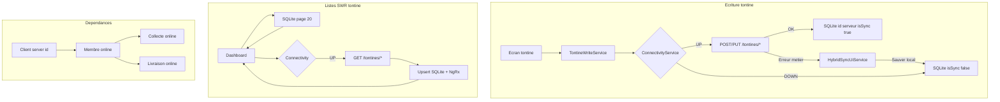

# Plan — Sync hybride phase 2 : Tontine & reliquats restants

## Contexte

La **phase 1** (livré en **2.12.0**) couvre :
- Fondations : `ConnectivityService`, `OnlineFirstWriteCoordinator`, `AutoSyncSchedulerService`
- Écritures online-first : **client**, **encaissement+reliquat**, **distribution**, **commande** (create)
- Listes SWR : **clients**, **encaissements**, **crédits**

Ce plan couvre **tout ce qui reste**, avec la **tontine en lot prioritaire phase 2** (membre, collecte **et livraison** en online-first).

---

## État des lieux — gaps restants

| Domaine | Statut actuel | Priorité |
|---------|---------------|----------|
| Tontine membre / collecte / livraison (write) | ✅ online-first 2.13.0 | — |
| Listes tontine (dashboard, rapport) | ✅ SWR 2.13.1 | — |
| Init tontine (SyncOrchestrator) | ✅ safe init 2.13.2 | — |
| UX fallback distribution / commande | ✅ 2.12.1 | — |
| Listes localités | ✅ SWR 2.12.1 | — |
| Listes commandes | SQLite only (pas de GET API) | **P2** |
| Localité create | ✅ online-first 2.14.0 | — |
| Client update (info, GPS, photos) | ✅ online-first 2.14.0 | — |
| Compte update | ✅ online-first 2.14.0 | — |
| Photos profil / CNI upload | ✅ best-effort + batch fallback 2.14.0 | — |
| Tests scheduler auto-sync | ✅ 2.12.1 | — |

---

## Architecture cible — Tontine



**Chaîne upload** (réutiliser, ne pas dupliquer) :
`Client → TontineMember → TontineCollection → TontineDelivery`

Fichiers sync : `tontine-member-sync.service.ts`, `tontine-collection-sync.service.ts`, `tontine-delivery-sync.service.ts`

**Pull** : `SyncOrchestratorService` + `SequentialSyncManagerService` (`GET /tontines/members`, `/collections`, `/stock`)

---

## Phase 2A — Compléter lacunes phase 1 (~1 sprint)

### 2A.1 — UX fallback distribution & commande
- `forceOffline?: boolean` sur `distribution.actions.ts`
- `HybridSyncUiService` dans `distribution.effects.ts` (comme client/recovery)
- Commande : handler dans `new-order.page.ts` ou effect NgRx avec `forceOffline` (déjà dans `order.service.ts`)

### 2A.2 — Tests fondations
- `auto-sync-scheduler.service.spec.ts` : pause/resume, skip si sync active, hybridSyncEnabled, intervalle
- `online-list-refresh.service.spec.ts`

### 2A.3 — SWR localités
- `refreshLocalitiesPage()` dans `OnlineListRefreshService`
- Brancher `locality.effects.ts`
- **Commandes** : pas de GET API → rester cache local (limitation documentée)

---

## Phase 2B — Tontine écritures online-first (~2 sprints)

Ordre : **Membre → Collecte → Livraison** (dépendances)

### 2B.1 — Méthodes API-only sur sync services
- `TontineMemberSyncService.postCreateMember()` / `postUpdateMember()`
- `TontineCollectionSyncService.postCreateCollection()`
- `TontineDeliverySyncService.postCreateDelivery()`

### 2B.2 — Nouveau `TontineWriteService`
Centraliser les writes aujourd’hui dans les pages :

| Page | Méthode |
|------|---------|
| `member-registration.page.ts` | `registerMember()` / `updateMember()` |
| `collection-recording.page.ts` | `recordCollection()` |
| `delivery-creation.page.ts` | `createDelivery()` |

Pattern : `OnlineFirstWriteCoordinator` + `HybridSyncUiService` fallback

### 2B.3 — Règles métier

**Membre**
- Prérequis : client avec **server id** (`id_mappings`) ; sinon message « synchronisez le client »
- Conserver `updateScope`, consentement journalier, `FinancialWriteGuardService`

**Collecte**
- Totaux membre mis à jour après succès online
- `AmountConfirmationService` conservé

**Livraison**
- API puis décrément stock local + `deliveryStatus` en transaction SQLite
- Réconcilier `tontine_stocks` si réponse serveur différente

**Stock catalogue** (`tontine_stocks`) : download-only, pas d’upload 2B  
**Stock request/return** (`stock-api.service.ts`) : reste online-only

### 2B.4 — NgRx
- Effects pour `addTontineMember` (action existante, non câblée)
- Post-write : `loadTontineSession`, refresh page courante, KPI tontine

---

## Phase 2C — Tontine listes SWR (~1 sprint)

Étendre `OnlineListRefreshService` :

| Méthode | API | Effects |
|---------|-----|---------|
| `refreshTontineMembersPage()` | `GET /tontines/members?page&size` | `loadFirstPage/NextPageTontineMembers$` |
| `refreshTontineCollectionsPage()` | `GET /tontines/collections?page&size` | collections + rapport journalier |
| `refreshTontineStocksPage()` | `GET /tontines/stock` | delivery-creation picker |
| Deliveries | Via refresh membres (embarquées) ou endpoint dédié | `loadFirstPageTontineDeliveries$` |

Pattern SWR (identique clients) :
1. Page locale immédiate
2. Refresh API si online
3. Re-dispatch success

**Perf** : page 20, ne pas écraser les entrées `isSync=false`, annuler refresh si page/filtre changé

---

## Phase 2D — Init tontine safe (~0.5 sprint)

Avant `forceCleanup` dans `SyncOrchestrator` :
- Si unsynced tontine local > 0 et backend UP → **skip cleanup**, log, init incrémentale
- Si offline → init locale only

Fichiers : `tontine.service.ts`, `sync-orchestrator.service.ts`, `data-cleaner.service.ts`

---

## Phase 3 — Écritures secondaires (~2 sprints)

### 3.1 Localité create online-first
- `LocalitySyncService.postCreateLocality()` + coordinator dans `locality.service.ts` / effects

### 3.2 Updates client / compte
- `updateClient`, `updateClientLocation`, `updateClientBalance` via API quand online
- Réutiliser PATCH/PUT existants dans `client-sync.service.ts`, `account-sync.service.ts`

### 3.3 Photos (approche retenue : best-effort)
- Garder queue batch comme fallback
- Déclencher upload photo **non bloquant** après save client online réussi si photos présentes

---

## Phase 4 — Durcissement & release

- Tests : membre→collecte→livraison online (mock HTTP) ; offline→sync auto
- Logs métriques (% online, durée)
- Version **2.13.0** + CHANGELOG

---

## Ordre d’implémentation

```
2A → 2B.1 API methods → 2B.2 TontineWriteService → 2C SWR → 2D init → 3 secondaires → 4 release
```

Estimation : **4–5 sprints**

---

## Critères d’acceptation tontine

- Membre/collecte/livraison online → serveur + local `isSync=true`
- Client non sync → message explicite, pas de création online silencieuse
- Offline → file `isSync=false`, sync manuelle/auto inchangée
- Dashboard : local immédiat puis refresh serveur
- Init : ne supprime pas les tontines locales non syncées
- Ping ≤ 1 / 120s ; SyncMaster reste filet de sécurité
