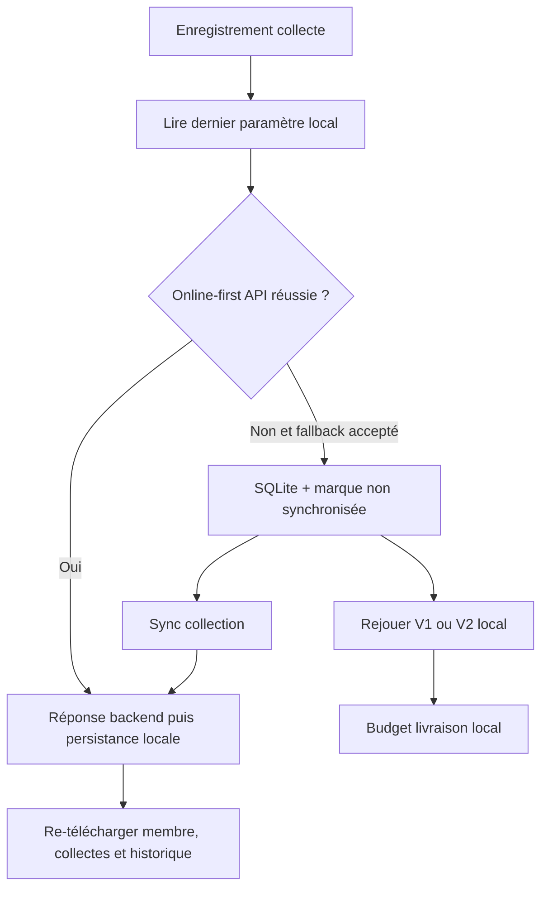

# Tontine mobile V2 hybride

## État actuel et impact

Le mobile synchronise déjà tous les paramètres vers SQLite (`parameters`), mais [`TontineCalculationService`](mobile/src/app/core/services/tontine-calculation.service.ts) ne lit que `USE_MEMBER_REGISTRATION_DATE_FOR_SHARE` et calcule systématiquement V1.

Le flux de collecte est online-first : [`TontineWriteService`](mobile/src/app/core/services/tontine-write.service.ts) tente `POST /api/v1/tontines/collections`, puis l’écran propose explicitement la sauvegarde offline pour une erreur métier. Les collectes offline sont ensuite envoyées par [`TontineCollectionSyncService`](mobile/src/app/core/services/sync/tontine-collection-sync.service.ts).

Décision retenue : appliquer **le dernier `TONTINE_SOCIETY_SHARE_VERSION` enregistré localement**, même s’il est périmé. Le backend recalcule et reste la source de vérité à la prochaine synchronisation.

## Données locales à compléter

Étendre le modèle `TontineCollection` et la table SQLite `tontine_collections` dans [`DatabaseService`](mobile/src/app/core/services/database.service.ts) :

- `societyShareAmount` : part prélevée localement, pour affichage/rejeu.
- `contributionMonth` : mois V2 d’affectation (`YYYY-MM-01`).
- `advanceToNextMonth` : flag V2 persistant.

Créer une migration SQLite additive dans [`migration.service.ts`](mobile/src/app/core/services/migration.service.ts) (pas seulement le schéma initial de [`DatabaseService`](mobile/src/app/core/services/database.service.ts)). Backfill des anciennes lignes : `contributionMonth = date_trunc mois de collectionDate`, `advanceToNextMonth = 0`, `societyShareAmount = 0`. Adapter [`TontineCollectionRepository`](mobile/src/app/core/repositories/tontine-collection.repository.ts) pour lire/écrire ces champs.

Mettre à jour les payloads dans [`sync.model.ts`](mobile/src/app/models/sync.model.ts) et [`TontineCollectionSyncService`](mobile/src/app/core/services/sync/tontine-collection-sync.service.ts) : transmettre `collectionDate`, `advanceToNextMonth` (et `catchupDailyStake` si un rattrapage mobile existe). Aujourd’hui, le payload omet même `collectionDate`. Consommer le résultat d’allocation serveur (`societyShareAmount`, `contributionMonth`) après POST.

Étendre aussi les mappers descendants : [`sequential-sync-manager.service.ts`](mobile/src/app/core/services/sync/sequential-sync-manager.service.ts) et [`tontine.service.ts`](mobile/src/app/core/services/tontine.service.ts) (`fetchAndSaveMemberCollections`) pour réhydrater les champs V2. Sans cela, un pull écraserait les nouvelles colonnes.

Le membre mobile n’expose pas `societyShare`, `availableContribution`, `validatedMonths`, `currentMonthDays` : les ajouter au modèle et à la table `tontine_members` pour persister le résultat serveur après sync.

## Calcul V1/V2 local

Refondre [`TontineCalculationService`](mobile/src/app/core/services/tontine-calculation.service.ts) en moteur rejouable :

- Ajouter `ParameterService.getSocietyShareVersion()` : lecture typée `V1|V2`, défaut `V1` si absent/invalide.
- Corriger `initializeParameters()` : le `tap(async ...)` n’attend pas `saveAll` ; enchaîner RxJS pour que SQLite soit écrit avant de signaler la fin. Ajouter le chargement des paramètres dans `initializeAllData()` (aujourd’hui omis hors `initial-loading`).
- Lire `TONTINE_SOCIETY_SHARE_VERSION` via cette API typée.
- Accepter les collectes détaillées, plutôt que seulement `totalCollected`, et les rejouer chronologiquement par `collectionDate`, puis id comme tie-breaker.
- Garder V1 identique au backend : mois calendaires entamés, date d’inscription selon le paramètre existant, plafond 10.
- Ajouter V2 : ouvrir une part société uniquement pour chaque mois de collecte distinct ; rattrapage = mois de `collectionDate`; mois sans collecte = aucune part; déficit du mois comblé par les collectes suivantes du même mois.
- Pour V2, calculer capital, part société, mois validés et jours du dernier mois actif. Sans `advanceToNextMonth`, accepter `currentMonthDays > 31`; avec flag, basculer l’excédent au mois suivant selon les mêmes règles backend.

## Réconciliation hybride

- **Chemin online** : enrichir les réponses backend/DTO mobile pour ramener `societyShare`, `availableContribution`, `validatedMonths`, `currentMonthDays`, ainsi que `societyShareAmount` par collecte. Persister ces valeurs serveur au lieu de seulement changer `isSync`/id.
- **Chemin offline** : après sauvegarde SQLite, rejouer les collectes locales et synchronisées du membre pour mettre à jour le statut dérivé local. Le reçu peut indiquer « estimation hors-ligne » si une collecte non synchronisée intervient dans le calcul.
- **Après sync** : dès qu’une collecte est acceptée, rafraîchir le membre, ses collectes et son historique de mises depuis l’API avant le prochain écran livraison. Si le backend refuse la collecte (session en migration, date invalide, flag invalide), conserver l’erreur dans la file de sync et afficher une action explicite (corriger/supprimer), sans créer de second envoi.
- Ne pas écraser une collecte locale non synchronisée par un pull descendant : fusion par mapping localId → serverId/référence (`reference` UUID, déjà idempotente côté backend), puis rejeu.
- Conserver la file implicite `isLocal/isSync` (pas de nouvelle table d’opérations dans cette itération). Après POST réussi, persister SQLite immédiatement ; en cas de crash entre HTTP et SQLite, le retry UUID/référence reprend la collecte existante.
- Si le backend refuse une collecte différée, l’erreur reste dans `SyncErrorService`. Étendre le retry manuel aux `tontine-collection` (aujourd’hui non couvert), avec action corriger/supprimer.

## Écrans et règles métier

- [`collection-recording.page.ts`](mobile/src/app/features/tontine/pages/collection-recording/collection-recording.page.ts) : inclure les nouveaux champs dans l’entité créée ; garder l’option V2 `advanceToNextMonth` hors écran si elle reste hors périmètre UI, avec valeur `false` explicite.
- Si le rattrapage est ajouté au mobile : le formulaire doit capturer `collectionDate` et envoyer la même date à l’API ; le calcul local utilise ce mois. Ne pas présenter de rattrapage mobile avant cette complétude.
- [`delivery-creation.page.ts`](mobile/src/app/features/tontine/pages/delivery-creation/delivery-creation.page.ts) : passer la liste des collectes au calculateur V1/V2 ; afficher la version appliquée et l’état « estimé offline » si des données non synchronisées existent. Continuer à réserver le budget serveur après synchronisation. Si V2 est actif et qu’une collecte n’a pas encore `contributionMonth` (données pré-migration incomplètes), ne pas présenter le budget comme exact.

## Tests

- Tests unitaires `TontineCalculationService` : non-régression V1 ; V2 mars/mai avec février-avril non cotisés ; rattrapage; déficit partiel; >31 jours sans flag; `advanceToNextMonth`.
- Tests repository SQLite : migration des anciennes données, lecture/écriture de `contributionMonth`, `advanceToNextMonth`, `societyShareAmount`.
- Tests sync : payload contenant date/flag, mapping d’id, réconciliation d’un membre après succès, et conservation d’une collecte locale après erreur business.
- E2E Ionic : online-first avec réponse serveur ; fallback offline ; reconnect/sync ; livraison bloquée ou explicitement marquée estimation lorsque le calcul dépend de données non synchronisées.
- Cas hybrid supplémentaires : collecte offline avant sync du membre parent ; timeout après POST (reprise par UUID) ; bascule V1→V2 entre saisie offline et sync (le serveur recalcule ; le mobile réhydrate après succès).

## Livraison

- Mise à jour de `docs/CHANGELOG.md`.
- Version mobile : incrément **mineur** dans `mobile/package.json`, `environment.ts` et `environment.prod.ts`, car la logique financière offline est une évolution fonctionnelle large.
