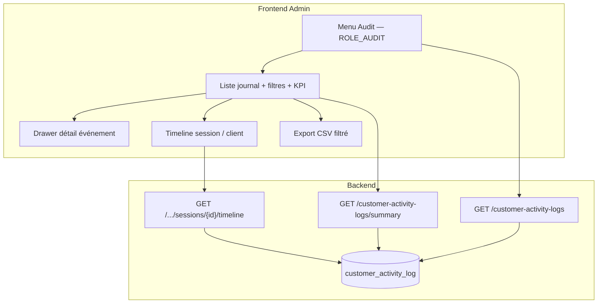

---
todos:
  - id: be-role-audit
    status: completed
    content: "Backend : ROLE_AUDIT (UserPermissionConstant + application.yml SUPER_ADMIN/ADMIN + Flyway uperm/upro_perms/uacc_perms) + @PreAuthorize sur CustomerActivityLogAdminController"
  - id: be-search-enrich
    status: completed
    content: "Backend : enrichir GET search (eventType, category, source, platform, appVersion, httpStatus, q message) + indexes + PageableDefault sort occurredAt,desc"
  - id: be-insights-api
    status: completed
    content: "Backend : GET /summary (KPIs période) + GET /sessions/{sessionId}/timeline + optionnel GET /facets (comptages filtres)"
  - id: fe-module
    status: completed
    content: "Frontend : module lazy customer-activity-audit (liste + drawer détail + KPIs + filtres) + route + menu sidebar ROLE_AUDIT"
  - id: fe-ops-ux
    status: completed
    content: "Frontend : timeline session, deep-link client, chips outcome, export CSV filtré, presets (erreurs 24h, auth échecs, etc.)"
  - id: docs-release
    status: completed
    content: "Guide manager + index RAG + bump Frontend/Backend + CHANGELOG"
name: Module Audit frontend — journal espace client
overview: "Ajouter un module Admin « Audit » (Journal espace client) pour consulter, rechercher et analyser les actions utilisateurs de customer-space stockées dans customer_activity_log. Accès strict via ROLE_AUDIT (SUPER_ADMIN et ADMIN par défaut). Enrichir l’API admin (filtres ops + insights) pour une vraie valeur d’exploitation au-delà d’une simple liste paginée."
isProject: false
---

# Module Audit — Journal espace client (frontend admin)

## Contexte

Le journal d’activité customer-space est déjà en production côté données :

- Table `customer_activity_log` ([V006](backend/src/main/resources/db/migration/V006__customer_activity_log.sql))
- Ingest client `POST /api/customer/auth/activity-logs` + événements serveur auth
- Lecture admin minimale : `GET /api/v1/customer-activity-logs` ([CustomerActivityLogAdminController](backend/src/main/java/com/optimize/elykia/core/controller/customer/CustomerActivityLogAdminController.java)) — **aucun `@PreAuthorize`**, filtres limités (`clientId`, `phone`, `deviceId`, `sessionId`, `from`, `to`)
- **Aucun écran frontend** ; à ne pas confondre avec Annulation ventes, stats Elykia IA, ou historique inventaires

Objectif : livrer un module d’exploitation pour support, fraude légère, QA et suivi d’adoption — pas seulement un dump de logs.

## Valeur d’exploitation (pourquoi ce module)

| Besoin ops | Insight / capacité |
|------------|-------------------|
| « Pourquoi ce client n’arrive pas à se connecter ? » | Timeline AUTH client+serveur sur une session / un téléphone |
| « Y a-t-il une vague d’erreurs app ? » | KPI erreurs 24h, top `eventType` ERROR, top chemins HTTP |
| « Quel parcours avant un échec paiement / commande ? » | Filtrer BUSINESS + ERROR, enchaîner via `sessionId` |
| « Quelle version APK casse ? » | Filtre `appVersion` × `platform`, KPI erreurs par version |
| « Multi-appareils / session douteuse ? » | Regrouper par `deviceId` / `sessionId` pour un même `clientId` |
| « Support hotline » | Recherche téléphone + plage horaire + copie reference `eventId` |
| « Adoption espace client » | KPI LOGIN_SUCCESS, SCREEN_VIEW, ORDER_SUBMITTED sur la période |

## Architecture cible



## Décisions produit

1. **Nom UI** : **Audit** (menu) / titre page **Journal espace client** — évite la confusion avec annulation / IA.
2. **Permission unique** : `ROLE_AUDIT` — pas de sous-permissions lecture/export en V1 (export inclus dans le même rôle).
3. **Attribution par défaut** : profils `SUPER_ADMIN` et `ADMIN` uniquement. Pas de GESTIONNAIRE / commercial.
4. **Périmètre données V1** : uniquement `customer_activity_log` (espace client). Pas de fusion avec `ai_query_log` ni audit staff interne.
5. **Phone** : afficher le numéro tel que stocké en base (support) ; ne pas ré-exposer de secrets (PIN/OTP déjà sanitizés à l’ingest).
6. **Corrélation Crashlytics** : V1 = `deviceId` + `sessionId` + fenêtre temporelle (pas de `crashId` persisté aujourd’hui). Option V1.1 : persister `X-Request-Id` / crash id.

---

## 1. Permissions — `ROLE_AUDIT`

### Backend

| Étape | Fichier / action |
|-------|------------------|
| Constante | `UserPermissionConstant.AUDIT = "ROLE_AUDIT"` |
| YAML greenfield | Ajouter `ROLE_AUDIT` à `security.config.permissions` et à `profil-permissions.SUPER_ADMIN` + `ADMIN` ([application.yml](backend/src/main/resources/application.yml)) |
| Flyway prod | `V007__role_audit.sql` : `INSERT` `uperm` + `upro_perms` (SUPER_ADMIN, ADMIN) + `uacc_perms` pour comptes déjà rattachés à ces profils (pattern [V002](backend/src/main/resources/db/migration/V002__client_activation_and_initial_deposit.sql)) |
| API | `@PreAuthorize("hasAuthority('ROLE_AUDIT')")` sur **tous** les endpoints admin activity-log |

### Frontend

- Constante dédiée : `frontend/src/app/shared/constants/audit-permission.constant.ts` (`AuditPermissions.Consult = 'ROLE_AUDIT'`)
- Route lazy + `NgxPermissionsGuard` `only: ['ROLE_AUDIT']`, `redirectTo: '/home'`
- Sidebar `*ngxPermissionsOnly="['ROLE_AUDIT']"` — item top-level près de **Inscriptions clients** / **Sécurité**
- Icône : `mat-icon` type `fact_check` ou `history_edu` (pas d’emoji)

---

## 2. Backend — enrichir l’API admin

### 2.1 `GET /api/v1/customer-activity-logs` (existant, à étendre)

Filtres actuels à conserver + ajouter :

| Param | Type | Comportement |
|-------|------|--------------|
| `eventType` | string ou multi (`eventType=A&eventType=B`) | exact / IN |
| `category` | `AUTH` \| `NAVIGATION` \| `BUSINESS` \| `ERROR` | exact |
| `source` | `CLIENT_APP` \| `SERVER` | exact |
| `platform` | android / ios / web | exact |
| `appVersion` | string | exact ou préfixe |
| `httpStatus` | int (ou `httpStatusFrom`/`To`) | égalité ou plage |
| `q` | string | `ILIKE` sur `message` (+ optionnel `screen`) |
| `outcome` | `SUCCESS` \| `FAILURE` \| `INFO` (dérivé) | mapping côté service sur suffixes `_SUCCESS` / `_FAILED` / types ERROR / reste |

Pagination : `@PageableDefault(size = 50, sort = "occurredAt", direction = DESC)`.

Indexes Flyway complémentaires (même migration ou V008) :

- `(event_type, occurred_at DESC)`
- `(category, occurred_at DESC)`
- `(source, occurred_at DESC)`
- éventuellement `(platform, app_version, occurred_at DESC)` si les KPI version sont critiques

### 2.2 `GET /api/v1/customer-activity-logs/summary` (nouveau — insights)

Query : mêmes filtres de période / identité que search (au minimum `from`, `to`, optionnellement `clientId` / `phone` / `platform` / `appVersion`).

Réponse proposée :

```json
{
  "from": "...", "to": "...",
  "totalEvents": 1234,
  "byCategory": { "AUTH": 400, "ERROR": 80, "...": "..." },
  "bySource": { "CLIENT_APP": 1100, "SERVER": 134 },
  "errorCount": 80,
  "authFailureCount": 25,
  "loginSuccessCount": 90,
  "uniqueClients": 40,
  "uniqueDevices": 55,
  "uniqueSessions": 120,
  "topEventTypes": [{ "eventType": "HTTP_ERROR", "count": 30 }],
  "topHttpPaths": [{ "path": "/api/...", "count": 12 }],
  "byPlatform": { "android": 900, "web": 300 },
  "byAppVersion": [{ "appVersion": "0.8.1", "count": 500, "errorCount": 12 }]
}
```

`topHttpPaths` : agrégation depuis `metadata->>'path'` (JSONB) pour `HTTP_ERROR` — best-effort, documenter si null-safe.

### 2.3 `GET /api/v1/customer-activity-logs/sessions/{sessionId}` (nouveau)

Retourne la timeline ordonnée `occurredAt ASC` (cap 500) pour reconstruire un parcours. Params optionnels `from`/`to`.

### 2.4 Hors V1 (backlog)

- Persister `requestId` / `crashId` à l’ingest
- Alertes / webhooks si pic d’erreurs
- Soft-delete / archive avant purge 180j
- Endpoint facets lazy pour peupler les dropdowns

---

## 3. Frontend — module `customer-activity-audit`

### Structure

```
frontend/src/app/customer-activity-audit/
  customer-activity-audit.module.ts
  customer-activity-audit-routing.module.ts
  constants/audit-event-taxonomy.ts   # libellés FR des eventType / category
  services/customer-activity-audit.service.ts
  pages/activity-log-list/
    activity-log-list.component.{ts,html,scss}
  components/
    activity-event-detail-drawer/
    activity-session-timeline/
    activity-outcome-chip/
```

Route : `/audit` (lazy dans [app-routing.module.ts](frontend/src/app/app-routing.module.ts)).

Style : skill [frontend-ui-style](.cursor/skills/frontend-ui-style/SKILL.md) — structure `page-header-card` → `kpi-strip` → `toolbar` → `table-card` + drawer (réf. [client-registrations-list](frontend/src/app/client-registrations/pages/client-registrations-list/)).

### 3.1 Écran liste (cœur)

**Header** : titre « Journal espace client », sous-titre support/exploitation, bouton refresh.

**KPI strip** (période des filtres, défaut **24 dernières heures**) :

1. Total événements  
2. Erreurs (`ERROR` + failures)  
3. Échecs auth (`LOGIN_FAILED`, `OTP_FAILED`, …)  
4. Connexions OK (`LOGIN_SUCCESS`, dédoublonnées client+serveur via compteur source ou unique sessions)  
5. Clients distincts  

**Toolbar filtres** :

- Plage dates/heures (`from` / `to`) + presets : *Aujourd’hui*, *24h*, *7j*, *30j*
- Recherche libre `q` (message)
- Téléphone, `clientId`, `deviceId`, `sessionId`
- Select catégorie, source, plateforme, version app
- Multi-select type d’événement (groupé par catégorie, libellés FR)
- Outcome (Tous / Succès / Échec / Info)
- Boutons : Appliquer, Effacer, Export CSV

**Tableau** colonnes :

| Colonne | Contenu |
|---------|---------|
| Horodatage | `occurredAt` (DM Mono) |
| Source | chip CLIENT / SERVEUR |
| Catégorie | badge couleur |
| Type | libellé FR + code technique en tooltip |
| Client | `clientId` lien vers `/client/:id` si présent |
| Téléphone | |
| Plateforme / Version | |
| Écran / Message | tronqué |
| HTTP | statut si présent |
| Actions | Voir détail |

Lignes ERROR / FAILURE : fond / bordure nuance danger (accessible, contraste OK).

Pagination Material `mat-paginator` alignée API.

### 3.2 Drawer détail

- Tous les champs DTO + `metadata` JSON pretty (copie presse-papiers)
- Actions rapides : « Voir la session », « Filtrer ce device », « Ouvrir la fiche client »
- `eventId` copiable pour ticket support

### 3.3 Timeline session (panneau ou route secondaire `/audit/sessions/:sessionId`)

- Fil vertical chronologique client+serveur mélangés
- Highlight des ERROR
- Utile pour rejouer un parcours hotline

### 3.4 Presets insights (raccourcis toolbar)

Boutons / chips qui pré-remplissent les filtres :

1. **Erreurs 24h** — category ERROR, last 24h  
2. **Auth en échec** — eventTypes LOGIN_FAILED, OTP_FAILED, OTP_SEND_FAILED  
3. **Paiements / commandes** — BUSINESS types MM_*, ORDER_*  
4. **Android dernière version** — platform + appVersion (saisie ou dernière vue dans summary)

### 3.5 Export CSV

- Export de la **page courante** ou jusqu’à N max (ex. 5 000) avec les filtres actifs
- Colonnes alignées tableau + `eventId`, `sessionId`, `deviceId`
- Endpoint dédié optionnel `GET .../export` **ou** génération côté front depuis pages successives — préférer **endpoint backend stream/CSV** si volume > quelques pages (V1 : front multi-page avec plafond + toast si tronqué)

---

## 4. Taxonomie UI (libellés)

Fichier front miroir de [event-types.ts](customer-space/src/app/core/telemetry/event-types.ts) + types serveur seuls (`CHECK_PHONE`, `OTP_SEND_FAILED`, `REGISTER`) :

- Libellé métier FR (ex. « Échec de connexion », « Erreur HTTP »)
- Groupement par catégorie pour le multi-select
- Toujours afficher `source` pour distinguer doublons LOGIN_SUCCESS client vs serveur

---

## 5. Documentation & livraison

| Livrable | Action |
|----------|--------|
| Guide | Nouvelle page `user-guide/docs/manager/customer_activity_audit.md` (parcours métier, pas de jargon ROLE_*) + lien dans [manager/index.md](user-guide/docs/manager/index.md) + `mkdocs.yml` |
| RAG | `python user-guide/generate_rag_index.py` |
| Versions | Frontend **mineur** (nouveau module) ; Backend **mineur** (API + permission) |
| CHANGELOG | skill keep-changelog |
| Tests | Backend : search filters + PreAuthorize / summary ; Frontend : service + component smoke (filtres → query params) |

---

## 6. Phases de livraison

### Phase A — Fondations (MVP exploitable)

1. `ROLE_AUDIT` + Flyway + YAML + `@PreAuthorize`
2. Enrichissement search (filtres ops + indexes + sort défaut)
3. Module frontend liste + filtres + drawer + menu
4. Guide + RAG + changelog

### Phase B — Insights (même PR si charge OK, sinon PR suivante)

1. Endpoint `/summary` + KPI strip
2. Timeline session
3. Presets + export CSV plafonné

### Phase C — Backlog

- Persistance `requestId` / lien Crashlytics
- Facets / alertes
- Événements serveur hors auth (paiements confirmés côté API métier)

---

## 7. Critères d’acceptation

1. Un utilisateur **sans** `ROLE_AUDIT` ne voit pas le menu et reçoit 403 / redirect sur `/audit` et sur l’API.
2. SUPER_ADMIN et ADMIN reçoivent `ROLE_AUDIT` après migration (comptes existants inclus).
3. On peut retrouver le parcours d’un téléphone sur 24h (filtres phone + dates) et ouvrir le détail d’un événement.
4. On peut isoler les ERROR / échecs auth et voir les KPI de la période filtrée.
5. Depuis un événement, on peut basculer sur la timeline `sessionId` et ouvrir la fiche client si `clientId` présent.
6. Aucune donnée sensible (PIN/OTP) visible dans metadata (déjà sanitizé à l’ingest — non-régression).

## Hors périmètre

- Refonte Crashlytics console / Analytics dashboards
- Audit des actions **staff** (admin web / mobile commercial)
- Modification / suppression manuelle d’événements depuis l’UI
- Changer la rétention 180j

## Risques

| Risque | Mitigation |
|--------|------------|
| Volume table + filtres sans index | Indexes dédiés + défaut 24h + size 50 |
| Doublons client/serveur sur AUTH | Chip source + libellés clairs |
| Export trop lourd | Plafond + préférer filtres serrés |
| Confusion menu « Audit » vs annulation | Libellé « Journal espace client » + placement menu |
