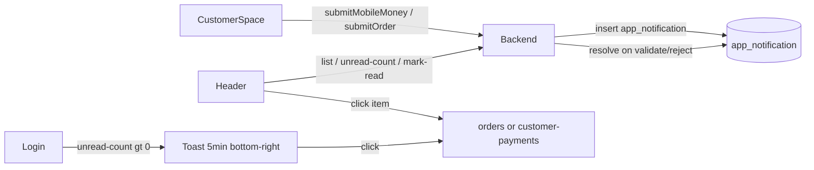

# Spec & plan — Notifications in-app (customer-space)

## Besoin reformulé (spec)

### Objectif

Quand un client crée une **déclaration de paiement Mobile Money** ou une **commande** depuis le customer-space, le backend enregistre une **notification in-app**. Les utilisateurs internes concernés la consultent via une **cloche unique** dans le header admin, et voient au login un **toast bas-droite** s’il reste des opérations à traiter.

### Acteurs & portée

| Profil                         | Voit                                                                                              |
| ------------------------------ | ------------------------------------------------------------------------------------------------- |
| SECRETARY, GESTIONNAIRE, ADMIN | Toutes les notifications                                                                          |
| PROMOTER                       | Uniquement celles dont le client a `collector` **ou** `tontineCollector` = username du commercial |
| Autres profils                 | Rien (pas de cloche, pas de toast)                                                                |

### Types d’événements (v1)

1. `PAYMENT_DECLARATION` — soumission `CustomerMobileMoneySubmission` en `INITIE`
2. `CUSTOMER_ORDER` — `Order` créée en `PENDING` depuis le portail client
3. `TONTINE_CATCHUP` — migration de l’existant ([TontineCatchupNotification](backend/src/main/java/com/optimize/elykia/core/entity/tontine/TontineCatchupNotification.java))

### Comportements UX

- **Cloche unifiée** dans [header.component.html](frontend/src/app/layout/header/header.component.html) (remplace la cloche « Rattrapages » seule) : badge non-lus, liste, marquer lu / tout lire, clic → deep-link + mark read.
- **Toast login** (profils concernés uniquement) : si `unreadCount > 0` après authentification, toast bas-droite « Vous avez des opérations en attente de validation », durée **5 min**, **persiste à la navigation**, disparition au clic (→ ouvre / navigue vers la file d’attente) ou au timeout. Une fois par session de login (`sessionStorage`).
- **Deep-links** :
  - `CUSTOMER_ORDER` → `/orders/details/:id` (ou `/orders` onglet PENDING)
  - `PAYMENT_DECLARATION` → `/customer-payments` (nouvelle page, filtre sur la soumission)
  - `TONTINE_CATCHUP` → `/report/daily?collector=…&startDate=…&endDate=…` (comportement actuel)

### Hors scope v1

- Push mobile / email / Notification Hub
- WebSocket temps réel (polling 60 s comme aujourd’hui)
- Validation métier complète « encaissement crédit » au-delà du passage `INITIE → VALIDE/REJETE` + écriture timeline si le flux existant le permet clairement

---

## Modèle de données

Nouvelle migration `V100__app_notification.sql` :

`**app_notification**`

- `id`, audit `BaseEntity`, `visibility`
- `type` (`PAYMENT_DECLARATION` | `CUSTOMER_ORDER` | `TONTINE_CATCHUP`)
- `entity_id` (Long) — id soumission / order / collection
- `entity_reference` (nullable, ex. `CMD-12`, ref collecte)
- `title`, `message` (textes affichables)
- `client_id`, `client_name`
- `target_collector` — username commercial principal (pour index / filtre rapide ; filtre PROMOTER = `target_collector = me` **OR** match client.tontineCollector stocké aussi si distinct)
- `tontine_collector` (nullable) — pour appliquer la règle OR demandée sans jointure coûteuse
- `operation_date`, `amount` (nullable)
- `link_path` + `link_query` (JSON ou query string) — deep-link stable côté API
- `resolved_at` (nullable) — quand l’opération n’est plus en attente (validée/rejetée/annulée) ; soft-hide de la file « à traiter » tout en gardant l’historique lu

`**app_notification_read**`

- PK `(notification_id, username)`, `read_at` — même pattern que [tontine_catchup_notification_read](backend/src/main/resources/db/migration/V97__tontine_catchup_kpi_and_notifications.sql)

**Migration données** : copier les lignes `tontine_catchup_notification` (+ reads) vers `app_notification` / `app_notification_read`, puis déprécier les endpoints catchup (proxy ou suppression après bascule frontend).

---

## Backend

### Création / résolution

| Événement            | Hook                                                                                                                                                                 | Action                                                                                                                                               |
| -------------------- | -------------------------------------------------------------------------------------------------------------------------------------------------------------------- | ---------------------------------------------------------------------------------------------------------------------------------------------------- |
| MM submit            | fin de `CustomerPortalService.submitMobileMoney`                                                                                                                     | create `PAYMENT_DECLARATION` ; `target_collector` = `credit.collector` fallback `client.collector` ; `tontine_collector` = `client.tontineCollector` |
| Order submit         | `OrderCreatedEvent` dans [DailyReportEventListener](backend/src/main/java/com/optimize/elykia/core/listener/DailyReportEventListener.java) (en plus du daily report) | create `CUSTOMER_ORDER` ; collectors depuis le client de la commande                                                                                 |
| Catchup              | remplacer `tontineCatchupNotificationService.createFromCatchupEvent`                                                                                                 | create `TONTINE_CATCHUP`                                                                                                                             |
| MM validé/rejeté     | nouveau service admin                                                                                                                                                | `resolved_at = now()`, status soumission `VALIDE`/`REJETE`                                                                                           |
| Order quitte PENDING | `OrderService.updateOrderStatus`                                                                                                                                     | resolve notif liée                                                                                                                                   |
| Catchup annulé       | listener cancel existant                                                                                                                                             | soft-delete / resolve                                                                                                                                |

### API unifiée — `/api/v1/app-notifications`

- `GET /` — liste (groupée par date ou plate), filtrée par rôle
- `GET /unread-count` — non lus **et non résolus**
- `POST /{id}/read`, `POST /read-all`
- Filtre PROMOTER : `target_collector = username OR tontine_collector = username`
- Auth profils : SECRETARY | GESTIONNAIRE | ADMIN | PROMOTER

### Validation déclarations MM (nouveau, requis pour 1A)

- Controller admin ex. `/api/v1/customer-mobile-money-submissions`
  - `GET ?status=INITIE` — liste paginée (même filtre rôle que notifs)
  - `POST /{id}/validate` → `VALIDE` + resolve notif (+ si possible, enchaîner la création recovery/`CreditTimeline` selon le flux métier existant le plus proche ; sinon documenter le gap et laisser VALIDE côté portail client)
  - `POST /{id}/reject` → `REJETE` + resolve notif
- Permissions alignées SECRETARY / GESTIONNAIRE / ADMIN ; PROMOTER lecture + actions **uniquement sur son portefeuille**

---

## Frontend admin

### Services

- Remplacer l’usage de [tontine-catchup-notification.service.ts](frontend/src/app/tontine/services/tontine-catchup-notification.service.ts) par `AppNotificationService` (mêmes endpoints unifiés).
- Adapter [header.component.ts](frontend/src/app/layout/header/header.component.ts) : `showNotifications` pour SECRETARY | GESTIONNAIRE | ADMIN | **PROMOTER** ; panneau multi-types (icône/libellé selon `type`) ; deep-link via `link_path`.

### Toast login 5 min

- Déclencher après login réussi (post-navigation layout, pas sur la page login seule) via un service root (ex. `PendingOpsToastService`) branché dans le layout principal.
- `ngx-toastr` : `positionClass: toast-bottom-right`, `timeOut: 300000`, `extendedTimeOut: 0`, `tapToDismiss: true`, `disableTimeOut: false`, `closeButton: true`.
- Condition : profil concerné + `unreadCount > 0` + flag session non déjà affiché.
- Clic toast → `/customer-payments` si des MM pending, sinon `/orders` (ou toujours ouvrir le panneau notifs / route hub `/notifications` si on préfère une seule entrée — **choix retenu : ouvrir le panneau n’est pas fiable hors header ; naviguer vers `/orders` avec query `?pendingToast=1` est fragile**. **Retenu : route hub légère `/pending-ops` ou clic = focus première notif non lue via API ; plus simple : naviguer vers la liste unifiée si on ajoute une page `/notifications`, sinon toast → ouvre `/orders` + message générique. **Décision plan : toast click → `/notifications` page liste (réutilise le même service) pour éviter ambiguïté multi-types.**

### Page validation MM

- Route `/customer-payments` (module + permissions consult/edit alignées commandes ou crédit).
- Table : client, commercial, crédit, échéance, montants, téléphone, référence, date, actions Valider / Rejeter.
- Deep-link depuis notif avec `?id=` pour highlight / scroll.

### Commandes

- Aucune nouvelle page : deep-link existant `/orders` / détail.
- Optionnel v1.1 : filtrer la liste commandes côté API pour PROMOTER (aujourd’hui [OrderService.getAllOrders](backend/src/main/java/com/optimize/elykia/core/service/order/OrderService.java) ne filtre pas) — **inclus dans ce plan** pour cohérence : PROMOTER ne voit / n’agit que sur ses clients (`collector` OR `tontineCollector`).

---

## Tests & critères d’acceptation

- Unité backend : create notif on MM + order ; resolve on status change ; unread-count filtré PROMOTER vs SECRETARY.
- E2E légers : badge header, mark read, toast présent 5 min (assertion timeout configurable en test), redirection clic.
- AC : secrétaire voit toutes notifs ; commercial A ne voit pas client de commercial B ; toast absent si 0 unread ; toast ne disparaît pas au changement de route avant 5 min.

