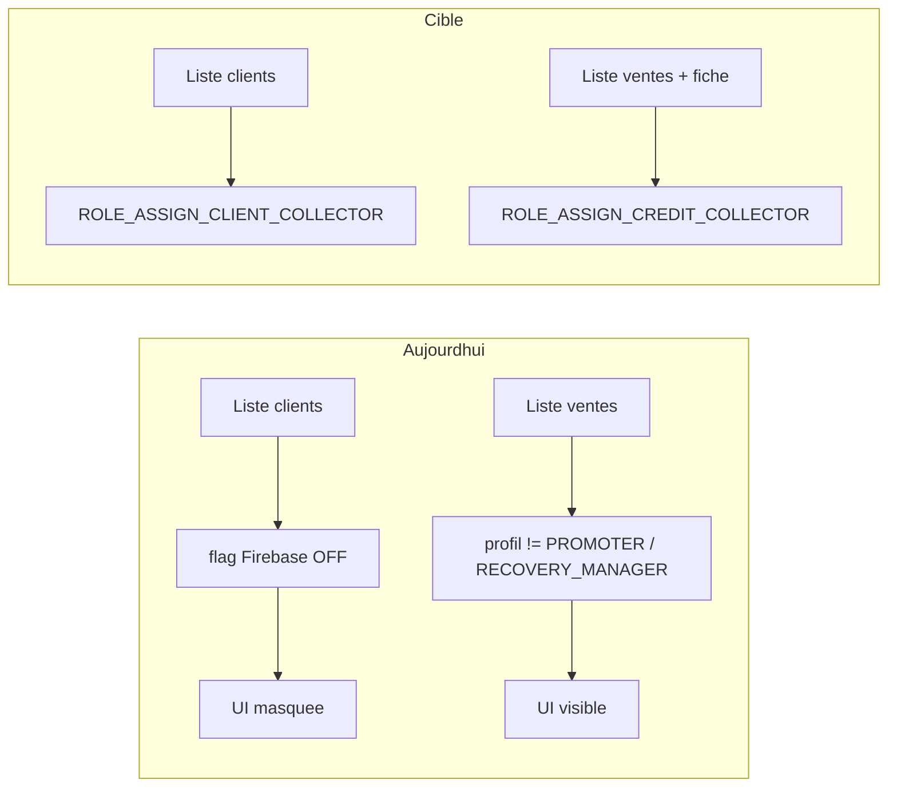
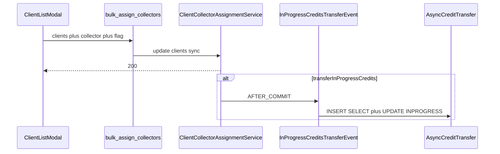

# Permissions changement de commercial

## Constat changelog

Le **changement de commercial en lot sur la liste clients est déjà implémenté** (Frontend 2.10.5 / Backend 1.2.15) : cases à cocher, modal crédit + tontine, rôle `ROLE_ASSIGN_CLIENT_COLLECTOR`.

Il est toutefois **inutilisable par permission seule** : l’UI est aussi derrière le feature flag Firebase `clientBulkAssignCollector`, **désactivé par défaut** dans [feature-flag.service.ts](frontend/src/app/shared/service/feature-flag.service.ts). Sans flag Remote Config à `true`, un utilisateur avec le rôle ne voit rien.

Sur la **liste des ventes**, le bulk existe déjà mais l’accès est **durci par profil** (`!isRecoveryManager && !isPromoter`), pas par permission. Les endpoints `POST /api/v1/credits/{id}/change-collector` et `/bulk-change-collector` n’ont **pas** de `@PreAuthorize`. Impossible aujourd’hui d’accorder (ou retirer) cette action via la fiche utilisateur.

## Rôles

| Permission                                | Périmètre                                                         | Profils par défaut                          |
| ----------------------------------------- | ----------------------------------------------------------------- | ------------------------------------------- |
| `ROLE_ASSIGN_CLIENT_COLLECTOR` (existant) | Liste clients (bulk) + champs commerciaux du formulaire d’édition | SUPER_ADMIN, ADMIN, GESTIONNAIRE, SECRETARY |
| `ROLE_ASSIGN_CREDIT_COLLECTOR` (nouveau)  | Liste ventes (bulk) + bouton « Modifier » fiche crédit            | mêmes profils                               |

**Jamais** attribués par défaut à `PROMOTER` ni `RECOVERY_MANAGER`. Un admin pourra les ajouter manuellement sur un compte (JWT = permissions **compte** `uacc_perms`, comme les KPI).

Lazy-loading : `credit` et `client` sont déjà en `loadChildren`. Pas de migration routing.

## Backend

- Constante `ASSIGN_CREDIT_COLLECTOR` dans [UserPermissionConstant.java](backend/src/main/java/com/optimize/elykia/core/util/UserPermissionConstant.java).
- Déclaration + mapping profils dans [application.yml](backend/src/main/resources/application.yml) (`security.config.permissions` et `profil-permissions`).
- Flyway `V94__assign_credit_collector_permission.sql` (même schéma que [V93](backend/src/main/resources/db/migration/V93__kpi_financier_permissions.sql)) :
  - `INSERT` `uperm`
  - `INSERT` `upro_perms` pour SUPER_ADMIN / ADMIN / GESTIONNAIRE / SECRETARY
  - `INSERT` `uacc_perms` pour les comptes existants de ces profils — **obligatoire** sinon secrétaires et gestionnaires **perdent** le bulk ventes au déploiement (aujourd’hui visible par exclusion de profil).
- `@PreAuthorize("hasAuthority('ROLE_ASSIGN_CREDIT_COLLECTOR')")` sur les deux endpoints de [CreditController](backend/src/main/java/com/optimize/elykia/core/controller/sale/CreditController.java).
- `@PreAuthorize("hasAuthority('ROLE_ASSIGN_CLIENT_COLLECTOR')")` sur [ClientCollectorAssignmentController](backend/src/main/java/com/optimize/elykia/core/controller/client/ClientCollectorAssignmentController.java) (le check manuel dans [ClientCollectorAssignmentService](backend/src/main/java/com/optimize/elykia/core/service/client/ClientCollectorAssignmentService.java) peut rester en filet).

## Historisation formulaire client (même flux que le bulk)

Aujourd’hui [ClientService.updateClient](backend-lib/elykia-client/src/main/java/com/optimize/elykia/client/service/ClientService.java) charge l’ancien client, mappe le DTO (dont `collector` / `tontineCollector`) et persiste, mais **ne publie que** `ClientPhoneUpdatedEvent`. Le bulk, lui, snapshot, diff, puis `ClientCollectorsChangedEvent` → [ClientCollectorHistoryListener](backend/src/main/java/com/optimize/elykia/core/listener/ClientCollectorHistoryListener.java) AFTER_COMMIT → [ClientCollectorHistoryService](backend/src/main/java/com/optimize/elykia/core/service/client/ClientCollectorHistoryService.java) async.

Dans `updateClient` (appelé par `PUT /api/v1/clients/{id}` depuis [client-add](frontend/src/app/client/client-add/client-add.component.ts)) :

1. Avant mapping, capturer `oldCollector` et `oldTontineCollector`.
2. Après `update`, comparer avec les nouvelles valeurs (`Objects.equals`).
3. Si au moins un a changé : construire 1–2 `ClientCollectorChangeRecord` (`CREDIT` / `TONTINE`, comme le bulk) et publier `ClientCollectorsChangedEvent`.
4. `performedBy` : username du `SecurityContext` (le lib n’a pas `UserService` ; même garde `StringUtils.hasText(performedBy)` que le bulk). Extraire un helper privé `publishCollectorChanges(...)` réutilisé par `bulkAssignCollectors`.
5. Même traitement dans `assignCollector` (`PATCH assign-collector`) pour ne pas laisser un second chemin sans historique.
6. `agencyCollector` : hors scope (absent de `ClientCollectorType` et du bulk).
7. Création (`addClient`) : pas d’historique (pas de commercial « avant »).

Permission : un `PUT` client sans `ROLE_ASSIGN_CLIENT_COLLECTOR` **reste autorisé** (édition fiche). Si `collector` ou `tontineCollector` a réellement changé sans cette autorité → `CustomValidationException` (le JWT ne porte que `uacc_perms`). Les champs inchangés (y compris via `getRawValue()` des contrôles disabled) ne déclenchent ni historique ni rejet.

## Transfert async des ventes INPROGRESS (modal liste clients)

Sur le modal [client-list](frontend/src/app/client/client-list/client-list.component.html) : checkbox **« Transférer automatiquement les ventes du commercial vers le nouveau commercial en charge du client »**, décochée par défaut.

- Visible / active seulement si un **commercial crédit** est choisi (sans crédit, le transfert de ventes n’a pas de cible). Changement tontine seul : case disabled.
- Le `POST /api/v1/clients/bulk-assign-collectors` reste **synchrone et rapide** (affectation client comme aujourd’hui). Le transfert ventes ne bloque pas la réponse.
- DTO [BulkAssignCollectorsDto](backend-lib/elykia-client/src/main/java/com/optimize/elykia/client/dto/BulkAssignCollectorsDto.java) : `boolean transferInProgressCredits`.
- Après succès de l’affectation, [ClientCollectorAssignmentService](backend/src/main/java/com/optimize/elykia/core/service/client/ClientCollectorAssignmentService.java) publie un événement dédié (`InProgressCreditsTransferEvent` : `clientIds`, `newCollector`, `performedBy`) — **pas** dans `elykia-client` (le lib ne connaît pas `Credit`).
- Listener `@TransactionalEventListener(AFTER_COMMIT)` puis service `@Async` (même séparation que l’historique client : ne pas empiler `@Async` sur le listener). Executor dédié dans [AsyncConfig](backend/src/main/java/com/optimize/elykia/core/config/AsyncConfig.java) (pas le pool tontine `core=1`).
- Job **set-based**, sans charger les entités `Credit` :
  1. `INSERT INTO credit_collector_history … SELECT … FROM credit WHERE client_id IN (:ids) AND status = 'INPROGRESS' AND collector <> :newCollector` (même colonnes que [bulkInsertHistoryForCredits](backend/src/main/java/com/optimize/elykia/core/repository/CreditCollectorHistoryRepository.java)).
  2. `UPDATE credit SET collector = :newCollector WHERE client_id IN (:ids) AND status = 'INPROGRESS' AND collector <> :newCollector`.
  3. `UPDATE client SET recovery_collector = :newCollector WHERE id IN (:ids)` (aligné sur `bulkChangeCollector`).
- Découper `clientIds` par lots (ex. 500) pour limiter la clause `IN` et les locks.
- Périmètre : tous les crédits `INPROGRESS` des **clients sélectionnés** vers le nouveau commercial crédit. Hors scope : formulaire d’édition unitaire, crédits SETTLED / CREATED / VALIDATED.
- Toast UI si case cochée : succès client immédiat + mention que le transfert des ventes en cours a été lancé.

## Frontend

**Liste ventes** — [credit-list.component.html](frontend/src/app/credit/credit-list/credit-list.component.html) : remplacer `*ngIf="!isRecoveryManager && !isPromoter"` (bouton bulk, colonnes checkbox desktop/mobile) par `*ngxPermissionsOnly="['ROLE_ASSIGN_CREDIT_COLLECTOR']"` via `ng-container` (éviter le double binding structurel déjà corrigé en 2.10.7). Les autres actions encore gated par profil (Mise, fusion) restent inchangées.

**Fiche crédit** — [credit-details.component.html](frontend/src/app/credit/credit-details/credit-details.component.html) : le bouton « Modifier » agent (`!isRecoveryManager && !isCollector`) passe sur la même permission. Même endpoint unitaire.

**Liste clients** — [client-list.component.html](frontend/src/app/client/client-list/client-list.component.html) + [client-list.component.ts](frontend/src/app/client/client-list/client-list.component.ts) :

- Retirer le gate `bulkAssignCollectorEnabled` / `FeatureFlags.ClientBulkAssignCollector`.
- Garder uniquement `*ngxPermissionsOnly="['ROLE_ASSIGN_CLIENT_COLLECTOR']"`.
- Laisser la clé dans `FeatureFlagService` (Remote Config) sans l’utiliser : pas un nettoyage Firebase.
- Modal : checkbox native stylée navy (comme les `<select>` du modal, pas `mat-checkbox`) ; envoyer `transferInProgressCredits` ; reset à `false` à la fermeture.

**Formulaire client** — [client-add.component.html](frontend/src/app/client/client-add/client-add.component.html) / [client-add.component.ts](frontend/src/app/client/client-add/client-add.component.ts) :

- En **création** : inchangé (commercial obligatoire, auto-rempli et disabled pour un promoteur).
- En **édition** : `collector` et `tontineCollector` éditables seulement avec `ROLE_ASSIGN_CLIENT_COLLECTOR` (sinon `disable()`, valeurs conservées via `getRawValue()`). Le commercial agence n’est pas concerné.

Constante frontend (style KPI) : `frontend/src/app/shared/constants/collector-assignment-permission.constant.ts`.

`NgxPermissionsModule` est déjà importé dans `credit.module.ts` et `client.module.ts`. La fiche utilisateur affiche déjà toutes les permissions `uperm` : le nouveau rôle apparaîtra tout seul.

## Versions / changelog

- Frontend `2.16.16` → `2.16.17` (PATCH, contrôle d’accès).
- Backend `1.10.4` → `1.10.5`.
- Entrées [docs/CHANGELOG.md](docs/CHANGELOG.md) : Added (rôle crédit, historisation édition, transfert async ventes INPROGRESS) / Changed (clients : flag retiré, ventes : profil → permission).

## Vérification

- Compte GESTIONNAIRE / SECRETARY : bulk ventes et bulk clients toujours visibles après Flyway ; édition client avec changement de commercial → ligne(s) dans `client_collector_history` (type CREDIT et/ou TONTINE).
- Modal clients + checkbox cochée : `client.collector` immédiat ; crédits `INPROGRESS` des clients sélectionnés passent au nouveau commercial (historique `credit_collector_history`) sans bloquer le 200 ; crédits soldés inchangés. Checkbox décochée : aucune vente touchée.
- Édition client **sans** changer les commerciaux : pas d’événement, fiche enregistrée normalement.
- Compte sans `ROLE_ASSIGN_CLIENT_COLLECTOR` : champs commerciaux disabled en édition ; un PUT qui tente de les changer → erreur métier ; les autres champs restent modifiables.
- Compte sans les rôles (ex. chef de recouvrement, commercial) : cases et boutons listes masqués ; `POST` bulk / change-collector → 403.
- Attribution manuelle de `ROLE_ASSIGN_CREDIT_COLLECTOR` (ou client) sur un compte : l’UI et l’API s’ouvrent après re-login (JWT).
- Ne pas combiner `*ngIf` + `*ngxPermissionsOnly` sur le même élément.

