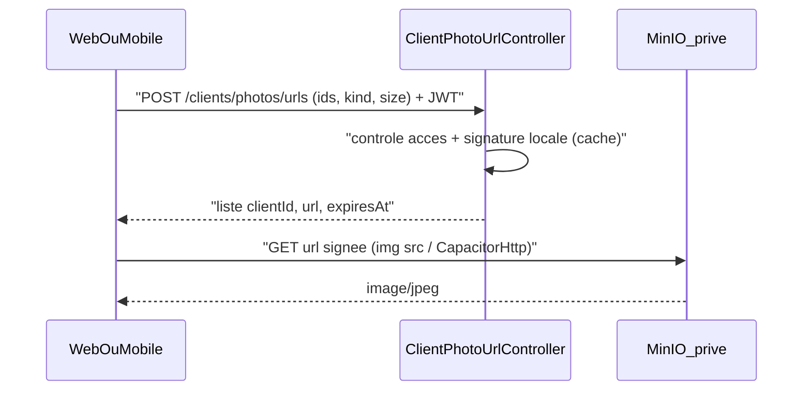

---
todos:
  - id: pr136-fallback
    status: completed
    content: 'PR #136 : commit + push du repli initiales (inscriptions) déjà codé'
  - id: backend-presign
    status: completed
    content: 'ClientPhotoUrlService (client MinIO de signature sur l''hôte public, cache des URL, contrôle portefeuille, thumb puis original) + POST /api/v1/clients/photos/urls + tests'
  - id: verify-presign-test-env
    status: completed
    content: Valider en env de test qu'une URL signée répond 200 via s3.optimizesolux.com (Host / Traefik / région)
  - id: web-photos
    status: completed
    content: 'Web : ClientPhotoUrlService Angular (batch + cache mémoire), inscriptions + fiche client ; repli legacy profil-photo-stream isolé'
  - id: mobile-photos
    status: completed
    content: 'Mobile : sync miniatures via URL signées (lots de 100, CapacitorHttp natif), affichage local d''abord, aperçu original à la demande, avatars RM, bump version'
  - id: docs-release
    status: in_progress
    content: 'CHANGELOG (Backend, Frontend, Mobile), vérif guides + RAG, builds/tests, PR dédiée vers main'
name: Photos clients MinIO privées
overview: 'Client photos (profile and ID) stay in private MinIO. A batch backend endpoint checks access per client and returns short-lived presigned URLs signed against the public host, and the images load straight from MinIO on the admin web (registrations, client detail) and mobile (commercial sync, RM). PR'
isProject: false
---

# Photos clients : URL signées MinIO (bucket privé)

## Constat
- Le flag `s3-photo-migration` est à `true` en prod : MinIO est le stockage principal et `PhotoStore` est voué à disparaître.
- Le bucket refuse les lectures anonymes (403 en prod et en test). Les photos MinIO sont cassées :
  - web : inscriptions, fiche client ;
  - mobile : liste et détail commercial, RM ;
  - sync mobile : `fetch` sans signature.
- Choix retenu : **URL présignées en lot**.
  - Le backend autorise chaque client puis signe localement (sans appel MinIO).
  - Les octets ne passent pas par le backend.
  - Les clés restent côté serveur.
  - Le contrôle se fait client par client (portefeuille).

## PR #136
- Commit et push du repli initiales déjà codé dans [client-registrations-list](frontend/src/app/client-registrations/pages/client-registrations-list/client-registrations-list.component.ts) ; CHANGELOG Frontend 2.26.0.

## Nouvelle PR « photos MinIO privées » (branche depuis `main` après merge de #136)

### Backend (core, pas de modif backend-lib)
- `ClientPhotoUrlService` (`core/service/client/`) :
  - Client MinIO **dédié à la signature** :
    - `MinioClient.builder().endpoint(minioProperties.getPublicUrl()).region("us-east-1").credentials(...)` ;
    - la région explicite évite tout appel réseau ; l'hôte public est inclus dans la signature ;
    - le client existant de [MinioStorageServiceImpl.java](backend-lib/elykia-client/src/main/java/com/optimize/elykia/client/storage/MinioStorageServiceImpl.java) reste sur l'endpoint interne.
  - Signature : `getPresignedObjectUrl(GetPresignedObjectUrlArgs.builder().method(Method.GET).bucket(bucket).object(key).expiry(...))`.
    - Clé via `PhotoObjectKeyBuilder`.
    - Expiration `elykia.photos.presign-expiry-minutes` (défaut 60).
  - Choix de l'objet sans appel MinIO, à partir des champs du client :
    - miniature si `profilPhotoThumbUrl` / `cardPhotoThumbUrl` existe, sinon original ;
    - aucun des deux : entrée `legacy: true` (photo encore dans `PhotoStore`).
  - Cache mémoire des URL signées par clé objet (durée = expiration moins une marge, par exemple 50 min sur 60) : la même URL est renvoyée pendant la fenêtre, ce qui permet au navigateur de mettre en cache.
  - Accès :
    - un profil à consultation globale (`CONSULT_CLIENT`, `EDIT_CLIENT`, `VALIDATE_CLIENT_REGISTRATION`, `ADMIN`, `RECOVERY_MANAGER`, `MANAGER`) voit tout ;
    - sinon `collector` ou `tontineCollector` doit être égal au username ;
    - les clients non autorisés sont omis de la réponse.
- `ClientPhotoUrlController` : `POST /api/v1/clients/photos/urls`.
  - Corps : `{ clientIds, kind: PROFIL|CARD, size: THUMB|ORIGINAL }`.
  - Réponse : `[{ clientId, url, expiresAt, legacy }]`.
  - Au-delà de 200 identifiants : 400.
  - Pas de conflit avec les mappings de `ClientController` (lib).
- Tests Mockito : miniature, bascule vers l'original, `legacy`, filtrage portefeuille, limite du lot, réutilisation du cache.

### Validation infra (env de test, avant le branchement front)
- Générer une URL signée pour un client de test et vérifier qu'un `curl` répond 200 via `https://s3.optimizesolux.com`.
- En cas de `SignatureDoesNotMatch` : corriger le passage du Host côté Traefik dans le repo d'infra (règle « patch repo avant VPS »), pas sur le serveur.
- Pas de CORS nécessaire : les `` n'en ont pas besoin et le mobile utilise CapacitorHttp natif (déjà `enabled: true`).

### Web admin
- `shared/service/client-photo-url.service.ts` :
  - `getUrls(ids, kind, size)` avec cache mémoire jusqu'à `expiresAt` ;
  - `getUrl(id, kind, size)` (lot d'un seul identifiant).
- Inscriptions :
  - miniatures profil en un seul appel après `load()`, miniature pièce à l'ouverture du détail, original au clic « Agrandir » ;
  - `(error)` et repli sur les initiales conservés.
- Fiche client [client-details.component.ts](frontend/src/app/client/client-details/client-details.component.ts) : `resolveProfilPhoto` passe par le service ; si `legacy`, repli sur l'appel existant `profil-photo-stream`, isolé et marqué transitoire.
- Plus aucun `` sur une URL MinIO brute du DTO ; ces champs ne servent plus qu'à indiquer la présence d'une photo (badges).

### Mobile (commercial + RM)
- [photo-sync.service.ts](mobile/src/app/core/services/photo-sync.service.ts) :
  - pour les clients concernés, demande d'URL signées par lots de 100, puis téléchargement direct (fetch passé en natif par CapacitorHttp) et enregistrement local, comme aujourd'hui ;
  - `legacy` : batch existant `profil-photos` / `card-photos`, marqué transitoire ;
  - le flux de synchronisation reste le même (règle local-first) : seule la source du téléchargement change.
- Affichage liste / détail ([clients.page](mobile/src/app/tabs/clients/clients.page.html), [client-detail.page](mobile/src/app/features/clients/pages/client-detail/client-detail.page.ts)) :
  - fichier local d'abord ; plus d'`` sur l'URL MinIO brute ; sinon icône ou initiales ;
  - aperçu agrandi : URL signée de l'original à la demande (en ligne).
- RM [rm-clients.page.ts](mobile/src/app/rm-tabs/clients/rm-clients.page.ts) : URL signées des miniatures en un lot pour les clients du pack ; repli sur les initiales (`failedAvatars`).
- Bump version mobile (package.json + 2 environments).

### Livraison
- CHANGELOG : Backend (minor), Frontend (patch), Mobile (patch). Docs & Infra : URL signées, bucket privé.
- Guides : vérifier les pages photos (manager inscriptions, commercial clients, recovery-manager) ; corriger seulement si le comportement visible change, puis régénérer le RAG.
- Vérifications : tests backend, `ng build` et script lazy-loading, build et tests mobile, contrôle manuel en env de test (inscriptions, fiche client, sync mobile).
- PR vers `main`.

## Hors périmètre
- Customer-space : n'affiche pas ces photos.
- Suppression de `PhotoStore`, des endpoints legacy et du job de migration : PR ultérieure. Les branches `legacy` sont isolées pour la faciliter.
