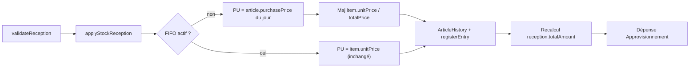

# Valider les réceptions au prix catalogue du jour (mode legacy)

## Constat (comportement actuel)

- À la création, [`ArticlesService.makeStockEntries`](backend/src/main/java/com/optimize/elykia/core/service/store/ArticlesService.java) fige `item.unitPrice`, `item.totalPrice` et `reception.totalAmount`. En legacy, le prix vient du payload (pré-rempli côté front avec le `purchasePrice` catalogue chargé à l'écran) ou, à défaut, de `LegacyStockValuationAdapter.resolveEntryUnitPrice` → `article.getPurchasePrice()` **à la date de création**.
- À la validation, [`StockReceptionService.applyStockReception`](backend/src/main/java/com/optimize/elykia/core/service/stock/StockReceptionService.java) réutilise ce snapshot :

```java
double unitPrice = item.getUnitPrice() != null ? item.getUnitPrice() : 0.0;
// ...
article.setPurchasePrice(unitPrice);           // écrase le catalogue avec le snapshot
// ...
expenseDto.setAmount(BigDecimal.valueOf(reception.getTotalAmount())); // total figé
```

Conséquence : si le prix catalogue change entre la création (PENDING) et la validation, l'historique article, la dépense « Approvisionnement » et le montant de la réception sont faux, et le catalogue est ramené à l'ancien prix.

## Cible



## Modifications backend

Fichier unique : [`StockReceptionService.java`](backend/src/main/java/com/optimize/elykia/core/service/stock/StockReceptionService.java), méthode `applyStockReception`.

1. Lire `boolean fifoEnabled = stockValuationFacade.isFifoEnabled();` une fois en début de méthode.
2. Par ligne, résoudre le PU :
   - legacy : `article.getPurchasePrice()` de l'article rechargé via `articlesService.getById(...)` (null → `0.0`, cohérent avec l'existant) ;
   - FIFO : `item.getUnitPrice()` (comportement actuel, hors périmètre).
3. En legacy, réécrire le snapshot de la ligne : `item.setUnitPrice(unitPrice)` et `item.setTotalPrice(unitPrice * quantity)` (cascade via `reception.items`, persisté par `update(reception)` dans `validateReception`). Le détail, le PDF fiche, le PDF journalier et l'annulation reflètent ainsi le prix réellement valorisé.
4. Accumuler un total recalculé et faire `reception.setTotalAmount(total)` **avant** le bloc dépense (en legacy). Le reverse d'annulation (`reverseValidatedReception`) utilise `reception.getTotalAmount()` : il restera cohérent sans autre changement.
5. En legacy, supprimer `article.setPurchasePrice(unitPrice)` (le catalogue reste la source de vérité). En FIFO, conserver la ligne telle quelle.
6. `PU:` dans la description de la dépense et `stockEntry.setUnitPrice(...)` (historique article) utilisent naturellement le PU résolu.

Pas de changement d'entité, de DTO, de contrôleur ni de migration ([`StockReception.java`](backend/src/main/java/com/optimize/elykia/core/entity/stock/StockReception.java) et [`StockReceptionController.java`](backend/src/main/java/com/optimize/elykia/core/controller/stock/StockReceptionController.java) inchangés) : schema catalog IA non concerné. La création conserve son snapshot, désormais simple estimation tant que la réception est en attente.

## Tests

Dans [`StockReceptionServiceTest.java`](backend/src/test/java/com/optimize/elykia/core/service/stock/StockReceptionServiceTest.java), tester `applyStockReception` directement (sans le `doNothing()` du spy) :
- legacy, snapshot 100 / catalogue 120, qté 5 : history et `registerEntry` avec 120, `item.totalPrice = 600`, `reception.totalAmount = 600`, dépense de 600, `setPurchasePrice` jamais appelé (catalogue reste 120).
- FIFO actif : PU snapshot 100 conservé, total inchangé (non-régression).
- Lancer `mvn -q test -Dtest=StockReceptionServiceTest` (+ `StockReceptionTraceabilityIntegrationTest` si exécutable localement).

## Guide utilisateur

Dans [`user-guide/docs/manager/stock_sales.md`](user-guide/docs/manager/stock_sales.md) (section « Circuit d'approbation », puce **Valider**), préciser en langage métier que le montant de la réception est calculé avec le prix d'achat en vigueur dans le catalogue au moment de la validation. Puis :
- `python user-guide/generate_rag_index.py`
- `python -m mkdocs build -f user-guide/mkdocs.yml -d ../frontend/src/user-guide`

## Version et changelog

- `backend/pom.xml` : incrément PATCH.
- [`docs/CHANGELOG.md`](docs/CHANGELOG.md) : nouvelle section `## Backend — [x.y.z] — 2026-10-03`, catégorie `Fixed` (valorisation au prix catalogue du jour à la validation, catalogue non réécrit, mode legacy).
