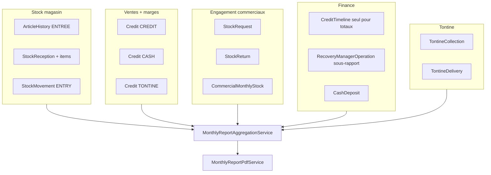
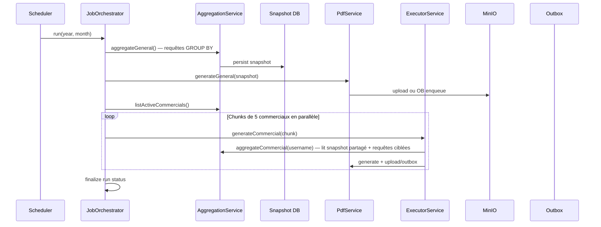

# Rapport mensuel consolidé ELYKIA

## Contexte et constat

Les métriques existantes sont aujourd'hui fragmentées :

| Zone UI | Métriques clés | Source backend |
|---------|----------------|----------------|
| [list.component.html](frontend/src/app/article/list/list.component.html) | Stock count, coût achat, vente crédit estimée, **marge estimée**, ruptures | `GET /api/v1/articles/stock-kpis` |
| [stock-request-list](frontend/src/app/stock/pages/stock-request-list/stock-request-list.component.html) | Totaux achat/vente crédit par demande | `StockRequest` + export PDF existant |
| [daily-report](frontend/src/app/report/pages/daily-report/daily-report.component.html) | 15+ KPIs journaliers par commercial, **marges ventes et sorties stock** | `DailyCommercialReport` (event-driven) |
| [my-stock-dashboard](frontend/src/app/stock/pages/my-stock-dashboard/my-stock-dashboard.component.html) | Pris/vendu/retourné/restant par article, **valeur vendue** | `CommercialMonthlyStock` + mouvements |
| [member-details](frontend/src/app/tontine/pages/member-details/member-details.component.html) | Contribution, solde, part société, livraisons | `TontineMember`, `TontineCollection` |
| [credit-late](frontend/src/app/credit/credit-late/credit-late.component.html) | Retards délai/échéance, montants dus | `CreditLateService` |

**Patterns réutilisables :**
- Agrégation mensuelle via [`DailyCommercialReportRepository.findAggregatedByDateBetween`](backend/src/main/java/com/optimize/elykia/core/repository/DailyCommercialReportRepository.java)
- Job mensuel le 1er à 2h : [`BiScheduler.calculateMonthlyPerformances()`](backend/src/main/java/com/optimize/elykia/core/scheduler/BiScheduler.java)
- Historique stock magasin : [`ArticleHistory`](backend/src/main/java/com/optimize/elykia/core/entity/article/ArticleHistory.java) (`ENTREE`, `SORTIE`, `RETURN`, `INVENTORY_ADJUSTMENT`) — source plus complète que `StockMovement` seul
- Traçabilité ventes stock commercial : [`CommercialMonthlyStockItemSoldValueHistory`](backend/src/main/java/com/optimize/elykia/core/entity/stock/CommercialMonthlyStockItemSoldValueHistory.java)
- Marges crédit : [`Credit.profitMargin`](backend/src/main/java/com/optimize/elykia/core/entity/sale/Credit.java) / `profitMarginPercentage`
- Livraisons tontine = ventes : `Credit` avec `type = TONTINE` (fallback si `TontineDelivery` incomplet)

**Prérequis validé :** enrichir [`CommercialStockMovement`](backend/src/main/java/com/optimize/elykia/core/entity/stock/CommercialStockMovement.java) avec les prix unitaires à l'écriture.

---

## Section transversale : Marges bénéficiaires

Formule standard :

```
marge_unitaire = prix_vente_unitaire - prix_achat_unitaire
marge_ligne     = marge_unitaire × quantité
marge_%         = (marge_ligne / coût_achat_ligne) × 100   si coût > 0
```

### Sources de marge par domaine

| Domaine | Champs existants | Calcul rapport |
|---------|------------------|----------------|
| **Ventes crédit** | `Credit.profitMargin`, `totalPurchase`, `totalAmount` | Agrégat mois + détail par vente/article |
| **Ventes comptant** | `Credit` type `CASH` | Idem |
| **Ventes tontine** | `Credit` type `TONTINE` (+ `TontineDelivery` en source primaire) | Marge via `profitMargin` / `totalPurchase` sur `Credit` |
| **Sorties stock** | `StockRequest` vente − achat ; items `unitPrice`, `purchasePrice` | Par demande et par article |
| **Stock commercial** | `CommercialMonthlyStockItem.totalMargeValue` | Par article et commercial |
| **Entrées stock magasin** | `StockReceptionItem.unitPrice` + `Articles.creditSalePrice` | **Marge estimée** (pas réalisée) : `qté × (creditSalePrice − coût entrée)` |
| **Rapport journalier** | `DailyCommercialReport.creditSalesMargin`, `stockRequestMargin` | Synthèse mensuelle par commercial |
| ~~Commandes~~ | `Order` | **Exclues du CA et des marges** — voir note ci-dessous |

### Note : commandes (pré-ventes)

Les **commandes** (`Order`) sont des pré-ventes : une fois acceptées et validées, elles sont **transformées en vente à crédit** (`Credit`). Les intégrer dans le chiffre d'affaires **double-compterait** la même opération.

- **Exclure** les commandes du CA et de la marge totale en synthèse exécutive
- **Optionnel (indicateur séparé)** : nb de commandes créées dans le mois, montant potentiel, nb converties en crédit — section annexe « Pipeline pré-ventes », sans impact sur les totaux financiers

---

## Contenu exhaustif du rapport

### Rapport général (1 PDF / mois)



#### 0. Synthèse exécutive (page 1)
- **Chiffre d'affaires total** : ventes crédit + comptant + tontine (`Credit` types `CREDIT`, `CASH`, `TONTINE`) — **sans commandes**
- Coût d'achat total engagé sur les ventes réalisées
- **Marge bénéficiaire totale réalisée** et taux de marge
- **Marge estimée** sur entrées stock magasin (valorisation au prix crédit catalogue)
- Répartition marge : ventes / sorties stock / stock commercial

#### 1. Entrées en stock (magasin)

**Sources combinées (priorité) :**

| Priorité | Source | Rôle |
|----------|--------|------|
| 1 | [`ArticleHistory`](backend/src/main/java/com/optimize/elykia/core/entity/article/ArticleHistory.java) `operationType = ENTREE`, `operationDate` dans le mois | Exhaustivité des mouvements (entrées manuelles, réceptions, retours magasin) |
| 2 | `StockReception` + `StockReceptionItem` | Prix d'achat unitaire (`unitPrice`, `totalPrice`) par réception |
| 3 | `StockMovement` type `ENTRY` | Complément si lacune (`unitCost`) — **ne pas s'y limiter** |

`ArticleHistory` ne porte pas de prix : jointure sur `StockReceptionItem` (même article + date proche) ou `Articles.purchasePrice` / prix réception en fallback.

**KPIs :** montant total achat, quantité totale, nb entrées, **marge estimée totale** (`Σ qté × (Articles.creditSalePrice − coût entrée)`)

**Liste par article :** nom, quantité, prix achat u., coût total, **prix vente crédit catalogue**, **marge estimée**, **marge estimée %**

> La marge ici est **estimée** (potentiel si vendu au prix crédit), pas une marge réalisée — libellé explicite dans le PDF : *« Marge estimée (prix crédit) »*.

#### 2. Ventes à crédit
- **Source :** `Credit` `type = CREDIT`, `accountingDate` dans le mois
- **KPIs :** nb ventes, CA, coût achat, **marge réalisée**, taux marge
- **Listes :** par article et par vente avec `profitMargin`

#### 3. Ventes comptant (cash)
- **Source :** `Credit` `type = CASH` — même structure marge que section 2

#### 4. Demandes de sortie et retours stock
- Sources : `StockRequest`, `StockReturn`, `StockTontineRequest`, `StockTontineReturn`
- KPIs + marges sorties stock + engagement net par commercial (`CommercialMonthlyStock`)

#### 5. Recouvrements — sans double comptage

**Règle anti-doublon :** les opérations du chef recouvrement créent d'abord un `CreditTimeline`, puis un [`RecoveryManagerOperation`](backend/src/main/java/com/optimize/elykia/core/entity/sale/RecoveryManagerOperation.java) lié via `creditTimelineId`. **Ne jamais sommer les deux pour les totaux.**

| Sous-section | Source | Contenu |
|--------------|--------|---------|
| **5a — Recouvrements totaux** | `CreditTimeline` uniquement (filtre mois, type paiement crédit) | KPIs : nb opérations, montant total recouvré |
| **5a — Détail** | `CreditTimeline` + jointure `Credit` | Par ligne : date, référence crédit, client, commercial, montant collecté, **marge initiale crédit** (`Credit.profitMargin`) |
| **5b — Activité chef recouvrement** | `RecoveryManagerOperation` seul | KPIs : nb opérations terrain, montant, commerciaux concernés ; liste par opération avec `recoveryManagerUsername`, `isPartial`, `originalAmountRemaining` |

**Info contextuelle « marge initiale du crédit » dans le PDF :** ce n'est pas une fonctionnalité PDF spéciale — c'est une **colonne supplémentaire** dans le DTO Thymeleaf, pré-calculée à l'agrégation :

```java
// RecoveryLineDto
private Double amountCollected;      // colonne principale
private Double creditProfitMargin;   // colonne contextuelle — depuis Credit.profitMargin
private String creditReference;
```

Dans le template HTML : colonne « Marge vente (info) » avec note de bas de tableau : *« Marge initiale de la vente à crédit, à titre informatif — distincte du montant recouvré. »* Pas de tooltip interactif (PDF statique) ; si espace limité, regrouper en annexe « Détail recouvrements ».

#### 6. Tontines

**Collectes :** `TontineCollection` dans le mois — par membre : collecté, `availableContribution`, `societyShare`, total part société du mois.

**Livraisons :**

| Priorité | Source | Usage |
|----------|--------|-------|
| 1 | `TontineDelivery` + `TontineDeliveryItem` | Détail livraison, articles, quantités |
| 2 | `Credit` `type = TONTINE`, même période / même membre | Fallback CA, `totalPurchase`, `profitMargin`, articles si `TontineDelivery` incomplet |

KPIs livraisons : count, montant total, **marge réalisée** (`Credit.profitMargin` ou calcul items).

#### 7. Versements (cash-deposit)
- `CashDeposit` + écart à verser vs versé (`DailyCommercialReport`)

#### 8. Retards de recouvrement (snapshot fin de mois)
- `CreditLateService` — état au dernier jour du mois

#### 9. Synthèse journalière agrégée
- `DailyCommercialReport.findAggregatedByDateBetween` incluant marges par commercial

#### 10. Pipeline pré-ventes (optionnel, hors CA)
- Commandes créées dans le mois : count, montant potentiel, nb converties en crédit — **clairement séparé** de la synthèse exécutive

---

### Rapport par commercial (1 PDF / commercial / mois)

Sections filtrées par `collector` + timeline mouvements avec marges + synthèse par article + activité hebdomadaire.

---

## Base MinIO : branche `feature/s3`

Merger [`feature/s3`](.) avant implémentation. Réutiliser `MinioStorageService`, `MinioProperties`, Docker Compose MinIO.

- Étendre avec `uploadObject` / `downloadObject` / `deleteObject` (bucket paramétrable)
- Bucket dédié : `elykia-reports` via `minio.reports-bucket`
- Clés : `reports/{year}/{month}/general.pdf`, `reports/{year}/{month}/commercial-{username}.pdf`

### Outbox retry (obligatoire en prod)

Reprendre le pattern [`PhotoOutboxRetryScheduler`](feature/s3) de `feature/s3` :

```
MonthlyReportOutboxEntry
  - id, runId, fileType, commercialUsername (nullable)
  - storageKey, pdfBytesPath (temp local) ou snapshotRef
  - status: PENDING | UPLOADING | DONE | FAILED
  - retryCount, lastAttemptAt, errorMessage

MonthlyReportOutboxRetryScheduler
  - @Scheduled(fixedDelay = 300_000) — même cadence que photos
  - Si MinIO down → statut run PARTIAL, entrées PENDING
  - Retry upload jusqu'à N tentatives → FAILED + alerte admin
  - Après succès → créer MonthlyReportFile, supprimer fichier temp, DONE
```

Le job principal **ne bloque pas** sur MinIO : génère le PDF, tente upload, sinon enqueue outbox. Le run passe à `COMPLETED` seulement quand tous les fichiers sont `DONE` (ou `COMPLETED_WITH_PENDING` si outbox active).

---

## Architecture technique proposée

### Nouvelles entités JPA

```
MonthlyReportRun       — year, month, status, totalMarginAmount, ...
MonthlyReportFile      — runId, reportType, storageKey, ...
MonthlyReportSnapshot  — runId, data JSONB (DTO complet)
MonthlyReportOutboxEntry — retry upload MinIO
```

### Enrichissement `CommercialStockMovement`

Colonnes : `unitPurchasePrice`, `unitSalePrice`, `marginAmount`, `sourceType`, `sourceId` — écriture dans `StockRequestService`, `StockReturnService`, `CreditService` + rétro-remplissage.

### Services backend (`report/monthly`)

| Service | Rôle |
|---------|------|
| `MonthlyReportAggregationService` | Requêtes GROUP BY, anti-doublon recouvrements, ArticleHistory |
| `MonthlyReportMarginCalculator` | Formules marge centralisées (réalisée vs estimée) |
| `MonthlyReportPdfService` | Thymeleaf + iText |
| `MonthlyReportStorageService` | Upload/download MinIO |
| `MonthlyReportOutboxService` + `MonthlyReportOutboxRetryScheduler` | Résilience upload |
| `MonthlyReportJobOrchestrator` | Orchestration par étapes (voir ci-dessous) |
| `CommercialStockTraceabilityService` | Timeline article + marges |

---

## Stratégie d'exécution du job : batch ou code optimisé ?

**Réponse : code optimisé orchestré par étapes — pas Spring Batch.**

Spring Batch serait surdimensionné pour un job mensuel unique (1×/mois, volume modéré). En revanche, on n'exécute pas non plus tout en mémoire d'un coup.

### Approche retenue : « chunked service job »



| Technique | Usage |
|-----------|-------|
| **Requêtes GROUP BY / native SQL** | Agrégats globaux en une passe par section — pas de `findAll()` + stream |
| **Snapshot JSONB** | Une écriture DB ; N PDFs relus depuis le snapshot sans re-requêter |
| **Pagination interne** | Listes détail > 500 lignes : fetch par pages de 200 pour construire le DTO |
| **Parallélisme contrôlé** | `ExecutorService` fixed pool (ex. 4 threads) pour PDFs commerciaux — pas un thread par commercial |
| **Chunks commerciaux** | Traiter par groupes de 5 pour limiter pression mémoire + DB |
| **Outbox async** | Upload MinIO découplé si échec |
| **ShedLock** | Un seul pod exécute le job |
| **Pas de Spring Batch** | Évite infra JobRepository, complexité reprise — la reprise est gérée par `MonthlyReportRun.status` + outbox + regénération manuelle |

**Reprise sur échec :** si le job échoue à mi-parcours, `MonthlyReportRun` garde l'état (`AGGREGATING`, `GENERATING`, commercial courant). Relance idempotente : skip fichiers déjà `DONE`, reprendre à partir du chunk incomplet.

---

## Job planifié

**Cron : `0 0 2 1 * *`** — après `BiScheduler.calculateMonthlyPerformances()`.

Séquence : ShedLock → idempotence → fermer `CommercialMonthlyStock` → agrégation + snapshot → PDF général → PDFs commerciaux (pool parallèle) → upload/outbox → statut final.

---

## API REST

| Méthode | Endpoint | Description |
|---------|----------|-------------|
| GET | `/api/v1/monthly-reports` | Arbre année/mois/fichiers |
| GET | `/api/v1/monthly-reports/{fileId}/download` | Stream PDF MinIO |
| POST | `/api/v1/monthly-reports/generate` | Regénération manuelle |
| GET | `/api/v1/monthly-reports/runs` | Historique + statut outbox |

Sécurité : `ROLE_REPORT`.

---

## Frontend

Page `/monthly-reports` — accordéons Année > Mois > fichiers PDF.

---

## Phasage d'implémentation

### Phase 0 — Prérequis MinIO
- Merger `feature/s3`, étendre `MinioStorageService`, bucket `elykia-reports`, `ReportObjectKeyBuilder`

### Phase 1 — Fondations données
- Entités run/file/snapshot/outbox + migration `CommercialStockMovement`
- `MonthlyReportAggregationService` + `MonthlyReportMarginCalculator`
- Tests : anti-doublon recouvrements, marges estimées entrées stock, exclusion commandes du CA

### Phase 2 — Génération, stockage, job
- Templates Thymeleaf (colonnes marge, libellés « estimée » vs « réalisée »)
- `MonthlyReportJobOrchestrator` + pool parallèle + outbox retry
- `MonthlyReportScheduler` + ShedLock

### Phase 3 — Frontend

### Phase 4 — Durcissement
- Prometheus, rétention, regénération UI, reprise job partiel

---

## Risques et mitigations

| Risque | Mitigation |
|--------|------------|
| Double comptage recouvrements | `CreditTimeline` seul pour totaux ; `RecoveryManagerOperation` en sous-rapport |
| Double comptage commandes → crédit | Commandes hors CA ; annexe pipeline séparée |
| `StockMovement` incomplet | `ArticleHistory` source primaire ; `StockReception` pour prix |
| MinIO down au moment du job | Outbox retry (pattern feature/s3) |
| Job long | Snapshot + chunks + parallélisme limité |
| Confusion marge estimée / réalisée | Libellés explicites dans PDF et DTO |
