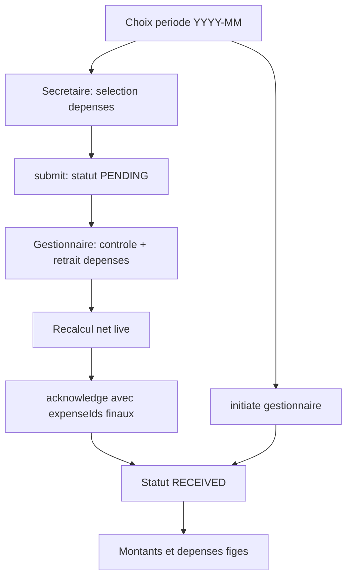

# Plan : Remise au gestionnaire avec déduction des dépenses

## Décisions figées

- **Deux niveaux de liaison** :
  - `PENDING` : dépenses associées mais **ajustables** par le gestionnaire (retrait autorisé ; net recalculé).
  - `RECEIVED` : montants **figés** ; plus aucun retrait / ajout ; dépenses définitivement comptabilisées.
- **Verrouillage définitif** uniquement après réception gestionnaire (`RECEIVED`), pas à la soumission secrétaire.
- Secrétaire propose les dépenses à la soumission ; gestionnaire contrôle et peut **retirer** celles qu’il estime hors remise avant d’accuser réception.
- `initiate` gestionnaire (création directe `RECEIVED`) : sélection finale immédiatement, puis verrou.
- **Net négatif refusé** : `Σ dépenses > totalAmount` → erreur métier.
- Remise **sans dépenses** autorisée (`expenseIds = []`).
- Pré-sélection : dépenses du mois non liées ailleurs ; ajout hors mois possible à la soumission (et à l’initiation).
- Une dépense liée à une remise (`PENDING` ou `RECEIVED`) n’est **plus sélectionnable** sur une autre remise.
- Une dépense n’est **plus modifiable/supprimable** dans le module Dépenses **seulement** si liée à une remise `RECEIVED` (si retirée du PENDING, elle redevient libre).

## Flux cible

## 1. Backend — modèle & migration

Fichiers pivots : [`CashPeriodRemittance.java`](backend/src/main/java/com/optimize/elykia/core/entity/report/CashPeriodRemittance.java), [`Expense.java`](backend/src/main/java/com/optimize/elykia/core/entity/expense/Expense.java), migration après [`V58__cash_period_remittance.sql`](backend/src/main/resources/db/migration/V58__cash_period_remittance.sql).

- Nouvelle migration Flyway :
  - `cash_period_remittance` : `expense_amount`, `net_amount` (NOT NULL, default 0)
  - Table `cash_period_remittance_expense` : `remittance_id`, `expense_id`, **UNIQUE(`expense_id`)**, FK
  - Backfill : `net_amount = total_amount`, `expense_amount = 0` pour remises existantes
- Entité liaison + relation côté remittance
- Flag métier côté Expense DTO : `linkedToRemittance`, `remittanceStatus`, `accounted` (= true seulement si `RECEIVED`)

## 2. Backend — service & API

Fichiers : [`CashPeriodRemittanceService.java`](backend/src/main/java/com/optimize/elykia/core/service/accounting/CashPeriodRemittanceService.java), [`CashPeriodRemittanceController.java`](backend/src/main/java/com/optimize/elykia/core/controller/accounting/CashPeriodRemittanceController.java), [`CashPeriodRemittanceRequest.java`](backend/src/main/java/com/optimize/elykia/core/dto/report/CashPeriodRemittanceRequest.java), [`ExpenseService.java`](backend/src/main/java/com/optimize/elykia/core/service/expense/ExpenseService.java).

- Étendre request : `List<Long> expenseIds`
- Summary DTO :
  - `expenseAmount`, `netAmount`
  - `candidateExpenses` (non liées ailleurs) + `preselected` si dans le mois (phase création)
  - si remise `PENDING` : `linkedExpenses` **éditables en retrait** pour le gestionnaire
  - si `RECEIVED` : `linkedExpenses` lecture seule
- `submitBySecretary` : crée `PENDING` + liens + calcule `expense_amount` / `net_amount`
- `acknowledgeByManager(id, expenseIds)` :
  1. Autorisé seulement si `PENDING`
  2. Remplace l’ensemble lié par le sous-ensemble final (retraits = IDs absents ; **pas d’ajout** d’IDs hors liens initiaux, sauf besoin métier ultérieur)
  3. Recalcule `expense_amount` / `net_amount` ; refuse si net &lt; 0
  4. Passe en `RECEIVED` et fige
- `initiateByManager` : sélection + `RECEIVED` immédiat + verrou
- `ExpenseService.update` / delete : refuser **uniquement** si dépense liée à une remise `RECEIVED`
- Contrainte UNIQUE `expense_id` : empêche la double sélection même en `PENDING`

## 3. Frontend — onglet Remise

Fichiers : [`cash-period-remittance-tab.component.*`](frontend/src/app/report/components/cash-period-remittance-tab/), [`cash-period-remittance.model.ts`](frontend/src/app/report/models/cash-period-remittance.model.ts), service associé.

- **Création** (secrétaire submit / gestionnaire initiate) : multi-sélection pré-cochée période + ajout hors période ; KPI Total | Dépenses | Net
- **Contrôle PENDING** (gestionnaire) : liste des dépenses liées avec possibilité de **décocher / retirer** ; net recalculé en direct ; bouton « Accuser réception » envoie les `expenseIds` restants
- **RECEIVED** : affichage figé (plus de modification)
- Historique : colonnes Dépenses + Net

**Contrainte repo** : domaine `report` encore eager → migration lazy-loading dans le scope ([skill](.cursor/skills/frontend-lazy-loading-migration/SKILL.md)).

## 4. Frontend — module Dépenses

Fichiers : [`list.component.*`](frontend/src/app/expense/pages/list/), [`form.component.*`](frontend/src/app/expense/pages/form/), [`expense.model.ts`](frontend/src/app/expense/models/expense.model.ts).

- Badge « En remise (en attente) » si liée `PENDING` (éditable encore, non sélectionnable ailleurs)
- Badge « Comptabilisée » si liée `RECEIVED` → édition / suppression désactivées
- Form : lecture seule seulement si `accounted` (`RECEIVED`)

## 5. Tests, changelog

- Tests : submit avec dépenses ; acknowledge avec retraits + net recalculé ; refuse ajout hors liens initiaux ; refuse update expense si `RECEIVED` ; autorise update si seulement `PENDING` puis libre après retrait ; net négatif ; double liaison
- [`docs/CHANGELOG.md`](docs/CHANGELOG.md) : Backend + Frontend

## Ordre d’implémentation

1. Migration + entités
2. Service remittance (submit / acknowledge avec expenseIds / initiate) + verrou Expense conditionnel + tests
3. UI Remise (création + contrôle PENDING + freeze RECEIVED)
4. UI Dépenses (badges / lock selon statut)
5. Lazy-loading `report` + changelog
