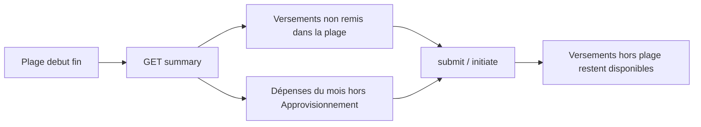

# Remise par plage de dates + exclusion Approvisionnement

L’onglet Remise n’est pas dans [daily-report.component.html](frontend/src/app/report/pages/daily-report/daily-report.component.html) lui-même : il embarque [cash-period-remittance-tab](frontend/src/app/report/components/cash-period-remittance-tab/cash-period-remittance-tab.component.html). C’est ce composant + le backend qui changent.

Aujourd’hui, `getSummary` / `submit` / `initiate` agrègent **tous** les versements non remis du mois (`1er` → dernier jour). Les dépenses candidates sont aussi celles du mois entier, y compris `Approvisionnement`.

Décision validée : la plage de dates ne filtre **que les versements**. Les dépenses restent celles du mois, **sauf** le type Approvisionnement.

## Backend

Fichiers : [CashPeriodRemittanceService.java](backend/src/main/java/com/optimize/elykia/core/service/accounting/CashPeriodRemittanceService.java), [CashPeriodRemittanceController.java](backend/src/main/java/com/optimize/elykia/core/controller/accounting/CashPeriodRemittanceController.java), [CashPeriodRemittanceRequest.java](backend/src/main/java/com/optimize/elykia/core/dto/report/CashPeriodRemittanceRequest.java).

Le repository filtre déjà par `start`/`end` (`findUnremittedDepositsByPeriod`). Il suffit de passer la plage utilisateur au lieu du mois entier.

- Ajouter `startDate` / `endDate` optionnels sur `CashPeriodRemittanceRequest` et sur `GET /summary`.
- Si absents : comportement actuel (mois complet) pour rester compatible avec les e2e.
- Si présents : valider `start <= end` et que les deux dates sont dans le `year`/`month` sélectionné.
- `computeUnremittedTotals`, `loadUnremittedDeposits`, `submitBySecretary`, `initiateByManager` utilisent cette plage. Les versements hors plage restent `remittance IS NULL` et pourront être remis plus tard.
- Une remise `PENDING` du mois continue de primer sur le résumé (inchangé). Les datepickers seront alors ignorés côté affichage.
- Dans `getCandidateExpenses` : exclure `expenseType.name == "Approvisionnement"` (même libellé que [StockReceptionService](backend/src/main/java/com/optimize/elykia/core/service/stock/StockReceptionService.java) et V12).
- Dans `resolveAndValidateExpenses` : refuser une dépense Approvisionnement si elle est envoyée à l’API.

Pas de migration SQL : `year`/`month` restent la période de grouping ; la plage ne sert qu’à sélectionner les versements liés.

## Frontend

Fichiers : [cash-period-remittance-tab.component.html](frontend/src/app/report/components/cash-period-remittance-tab/cash-period-remittance-tab.component.html) / `.ts` / `.scss`, [cash-period-remittance.service.ts](frontend/src/app/report/service/cash-period-remittance.service.ts).

- Toolbar : à côté Année / Mois, deux champs natifs `type="date"` (style `.field-input` existant) **Du** / **Au**, bornés au mois sélectionné (`min` = 1er, `max` = min(aujourd’hui, fin de mois)).
- Défaut : 1er du mois → aujourd’hui si mois courant, sinon dernier jour du mois.
- Changer année/mois réinitialise la plage, puis recharge le résumé.
- Changer Du/Au recharge le résumé (versements + KPIs).
- Désactiver Du/Au si une remise `PENDING` est affichée (les totaux viennent de cette remise).
- Le service passe `startDate`/`endDate` (`yyyy-MM-dd`) à summary, submit et initiate.
- Filet UI : `getVisibleExpenses()` ignore aussi `expenseTypeName === 'Approvisionnement'` pour les candidats.
- Sous-titre : préciser qu’on peut remettre seulement une plage de versements.

Le domaine `report` est déjà lazy-loaded : pas de migration.

## Tests et changelog

- Unitaires backend dans [CashPeriodRemittanceServiceTest.java](backend/src/test/java/com/optimize/elykia/core/service/accounting/CashPeriodRemittanceServiceTest.java) :
  - summary/submit avec plage 1–5 n’inclut pas un versement du 19
  - les candidats n’incluent pas Approvisionnement
  - submit refuse une dépense Approvisionnement
- E2E : étendre [api-client.ts](frontend/e2e/fixtures/api-client.ts) (params dates optionnels, rétrocompatibles) ; ajouter un cas UI (champs Du/Au visibles, summary appelé avec `startDate`/`endDate`).
- Versions : Frontend `2.17.0` → `2.18.0`, Backend `1.11.0` → `1.12.0` + [docs/CHANGELOG.md](docs/CHANGELOG.md).

