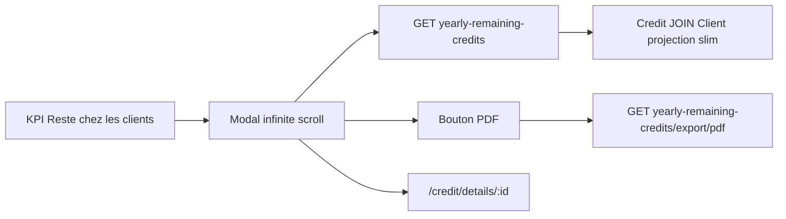

# Modal « Reste chez les clients »

## Périmètre métier (validé)

Lister les **crédits du commercial**, `type = CREDIT`, `state = ENABLED`, **`beginDate` dans l’année du bilan**, **`totalAmountRemaining > 0`**.

Le KPI affiché reste `ventes − versements au secrétaire` (agrégat mensuel existant). La somme des soldes du modal **peut différer** : le modal le dira clairement (sous-titre + totaux distincts).

`report` et `credit` sont déjà lazy-loaded : **pas de migration routing**.

## Backend

**DTO slim** (pas de `CreditRespDto` / `ClientRespDto`) :

`RemainingAtClientsCreditDto` — `id`, `reference`, `clientLastname`, `clientFirstname`, `beginDate`, `totalAmount`, `totalAmountRemaining`.

**Requête paginée** dans [`CreditRepository.java`](backend/src/main/java/com/optimize/elykia/core/repository/CreditRepository.java) :

- `SELECT NEW RemainingAtClientsCreditDto(c.id, c.reference, cl.lastname, cl.firstname, c.beginDate, c.totalAmount, c.totalAmountRemaining)`
- `FROM Credit c JOIN c.client cl`
- Filtres : `collector`, `type = CREDIT`, `state = ENABLED`, `beginDate` entre `year-01-01` et `year-12-31`, `totalAmountRemaining > 0`
- `ORDER BY c.beginDate DESC, c.id DESC`
- `countQuery` séparé (`COUNT(c.id)` sans join client) pour éviter un count lourd
- Index existant `idx_credit_collector` : suffisant pour filtrer le commercial puis le range de dates. Pas de nouvelle migration d’index sauf si un EXPLAIN le justifie.

**Agrégat d’en-tête** (une requête) : `COUNT` + `SUM(totalAmountRemaining)` avec les mêmes filtres, exposé dans un wrapper `RemainingAtClientsPageDto` (`content` Spring `Page` + `totalRemainingAmount` + `salesCount`).

**Endpoints** dans [`DailyReportController.java`](backend/src/main/java/com/optimize/elykia/core/controller/report/DailyReportController.java), même auth que `/yearly-summary` (promoteur forcé sur son username) :

- `GET /api/daily-commercial-reports/yearly-remaining-credits?year=&collector=&page=&size=`
- `GET /api/daily-commercial-reports/yearly-remaining-credits/export/pdf?year=&collector=`

Service dédié `RemainingAtClientsPdfService` : `PdfDocumentIdentity` + `PdfHtmlRenderer` + template Thymeleaf `remaining-at-clients-export.html` (fragments `pdf/fragments` : header, styles, `.pdf-meta` / `.pdf-kpi` / `.data-table`). PDF = **toutes** les lignes (même projection, `List` non paginée). Colonnes : client, référence, date début, montant total, montant restant. KPI PDF : commercial, année, nombre, somme des restes.

Tests : requête/filtres (service unitaire mock repo) + PDF multi-pages `1/N` comme [`ClientListPdfServiceTest`](backend/src/test/java/com/optimize/elykia/core/service/client/ClientListPdfServiceTest.java).

## Frontend

Réutiliser le pattern visuel de [`stock-sold-sales-dialog`](frontend/src/app/stock/components/stock-sold-sales-dialog/stock-sold-sales-dialog.component.html) (palette navy, pas de `mat-button` brut).

**KPI cliquable** dans [`daily-report.component.html`](frontend/src/app/report/pages/daily-report/daily-report.component.html) : `role="button"`, hover, curseur pointer, ouverture même si reste = 0 (état vide).

**Nouveau dialog** `remaining-at-clients-dialog` déclaré dans [`report.module.ts`](frontend/src/app/report/report.module.ts) :

- Colonnes : nom, prénom, référence (lien), date début, montant total, montant restant
- Référence → ferme le dialog puis `router.navigate(['/credit/details', id])`
- Infinite scroll : `IntersectionObserver` sur un sentinelle en bas du tableau, `pageSize = 25`, append, `loadingMore`, arrêt quand `last`
- Toolbar : compteur + bouton `.btn-download` PDF (blob, même pattern que `onDownloadReportPdf`)
- États chargement / vide / erreur conformes au skill UI
- Annulation HTTP à la destruction

Méthodes dans [`daily-report.service.ts`](frontend/src/app/report/service/daily-report.service.ts).

## Versions

- Frontend `2.16.7` → `2.16.8` (patch)
- Backend `1.9.8` → `1.9.9` (patch)
- [`docs/CHANGELOG.md`](docs/CHANGELOG.md) : Added frontend + backend
