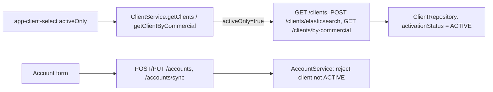

# Desktop scroll, tontine estimate, unvalidated clients

## 1. Customer-space: scroll on desktop pages

Cause: on desktop, 16 of the 18 routed pages are rendered without `<ion-content>`. Each page is a fixed-size `.ion-page` box (absolute position, viewport size). The page hosts have no `overflow`, the split-pane's main area clips with `overflow:hidden`, and `body` is `position:fixed`. Only `/auth` and `/notifications` scroll.

Fix, a single global rule in [customer-space/src/global.scss](customer-space/src/global.scss) next to the `body.elyk-desktop` block (around lines 430-596):

```scss
body.elyk-desktop ion-router-outlet > .ion-page {
  overflow-y: auto;
  overscroll-behavior: contain;
}
```

- The page box already has a fixed height, so it becomes the scroll container. As a side effect, `.elyk-aside-sticky` (the sticky right-hand "Récapitulatif" panel) starts working.
- The phone layout is unchanged (no `elyk-desktop` class). `/auth` and `/notifications` keep their `ion-content`, which fills the box without overflowing.
- Check in the browser at 1280px or wider on dashboard, purchases, purchase detail, timeline, tontines, join, tontine detail, payment, catalog, cart, profile and onboarding.

## 2. Customer-space: desktop tontine figures follow the member's booklet

Reference (phone layout): the "Carnet de mises mensuelles" built by `CustomerPortalService.buildMonthlySummaries`. It has one row per month, from the member's start month to the session end month. On desktop, every figure that counts months must use the same months instead of a fixed 10.

Same rule as the booklet:
- Member start date = registration date, or the session start date if it is later. When joining, the registration date is today.
- Months = from the start month to the session end month, inclusive, capped at 10 (`MAX_MONTHS`) and never below 0.

**2a. Desktop "Récapitulatif" when joining** ([tontine-join](customer-space/src/app/features/tontine-join/))
- Today: `[estimatedTotal]="monthlyEstimate * 10"` (line 17 of the page template), with the label "Estimation (≈300 j)". That's a full session regardless of the join date.
- [tontine-join.page.ts](customer-space/src/app/features/tontine-join/tontine-join.page.ts): add `remainingSessionMonths` (rule above, from `session.startDate` and `session.endDate`, with `YYYY-MM-DD` parsed as a local date) and `sessionEstimate = remainingSessionMonths × 31 × dailyStake`.
- [tontine-join.page.html](customer-space/src/app/features/tontine-join/tontine-join.page.html): pass `[estimatedTotal]="sessionEstimate"` and `[estimatedMonths]="remainingSessionMonths"`.
- [tontine-join-desktop component](customer-space/src/app/features/tontine-join/desktop/tontine-join-desktop.component.html): new input `estimatedMonths`.
  - The label becomes "Estimation sur N mois" (singular or plural).
  - Add the line "Soit environ X FCFA par mois", as on phone.
  - Hide the estimate when there are 0 months.

**2b. Desktop tontine detail** ([tontine-detail-desktop](customer-space/src/app/features/tontine-detail/desktop/tontine-detail-desktop.component.html))
- Today: the title is fixed at "Carnet des 10 mois", and the KPI shows "Progression X/10".
- [tontine-detail.page.ts](customer-space/src/app/features/tontine-detail/tontine-detail.page.ts): add `memberMonths` = number of rows in `detail.monthlySummaries`, capped at 10, falling back to 10 if the list is empty. Pass it to the desktop component.
- On desktop:
  - Title "Carnet des N mois".
  - KPI "Progression X/N", with the percentage computed against N.
  - The phone layout is left as is.

**Tests**
- [tontine-join.page.spec.ts](customer-space/src/app/features/tontine-join/tontine-join.page.spec.ts):
  - Joining before the session starts gives 10 months.
  - Joining in June for a session ending in December gives 7 months.
  - Joining after the session ends gives 0.
  - A session longer than 10 months is capped at 10.
- [tontine-detail.page.spec.ts](customer-space/src/app/features/tontine-detail/tontine-detail.page.spec.ts): `memberMonths` equals the number of booklet rows (for example 7), with the fallback to 10.

## 3. Frontend and backend: exclude unvalidated clients

Status field: `Client.activationStatus` (`PENDING`, `ACTIVE` or `REJECTED`). Self-registrations from the customer space start as `PENDING`. Scope agreed: every client selector in the frontend, plus a backend guard on accounts.




**Backend (backend-lib/elykia-client)**

- [ClientController.java](backend-lib/elykia-client/src/main/java/com/optimize/elykia/client/controller/ClientController.java): add an optional `@RequestParam Boolean activeOnly` to `GET /api/v1/clients`, `POST /elasticsearch` and `GET /by-commercial/{commercial}`. It defaults to false, so the client list page is unchanged and still shows registrations waiting for validation.
- [ClientRepository.java](backend-lib/elykia-client/src/main/java/com/optimize/elykia/client/repository/ClientRepository.java):
  - `findClientsDto`: add `AND (:#{#activeOnly != true} = true OR c.activationStatus = ...ACTIVE)`.
  - `getElasticsearchCriteria`: add a predicate on `activationStatus` when `activeOnly` is true.
  - `findByCollectorAndClientTypeAndState`: add a variant with the same condition.
  - Keep the current signatures as `default` overloads so existing callers are untouched.
- [ClientService.java](backend-lib/elykia-client/src/main/java/com/optimize/elykia/client/service/ClientService.java): pass `activeOnly` through `getAll`, `elasticsearch` and `getAllClientByCollector`, and add `activeOnly` to the `CLIENTS_PAGE` and `CLIENTS_BY_COMMERCIAL_PAGE` cache keys. Without that, filtered and unfiltered pages would share cache entries.
- [AccountService.java](backend-lib/elykia-client/src/main/java/com/optimize/elykia/client/service/AccountService.java): in `createAccount`, `syncAccount` and `updateAccount`, load the client. If `!client.isActivationActive()`, throw `CustomValidationException("Ce client n'est pas encore validé : impossible de lui créer un compte.")`.
  - This stays compatible with `ClientRegistrationAdminService.activate`, which sets `ACTIVE` before `ensureAccount` in the same transaction, so the managed entity is already `ACTIVE`.
- Unit tests: AccountService guard (`PENDING` and `REJECTED` refused, `ACTIVE` accepted), and `activeOnly` passed through by `ClientService`.

**Frontend**

- [client.service.ts](frontend/src/app/client/service/client.service.ts): add an optional `activeOnly` parameter to `getClients` and `getClientByCommercial`, sent as `activeOnly=true`.
- [client-select.component.ts](frontend/src/app/shared/components/client-select/client-select.component.ts): new `@Input() activeOnly = true`, passed by `buildClientsRequest()` on all three paths. Its default of true covers every selector (account, credit, distribution, tontine, rattrapage, add tontine member, order) without editing each form.
  - `ensureClientLoaded` (edit mode) keeps showing a client that is already selected.
- The `client` domain is already lazy-loaded (`client.module.ts`, `loadChildren` in `app-routing.module.ts` line 207), so no migration is needed.

## 4. Delivery (repo rules)

- User guide:
  - Customer-space "Rejoindre la tontine" page (desktop estimate on N months).
  - Back-office pages for account creation and client selection (only validated clients are offered; a client waiting for validation must be validated first). Business wording only.
- Then run `python user-guide/generate_rag_index.py` and `python -m mkdocs build -f user-guide/mkdocs.yml -d ../frontend/src/user-guide`.
- Version bumps for customer-space, frontend and backend, plus entries in [docs/CHANGELOG.md](docs/CHANGELOG.md) (keep-changelog skill).
- No DDL change, so the AI schema catalog is not touched.
- Checks: builds and tests for customer-space, frontend and backend-lib/backend; desktop scroll checked in the browser.

## 5. Frontend: payments list — no double validate

Bug: on [customer-payments-list](frontend/src/app/customer-payments/pages/customer-payments-list/), after **Valider** / **Rejeter** the row stayed actionable and a second click could fire another request before `load()` finished.

Fix:
- Per-row `busyRowKeys` map: disable both buttons while the request is in flight (label **Traitement…** on Valider).
- On success: remove the row from the local array immediately, then silent-reload the INITIE list (no full-table spinner flash).
- Same behaviour for credit and tontine tabs.
- User-guide + RAG note: after Valider/Rejeter the declaration leaves the waiting list; buttons unavailable during processing.
- Frontend PATCH `2.26.6` + CHANGELOG.
