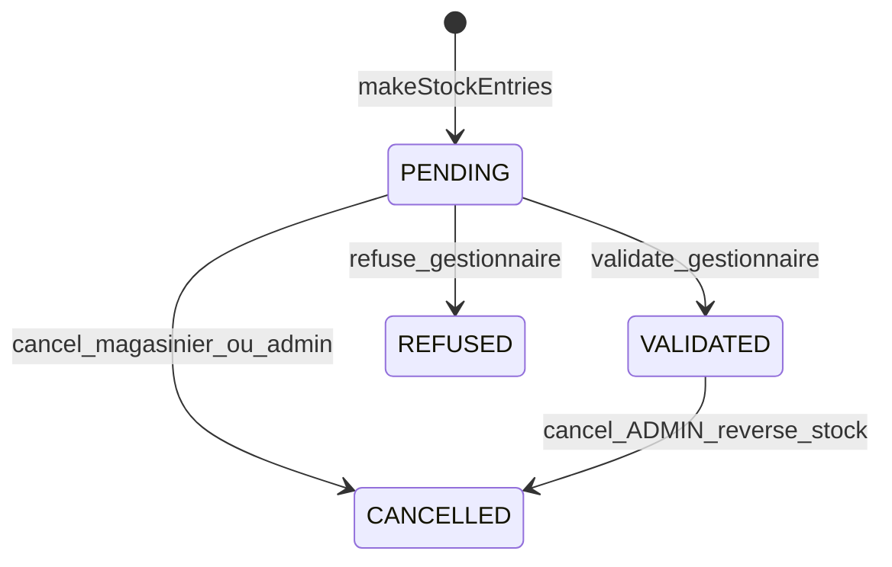

# Validation gestionnaire des entrées de stock + Plan mode par défaut

## Décisions actées

- **1A** : toute création d’entrée → `PENDING` (pas d’auto-validation ADMIN/GESTIONNAIRE).
- **2B** : le magasinier peut **annuler uniquement** une réception `PENDING` (abandon, aucun impact stock). L’annulation d’une réception **déjà `VALIDATED`** (reverse stock) reste **ADMIN uniquement**.
- **Refus** ≠ annulation : refus = action gestionnaire (`REFUSED`), sans impact stock ; annulation PENDING = abandon (`CANCELLED`) sans reverse ; annulation VALIDATED = reverse ADMIN.

## Préalable session : règle Plan mode

Créer une règle utilisateur `alwaysApply` (tous projets) dans `C:\Users\kahonsu\.cursor\rules\` :

- Pour toute tâche non triviale (feature, refactor multi-fichiers, analyse métier), appeler `SwitchMode` → `plan` **avant** de coder.
- Exceptions : fix trivial 1 fichier, question pure, commit/PR demandé explicitement.

*(Écriture de la règle au moment de l’exécution du plan — impossible en Plan mode.)*

---

## Flux cible

| Transition | Qui | Effet stock / FIFO / dépense / history ENTRY |
|------------|-----|-----------------------------------------------|
| → PENDING | Magasinier (création) | Aucun |
| PENDING → VALIDATED | GESTIONNAIRE, ADMIN | Appliquer (logique actuelle de `makeStockEntries`) |
| PENDING → REFUSED | GESTIONNAIRE, ADMIN | Aucun |
| PENDING → CANCELLED | Créateur magasinier, GESTIONNAIRE, ADMIN | Aucun |
| VALIDATED → CANCELLED | ADMIN seulement | Reverse (existant) |

---

## Backend

### 1. Statut + migration

- Étendre [`ReceptionStatus.java`](backend/src/main/java/com/optimize/elykia/core/enumaration/ReceptionStatus.java) : `PENDING`, `VALIDATED`, `REFUSED`, `CANCELLED`.
- Flyway : défaut colonne pour **nouvelles** lignes = `PENDING` ; historiques restent `VALIDATED`.
- Champs audit optionnels mais recommandés sur [`StockReception.java`](backend/src/main/java/com/optimize/elykia/core/entity/stock/StockReception.java) : `validatedBy` / `validatedAt`, `refusedBy` / `refusedAt`, `refusalReason`, `cancelledBy` / `cancelledAt`.

### 2. Création sans impact stock

Refactor [`ArticlesService.makeStockEntries`](backend/src/main/java/com/optimize/elykia/core/service/store/ArticlesService.java) :

- Créer `StockReception` + items, statut **`PENDING`**, calculer `totalAmount`.
- **Ne plus** appeler `makeEntry`, `registerEntry`, expense Approvisionnement, ni `ArticleHistory.buildEntryHistory`.
- Extraire la logique d’application dans une méthode réutilisable (ex. `applyStockReception(StockReception)` dans `StockReceptionService` ou service dédié).

### 3. Nouvelles opérations dans [`StockReceptionService`](backend/src/main/java/com/optimize/elykia/core/service/stock/StockReceptionService.java)

- `validateReception(id)` : uniquement `PENDING` ; rôles GESTIONNAIRE|ADMIN ; `applyStockReception` ; → `VALIDATED`.
- `refuseReception(id, reason?)` : uniquement `PENDING` ; GESTIONNAIRE|ADMIN ; → `REFUSED` (motif optionnel).
- Adapter `cancelReception(id)` :
  - Si `PENDING` : autoriser créateur (magasinier = `receivedBy` == current user) **ou** GESTIONNAIRE/ADMIN ; statut `CANCELLED` **sans** reverse stock.
  - Si `VALIDATED` : ADMIN uniquement ; reverse stock/FIFO/expense (logique actuelle).
  - Si `REFUSED` ou déjà `CANCELLED` : rejeter.

### 4. API [`StockReceptionController`](backend/src/main/java/com/optimize/elykia/core/controller/stock/StockReceptionController.java)

- `POST /api/v1/stock-receptions/{id}/validate`
- `POST /api/v1/stock-receptions/{id}/refuse` (body motif optionnel)
- Garder `DELETE /{id}` pour annulation (PENDING ou VALIDATED selon règles ci-dessus)
- Contrôles de rôle côté service (pattern [`StockRequestService`](backend/src/main/java/com/optimize/elykia/core/service/stock/StockRequestService.java))

### 5. DTO / filtre

- Exposer nouveau statut + champs audit.
- Filtre liste par statut (utile pour « En attente »).

---

## Frontend

### 1. Modèle + service

- [`stock-reception.model.ts`](frontend/src/app/core/models/stock-reception.model.ts) : `'PENDING' | 'VALIDATED' | 'REFUSED' | 'CANCELLED'`
- [`stock-reception.service.ts`](frontend/src/app/stock/services/stock-reception.service.ts) : `validate()`, `refuse()`, garder `cancel()`

### 2. Liste [`stock-reception-list`](frontend/src/app/stock/pages/stock-reception-list/)

- Badges : En attente / Validée / Refusée / Annulée
- Actions :
  - **Valider / Refuser** si `PENDING` et GESTIONNAIRE|ADMIN
  - **Annuler** si `PENDING` et (créateur magasinier **ou** gestionnaire/admin) — label type « Abandonner »
  - **Annuler** si `VALIDATED` et ADMIN seulement (reverse) — label « Annuler » existant
- Filtre statut + KPI « en attente » ; style UI liste ELYKIA

### 3. Détail réception

- Mêmes actions + affichage motif de refus si présent

### 4. Entrée stock UX

- [`inventory-add`](frontend/src/app/inventory/inventory-add/) + [`quick-stock-entry`](frontend/src/app/article/details/components/quick-stock-entry/) : toast « enregistrée — en attente de validation » ; redirection préférée vers `/stock/receptions`
- **Lazy-loading obligatoire** du domaine `inventory` (encore eager) dans la même tâche si on touche `inventory-add` — skill [frontend-lazy-loading-migration](.cursor/skills/frontend-lazy-loading-migration/SKILL.md). `stock/` déjà lazy.

### 5. Changelog

- [`docs/CHANGELOG.md`](docs/CHANGELOG.md) : sections Frontend + Backend (skill keep-changelog)

---

## Tests / non-régression

- Création PENDING → stock inchangé
- Validate → stock + FIFO + expense
- Refuse → stock inchangé, statut REFUSED
- Cancel PENDING (magasinier créateur) → CANCELLED, stock inchangé
- Cancel VALIDATED (non-ADMIN) → refusé
- Cancel VALIDATED (ADMIN) → reverse comme aujourd’hui
- Double validate / validate après refuse → erreur

---

## Hors scope

- Auto-validation
- Motif de refus obligatoire
- Changement du flux d’annulation ADMIN post-validation (hors renforcement des droits backend)
