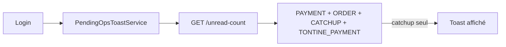

# Toast login : exclure les rattrapages

## Diagnostic

Le toast de [`pending-ops-toast.service.ts`](frontend/src/app/shared/service/pending-ops-toast.service.ts) appelle `AppNotificationService.unreadCount()` :

```29:33:frontend/src/app/shared/service/pending-ops-toast.service.ts
    this.notificationService.unreadCount().subscribe({
      next: (count) => {
        if (count <= 0) {
          return;
```

Côté backend, [`AppNotificationRepository.countUnreadUnresolvedForUser`](backend/src/main/java/com/optimize/elykia/core/repository/notification/AppNotificationRepository.java) compte **tous** les types non résolus non lus, y compris `TONTINE_CATCHUP`.

Résultat : s’il n’y a que des rattrapages → toast affiché à tort.



## Décision

- **Toast login** : compter uniquement les opérations « à valider » → exclure `TONTINE_CATCHUP`.
- **Cloche / page `/notifications`** : inchangées (les rattrapages restent visibles et comptés dans le badge).

Types qui déclenchent encore le toast : `PAYMENT_DECLARATION`, `TONTINE_PAYMENT_DECLARATION`, `CUSTOMER_ORDER`.

## Implémentation

### Backend

1. Ajouter dans [`AppNotificationRepository`](backend/src/main/java/com/optimize/elykia/core/repository/notification/AppNotificationRepository.java) deux requêtes miroirs des counts existants avec :
   - `AND n.type <> TONTINE_CATCHUP`
   - même filtre PROMOTER que `countUnreadUnresolvedForPromoter`

2. Dans [`AppNotificationService`](backend/src/main/java/com/optimize/elykia/core/service/notification/AppNotificationService.java) : méthode `unreadCountExcludingCatchup(User)` (même audience / branche promoter que `unreadCount`).

3. Dans [`AppNotificationController`](backend/src/main/java/com/optimize/elykia/core/controller/notification/AppNotificationController.java) : endpoint dédié  
   `GET /api/v1/app-notifications/unread-count-for-toast`  
   (évite d’altérer le badge qui utilise `/unread-count`).

4. Tests dans [`AppNotificationServiceTest`](backend/src/test/java/com/optimize/elykia/core/service/notification/AppNotificationServiceTest.java) : secretary + promoter appellent la bonne query.

### Frontend

1. [`app-notification.service.ts`](frontend/src/app/shared/service/app-notification.service.ts) (+ helper API si besoin) : `unreadCountForToast()`.
2. [`pending-ops-toast.service.ts`](frontend/src/app/shared/service/pending-ops-toast.service.ts) : basculer le toast sur `unreadCountForToast()` au lieu de `unreadCount()`.
3. Header badge : **ne pas toucher**.

### Livrables transverses

- Bump version Frontend + Backend + entrée [`docs/CHANGELOG.md`](docs/CHANGELOG.md) (skill keep-changelog).
- Plan `.cursor/plans/` inclus au commit si demandé.

## Critère de validation

- Uniquement des `TONTINE_CATCHUP` non lus → **pas de toast** au login ; badge peut rester > 0.
- Au moins un paiement / commande / cotisation tontine non lu → toast affiché.
- Page notifications et cloche : rattrapages toujours listés.