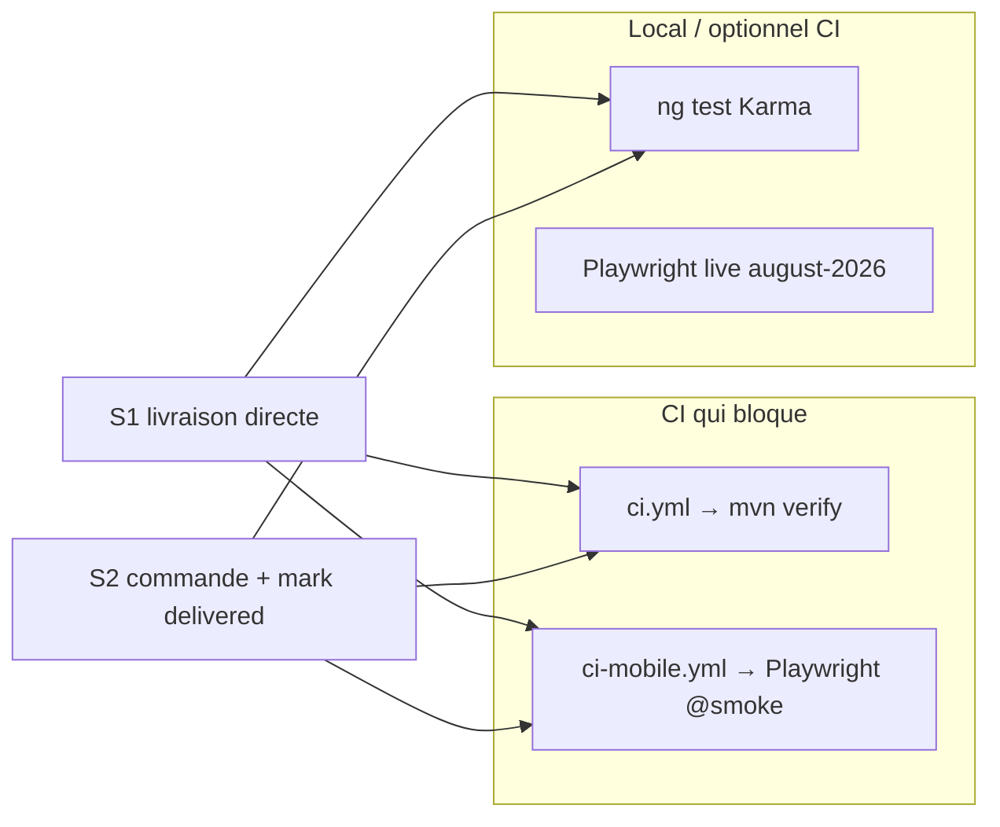

# Plan — Tests commande vs livraison directe (tontine_delivery)

**Statut :** brouillon — **à valider avant implémentation** (aucun code de test dans ce lot).  
**Produit validé :** [Plan commande vs livraison](/cursor/stores/bc-fbdc0dac-2b34-4a43-a4bd-57c4441d9067/docs/tontine-delivery-order-plan.md)  
**Feature :** [PR #104](https://github.com/AQUILA04/ELYKIA/pull/104) (`feat(tontine): commande vs livraison directe`) — déjà en review / CI green.  
**Hors périmètre de ce plan :** nouvelles features, Order/Distribution vente (PR #103), workflow `VALIDATED` magasinier.

---

## 1. Objectif

Garantir, de façon automatisée et **exécutable en CI**, les deux invariants produit :

| # | Scénario | Stock commercial tontine | Statut |
|---|----------|---------------------------|--------|
| **S1** | Créer une **livraison directe** pour un membre/client | Impacté **immédiatement** | `DELIVERED` |
| **S2a** | Créer une **commande** (order delivery) | **Non** impacté | `PENDING` (libellé « Commande ») |
| **S2b** | Puis **marquer comme livré** | Impacté | `DELIVERED` |

Référence décisions produit (plan validé) : pas de déduction stock à la commande ; commercial `PENDING` → `DELIVERED` sans étape web `VALIDATED` en v1.

---

## 2. Où vivent les tests aujourd’hui (patterns `mobile/` + backend)

### Backend (CI gate deploy — `ci.yml`)

- Framework : JUnit 5 + Mockito sous `backend/src/test/java/...`
- Qualité : `mvn -B verify --file backend/pom.xml` (job `build-backend`) — **les unit tests backend tournent déjà en CI**.
- Domaine livraison : [`TontineDeliveryServiceTest`](backend/src/test/java/com/optimize/elykia/core/service/TontineDeliveryServiceTest.java)
- Intégration plus large (contribution → distribute → mouvements) : `TontineContributionDeliveryIntegrationTest` — utile en régression stock ledger, pas requis pour les 2 scénarios UX v1.

### Mobile unit / intégration (Karma / Jasmine)

- Specs colocalisées : `*.spec.ts` à côté du code (`mobile/src/app/...`).
- Patterns proches déjà utilisés pour la tontine :
  - Write local-first : [`tontine-write.service.spec.ts`](mobile/src/app/core/services/tontine-write.service.spec.ts)
  - Sync : `mobile/src/app/core/services/sync/*.spec.ts` (ex. `tontine-collection-sync.service.spec.ts`)
  - Migrations SQLite : [`migration.service.spec.ts`](mobile/src/app/core/services/migration.service.spec.ts)
  - Utils purs : `*.util.spec.ts`
- Commande locale : `npm test` → `ng test` (Karma, Chrome).
- **Important CI :** [`.github/workflows/ci-mobile.yml`](.github/workflows/ci-mobile.yml) lance **uniquement** `npm run test:e2e:smoke` (+ build Android). **`ng test` / Karma n’est pas dans le pipeline mobile actuel.** Les specs unitaires protègent en local / PR review, mais ne bloquent pas le merge sauf décision d’étendre le CI (todo `mobile-unit-ci`).

### Mobile E2E (Playwright — déjà en CI smoke)

- Config : [`mobile/playwright.config.ts`](mobile/playwright.config.ts)
- Specs : `mobile/e2e/specs/` ; fixtures auth mock / live : `mobile/e2e/fixtures/`
- Helpers tontine : `e2e/fixtures/tontine-ops.ts`, `tontine-api.ts`
- Smoke existant tontine (navigation seulement) : [`e2e/specs/tontine-hybrid-allocation.spec.ts`](mobile/e2e/specs/tontine-hybrid-allocation.spec.ts) (`@smoke`)
- Flux live backend (hors smoke CI mobile) : `e2e/specs/august-2026/hybrid-writes.spec.ts` — pattern serial + backend réel ; **trop lourd / fragile** pour les 2 scénarios prioritaires en CI mobile.
- Tag recommandé pour ce plan : `@smoke` + API **mockée** (comme les smoke offline), afin de rester dans `test:e2e:smoke`.

---

## 3. Couverture déjà présente (PR #104) vs lacunes

### Backend — `TontineDeliveryServiceTest` (ajouté / étendu dans #104)

| Cas | Présent dans #104 ? | Assert stock ? |
|-----|---------------------|----------------|
| `createDelivery` → membre `PENDING` | Oui | Indirect : `creditService.createTontineCredit` **never** (stock commercial passe par le crédit tontine) |
| `deliverDelivery` depuis `PENDING` → `DELIVERED` + `deliveryDate` rafraîchie | Oui | Indirect : `creditService.createTontineCredit` **appelé** |
| `distributeTontineDelivery` → `DELIVERED` + crédit | Oui | Indirect : crédit appelé |
| Asserts sur quantités / `CommercialMonthlyStock` | Non | À renforcer si on veut un assert « stock » explicite (spy `CreditService` suffit pour le contrat de ce service) |

**Verdict backend :** les 2 scénarios métier sont **déjà largement couverts** au niveau service livraison. À ajouter surtout : documentation dans le test / assert commenté reliant crédit = impact stock, et éventuellement un test `create` qui vérifie aussi `never()` sur tout chemin stock (déjà le cas via crédit). Pas besoin de nouveau fichier si on complète celui-ci.

### Mobile — déjà dans #104 (12/12 selon description PR)

| Fichier | Couverture |
|---------|------------|
| `tontine-write.service.spec.ts` | **S2a** commande : pas d’appel `TontineStockRepository.updateQuantities` + `PENDING` ; **S1** directe : déduction stock + membre `DELIVERED` ; **S2b** `markDeliveryAsDelivered` : stock + `needsDeliverSync` |
| `tontine-delivery-status.util.spec.ts` | Libellés / `canMark…` / `isOrder` |
| `migration.service.spec.ts` | Migration v31 colonne `needsDeliverSync` |

### Lacunes recommandées (à implémenter après validation de ce plan)

1. **`tontine-delivery-sync.service.spec.ts`** (absent) — routing sync critique :
   - statut `PENDING`/`VALIDATED` → `POST …/deliveries`
   - statut `DELIVERED` (création) → `POST …/distribute`
   - `needsDeliverSync` → `PATCH …/{id}/deliver`
   - commande non sync puis livrée localement → traiter comme distribute (règle plan produit §6)
2. **E2E smoke UX** (pas de parcours création/livraison aujourd’hui) — mock API + `data-testid` sur action sheet / CTA fiche membre.
3. **Specs pages** (`delivery-creation.page.spec.ts`, `member-detail.page.spec.ts`) — optionnel / priorité basse : la logique stock est déjà dans le write service ; pages = wiring UI.
4. **Karma en CI** — option produit/eng : ajouter un job `ng test --browsers=ChromeHeadless --watch=false` dans `ci-mobile.yml` pour que les specs #104 + sync deviennent gate ; sinon les garder comme filet local + revue PR.

---

## 4. Matrice de tests proposée (après validation)

### Priorité P0 — doit tourner en CI

| ID | Couche | Où | Scénario | Assertions clés |
|----|--------|-----|----------|-----------------|
| B1 | Backend unit | `TontineDeliveryServiceTest` | S1 distribute | `DELIVERED` + `createTontineCredit` called |
| B2 | Backend unit | idem | S2a create | `PENDING` + crédit **never** |
| B3 | Backend unit | idem | S2b deliver | `DELIVERED` + crédit called + `deliveryDate` > `requestDate` |
| M1 | Mobile unit | `tontine-write.service.spec.ts` | S1 / S2a / S2b | déjà dans #104 — conserver / ne pas régresser |
| M2 | Mobile unit | **nouveau** sync spec | routing endpoints | create / distribute / deliver selon statut |
| E1 | Playwright `@smoke` | `e2e/specs/…` | S1 UX | choisir « Livraison directe » → statut livré (mock) ; interceptor vérifie `POST …/distribute` |
| E2 | Playwright `@smoke` | idem | S2 UX | « Commande » → pas d’impact stock mock ; « Marquer comme livré » → `PATCH …/deliver` (ou file sync) |

**Note stock mobile en E2E :** avec API mock, assert via appels réseau + éventuellement lecture UI statut / toast ; pas besoin de SQLite réel stock si le write service est déjà unitairement couvert.

### Priorité P1 — local / CI optionnel

| ID | Couche | Contenu |
|----|--------|---------|
| M3 | Karma pages | Action sheet + CTA visible seulement si `PENDING`/`VALIDATED` |
| M4 | CI Karma | Headless `ng test` dans `ci-mobile.yml` |
| B4 | Integration | Réutiliser / étendre `TontineContributionDeliveryIntegrationTest` seulement si régression ledger stock |

### Hors scope tests

- Frontend web admin livraison.
- Order / Distribution / crédit vente.
- Multi-livraisons par membre.
- Annulation de commande.

---

## 5. Scénarios détaillés (contrat de test)

### S1 — Livraison directe

**Given** membre éligible + stock commercial local / serveur suffisant.  
**When** création avec choix « Livraison directe ».  
**Then**
- Mobile local : `TontineDelivery.status = DELIVERED`, `member.deliveryStatus = DELIVERED`, `updateQuantities` appelé.
- Sync / API : `POST /api/v1/tontines/deliveries/distribute`.
- Backend : membre `DELIVERED` ; `creditService.createTontineCredit` (impact stock commercial).

### S2 — Commande puis livraison

**S2a — When** création « Commande ».  
**Then**
- Mobile : statut `PENDING`, **aucun** `updateQuantities`.
- Sync : `POST /api/v1/tontines/deliveries` (pas `/distribute`).
- Backend : `PENDING` ; crédit / stock **jamais**.

**S2b — When** « Marquer comme livré » sur fiche membre.  
**Then**
- Mobile : `DELIVERED`, stock déduit ; si déjà sync → `needsDeliverSync` + `PATCH …/deliver` ; si pas encore sync → chemin distribute (éviter double create).
- Backend deliver : `DELIVERED` + crédit/stock + `deliveryDate` effective.

---

## 6. Ordre d’implémentation (après validation utilisateur)

1. Confirmer ce plan (surtout : E2E smoke mock vs live ; Karma en CI oui/non).
2. Backend : petits renforts d’assert stock/crédit sur `TontineDeliveryServiceTest` (sur branche feature #104 ou follow-up tests-only).
3. Mobile unit : sync spec + garder write/status/migration #104.
4. E2E `@smoke` S1 + S2 avec mocks + `data-testid` manquants si besoin.
5. (Option) job Karma headless dans `ci-mobile.yml`.
6. PR **tests-only** (pas de feature) — changelog / bump mobile seulement si le skill version l’exige pour fichiers sous `mobile/` (même patch si seuls specs).

---

## 7. Critères d’acceptation de ce plan

- [ ] Les scénarios S1 et S2 (a+b) sont listés et mappés à des fichiers de test concrets.
- [ ] On sait ce que #104 couvre déjà vs ce qu’il reste.
- [ ] La stratégie privilégie les tests **déjà exécutés en CI** (backend verify + Playwright smoke).
- [ ] Aucun code de test n’est écrit tant que ce plan n’est pas validé.

---

## 8. Décisions à trancher à la validation

1. **E2E :** smoke mock en `ci-mobile` (recommandé) vs live august-2026 seulement ?
2. **Karma CI :** ajouter headless maintenant, ou reporter après consolidation des specs ?
3. **PR tests :** follow-up dédié après merge #104, ou commits tests sur #104 avant merge ?
