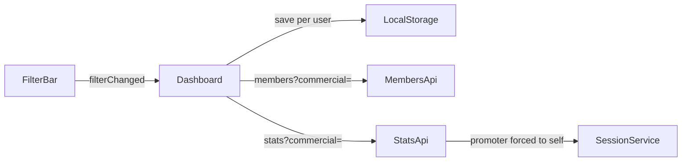

---
todos:
  - id: backend-stats
    status: completed
    content: 'Backend: commercial param on /stats, filtered repo queries, promoter forced filter, revenue by societyShare'
  - id: backend-tests
    status: completed
    content: 'Update TontineSessionServiceTest (unfiltered, commercial, promoter)'
  - id: front-kpi
    status: completed
    content: 'Frontend: service getSessionStats/getCurrentSession(commercial), dashboard refreshKpis + revenue priority'
  - id: front-storage
    status: completed
    content: 'Frontend: per-user filter storage service + signOut preserves elykia.prefs.* keys'
  - id: front-wire
    status: completed
    content: 'Dashboard/filter-bar: restore on init via initialFilters, save on change, keep filters on session change, stale commercial fallback'
  - id: guide-rag
    status: completed
    content: Update user-guide tontine page(s) and regenerate RAG index
  - id: changelog
    status: in_progress
    content: 'Bump frontend 2.25.2 + backend patch, CHANGELOG entries, build/tests + review'
name: Tontine KPI and saved filters
overview: 'Make the tontine dashboard KPI cards follow the selected commercial, with promoters always limited to their own members. Save the member-list filters per user in the browser, including across logout, until the user clicks « Effacer ».'
isProject: false
---

# Tontine dashboard: KPIs by commercial and saved filters

## Root causes

- **KPIs**: the cards come from `GET /api/v1/tontines/sessions/{id}/stats`, which takes no `commercial` parameter. The service only receives the session id, so the cards always show the global figures. Only the member list (`/members?commercial=`) uses the filter.
- **Lost filters**: the filter values live only in `TontineFilterBarComponent`, so they are reset each time the page loads. Also, `onSessionChange` in the dashboard resets `memberQueryParams`, and the session selector fires that event on every page load. Finally, `TokenStorageService.signOut()` runs `localStorage.clear()`, which would wipe any saved filters at logout.

## Backend (KPIs filtered by commercial)

- [`TontineSessionController.java`](backend/src/main/java/com/optimize/elykia/core/controller/tontine/TontineSessionController.java): add `@RequestParam(required = false) String commercial` to `/{sessionId}/stats`.
- [`TontineSessionService.java`](backend/src/main/java/com/optimize/elykia/core/service/tontine/TontineSessionService.java):
  - New method `getSessionStats(Long sessionId, String commercial)`. A blank value or `ALL` means no filter. If the current user is a promoter (`currentUser.is(UserProfilConstant.PROMOTER)`), the filter is forced to their username, the same rule as `TontineService.getMembers`. This requires injecting `UserService`.
  - The existing `getSessionStats(Long)` stays global (`commercial = null`) for the Excel and PDF exports in `TontineExportService`.
  - Revenue: with no filter, keep `session.getTotalRevenue()`. With a commercial, use the filtered sum of `societyShare`.
- [`TontineMemberRepository.java`](backend/src/main/java/com/optimize/elykia/core/repository/TontineMemberRepository.java): add filtered queries that match the member list (`c.tontineCollector`):
  - `countBySessionAndCommercial`, `countBySessionAndCommercialAndDeliveryStatus`, `sumTotalContributionBySessionAndCommercial`, `sumSocietyShareBySessionAndCommercial`
  - Each uses the condition `(:commercial IS NULL OR tm.client.tontineCollector = :commercial)`.
- [`TontineCollectionRepository.java`](backend/src/main/java/com/optimize/elykia/core/repository/TontineCollectionRepository.java): add `sumDeliveryCollectionsBySessionAndCommercial`, filtering on `tc.tontineMember.client.tontineCollector`.
- `topCommercials` stays unchanged, since the dashboard does not display it.
- [`TontineSessionServiceTest.java`](backend/src/test/java/com/optimize/elykia/core/service/TontineSessionServiceTest.java): update the mocks and add three cases: no filter, commercial filter, and promoter forced to their own username.
- No DDL change, so the AI schema catalog does not need an update.

## Frontend: KPIs

- [`tontine.service.ts`](frontend/src/app/tontine/services/tontine.service.ts): `getSessionStats(sessionId, commercial?)` and `getCurrentSession(commercial?)` add the `commercial` HTTP parameter when it is set.
- [`tontine-dashboard.component.ts`](frontend/src/app/tontine/pages/tontine-dashboard/tontine-dashboard.component.ts):
  - New `private refreshKpis()` that calls `getSessionStats(currentSession.id, memberQueryParams.commercial)` and does nothing if no session is loaded yet.
  - `onFilterChange`: call `refreshKpis()` only when `commercial` changes.
  - `loadCurrentSessionAndMembers` and `refreshData`: pass `memberQueryParams.commercial` to `getCurrentSession`.
  - In `createKPICards`, Revenu Total becomes `kpis.totalRevenue ?? session?.totalRevenue`, so the filtered revenue takes priority.

## Frontend: saved filters (per user, kept across logout)

- New service [`tontine-member-filter-storage.service.ts`](frontend/src/app/tontine/services/tontine-member-filter-storage.service.ts):
  - Key: `elykia.prefs.tontine.members.filters.<username>`. The username comes from `AuthService.getCurrentUser()?.username`; if there is no username, nothing is saved.
  - Saved values: `search`, `deliveryStatus`, `commercial`, `carnetVerified`, `registrationSource`.
  - Methods `load()`, `save(filters)` and `clear()`. When every filter is empty, `save` removes the key. Corrupted JSON is ignored.
- [`token-storage.service.ts`](frontend/src/app/shared/service/token-storage.service.ts): `signOut()` keeps the keys prefixed `elykia.prefs.` (read them before `localStorage.clear()`, then write them back). Everything else is still wiped.
- Dashboard:
  - In `ngOnInit`, before the first load, read the saved filters into `memberQueryParams` and pass them to the filter bar through `[initialFilters]`.
  - `onFilterChange` saves the filters with `storage.save(...)`.
  - `onSessionChange` no longer resets the filters, only `page: 0`. Search, sort and page size are kept.
- [`filter-bar.component.ts`](frontend/src/app/tontine/components/filter-bar/filter-bar.component.ts): new `@Input() initialFilters`, applied to the `current*` fields in `ngOnInit` before the existing emit. After `loadAgents()`, if the saved commercial is no longer in the list, fall back to `ALL` and emit again. `clearFilters()` is unchanged: it emits empty filters, so the saved filters are deleted.

## Delivery

- User guide [`user-guide/docs/commercial/tontine.md`](user-guide/docs/commercial/tontine.md), sections "Les indicateurs clés" and "Trouver rapidement un membre":
  - The cards show the figures for the selected commercial.
  - The filters are kept when the user leaves the page and comes back, until they click « Effacer ».
  - Update the print version `guide_complet_commercial.md` if it repeats this section.
  - Then run `python user-guide/generate_rag_index.py`.
- Version bumps: frontend `2.25.1` to `2.25.2`, plus a backend patch bump in `pom.xml`. Add both entries to [`docs/CHANGELOG.md`](docs/CHANGELOG.md).
- Checks: `mvn test -Dtest=TontineSessionServiceTest`, a frontend build, then a code review of the diff.
