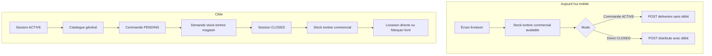

# Commande tontine depuis le catalogue (sans stock préalable)

## Constat

Aujourd’hui le découpage métier est déjà correct **côté API** :

| Étape | Endpoint | Stock tontine commercial |
|-------|----------|--------------------------|
| Commande | `POST /deliveries` | **Aucun** contrôle ni débit |
| Remise | `PATCH …/deliver` ou `POST …/distribute` | Validation + débit via `CreditService.createTontineCredit` |

`persistNewDelivery` charge l’article catalogue par `articleId`, contrôle le **budget membre** (`availableContribution`), et ne touche pas au stock. Le débit n’intervient qu’à la remise (`deliver` / `distribute`).

Le **blocage est surtout mobile** : l’écran [delivery-creation.page.ts](mobile/src/app/features/tontine/pages/delivery-creation/delivery-creation.page.ts) ne liste que `TontineStock` avec `availableQuantity > 0` ([tontine-stock.repository.extensions.ts](mobile/src/app/core/repositories/tontine-stock.repository.extensions.ts)). Même en mode commande (`ACTIVE`), le commercial doit donc déjà avoir été doté.

Le **frontend admin** fait déjà la bonne chose pour la commande : la modale [delivery-article-selection-modal](frontend/src/app/tontine/components/modals/delivery-article-selection-modal/delivery-article-selection-modal.component.ts) charge le **catalogue** (`ItemService.getEnabledArticlesPage`) avec `sellingPrice` et appelle `createDelivery`.

## Objectif produit

- **Commande** (session `ACTIVE`) : choisir dans le **catalogue général**, sans exiger que le commercial ait déjà du stock tontine.
- **Livraison directe / Marquer comme livré** (session `CLOSED`) : continuer à s’appuyer sur le **stock tontine du commercial** (contrôle + débit).
- Le magasin / flux stock-tontine reste le moyen d’alimenter le commercial **avant** la remise physique (après la commande, pas avant).

## Décision prix (verrouillée)

| Canal | Prix actuel commande | Cible |
|-------|----------------------|-------|
| Admin web | `sellingPrice` | inchangé |
| Mobile (stock tontine) | `TontineStock.unitPrice` | inchangé pour DIRECT / remise |
| Mobile (catalogue) | seul `creditSalePrice` est en SQLite | **étendre sync + modèle avec `sellingPrice`** et l’utiliser pour la commande |

**Décision** : aligner la commande catalogue mobile sur **`sellingPrice`**, comme l’admin, pour éviter deux tarifs tontine selon le canal. Travail associé : colonne / champ `sellingPrice` dans le modèle Article mobile, schéma SQLite et upsert sync (le DTO backend `ArticlesDto` l’expose déjà).

## Plan d’implémentation

### 1. Mobile — séparer la source d’articles selon le mode

Fichiers principaux :
- [delivery-creation.page.ts](mobile/src/app/features/tontine/pages/delivery-creation/delivery-creation.page.ts) / `.html`
- [article.repository.ts](mobile/src/app/core/repositories/article.repository.ts) + [database.service.ts](mobile/src/app/core/services/database.service.ts) (ajout `sellingPrice`)
- store / sélecteurs articles existants (réutiliser plutôt qu’un store tontine-stock)

Comportement :

| Contexte UI | Source liste | Plafond quantité | Débit local | Prix |
|-------------|--------------|------------------|-------------|------|
| Session `ACTIVE` (commande) | Catalogue `articles` ENABLED | Budget membre seulement | Aucun (`stockUpdates: []`) | `sellingPrice` |
| Session `CLOSED` (livraison directe) | Stock tontine `availableQuantity > 0` | Capé par stock | Oui | `unitPrice` stock |

Détails techniques :
- Panier clé par `articleId` en mode commande (pas seulement `stockId`).
- Bandeau mode clair : « Commande — catalogue » vs « Remise — stock tontine ».
- Sur **Marquer comme livré** : si stock local insuffisant pour un article commandé, message explicite (le serveur refuse déjà).
- Empty state commande : « Aucun article catalogue » / sync, **pas** « aucun stock tontine ».

### 2. Backend — peu ou pas de changement fonctionnel

Déjà OK :
- `createDelivery` : articles catalogue + budget, session `ACTIVE`, pas de stock.
- `deliver` / `distribute` : session `CLOSED` + `validateTontineStockAvailability` + débit.

Renforcements recommandés :
- Message d’erreur métier plus clair si stock insuffisant à la remise (« Stock tontine insuffisant pour l’article X — faites une demande de stock tontine »).
- Tests : commande sans ligne stock OK ; remise sans stock KO (déjà partiellement couverts — étendre si besoin).

### 3. Frontend admin — confirmation, pas de refonte

Déjà catalogue pour **Préparer la Livraison**.  
Option UX légère (non bloquante) : badge lecture seule « stock commercial : oui / non / partiel » pour anticiper la remise.

### 4. Guide + versions

- [user-guide/docs/commercial/mobile_app.md](user-guide/docs/commercial/mobile_app.md) : commande = catalogue ; remise = stock tontine du commercial (après demande magasin si besoin).
- Aligner [tontine.md](user-guide/docs/commercial/tontine.md) web.
- Régénérer index RAG + HTML frontend.
- Changelog + bump : Mobile (mineur) ; Backend patch si messages seulement ; Frontend patch si badge.

## Hors scope / risques

- Ne **pas** débiter le stock à la commande.
- Ne **pas** permettre une livraison directe / remise sans stock commercial.
- Hors-ligne : commande catalogue OK si articles sync ; livraison directe toujours limitée au stock local.
- Écart possible `year` vs `tontineSessionId` sur la liste DIRECT — à surveiller.
- Migration SQLite mobile : ajouter `sellingPrice` sans casser les installs existantes (ALTER / recreate selon le pattern du projet).

## Ordre de livraison

1. Mobile : sync + modèle `sellingPrice` sur articles.
2. Mobile : liste catalogue en session `ACTIVE` + panier `articleId`.
3. Mobile : garder stock tontine en session `CLOSED` pour DIRECT / remise.
4. Messages d’erreur remise (backend + mobile).
5. Guides + tests (unit / smoke commande sans ligne stock).
6. Optionnel : badge stock commercial côté admin.
