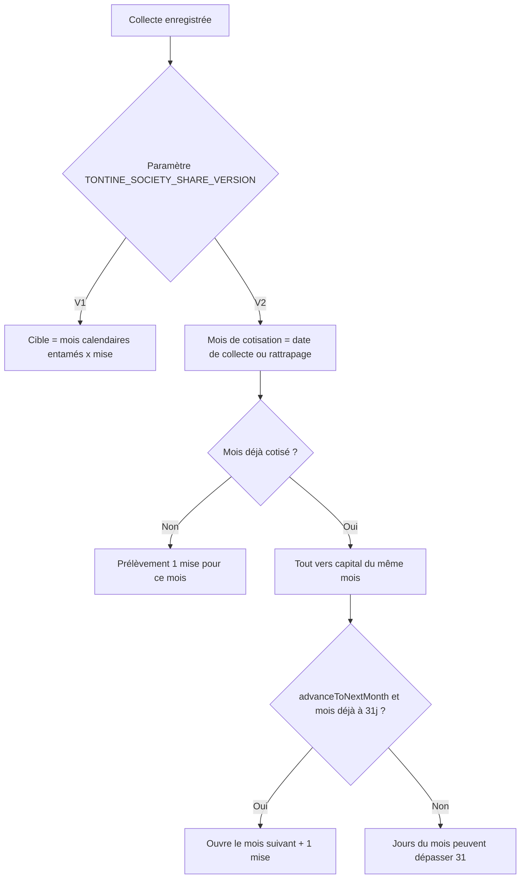
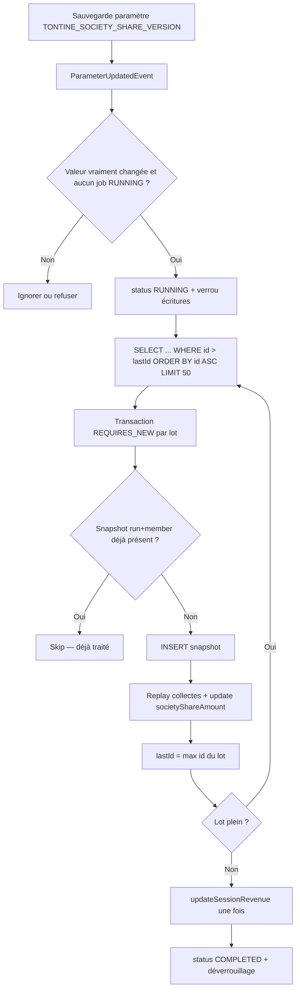

# Part société tontine V1/V2

## Écart V1 vs métier

Aujourd’hui dans [`TontineService.java`](backend/src/main/java/com/optimize/elykia/core/service/tontine/TontineService.java) :

- **Part société (V1)** : `calculateTargetSocietyShare` facture **chaque mois calendaire entamé** depuis le début de session (ou la date d’inscription si `USE_MEMBER_REGISTRATION_DATE_FOR_SHARE`), plafonné à 10, **même sans aucune collecte** ce mois-là.
- **Capital (V1)** : `calculateMemberStatus` convertit le capital en mois **successifs** via `jours / 31`. Dépasser 31 jours ouvre automatiquement le mois suivant — ce n’est pas un blocage à l’enregistrement, mais un enchaînement implicite.

Conséquence : inscrit en février, première collecte en mars, trou en avril, collecte en mai → V1 prélève février+mars+avril+mai. Le métier V2 ne doit prélever que **mars et mai** (et février/avril seulement si rattrapage).

## Décisions retenues

- **V1 inchangée**, sélectionnée par défaut.
- **Basculement** via paramètre `TONTINE_SOCIETY_SHARE_VERSION` : déclenche **automatiquement** un job async (pas d’appel admin manuel).
- **Recalcul global** de tous les membres de la session active, **après snapshot** par membre. Le revenu session peut baisser.
- **Écritures tontine bloquées** pendant le job ; **bandeau d’alerte** sur les pages tontine frontend.
- Flag API `advanceToNextMonth` (pas de checkbox UI). Mobile offline reste en logique V1 (budget livraison sous-estimé) — hors périmètre.

## Paramètre

Nouveau paramètre `TONTINE_SOCIETY_SHARE_VERSION` :

- Valeurs : `V1` (défaut) | `V2`
- Init dans [`backend/src/main/resources/application.yml`](backend/src/main/resources/application.yml) et [`backend-lib/common-securities/src/main/resources/application.yml`](backend-lib/common-securities/src/main/resources/application.yml)
- Ajouter `ParameterService.getValue(String key)` (aujourd’hui seul `isEnabled` booléen existe)
- Publier un `ParameterUpdatedEvent(key, oldValue, newValue)` depuis `ParameterService.update` / `create` dans [`ParameterService.java`](backend-lib/common-securities/src/main/java/com/optimize/common/securities/service/ParameterService.java) — seul hook propre, le [`ParameterController`](backend-lib/common-securities/src/main/java/com/optimize/common/securities/controllers/ParameterController.java) étant dans la lib
- Listener backend : ne réagir que si `key == TONTINE_SOCIETY_SHARE_VERSION` **et** `oldValue != newValue` (V1↔V2). Un save sans changement ne lance pas le job. Un job déjà `RUNNING` refuse une nouvelle bascule (`CustomValidationException`)

`USE_MEMBER_REGISTRATION_DATE_FOR_SHARE` **ne concerne que V1**. En V2, le point de départ n’est plus « mois entamés depuis l’inscription » mais « mois avec au moins une collecte ».

## Architecture backend

Extraire deux politiques, `TontineService` ne fait plus que dispatcher :

- `TontineAllocationPolicy` + `V1TontineAllocationPolicy` (code actuel déplacé) + `V2TontineAllocationPolicy`
- `TontineAllocationPolicyResolver` lit le paramètre

Fichiers cibles : package `backend/src/main/java/com/optimize/elykia/core/service/tontine/` (nouveau sous-package `allocation/` de préférence).

### Règles V2 — part société

Cible = somme des mises journalières (historique montants, comme aujourd’hui) pour **chaque mois distinct réellement cotisé**, plafond 10.

Un mois est cotisé si au moins une collecte `ENABLED` lui est rattachée :

- Collecte du jour → mois calendaire de `collectionDate` (aujourd’hui).
- Rattrapage (`collectionDate` passée) → **mois rattrapé**, même s’il n’avait aucune cotisation : prélèvement automatique de la part société de ce mois.
- Mois sans collecte (ex. février, avril) → **0**. Pas de rattrapage implicite quand on cotise en mai.

Sur la **première** collecte d’un mois : prélever `min(montant, mise du mois)`. Si la collecte est inférieure à la mise, le déficit reste et les collectes suivantes du **même mois** le comblent (même mécanique de déficit qu’aujourd’hui, mais bornée aux mois ouverts).

### Règles V2 — 31 jours et `advanceToNextMonth`

- Plus de conversion `capital / 31` en mois successifs.
- Un mois cotisé peut dépasser 31 jours de capital (ex. 40/31). `currentMonthDays` peut être `> 31`.
- `validatedMonths` V2 = nombre de mois cotisés ayant **au moins 31 jours** de capital (plafond 10). Les mois cotisés à 10/31 comptent pour la part société mais pas comme mois « validé ».
- `TontineCollectionDto.advanceToNextMonth` (booléen, défaut `false`) :
  - Si le mois courant a déjà ≥ 31 jours de capital : toute la collecte va au **mois suivant** + prélèvement part société de ce mois.
  - Si une seule collecte fait passer le mois de &lt; 31 à &gt; 31 **et** le flag est vrai : remplir 31 jours sur le mois courant, surplus + part société sur le mois suivant (split d’allocation en mémoire, **une** ligne de collecte).
  - Si le flag est vrai alors que le mois n’atteint pas 31 jours (même après cette collecte) : `CustomValidationException`.
  - Ignoré en V1.

Le replay (`recalculateMemberFromCollections`, annulation, changement de mise `GLOBAL`) relit le flag persisté et rejoue chronologiquement.

### Persistance

Flyway `V92__tontine_collection_allocation_v2.sql` :

- Sur `tontine_collection` : `advance_to_next_month boolean default false`, `contribution_month date` (1er du mois ; backfill `date_trunc('month', collection_date)`). Source de vérité du replay = date + flag + ordre.
- Tables job (modèle proche de [`TontineCollectionResetRun`](backend/src/main/java/com/optimize/elykia/core/entity/report/TontineCollectionResetRun.java)) :

`tontine_allocation_migration_run` : `session_id`, `from_version`, `to_version`, `status` (`PENDING|RUNNING|COMPLETED|FAILED`), `triggered_by`, `total_members`, `processed_members`, `failed_members`, `last_processed_member_id`, `started_at`, `finished_at`, `error_message`.

`tontine_member_allocation_snapshot` : une ligne **par membre et par run**, écrite **avant** le recalc — c’est aussi le **registre des membres déjà traités** :

- `run_id`, `member_id`, `client_id`
- `society_share`, `total_contribution`, `available_contribution`, `validated_months`, `current_month_days`
- `collections_society_share` JSONB : `[{collectionId, societyShareAmount}]` pour pouvoir reconstruire l’allocation par collecte

Contrainte **`UNIQUE (run_id, member_id)`** (idempotence : un second passage du même membre ne recréé pas de snapshot et ne relance pas le recalc). Index `(run_id)`.

Étendre [`TontineCollection`](backend/src/main/java/com/optimize/elykia/core/entity/tontine/TontineCollection.java), [`TontineCollectionDto`](backend/src/main/java/com/optimize/elykia/core/dto/TontineCollectionDto.java), [`TontineCollectionRespDto`](backend/src/main/java/com/optimize/elykia/core/dto/TontineCollectionRespDto.java).

## Job de migration à la bascule (performant)

Règles de perf (ne **pas** charger toute la session en une transaction, contrairement à [`TontineCollectionResetService`](backend/src/main/java/com/optimize/elykia/core/service/tontine/TontineCollectionResetService.java)) :

- `@Async` sur un executor dédié (`tontineMigrationExecutor`, pool 1 thread — un seul job à la fois).
- **Pas de pagination OFFSET / `Pageable` page 0,1,2…** : sans `ORDER BY` stable, PostgreSQL peut renvoyer un ordre différent d’un appel à l’autre → le même membre sur deux lots (ou un membre sauté). Même avec un ordre, un OFFSET se décale si le jeu change.
- **Keyset** : nouvelle requête `findNextEnabledBySessionId(sessionId, lastId, PageRequest.of(0, 50))` du type `WHERE tm.tontineSession.id = :sessionId AND tm.state = ENABLED AND tm.id > :lastId ORDER BY tm.id ASC`. `lastId` initial = `0` (ou `run.lastProcessedMemberId` pour reprise après crash).
- **Idempotence via snapshot** : avant recalc, si une ligne `(run_id, member_id)` existe déjà → skip. L’insert unique empêche un double traitement même en cas de retry du lot.
- **Une transaction `REQUIRES_NEW` par lot** (50 membres) : snapshot puis recalc. Échec d’un membre : incrémenter `failed_members`, logger, continuer ; le run passe `FAILED` seulement si une erreur fatale arrête le job. Après chaque lot : persister `last_processed_member_id`.
- Collectes : `findByTontineMember_IdAndStateOrderByCollectionDateAscIdAsc` **par membre** (déjà utilisé par le replay) — pas de `findAll` session.
- `updateSessionRevenue` **une seule fois** en fin de job.
- `clear()` / pas de persistence context géant : le lot se termine et commit.
- Replay V2 doit aussi **réécrire** `TontineCollection.societyShareAmount` (le recalc actuel ne le fait pas).

Déclenchement : listener `@TransactionalEventListener(AFTER_COMMIT)` sur `ParameterUpdatedEvent` pour ne lancer le job qu’après commit du paramètre. Même job si bascule **V2 → V1** (réalignement + snapshot). Endpoint `POST .../recalculate-allocations` **conservé en filet** (rejeu manuel si le listener a échoué), mais le chemin normal est automatique.

**Effet financier** : `societyShare` peut baisser, `availableContribution` augmenter, `totalRevenue` session réaligné. Les snapshots gardent l’état V1 (ou précédent) pour audit / rollback manuel.

## Verrouillage des écritures + alerte frontend

Tant que le run le plus récent est `PENDING` ou `RUNNING` :

- Refuser dans [`TontineService`](backend/src/main/java/com/optimize/elykia/core/service/tontine/TontineService.java) : `recordCollection`, `registerMember` / `registerMembers`, `cancelCollection`, `updateMember` (montant), rattrapage. Message explicite (migration en cours).
- Lectures (listes, détail, exports) **autorisées**.
- `GET /api/v1/tontines/allocation-migration/status` → `{ running, fromVersion, toVersion, processedMembers, totalMembers, startedAt }` (sans auth spéciale au-delà du droit tontine existant).

Frontend (module [`tontine`](frontend/src/app/tontine/) **déjà lazy** — pas de migration du domaine eager `parameters`) :

- Composant bandeau `TontineAllocationMigrationBannerComponent` (style info/warn existant, skill UI tontine) inclus sur dashboard, détail membre, collectes, livraisons.
- Au `ngOnInit` des pages (ou shell partagé) : appeler le status ; si `running`, afficher *« Recalcul des parts société en cours (V1 → V2). Les nouvelles collectes et inscriptions sont temporairement bloquées. »* + progression `processed/total`. Polling léger (ex. 5 s) jusqu’à `running=false`.
- Désactiver les boutons « Enregistrer une collecte » / rattrapage / inscription tant que `running`.
- Ne **pas** modifier [`parameter-edit`](frontend/src/app/parameters/parameter-edit/parameter-edit.component.ts) (domaine eager `parameters` : une confirmation là imposerait une migration lazy hors scope).

Mobile : pas de bandeau cette itération ; l’API renvoie l’erreur si une collecte est tentée pendant le job.

## Tests

Étendre / ajouter des tests unitaires (sans réflexion si possible, méthodes package-visible ou policy testable) :

- Scénario métier : inscription février, 0 collecte février, collecte mars, 0 avril, collecte mai → 2 parts (mars+mai).
- Rattrapage février et avril → +2 parts.
- Collecte partielle &lt; mise sur un nouveau mois → déficit comblé à la collecte suivante du même mois.
- Dépassement 31 jours sans flag → même mois, `currentMonthDays > 31`, pas de part du mois suivant.
- Flag `advanceToNextMonth` après 31 jours → part du mois suivant.
- V1 inchangée : tests existants de [`TontineCollectionAllocationTest.java`](backend/src/test/java/com/optimize/elykia/core/service/TontineCollectionAllocationTest.java) (cible = mois calendaires jusqu’à la date d’allocation).
- Recalcul session : après replay V2, `societyShare` aligné sur les mois cotisés.
- Job : snapshot écrit avant mutation ; membre déjà snapshoté pour le run → skip ; keyset `id > lastId ORDER BY id` (pas d’OFFSET) ; écriture `recordCollection` refusée si run `RUNNING`.
- Status API : `running=true` pendant le job, `false` après `COMPLETED`.

[`TontineCalculationTest.java`](backend/src/test/java/com/optimize/elykia/core/service/TontineCalculationTest.java) décrit une ancienne logique (part = mois validés / 31) **divergente** du V1 actuel ; ne pas s’en servir comme oracle V1.

## Hors périmètre (cette itération)

- Checkbox frontend / mobile « passer au mois suivant ».
- Confirmation dédiée dans l’écran Paramètres (domaine eager — migration lazy hors scope).
- Alignement `TontineCalculationService` mobile et bandeau rattrapage (« part société jusqu’à la date choisie » = libellé V1).
- Rollback automatique depuis snapshot (les lignes restent consultables / exportables ; restauration = opération manuelle ultérieure).
- Customer-space : affichera les nouveaux `validatedMonths` / `societyShare` API sans changement de code.

## Livrables transverses

- Changelog [`docs/CHANGELOG.md`](docs/CHANGELOG.md) + bump mineur [`backend/pom.xml`](backend/pom.xml) (`1.9.16` → `1.10.0`) et patch frontend (bandeau tontine).
- Skills : [`frontend-ui-style`](c:\Users\kahonsu\Documents\GitHub\ELYKIA\.cursor\skills\frontend-ui-style\SKILL.md) pour le bandeau ; pas de bump mobile.
