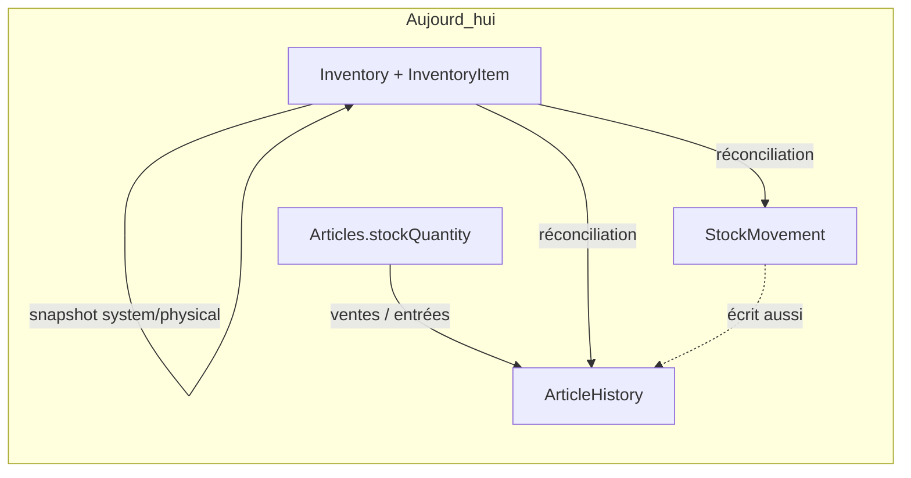
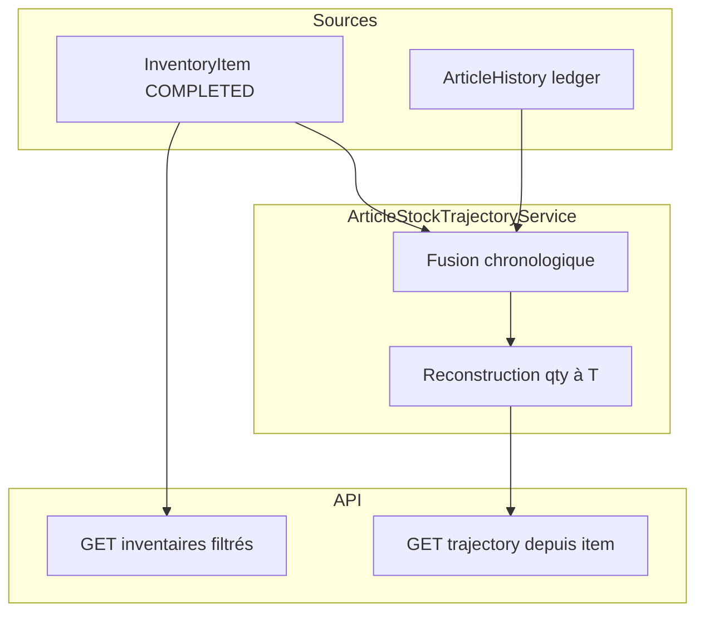

# Trajectoire article depuis inventaire (conception métier + technique)

## Constat (état actuel)

Le modèle métier existe déjà partiellement, mais **n’est pas exploité comme une timeline**.



| Capacité | Existe ? | Limite |
|---|---|---|
| Snapshot inventaire (`systemQuantity`, `physicalQuantity`, écart, réconciliation) | Oui | Pas exposé en consultation historique côté UI |
| Liste API inventaires `GET /api/v1/inventories` | Oui ([InventoryController](backend/src/main/java/com/optimize/elykia/core/controller/inventory/InventoryController.java)) | Le front appelle `/articles/enabled` via `getInventories()` — la page « Inventaires » affiche le **catalogue articles**, pas l’historique des inventaires |
| Journal chronologique stock | Oui ([ArticleHistory](backend/src/main/java/com/optimize/elykia/core/entity/article/ArticleHistory.java)) | Pas de lien inventaire / vente / motif ; précision métier `operationDate` = `LocalDate` (heure via `DATE_REG` auditable seulement) |
| `StockMovement` | Partiel | Ventes crédit → uniquement `ArticleHistory` (`makeStockRelease`) ; pas de FK inventaire ; double écriture + `stockBefore` faux après réconciliation |

**Analogie Git utile pour le métier :**

| Git | ELYKIA |
|---|---|
| Commit / tag (snapshot) | `InventoryItem` d’un inventaire `COMPLETED` |
| Diff / commit courant | entrée `ArticleHistory` (ENTREE, SORTIE, RETURN, RESET, INVENTORY_ADJUSTMENT…) |
| `git log A..HEAD` | trajectoire depuis un inventaire jusqu’à date T |
| Working tree | stock système actuel de l’article |

---

## Proposition métier : « Trajectoire article »

Objectif : à partir d’un **item d’inventaire**, répondre à :

1. Quel stock a été **constaté** et **retenu système** à cet inventaire ?
2. Quels **mouvements** se sont produits jusqu’à la date T ?
3. Quels **inventaires intermédiaires** l’article a-t-il traversés ?
4. Quel stock **reconstruit** à T, et comment se compare-t-il au stock système actuel ?

### Règles d’ancrage (baseline)

Pour un `InventoryItem` source :

- **Constat physique** = `physicalQuantity` (si saisie)
- **Stock retenu système** (baseline de reconstruction) :
  - `VALIDATED` → `physicalQuantity` (= système)
  - réconciliation `ADJUST_TO_PHYSICAL` / surplus → `physicalQuantity` (stock aligné)
  - `MARK_AS_DEBT` / `CANCEL_DEBT` → `systemQuantity` (le stock n’a pas été modifié ; le physique reste informatif)
- Instant d’ancrage = `inventory.completedAt` si présent, sinon fin de `inventoryDate`

À chaque **jalon inventaire intermédiaire**, afficher les deux lectures (physique vs système) + action de réconciliation — c’est le « merge commit » métier qui explique un écart non couvert par les mouvements.

### Valeur métier concrète

- Expliquer un écart au prochain inventaire : *attendu = baseline + somme des deltas signés*
- Auditer un article « perdu » entre deux inventaires (sorties, resets, ajustements)
- Comparer stock reconstruit à T vs stock actuel (détecte trous de traçabilité)
- Consulter un inventaire passé en lecture seule (aujourd’hui impossible côté UI)

---

## Architecture cible



**Choix technique figé :** `ArticleHistory` reste le **ledger unique** pour reconstruire les quantités (c’est déjà le journal des ventes). Les inventaires deviennent des **nœuds jalon** injectés dans la timeline. `StockMovement` reste enrichissement métier (lien crédit, motif) quand disponible, mais n’est **pas** la source de reconstruction (couverture incomplète).

---

## Modèle de réponse API

`GET /api/v1/inventory-items/{itemId}/trajectory?toDate=YYYY-MM-DD` (défaut = maintenant)

```text
ArticleStockTrajectoryDto
  articleId, articleName, ...
  from: InventoryCheckpointDto   // inventaire source
  toDate, reconstructedQuantity, currentSystemQuantity, drift
  summary: { totalIn, totalOut, netDelta, movementCount, intermediateInventoryCount }
  nodes: TimelineNodeDto[]       // chronologique croissant
```

Chaque nœud :

- `kind`: `INVENTORY_CHECKPOINT` | `MOVEMENT`
- `occurredAt`, `quantityBefore`, `quantityAfter`, `delta`
- checkpoint : `inventoryId`, `systemQuantity`, `physicalQuantity`, `difference`, `itemStatus`, `reconciliationAction`
- movement : `historyId`, `operationType`, `operationUser`, `reference` (optionnel après enrichissement)

Calcul :

`reconstructed(T) = baselineSystème + Σ delta(mouvements) où occurredAt ∈ (anchor, T]`

avec `delta` signé selon le type (`ENTREE`/`RETURN`/`INVENTORY_ADJUSTMENT+` positifs ; `SORTIE`/`CANCEL_RECEPTION`/`RESET` négatifs — `RESET` traité comme passage à 0 : delta = `-initialQuantity`).

Les checkpoints intermédiaires **n’ajoutent pas** un second delta s’il existe déjà un `INVENTORY_ADJUSTMENT` correspondant ; ils annotent la timeline. S’il y a un écart entre qty reconstruite juste avant le jalon et le `systemQuantity` du jalon → signal `gapDetected` (trous de journal).

Point d’entrée secondaire (même service) :

`GET /api/v1/articles/{id}/trajectory?fromInventoryId=&toDate=`

---

## Fondations données (migrations + écriture)

Fichier migration Flyway (ex. `V80__article_history_trajectory.sql`) :

1. Enrichir `article_history` :
   - `occurred_at TIMESTAMP` (backfill depuis `DATE_REG`, fallback `operation_date`)
   - `inventory_item_id` nullable FK
   - `reference_type` / `reference_id` nullable (ex. `CREDIT`, `STOCK_RECEPTION`, `INVENTORY`)
   - `reason` nullable
2. Index `(articles_id, occurred_at)` et `(inventory_item_id)`
3. Lors des réconciliations inventaire : renseigner `inventory_item_id` + `reference_type=INVENTORY`
4. Corriger [InventoryReconciliationService](backend/src/main/java/com/optimize/elykia/core/service/store/InventoryReconciliationService.java) : **une seule** écriture historique (supprimer le double `ArticleHistory` via `StockMovementService.recordMovement` après update du stock, ou passer `stockBefore`/`stockAfter` explicites) — aujourd’hui le `stockBefore` de `StockMovement` est faux car le stock article est déjà muté

Requêtes repo à ajouter :

- `InventoryItemRepository.findCompletedByArticleIdAndCompletedAtBetween(...)`
- `ArticleHistoryRepository.findByArticleIdAndOccurredAtBetweenOrderByOccurredAtAsc(...)`

---

## Consultation inventaires passés

Backend (léger) :

- Enrichir `GET /api/v1/inventories` : filtres `status`, `fromDate`, `toDate` ; DTO résumé sans charger tous les items (`itemCount`, `discrepancyCount`, `completedAt`)
- Conserver `GET /{id}` et `GET /{id}/items` en lecture seule pour `COMPLETED`

Frontend ([frontend/src/app/inventory/](frontend/src/app/inventory/)) — domaine encore eager → **migration lazy-loading obligatoire** (skill [frontend-lazy-loading-migration](.cursor/skills/frontend-lazy-loading-migration/SKILL.md)) :

1. Séparer clairement :
   - **Stock / entrées** (comportement actuel catalogue)
   - **Historique des inventaires** (nouvelle liste via `getAllInventories`)
2. Page détail inventaire passé (lecture seule) + lien « Voir la trajectoire » sur chaque ligne article
3. Panneau / page trajectoire (timeline jalons + mouvements + résumé + drift)

Style UI : skill [frontend-ui-style](.cursor/skills/frontend-ui-style/SKILL.md). Changelog : skill [keep-changelog](.cursor/skills/keep-changelog/SKILL.md).

---

## Périmètre de livraison (décision)

Livrable V1 = **backend trajectory + consultation inventaires passés + UI frontend** (pas mobile). Tests unitaires du service de reconstruction (cas VALIDATED, DEBT sans ajustement, inventaire intermédiaire, RESET, date T).

Hors V1 (éventuel suivi) : backfill massif des `reference_*` sur l’historique ancien ; unification totale `StockMovement` ↔ ventes ; PDF trajectoire.

---

## Fichiers clés à toucher

- Backend : `ArticleHistory`, `ArticleHistoryRepository`, nouveau `ArticleStockTrajectoryService` + DTOs, `InventoryController` / nouveau endpoint items, `InventoryReconciliationService`, `InventoryRepository` (filtres), migration Flyway
- Frontend : module lazy `inventory`, liste historique, détail passé, vue trajectoire, `inventory.service.ts`
- Docs : `docs/CHANGELOG.md`
