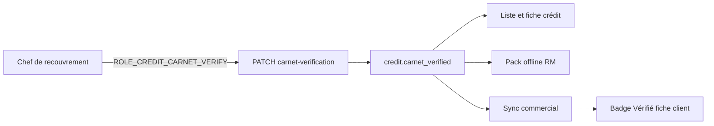

---
todos:
  - id: backend-flag-role
    status: completed
    content: 'Migration V010, droit ROLE_CREDIT_CARNET_VERIFY, service et endpoints, DTOs liste/retards/pack, catalog IA, tests'
  - id: web-credit-ui
    status: completed
    content: 'Badge, filtre, vérification unitaire et en masse sur la liste et la fiche crédit web'
  - id: mobile-rm
    status: completed
    content: 'Vérifier / Annuler et badge sur les retards du shell RM, file offline et sync'
  - id: mobile-commercial-badge
    status: completed
    content: Propager le flag dans la sync SQLite et afficher le badge Vérifié sur la fiche client
  - id: guide-changelog
    status: in_progress
    content: 'Guide utilisateur, index RAG, HTML MkDocs, changelog et version mobile'
name: Vérification carnet crédit
overview: 'Ajouter la vérification de carnet sur chaque vente à crédit, distincte du contrôle terrain, avec le droit ROLE_CREDIT_CARNET_VERIFY pour le chef de recouvrement (web et shell mobile RM), et un badge « Vérifié » en lecture seule sur la fiche client mobile des commerciaux.'
isProject: false
---

# Vérification carnet crédit

## Constat

Côté tontine, deux actions coexistent :

- **Contrôle carnet** : compare les montants (écart / conforme).
- **Vérifié carnet** : certification physique, sans modifier les montants. Colonnes `carnet_verified`, `carnet_verified_at`, `carnet_verified_by` sur `tontine_member`, droit [`ROLE_TONTINE_CARNET_VERIFY`](backend/src/main/java/com/optimize/elykia/core/util/UserPermissionConstant.java) attribué à `RECOVERY_MANAGER`, `ADMIN`, `SUPER_ADMIN`.

Côté crédit, seul le **contrôle terrain** existe ([`CreditFieldControl`](backend/src/main/java/com/optimize/elykia/core/entity/sale/CreditFieldControl.java), section dans [`credit-details.component.html`](frontend/src/app/credit/credit-details/credit-details.component.html), bouton **Contrôle** sur les retards du dashboard RM). Aucun badge ni endpoint de vérification.

## Décision

Un flag **par vente à crédit** (`credit`), comme le contrôle terrain et comme le membre tontine. Sur la fiche client mobile, le badge **Vérifié** s’affiche sur chaque carte de crédit. Le commercial le voit ; il ne peut pas le poser ni le retirer.

Écriture limitée aux crédits `INPROGRESS` de type `CREDIT`. Poser le flag ne touche pas les montants ni le dernier contrôle terrain. La vérification en masse ne fait que marquer (pas d’annulation groupée), comme la tontine.

## Backend

- Migration Flyway `V010__credit_carnet_verification.sql` : trois colonnes sur `credit` (défaut `false`), index `(status, carnet_verified)`, permission `ROLE_CREDIT_CARNET_VERIFY`, liaison profils `RECOVERY_MANAGER` / `ADMIN` / `SUPER_ADMIN` et copie sur les comptes existants (même schéma que [`V96__tontine_member_carnet_verification.sql`](backend/src/main/resources/db/legacy/V96__tontine_member_carnet_verification.sql)).
- Constante `CREDIT_CARNET_VERIFY` et ajout dans [`RecoveryManagerDefaultPermissionsInit`](backend/src/main/java/com/optimize/elykia/core/config/RecoveryManagerDefaultPermissionsInit.java).
- Service calqué sur [`TontineMemberCarnetVerificationService`](backend/src/main/java/com/optimize/elykia/core/service/tontine/TontineMemberCarnetVerificationService.java) : `PATCH /api/v1/credits/{id}/carnet-verification` et `POST /api/v1/credits/carnet-verifications` (plafond 500). `@PreAuthorize` sur le nouveau droit et `ADMIN`.
- Exposer `carnetVerified`, `carnetVerifiedAt`, `carnetVerifiedBy` sur [`CreditRespDto`](backend/src/main/java/com/optimize/elykia/core/dto/CreditRespDto.java) et [`CreditLateDTO`](backend/src/main/java/com/optimize/elykia/core/dto/CreditLateDTO.java). Filtre optionnel `carnetVerified` dans [`CreditSearchDto`](backend/src/main/java/com/optimize/elykia/core/dto/CreditSearchDto.java) et la requête de liste.
- Inclure les trois champs dans le pack RM (retards déjà chargés par [`RecoveryFieldPlanService`](backend/src/main/java/com/optimize/elykia/core/service/sale/RecoveryFieldPlanService.java)).
- Mettre à jour [`schema-catalog.json`](backend/src/main/resources/ai/schema-catalog.json) (table `credit`).
- Test unitaire du service (poser, déjà vérifié, annuler, masse, refus hors `INPROGRESS`).

## Web admin

Fichiers : [`credit-list.component.html`](frontend/src/app/credit/credit-list/credit-list.component.html), [`credit-details.component.html`](frontend/src/app/credit/credit-details/credit-details.component.html).

- Liste : colonne **Carnet** (badge **Vérifié** ou tiret), filtre « Carnet vérifié / non vérifié », cases à cocher aussi pour `ROLE_CREDIT_CARNET_VERIFY`, barre **Vérifier la sélection**.
- Fiche : badge **Carnet vérifié** / **Carnet non vérifié** avec date et auteur, bouton **Vérifier** / **Annuler la vérification** (crédit en cours uniquement). Le bloc **Contrôle terrain** reste inchangé.
- Le commercial et le gestionnaire voient le badge ; le bouton est masqué sans le droit.

## Mobile — shell chef de recouvrement

Même geste que la tontine sur [`rm-field.page.html`](mobile/src/app/rm-tabs/field/rm-field.page.html), appliqué aux **retards crédit** :

- Dashboard retards ([`rm-dashboard.page.html`](mobile/src/app/rm-tabs/dashboard/rm-dashboard.page.html)) : badge **Vérifié** à côté du badge de contrôle, bouton **Vérifier** / **Annuler** à côté de **Contrôle**.
- Onglet Terrain, section retards : badge + **Vérifier** (le bouton **Naviguer** reste).
- File d’attente offline + sync dans l’onglet Plus, sur le modèle de [`rm-carnet-verification-queue.service.ts`](mobile/src/app/core/services/rm/rm-carnet-verification-queue.service.ts), en appelant l’API crédit et en mettant à jour le pack local.

## Mobile — badge commercial

Lecture seule, sans nouveau droit.

- Colonnes SQLite `carnetVerified`, `carnetVerifiedAt`, `carnetVerifiedBy` via [`migration.service.ts`](mobile/src/app/core/services/migration.service.ts) (`addColumnIfNotExists`).
- Mapper [`distribution.mapper.ts`](mobile/src/app/shared/mapper/distribution.mapper.ts), modèle `Distribution`, persistance dans `database.service.ts` / `distribution.repository.ts`.
- Badge **Vérifié** sur chaque carte crédit de [`client-detail.page.html`](mobile/src/app/features/clients/pages/client-detail/client-detail.page.html) lorsque `credit.carnetVerified` est vrai. Pas de bouton d’action.

Incrément de version mobile (les trois fichiers du skill version).

## Guide et livraison

- [`user-guide/docs/recovery-manager/web.md`](user-guide/docs/recovery-manager/web.md) et [`mobile.md`](user-guide/docs/recovery-manager/mobile.md) : vérifier un carnet de vente, distinct du contrôle terrain.
- Guide commercial mobile : le badge **Vérifié** sur la fiche client (langage métier, sans nommer le droit).
- Régénérer l’index RAG et le HTML MkDocs.
- Entrée `docs/CHANGELOG.md` (backend, frontend, mobile).

Hors périmètre : export PDF des vérifications crédit (présent en tontine, non demandé ici), et toute action de vérification pour le commercial.
