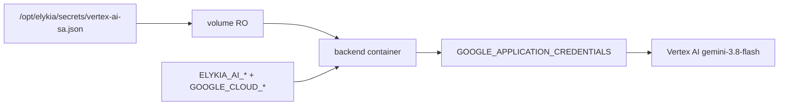

# Activer Vertex AI (Gemini 3.8 Flash) sur Contabo test + prod

## Verdict

**Oui.** Le fichier `C:\env\SECRET\elykia-503006-aab5a3518e99.json` est un compte de service valide (`type=service_account`, projet `elykia-503006`, SA `gemini-app-user@elykia-503006.iam.gserviceaccount.com`). Spring AI 1.0 en mode `elykia.ai.provider=gemini` utilise déjà Vertex AI via ADC (`GOOGLE_APPLICATION_CREDENTIALS`), comme documenté dans `[backend/docs/AI_ASSISTANT.md](backend/docs/AI_ASSISTANT.md)`.

Aujourd’hui Contabo n’a **aucune** config IA : provider par défaut `stub` dans `[backend/src/main/resources/application.yml](backend/src/main/resources/application.yml)`, et les compose Contabo (`[deploy/docker-compose.test.yml](deploy/docker-compose.test.yml)`, `[deploy/docker-compose.prod.yml](deploy/docker-compose.prod.yml)`) ne montent ni credentials GCP ni variables `ELYKIA_AI_`* / `GOOGLE_CLOUD_*`.

## Approche retenue

- **Même SA** pour test et prod Contabo (celui fourni).
- **Secret hors Git** : copier le JSON sur le VPS sous `/opt/elykia/secrets/vertex-ai-sa.json`, montage read-only dans les conteneurs backend.
- **Activation 100 % env** (pas de rebuild image) : `ELYKIA_AI_PROVIDER=gemini` + ADC.
- **Modèle** : `gemini-3.8-flash` — dernière version GA Vertex AI (release 2026-09-02). Remplace `gemini-2.0-flash` (retiré) et dépasse `gemini-3.5-flash` déjà présent dans `application.yml`.
- **Région / endpoint** : `global` (requis pour 3.8 Flash : dispo `global` | `us` | `eu` — **pas** `us-central1`).
- **Exécution ops** : checklist SSH Contabo manuelle (pas d’hypothèse d’accès SSH depuis cette session).

## Changements repo

1. **Compose Contabo** — dans `backend.environment` de test et prod :
  - `ELYKIA_AI_ENABLED=true`
  - `ELYKIA_AI_PROVIDER=gemini`
  - `ELYKIA_AI_MODEL=gemini-3.8-flash`
  - `GOOGLE_CLOUD_PROJECT=elykia-503006`
  - `GOOGLE_CLOUD_LOCATION=global`
  - `GOOGLE_APPLICATION_CREDENTIALS=/secrets/gcp/vertex-ai-sa.json`
  - volume : `${GCP_VERTEX_SA_PATH:-/opt/elykia/secrets/vertex-ai-sa.json}:/secrets/gcp/vertex-ai-sa.json:ro`
2. **Env examples** — étendre `[deploy/.env.contabo.prod.example](deploy/.env.contabo.prod.example)` et ajouter un `.env.contabo.test.example` avec les mêmes clés + `GCP_VERTEX_SA_PATH`.
3. `**application.yml**` — aligner le défaut Vertex + métadonnée health :
  - `spring.ai.vertex.ai.gemini.chat.options.model: gemini-3.8-flash`
  - documenter / garder `elykia.ai.model` cohérent quand provider=gemini (override Contabo via `ELYKIA_AI_MODEL`)
4. **Doc** — mettre à jour `[backend/docs/AI_ASSISTANT.md](backend/docs/AI_ASSISTANT.md)` :
  - section Gemini : modèle recommandé `**gemini-3.8-flash**`, location `**global**`
  - table des modèles (3.8 Flash GA ; noter multi-region `us`/`eu` en alternative)
  - checklist Contabo : copie SA, IAM, recreate containers, healthcheck
  - ADC via fichier SA (`GOOGLE_APPLICATION_CREDENTIALS`), pas seulement `gcloud auth application-default login`
  - checklist prod cloud : remplacer références obsolètes (`gemini-2.0-flash`, `us-central1` par défaut pour Vertex 3.x)

Aucun commit du JSON ; aucun embedding du contenu private key dans le repo.

## Checklist ops Contabo (après validation du plan)

**GCP (une fois)**

- Activer l’API **Vertex AI** (Agent Platform) sur le projet `elykia-503006`.
- Rôle SA minimal : `roles/aiplatform.user` (et billing actif).
- Confirmer l’accès à `gemini-3.8-flash` via endpoint `**global**`.

**VPS**

- `mkdir -p /opt/elykia/secrets && chmod 700 /opt/elykia/secrets`
- Copier le JSON local vers `/opt/elykia/secrets/vertex-ai-sa.json` (scp), `chmod 600`, propriétaire root.
- Ajouter les variables dans `/opt/elykia/test/.env` et `/opt/elykia/prod/.env` (`ELYKIA_AI_MODEL=gemini-3.8-flash`, `GOOGLE_CLOUD_LOCATION=global`).
- Recreate backends :
  - `docker compose -f docker-compose.test.yml --project-name elykia-test --env-file /opt/elykia/test/.env up -d backend`
  - idem prod avec `docker-compose.prod.yml` / `elykia-prod` / `/opt/elykia/prod/.env`
- Smoke : `GET /api/v1/ai/health` → `"provider":"gemini"` (model `gemini-3.8-flash`) ; une question DATA + HOW_TO via `/ai-chat`.
- Frontend : activer le feature flag `elykiaAi` (prod a `aiChatEnabled: false` par défaut) et rôles `ROLE_AI_CHAT` / `ROLE_AI_REPORT` si pas déjà faits.

## Hors scope

- Changer le provider local/dev (reste stub/ollama).
- Upgrade Spring AI vers Google AI Studio (`GEMINI_API_KEY`).
- Tuning / thinking_level avancé (laisser défauts Spring AI / Vertex ; 3.8 Flash supporte `LOW`|`MEDIUM`|`HIGH`, pas `MINIMAL`).

