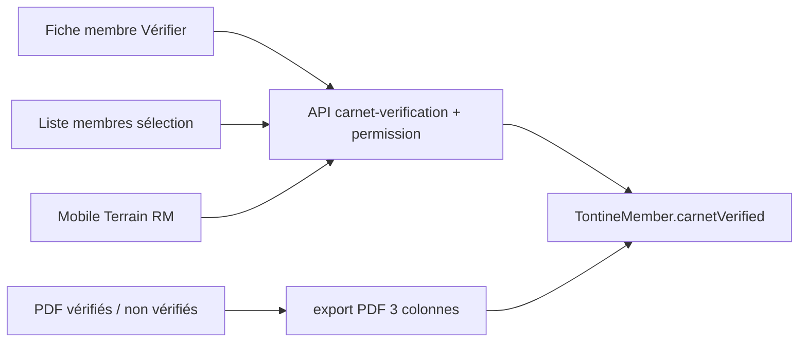

# Vérification de carnet tontine

Fonctionnalité **distincte** du contrôle terrain existant (saisie carnet vs système → CONFORME/ÉCART). Ici le métier veut seulement **cocher** les membres dont le carnet a déjà été contrôlé, pour suivre l’avancement et imprimer les listes.

Périmètre : **membres tontine de la session en cours** uniquement (les fichiers cités + pack terrain RM). Pas de crédit.

## Décisions retenues

- **Session-scopé** : le flag vit sur `[TontineMember](backend/src/main/java/com/optimize/elykia/core/entity/tontine/TontineMember.java)` (déjà lié à une session). Une nouvelle session repart à « non vérifié ».
- **Marquer et décocher** : bouton unitaire en toggle (erreur de saisie). Le bulk ne **marque** que les non vérifiés sélectionnés (idempotent). Décocher en masse n’est pas exposé pour éviter les erreurs.
- **Droit dédié** `ROLE_TONTINE_CARNET_VERIFY` : pas de gate sur le profil `RECOVERY_MANAGER` (contrairement au contrôle terrain). Un commercial pourra le faire plus tard si on lui attribue le droit dans l’admin des permissions.
- **Mobile v1** : chef de recouvrement uniquement, onglet Terrain. Un commercial avec le droit utilisera le **frontend web** ; pas d’UI commerciale mobile dans cette livraison.
- **PDF** : session courante + filtre commercial optionnel (y compris « Tous ») + `verified=true|false`. Ordre alphabétique **colonne par colonne**, 3 colonnes, puis page suivante.

## 1. Backend — modèle et droit

**Migration Flyway `V96`** (après `[V95](backend/src/main/resources/db/migration/V95__recovery_manager_client_and_assign_collector.sql)`) :

- Colonnes sur `tontine_member` : `carnet_verified BOOLEAN NOT NULL DEFAULT false`, `carnet_verified_at TIMESTAMP`, `carnet_verified_by VARCHAR`.
- Index `(tontine_session_id, carnet_verified)` pour listes/PDF.
- Insert `uperm` `ROLE_TONTINE_CARNET_VERIFY`.
- Grant profil + comptes existants : `RECOVERY_MANAGER`, `MANAGER`, `ADMIN`, `SUPER_ADMIN`. **Jamais** `PROMOTER` / `USER`.

Constantes : `[UserPermissionConstant](backend/src/main/java/com/optimize/elykia/core/util/UserPermissionConstant.java)`. Ajouter le rôle dans `security.config.profil-permissions` de `[application.yml](backend/src/main/resources/application.yml)` pour `RECOVERY_MANAGER` / `ADMIN` / `MANAGER`. Étendre `[RecoveryManagerDefaultPermissionsInit](backend/src/main/java/com/optimize/elykia/core/config/RecoveryManagerDefaultPermissionsInit.java)` (Flyway off en local).

Entité + mapping dans `[TontineMemberRespDto](backend/src/main/java/com/optimize/elykia/core/dto/TontineMemberRespDto.java)` (`carnetVerified`, `carnetVerifiedAt`, `carnetVerifiedBy`). Filtre optionnel `carnetVerified` sur `GET /api/v1/tontines/members`.

## 2. Backend — API

Dans `[TontineController](backend/src/main/java/com/optimize/elykia/core/controller/tontine/TontineController.java)`, `@PreAuthorize` sur `ROLE_TONTINE_CARNET_VERIFY` **ou** `ROLE_ADMIN` :

- `PATCH /api/v1/tontines/members/{id}/carnet-verification` body `{ "verified": true|false }`
- `POST /api/v1/tontines/members/carnet-verifications` body `{ "memberIds": [...], "verified": true }` (bulk, max raisonnable ~500, ignore déjà à l’état demandé)
- `GET /api/v1/tontines/members/carnet-verifications/export/pdf?verified=&commercial=`

Règles : session **active** uniquement pour PATCH/POST ; historique lecture seule. `verifiedBy` = username SecurityContext. Marquer un déjà-vérifié = no-op (conserve date/auteur d’origine).

Service dédié `TontineMemberCarnetVerificationService` (pas réutiliser `[TontineMemberFieldControlService](backend/src/main/java/com/optimize/elykia/core/service/tontine/TontineMemberFieldControlService.java)`).

Pack RM : ajouter `carnetVerified` (et meta) sur `[RmPackTontineMemberDto](backend/src/main/java/com/optimize/elykia/core/dto/sale/RmPackTontineMemberDto.java)` pour afficher le badge hors-ligne.

## 3. Backend — PDF 3 colonnes (thème navy)

Suivre le skill PDF Elykia : `PdfDocumentIdentity` + fragments `[pdf/fragments.html](backend/src/main/resources/templates/pdf/fragments.html)` + `[PdfHtmlRenderer](backend/src/main/java/com/optimize/elykia/core/service/report/PdfHtmlRenderer.java)` (pas `HtmlConverter` direct). **Pas de flex/grid** : table 3 cellules.

Algorithme (classe testable, ex. `CarnetVerificationColumnLayout`) :

1. Trier `lastname + firstname` avec `Collator` `fr_FR` (PRIMARY, accents ignorés).
2. Découper en pages de `rowsPerColumn * 3` noms (constante ~40, police compacte 8.5–9pt, `@page` margin bas ≥ 24mm).
3. **Remplissage colonne d’abord** : page 1 col1 = noms `[0..R)`, col2 = `[R..2R)`, col3 = `[2R..3R)` ; page 2 continue à l’index `3R`. C’est exactement l’exemple A / A / B-C-D puis page suivante D-E.

Meta PDF : titre « Carnets vérifiés » ou « Carnets à vérifier », session, commercial (ou Tous), date, compteur. Ligne compacte : `NOM Prénom` (+ code client en petit si place).

Test : packing unitaire (ordre des colonnes) + rendu multi-pages `1/N` et `N/N` extraits du PDF.

## 4. Frontend web

Permission UI : `*ngxPermissionsOnly="['ROLE_TONTINE_CARNET_VERIFY', 'ROLE_ADMIN']"` — **pas** `isRecoveryManager`. Style : skill `[frontend-ui-style](.cursor/skills/frontend-ui-style/SKILL.md)` (boutons existants `.btn-primary` / `.btn-outline`, checkboxes comme `[client-list](frontend/src/app/client/client-list/client-list.component.html)`).

**Fiche membre** `[member-details.component.html](frontend/src/app/tontine/pages/member-details/member-details.component.html)` :

- **Badge visible pour tout le monde** qui ouvre la fiche (pas seulement le droit Vérifier) : dans le header (à côté du nom / sous-titre) un badge **Carnet vérifié** (vert) ou **Carnet non vérifié**. Si vérifié, une petite ligne « Vérifié le dd/MM/yyyy HH:mm par {username} ».
- Bouton d’action **Vérifier** / **Annuler la vérification** (toggle) dans `.header-actions`, à côté de Contrôle terrain, **uniquement** avec `ROLE_TONTINE_CARNET_VERIFY` / `ROLE_ADMIN`. Désactivé en session historique.
- Le badge se met à jour immédiatement après le PATCH, sans recharger toute la page. Contrôle terrain reste inchangé.

**Liste** `[tontine-dashboard](frontend/src/app/tontine/pages/tontine-dashboard/tontine-dashboard.component.html)` + `[member-table](frontend/src/app/tontine/components/member-table/member-table.component.html)` :

- Colonne checkbox (header tout-sélectionner page) visible seulement avec le droit.
- Colonne / badge **Carnet** (Vérifié / —).
- Barre d’actions si sélection : « Vérifier la sélection (N) » + confirmation.
- Filtre toolbar : Carnet = Tous / Vérifiés / Non vérifiés (`[filter-bar](frontend/src/app/tontine/components/filter-bar/filter-bar.component.html)`).
- Deux actions PDF (droit verify) : **PDF vérifiés** et **PDF à vérifier**, en conservant le commercial courant (y compris Tous). Distinctes du PDF cotisations déjà gated par `ROLE_TONTINE_MEMBER_PDF`.

Types `[tontine.types.ts](frontend/src/app/tontine/types/tontine.types.ts)` + méthodes dans `[tontine.service.ts](frontend/src/app/tontine/services/tontine.service.ts)`. `data-testid` pour E2E.

## 5. Mobile chef de recouvrement

Onglet Terrain `[rm-field.page](mobile/src/app/rm-tabs/field/rm-field.page.html)`, section Tontine :

- Badge **Vérifié** si `carnetVerified` (indépendant du badge CONFORME/ÉCART du contrôle).
- Bouton unitaire **Vérifier** / **Annuler**.
- Mode sélection (checkboxes) + CTA **Vérifier la sélection**.

API online-first (même pattern que le contrôle carnet). File d’attente offline légère si hors réseau, sync depuis Plus. Refresh pack après succès.

Les commerciaux **n’ont pas** l’écran RM ; le backend refuse sans `ROLE_TONTINE_CARNET_VERIFY`.

## 6. Tests, versions, changelog

- Backend : service mark/bulk/idempotence ; layout colonnes ; PDF `1/N`.
- Frontend E2E tontine : unitaire fiche + bulk liste + absence d’actions sans droit.
- Mobile E2E RM : vérifier un membre Terrain.
- SemVer **mineur** (feature visible) : `backend/pom.xml`, `frontend/package.json`, skill **mobile-version-bump** (3 fichiers).
- `[docs/CHANGELOG.md](docs/CHANGELOG.md)` : sections Frontend / Mobile / Backend (Added).

