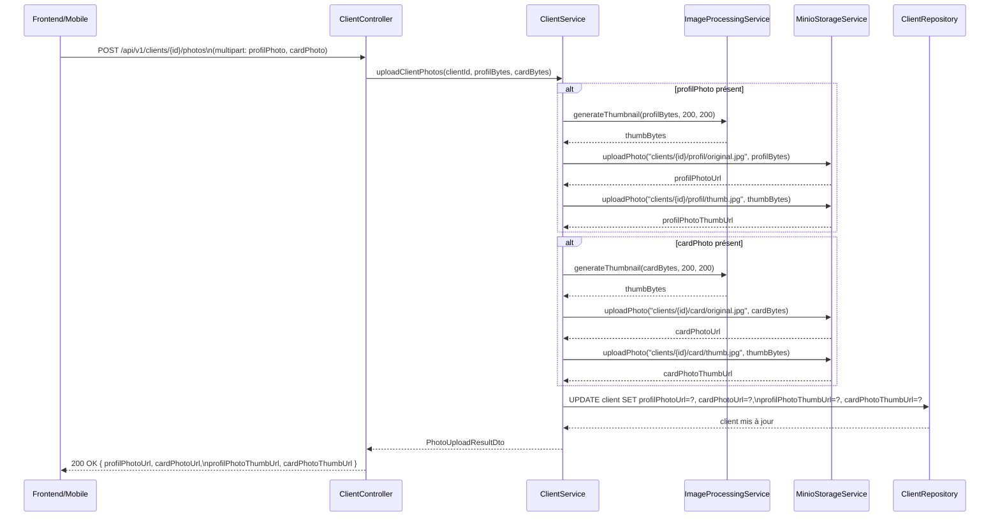
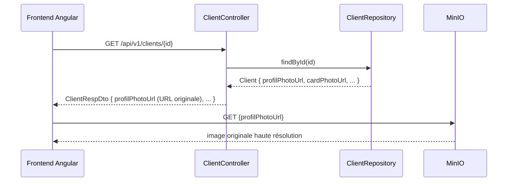
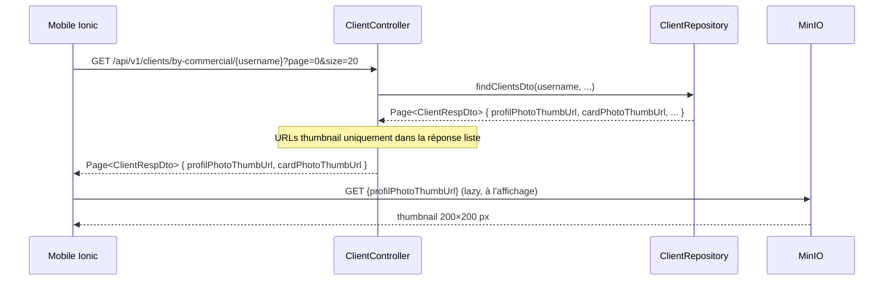
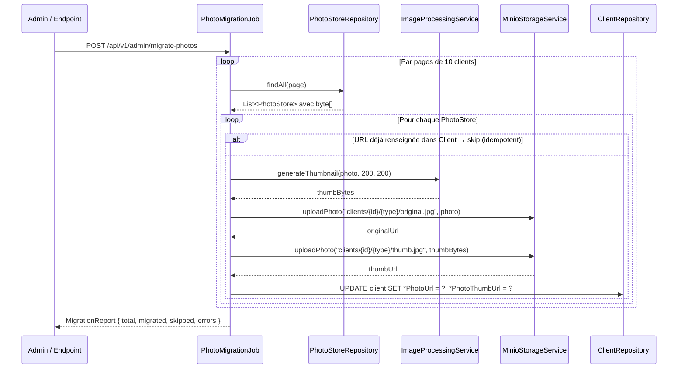

# Design Document: Client Photo MinIO Storage

## Overview

Cette feature migre le stockage des photos clients (photo de profil + photo de pièce d'identité) depuis la base de données relationnelle (champs `byte[]` dans `Client` et `PhotoStore`) vers un stockage objet MinIO compatible S3. Chaque photo uploadée est conservée en deux versions dans MinIO : l'image originale haute résolution et un thumbnail (200×200 px). Les URLs MinIO sont persistées dans l'entité `Client` (champs existants `profilPhotoUrl`, `cardPhotoUrl`, `profilPhotoThumbUrl`, `cardPhotoThumbUrl`), ce qui permet au frontend web de charger l'original et au mobile de charger uniquement les thumbnails lors des synchronisations en liste.

La migration des données existantes est assurée par un job de migration qui lit les `byte[]` encore présents en base, les pousse vers MinIO, met à jour les URLs dans `Client`, puis supprime les données binaires. Les champs `byte[]` dans `Client` et `PhotoStore` sont marqués `@Deprecated` dans un premier temps, puis retirés après validation complète.

## Architecture

```mermaid
graph TD
    subgraph "Clients"
        FE[Frontend Angular]
        MOB[Mobile Ionic/Angular]
    end

    subgraph "Backend Spring Boot"
        CC[ClientController]
        CS[ClientService]
        MS[MinioStorageService]
        IS[ImageProcessingService]
        MJ[PhotoMigrationJob]
        CR[ClientRepository]
        PSR[PhotoStoreRepository]
    end

    subgraph "Stockage"
        MINIO[(MinIO\nelykia-clients bucket)]
        DB[(PostgreSQL\nClient.profilPhotoUrl\nClient.cardPhotoUrl\nClient.profilPhotoThumbUrl\nClient.cardPhotoThumbUrl)]
    end

    FE -->|POST /api/v1/clients/{id}/photos\nmultipart/form-data| CC
    MOB -->|POST /api/v1/clients/{id}/photos\nmultipart/form-data| CC
    CC --> CS
    CS --> IS
    IS -->|image originale| MS
    IS -->|thumbnail 200x200| MS
    MS -->|PUT object| MINIO
    MS -->|URL originale + URL thumb| CS
    CS -->|UPDATE profilPhotoUrl\ncardPhotoUrl\nprofilPhotoThumbUrl\ncardPhotoThumbUrl| CR
    CR --> DB

    FE -->|GET /api/v1/clients/{id}| CC
    CC -->|profilPhotoUrl| FE

    MOB -->|GET /api/v1/clients/by-commercial/{username}| CC
    CC -->|profilPhotoThumbUrl\ncardPhotoThumbUrl| MOB

    MJ -->|lit byte[] existants| PSR
    MJ --> IS
    MJ --> MS
    MJ --> CR
```

## Composants et Interfaces

### Nouveau composant : MinioStorageService

**Rôle** : Encapsule toutes les interactions avec le SDK MinIO Java (`io.minio:minio`). Gère l'upload, la génération d'URLs présignées ou publiques, et la suppression d'objets.

**Interface** :
```java
public interface MinioStorageService {

    /**
     * Upload un tableau de bytes vers MinIO.
     * @param objectKey  Chemin complet dans le bucket (ex: "clients/42/profil/original.jpg")
     * @param data       Contenu binaire de l'image
     * @param contentType MIME type (ex: "image/jpeg")
     * @return URL publique ou présignée de l'objet uploadé
     */
    String uploadPhoto(String objectKey, byte[] data, String contentType);

    /**
     * Supprime un objet du bucket.
     * @param objectKey Chemin complet dans le bucket
     */
    void deletePhoto(String objectKey);

    /**
     * Vérifie si un objet existe dans le bucket.
     */
    boolean exists(String objectKey);
}
```

**Responsabilités** :
- Initialiser le client MinIO à partir de la configuration Spring (`minio.endpoint`, `minio.access-key`, `minio.secret-key`, `minio.bucket`)
- Créer le bucket s'il n'existe pas au démarrage (`@PostConstruct`)
- Gérer les erreurs MinIO et les encapsuler en `ApplicationException`
- Retourner l'URL publique construite à partir de l'endpoint + bucket + objectKey

---

### Nouveau composant : ImageProcessingService

**Rôle** : Génère le thumbnail à partir de l'image originale. Utilise la bibliothèque `Thumbnailator` (déjà courante dans l'écosystème Spring) ou `java.awt.Image`.

**Interface** :
```java
public interface ImageProcessingService {

    /**
     * Redimensionne une image en thumbnail.
     * @param original  Bytes de l'image originale
     * @param width     Largeur cible en pixels
     * @param height    Hauteur cible en pixels
     * @return Bytes du thumbnail au format JPEG
     */
    byte[] generateThumbnail(byte[] original, int width, int height);
}
```

**Responsabilités** :
- Décoder l'image source (JPEG, PNG, WebP)
- Redimensionner en conservant le ratio (fit dans width×height)
- Encoder en sortie JPEG avec qualité configurable (défaut : 80%)
- Lever une `ApplicationException` si l'image source est corrompue ou vide

---

### Nouveau composant : PhotoObjectKeyBuilder

**Rôle** : Centralise la construction des chemins d'objets MinIO pour garantir la cohérence de la structure des dossiers.

**Interface** :
```java
public class PhotoObjectKeyBuilder {

    // clients/{clientId}/profil/original.jpg
    public static String profilOriginal(Long clientId);

    // clients/{clientId}/profil/thumb.jpg
    public static String profilThumb(Long clientId);

    // clients/{clientId}/card/original.jpg
    public static String cardOriginal(Long clientId);

    // clients/{clientId}/card/thumb.jpg
    public static String cardThumb(Long clientId);
}
```

---

### Composant modifié : ClientService

**Méthodes impactées** :

| Méthode existante | Changement |
|---|---|
| `addClient(ClientDto)` | Après `create(client)`, appelle `MinioStorageService` si des bytes de photo sont présents dans le DTO, puis persiste les URLs dans `Client`. Ne crée plus de `PhotoStore`. |
| `updateClientPhoto(UpdatePhotoDto)` | Remplace l'appel `photoStoreRepository.updateProfil/updateCard` par upload MinIO + mise à jour des URLs dans `Client`. |
| `updatePhotosBatch(List<ClientPhotoBatchUpdateDto>)` | Idem, upload vers MinIO en batch. |
| `checkMissingPhotos(List<Long>)` | Vérifie `client.profilPhotoUrl` et `client.cardPhotoUrl` au lieu de lire les bytes depuis `PhotoStore`. |
| `getProfilPhoto(Long)` | **Deprecated** — retourne un redirect HTTP 302 vers l'URL MinIO ou supprimé. |
| `getCardPhoto(Long)` | **Deprecated** — idem. |
| `getProfilPhotos(List<Long>)` | Retourne les URLs thumbnail depuis `Client` au lieu des bytes depuis `PhotoStore`. |
| `getCardPhotos(List<Long>)` | Idem. |

**Nouvelle méthode** :
```java
@Transactional
public PhotoUploadResultDto uploadClientPhotos(Long clientId, byte[] profilPhotoBytes, byte[] cardPhotoBytes);
```

---

### Composant modifié : ClientController

**Nouveaux endpoints** :

```
POST /api/v1/clients/{id}/photos
  Content-Type: multipart/form-data
  Parts: profilPhoto (optional), cardPhoto (optional), cardType (optional), cardNumber (optional)
  → 200 OK { profilPhotoUrl, cardPhotoUrl, profilPhotoThumbUrl, cardPhotoThumbUrl }

GET /api/v1/clients/{id}/profil-photo
  → 302 Redirect vers URL MinIO (ou suppression de l'endpoint si le frontend utilise directement l'URL)
```

---

### Nouveau composant : PhotoMigrationJob

**Rôle** : Job Spring (`@Component`) déclenché manuellement via un endpoint admin ou au démarrage conditionnel. Migre les photos existantes de `PhotoStore` vers MinIO.

**Interface** :
```java
public interface PhotoMigrationJob {

    /**
     * Lance la migration complète. Traite les clients par pages de 10.
     * Idempotent : ignore les clients dont les URLs sont déjà renseignées.
     */
    MigrationReport runMigration();

    /**
     * Retourne l'état d'avancement de la migration en cours.
     */
    MigrationStatus getStatus();
}
```

---

### Entité modifiée : Client

```java
// AVANT
private byte[] profilPhoto;   // → @Deprecated puis supprimé
private byte[] IDDoc;         // → @Deprecated puis supprimé

// APRÈS (champs existants, déjà présents, maintenant seule source de vérité)
private String profilPhotoUrl;       // URL originale profil
private String cardPhotoUrl;         // URL originale carte
private String profilPhotoThumbUrl;  // URL thumbnail profil
private String cardPhotoThumbUrl;    // URL thumbnail carte
```

---

### Entité modifiée : PhotoStore

```java
// byte[] photo → @Deprecated puis supprimé après migration
// L'entité PhotoStore elle-même devient obsolète après migration complète
```

## Modèles de données

### Organisation des objets MinIO

```
Bucket : elykia-clients
│
├── clients/
│   ├── {clientId}/
│   │   ├── profil/
│   │   │   ├── original.jpg    ← image haute résolution
│   │   │   └── thumb.jpg       ← thumbnail 200×200 px
│   │   └── card/
│   │       ├── original.jpg
│   │       └── thumb.jpg
```

**Règles de nommage** :
- Extension `.jpg` fixe (toutes les images sont converties en JPEG à l'upload)
- Remplacement de l'objet existant si un nouvel upload arrive pour le même client (pas de versioning)
- Pas de timestamp dans le chemin (l'URL est stable et peut être mise en cache)

---

### DTO : PhotoUploadResultDto

```java
public record PhotoUploadResultDto(
    Long clientId,
    String profilPhotoUrl,
    String cardPhotoUrl,
    String profilPhotoThumbUrl,
    String cardPhotoThumbUrl
) {}
```

---

### DTO : ClientPhotoDto (modifié)

```java
// AVANT : retournait les bytes
public record ClientPhotoDto(Long clientId, byte[] photo) {}

// APRÈS : retourne les URLs
public record ClientPhotoDto(
    Long clientId,
    String photoUrl,      // URL originale
    String thumbUrl       // URL thumbnail
) {}
```

---

### Configuration Spring Boot

```yaml
# application.yml
minio:
  endpoint: http://localhost:9000
  access-key: ${MINIO_ACCESS_KEY}
  secret-key: ${MINIO_SECRET_KEY}
  bucket: elykia-clients
  public-url: http://localhost:9000  # URL publique (peut différer de l'endpoint interne)
```

## Flux de données

### Flux 1 : Upload d'une photo (création ou mise à jour)



---

### Flux 2 : Récupération individuelle (détail client — Frontend)



---

### Flux 3 : Récupération en liste (synchronisation mobile)



---

### Flux 4 : Migration des données existantes



## Stratégie de migration des données existantes

### Approche : migration en ligne, sans downtime

La migration est **idempotente** et peut être relancée sans risque. Elle s'exécute en arrière-plan sans bloquer le service.

**Étapes** :

1. **Déploiement de la nouvelle version** avec MinIO configuré et les nouveaux endpoints actifs. Les anciens endpoints (`getProfilPhoto`, `getCardPhoto` retournant des bytes) restent fonctionnels pendant la période de transition.

2. **Déclenchement de la migration** via `POST /api/v1/admin/migrate-photos` (endpoint protégé par rôle `ADMIN`). Le job traite les clients par pages de 10 pour limiter la consommation mémoire.

3. **Vérification** : l'endpoint `GET /api/v1/admin/migrate-photos/status` retourne le rapport de progression.

4. **Suppression progressive** :
   - Phase 1 : Les champs `byte[] profilPhoto` et `byte[] IDDoc` dans `Client` sont annotés `@Deprecated` et exclus des sérialisations JSON (`@JsonIgnore` déjà présent sur `IDDoc`).
   - Phase 2 : Après validation complète (toutes les URLs renseignées), une migration Flyway supprime les colonnes `profil_photo` et `i_d_doc` de la table `client`, et la table `photo_store` entière.

**Script Flyway de nettoyage (Phase 2)** :
```sql
-- V{next}__remove_binary_photo_columns.sql
ALTER TABLE client DROP COLUMN IF EXISTS profil_photo;
ALTER TABLE client DROP COLUMN IF EXISTS i_d_doc;
DROP TABLE IF EXISTS photo_store;
```

### Gestion des erreurs de migration

- Si l'upload MinIO échoue pour un client, l'erreur est loggée et le client est ajouté à la liste `errors` du rapport. La migration continue pour les autres clients.
- Le job peut être relancé : les clients dont les URLs sont déjà renseignées sont ignorés (condition `profilPhotoUrl IS NULL OR cardPhotoUrl IS NULL`).

## Impact sur le mobile (synchronisation des URLs)

### Changements dans `PhotoSyncService`

Le `PhotoSyncService` actuel télécharge les bytes depuis le backend et les sauvegarde dans le système de fichiers local. Avec MinIO, les URLs sont directement disponibles dans la réponse de synchronisation des clients.

**Nouveau comportement** :

1. Lors de `fetchPageAndSave`, les clients reçus contiennent déjà `profilPhotoThumbUrl` et `cardPhotoThumbUrl` (URLs MinIO).
2. Ces URLs sont persistées dans SQLite (colonnes existantes).
3. Le `PhotoSyncService` n'a plus besoin de faire des appels batch séparés (`/profil-photos`, `/card-photos`) pour récupérer les bytes — il peut directement télécharger les images depuis les URLs MinIO et les sauvegarder localement si nécessaire (mode offline).

**Stratégie de cache local sur mobile** :

```
Option A (recommandée) : Lazy loading avec cache HTTP
  → Le mobile affiche directement les URLs MinIO dans les  tags
  → Le navigateur/WebView gère le cache HTTP natif
  → Pas de stockage local explicite nécessaire pour les thumbnails

Option B : Téléchargement proactif pour mode offline
  → PhotoSyncService télécharge les thumbnails depuis les URLs MinIO
  → Sauvegarde dans Filesystem (Directory.Data)
  → Remplace profilPhotoThumbUrl par le chemin local dans SQLite
```

**Modification du schéma SQLite** : aucune modification nécessaire — les colonnes `profilPhotoUrl`, `cardPhotoUrl`, `profilPhotoThumbUrl`, `cardPhotoThumbUrl` existent déjà.

**Suppression des appels batch obsolètes** :
- `POST /api/v1/clients/profil-photos` (retournait des bytes) → **supprimé**
- `POST /api/v1/clients/card-photos` (retournait des bytes) → **supprimé**
- `POST /api/v1/clients/photos-batch-update` (upload de bytes depuis mobile) → **remplacé** par `POST /api/v1/clients/{id}/photos` (multipart)

## Gestion des erreurs

### Scénario 1 : MinIO indisponible lors d'un upload

**Condition** : Le service MinIO est inaccessible au moment de l'upload d'une photo.  
**Réponse** : `ClientService` propage une `ApplicationException("Service de stockage photo indisponible")` → HTTP 503.  
**Récupération** : L'utilisateur peut réessayer. Les données client (sans photo) sont déjà sauvegardées en base.

### Scénario 2 : Image corrompue ou format non supporté

**Condition** : `ImageProcessingService.generateThumbnail()` reçoit des bytes invalides.  
**Réponse** : `ApplicationException("Format d'image non supporté ou fichier corrompu")` → HTTP 400.  
**Récupération** : L'utilisateur doit fournir une image valide.

### Scénario 3 : Échec partiel lors de la migration

**Condition** : L'upload MinIO réussit pour l'original mais échoue pour le thumbnail.  
**Réponse** : Le job logge l'erreur, ne met pas à jour les URLs dans `Client` (transaction atomique), et marque le client en erreur dans le rapport.  
**Récupération** : Relancer le job de migration.

### Scénario 4 : URL MinIO expirée (si URLs présignées)

**Condition** : Les URLs présignées ont une durée de vie limitée.  
**Réponse** : Utiliser des URLs publiques permanentes (bucket public) plutôt que des URLs présignées, ou implémenter un endpoint de rafraîchissement.  
**Recommandation** : Configurer le bucket `elykia-clients` en lecture publique pour les photos clients, ce qui évite la gestion d'expiration.

## Stratégie de tests

### Tests unitaires

- `MinioStorageServiceTest` : mock du client MinIO SDK, vérifier upload/delete/exists
- `ImageProcessingServiceTest` : vérifier les dimensions du thumbnail généré, gestion des images corrompues
- `PhotoObjectKeyBuilderTest` : vérifier la construction des chemins pour différents `clientId` et types
- `ClientServiceTest` : mock de `MinioStorageService` et `ImageProcessingService`, vérifier que les URLs sont correctement persistées

### Tests d'intégration

- `PhotoMigrationJobIntegrationTest` : avec un MinIO embarqué (Testcontainers `minio/minio`), vérifier la migration complète d'un jeu de données de test
- `ClientControllerIntegrationTest` : upload multipart → vérifier présence des objets dans MinIO et URLs en base

### Tests de propriétés (property-based)

**Bibliothèque** : JUnit 5 + jqwik

- **Propriété 1** : Pour tout `clientId` valide et tout tableau de bytes non vide, `uploadClientPhotos` retourne des URLs non nulles et non vides.
- **Propriété 2** : Pour tout tableau de bytes représentant une image valide, `generateThumbnail(bytes, 200, 200)` retourne une image dont les dimensions sont ≤ 200×200 px.
- **Propriété 3** : `PhotoObjectKeyBuilder.profilOriginal(id)` et `PhotoObjectKeyBuilder.profilThumb(id)` retournent toujours des chemins distincts pour tout `id`.

## Considérations de performance

- **Upload** : Les images sont traitées en mémoire (pas d'écriture disque intermédiaire). Pour des images > 10 Mo, envisager un streaming multipart direct vers MinIO.
- **Batch migration** : Traitement par pages de 10 clients pour limiter la consommation mémoire (chaque `byte[]` peut peser plusieurs Mo).
- **Mobile** : Les thumbnails (200×200 px, ~10-30 Ko) réduisent significativement la bande passante lors des synchronisations en liste par rapport aux images originales.
- **Cache** : Les URLs MinIO étant stables (pas de timestamp), elles peuvent être mises en cache côté client (HTTP Cache-Control).

## Considérations de sécurité

- **Accès au bucket** : Le bucket `elykia-clients` doit être configuré en lecture publique uniquement pour les objets photos. Les opérations d'écriture et de suppression restent réservées au backend via les credentials MinIO.
- **Credentials MinIO** : Stockés dans des variables d'environnement (`MINIO_ACCESS_KEY`, `MINIO_SECRET_KEY`), jamais en dur dans le code ou les fichiers de configuration versionnés.
- **Endpoint admin de migration** : Protégé par `@PreAuthorize("hasRole('ADMIN')")`.
- **Validation des uploads** : Vérifier le content-type et la taille maximale des fichiers uploadés (ex: 10 Mo max) avant traitement.

## Dépendances

### Backend (à ajouter dans `pom.xml`)

```xml
<!-- SDK MinIO Java -->
<dependency>
    <groupId>io.minio</groupId>
    <artifactId>minio</artifactId>
    <version>8.5.7</version>
</dependency>

<!-- Thumbnailator pour le redimensionnement d'images -->
<dependency>
    <groupId>net.coobird</groupId>
    <artifactId>thumbnailator</artifactId>
    <version>0.4.20</version>
</dependency>
```

### Infrastructure

- **MinIO** : Instance MinIO déployée et accessible depuis le backend (Docker ou service dédié)
- **Bucket** : `elykia-clients` créé avec politique de lecture publique sur les objets
- **Variables d'environnement** : `MINIO_ENDPOINT`, `MINIO_ACCESS_KEY`, `MINIO_SECRET_KEY`

## Correctness Properties

*A property is a characteristic or behavior that should hold true across all valid executions of a system — essentially, a formal statement about what the system should do. Properties serve as the bridge between human-readable specifications and machine-verifiable correctness guarantees.*

### Property 1 : Thumbnail dimensions respectées

*For any* tableau de bytes représentant une image valide (JPEG, PNG, WebP), `generateThumbnail(bytes, 200, 200)` retourne une image dont la largeur est ≤ 200 px et la hauteur est ≤ 200 px.

**Validates: Requirements 2.1, 2.3**

---

### Property 2 : Thumbnail encodé en JPEG

*For any* tableau de bytes représentant une image valide, `generateThumbnail(bytes, 200, 200)` retourne des bytes dont les deux premiers octets sont `0xFF 0xD8` (magic bytes JPEG).

**Validates: Requirements 2.2**

---

### Property 3 : Clés d'objets distinctes (original vs thumbnail)

*For any* `clientId` Long valide, `PhotoObjectKeyBuilder.profilOriginal(clientId)` ≠ `PhotoObjectKeyBuilder.profilThumb(clientId)` et `PhotoObjectKeyBuilder.cardOriginal(clientId)` ≠ `PhotoObjectKeyBuilder.cardThumb(clientId)`.

**Validates: Requirements 3.5**

---

### Property 4 : Clés d'objets distinctes (profil vs carte)

*For any* `clientId` Long valide, `PhotoObjectKeyBuilder.profilOriginal(clientId)` ≠ `PhotoObjectKeyBuilder.cardOriginal(clientId)` et `PhotoObjectKeyBuilder.profilThumb(clientId)` ≠ `PhotoObjectKeyBuilder.cardThumb(clientId)`.

**Validates: Requirements 3.6**

---

### Property 5 : Pattern des clés d'objets MinIO

*For any* `clientId` Long valide, les quatre clés générées par `PhotoObjectKeyBuilder` respectent le pattern `clients/{clientId}/{type}/{variant}.jpg` où `type` ∈ {`profil`, `card`} et `variant` ∈ {`original`, `thumb`}.

**Validates: Requirements 3.1, 3.2, 3.3, 3.4**

---

### Property 6 : Upload retourne une URL non nulle et non vide

*For any* `objectKey` non vide et tableau de bytes non vide, `MinioStorageService.uploadPhoto(objectKey, data, contentType)` retourne une chaîne non nulle et non vide.

**Validates: Requirements 4.1**

---

### Property 7 : Round-trip upload/exists

*For any* `objectKey` non vide et tableau de bytes non vide, après `uploadPhoto(objectKey, data, contentType)`, `exists(objectKey)` retourne `true`.

**Validates: Requirements 4.3**

---

### Property 8 : Round-trip upload/delete/exists

*For any* `objectKey` non vide et tableau de bytes non vide, après `uploadPhoto(objectKey, data, contentType)` puis `deletePhoto(objectKey)`, `exists(objectKey)` retourne `false`.

**Validates: Requirements 4.2, 4.4**

---

### Property 9 : uploadClientPhotos retourne des URLs non nulles

*For any* `clientId` valide et tableau de bytes de photo non vide, `ClientService.uploadClientPhotos(clientId, profilBytes, cardBytes)` retourne un `PhotoUploadResultDto` dont tous les champs URL (`profilPhotoUrl`, `cardPhotoUrl`, `profilPhotoThumbUrl`, `cardPhotoThumbUrl`) sont non nuls et non vides.

**Validates: Requirements 1.3, 1.4, 5.6**

---

### Property 10 : Idempotence du job de migration

*For any* ensemble de clients dont les URLs sont déjà renseignées, exécuter `PhotoMigrationJob.runMigration()` deux fois produit le même état final — les URLs ne sont pas modifiées et le rapport indique `migrated = 0, skipped = total`.

**Validates: Requirements 7.3**

---

### Property 11 : Invariant du MigrationReport

*For any* exécution de `PhotoMigrationJob.runMigration()`, le `MigrationReport` retourné satisfait `total = migrated + skipped + errors`.

**Validates: Requirements 7.6**
