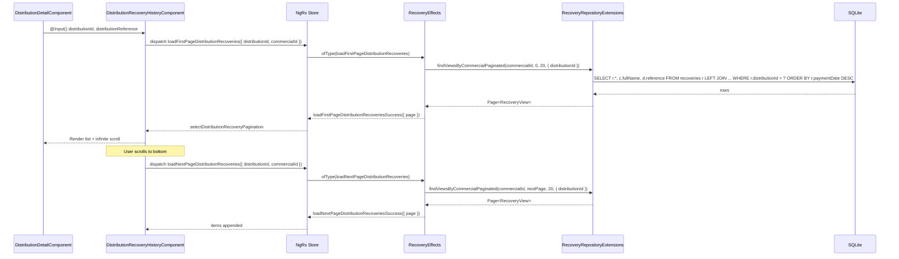

# Design Document: Distribution Recovery History

## Overview

Cette fonctionnalité ajoute une section **"Historique des recouvrements"** dans le modal de détail d'une distribution (`DistributionDetailComponent`). Elle affiche la liste paginée des recouvrements liés à cette distribution spécifique, triés du plus récent au plus ancien, avec un infinite scroll. L'objectif est de permettre au commercial de consulter rapidement l'historique de paiement d'un crédit directement depuis son détail, sans quitter le contexte.

L'approche retenue est **locale-first** : les données sont lues depuis la base SQLite locale via le repository existant (`RecoveryRepositoryExtensions`), en filtrant par `distributionId`. Aucun appel réseau n'est nécessaire pour cette fonctionnalité.

## Architecture

```mermaid
graph TD
    A[DistributionDetailComponent] -->|@Input distribution| B[DistributionRecoveryHistoryComponent]
    B -->|dispatch loadFirstPage| C[NgRx Store - Recovery]
    B -->|dispatch loadNextPage| C
    C -->|effect| D[RecoveryRepositoryExtensions]
    D -->|SQL JOIN + filter distributionId| E[(SQLite Local DB)]
    E -->|RecoveryView paginated| D
    D -->|Page of RecoveryView| C
    C -->|selectDistributionRecoveries| B
    B -->|click item| F[RecoveryDetailComponent Modal]
```

### Flux de données



## Components and Interfaces

### Component 1 : DistributionRecoveryHistoryComponent (nouveau)

**Purpose** : Composant standalone dédié à l'affichage de l'historique des recouvrements d'une distribution. Encapsule toute la logique de pagination et d'affichage.

**Sélecteur** : `app-distribution-recovery-history`

**Interface** :
```typescript
@Component({
  selector: 'app-distribution-recovery-history',
  standalone: true,
  imports: [CommonModule, IonicModule],
  changeDetection: ChangeDetectionStrategy.OnPush
})
export class DistributionRecoveryHistoryComponent implements OnInit, OnDestroy {
  @Input() distributionId!: string;
  @Input() distributionReference!: string;

  vm$: Observable<DistributionRecoveryHistoryVM>;

  ngOnInit(): void;
  loadMore(event: InfiniteScrollCustomEvent): void;
  openRecoveryDetail(recovery: RecoveryView): void;
  trackByRecoveryId(index: number, recovery: RecoveryView): string;
  ngOnDestroy(): void;
}
```

**Responsabilités** :
- Dispatcher `loadFirstPageDistributionRecoveries` au `ngOnInit`
- Dispatcher `loadNextPageDistributionRecoveries` lors du scroll infini
- Ouvrir le modal `RecoveryDetailComponent` au clic sur un item
- Se désabonner proprement à la destruction (`destroy$`)
- Réinitialiser la pagination à la destruction (`resetDistributionRecoveryPagination`)

---

### Component 2 : DistributionDetailComponent (modifié)

**Purpose** : Intégrer le nouveau composant enfant dans le template HTML existant.

**Modification** :
- Ajouter `DistributionRecoveryHistoryComponent` dans le tableau `imports` du composant standalone
- Ajouter le tag `<app-distribution-recovery-history>` dans le template, après la section des boutons d'action

```typescript
// Ajout dans imports[]
imports: [CommonModule, IonicModule, DistributionRecoveryHistoryComponent],
```

```html
<!-- Ajout dans distribution-detail.component.html -->
<app-distribution-recovery-history
  *ngIf="distribution?.id"
  [distributionId]="distribution.id"
  [distributionReference]="distribution.reference">
</app-distribution-recovery-history>
```

## Data Models

### DistributionRecoveryHistoryVM

View Model utilisé par le composant enfant :

```typescript
interface DistributionRecoveryHistoryVM {
  recoveries: RecoveryView[];  // Liste accumulée (infinite scroll)
  loading: boolean;            // Chargement en cours
  hasMore: boolean;            // Encore des pages disponibles
  totalCount: number;          // Nombre total de recouvrements
  error: string | null;        // Erreur éventuelle
}
```

### DistributionRecoveryPaginationState

Slice d'état NgRx dédié à la pagination par distribution (isolé de la pagination globale) :

```typescript
interface DistributionRecoveryPaginationState {
  distributionId: string | null;  // Distribution courante filtrée
  items: RecoveryView[];
  currentPage: number;
  pageSize: number;
  totalItems: number;
  hasMore: boolean;
  loading: boolean;
  error: string | null;
}
```

### RecoveryRepositoryFilters (extension)

Le filtre `distributionId` est ajouté à l'interface existante :

```typescript
// Existant dans recovery.repository.extensions.ts
export interface RecoveryRepositoryFilters extends RepositoryViewFilters {
  paymentMethod?: string;
  clientId?: string;
  distributionId?: string;  // NOUVEAU : filtre par distribution
}
```

## Architecture NgRx — Nouvelles Actions

Les nouvelles actions sont **isolées** de la pagination globale pour éviter tout conflit d'état :

```typescript
// Actions dédiées à l'historique par distribution
export const loadFirstPageDistributionRecoveries = createAction(
  '[Recovery] Load First Page Distribution Recoveries',
  props<{ distributionId: string; commercialId: string; pageSize?: number }>()
);

export const loadFirstPageDistributionRecoveriesSuccess = createAction(
  '[Recovery] Load First Page Distribution Recoveries Success',
  props<{ page: Page<RecoveryView> }>()
);

export const loadFirstPageDistributionRecoveriesFailure = createAction(
  '[Recovery] Load First Page Distribution Recoveries Failure',
  props<{ error: any }>()
);

export const loadNextPageDistributionRecoveries = createAction(
  '[Recovery] Load Next Page Distribution Recoveries',
  props<{ distributionId: string; commercialId: string }>()
);

export const loadNextPageDistributionRecoveriesSuccess = createAction(
  '[Recovery] Load Next Page Distribution Recoveries Success',
  props<{ page: Page<RecoveryView> }>()
);

export const loadNextPageDistributionRecoveriesFailure = createAction(
  '[Recovery] Load Next Page Distribution Recoveries Failure',
  props<{ error: any }>()
);

export const resetDistributionRecoveryPagination = createAction(
  '[Recovery] Reset Distribution Recovery Pagination'
);
```

## Architecture NgRx — Reducer

La `RecoveryState` est étendue avec un second slot de pagination dédié :

```typescript
export interface RecoveryState {
  // ... état existant ...
  pagination: PaginationState<RecoveryView>;           // Pagination globale (inchangée)
  distributionPagination: DistributionRecoveryPaginationState; // NOUVEAU
}
```

Les reducers pour les nouvelles actions suivent le même pattern que `loadFirstPageRecoveries` / `loadNextPageRecoveries`, mais opèrent sur `state.distributionPagination`.

## Architecture NgRx — Selectors

```typescript
export const selectDistributionRecoveryPagination = createSelector(
  selectRecoveryState,
  (state) => state.distributionPagination
);

export const selectDistributionRecoveryItems = createSelector(
  selectDistributionRecoveryPagination,
  (pagination) => pagination.items
);

export const selectDistributionRecoveryHasMore = createSelector(
  selectDistributionRecoveryPagination,
  (pagination) => pagination.hasMore
);

export const selectDistributionRecoveryLoading = createSelector(
  selectDistributionRecoveryPagination,
  (pagination) => pagination.loading
);

export const selectDistributionRecoveryTotalItems = createSelector(
  selectDistributionRecoveryPagination,
  (pagination) => pagination.totalItems
);
```

## Architecture NgRx — Effects

Deux nouveaux effets dans `RecoveryEffects`, calqués sur les effets de pagination existants :

```typescript
loadFirstPageDistributionRecoveries$ = createEffect(() =>
  this.actions$.pipe(
    ofType(RecoveryActions.loadFirstPageDistributionRecoveries),
    switchMap((action) =>
      from(
        this.recoveryRepositoryExtensions.findViewsByCommercialPaginated(
          action.commercialId,
          0,
          action.pageSize || 20,
          { distributionId: action.distributionId }
        )
      ).pipe(
        map((page) => RecoveryActions.loadFirstPageDistributionRecoveriesSuccess({ page })),
        catchError((error) => of(RecoveryActions.loadFirstPageDistributionRecoveriesFailure({ error: error.message })))
      )
    )
  )
);

loadNextPageDistributionRecoveries$ = createEffect(() =>
  this.actions$.pipe(
    ofType(RecoveryActions.loadNextPageDistributionRecoveries),
    withLatestFrom(this.store.select(selectDistributionRecoveryPagination)),
    switchMap(([action, pagination]) => {
      if (!pagination.hasMore || pagination.loading) return of({ type: 'NO_OP' });
      const nextPage = pagination.currentPage + 1;
      return from(
        this.recoveryRepositoryExtensions.findViewsByCommercialPaginated(
          action.commercialId,
          nextPage,
          pagination.pageSize,
          { distributionId: action.distributionId }
        )
      ).pipe(
        map((page) => RecoveryActions.loadNextPageDistributionRecoveriesSuccess({ page })),
        catchError((error) => of(RecoveryActions.loadNextPageDistributionRecoveriesFailure({ error: error.message })))
      );
    })
  )
);
```

## Repository — Extension du filtre distributionId

Dans `RecoveryRepositoryExtensions.findViewsByCommercialPaginated`, ajouter la condition :

```typescript
// Dans la construction du WHERE clause
if (filters?.distributionId) {
  whereConditions.push('r.distributionId = ?');
  params.push(filters.distributionId);
}
```

La requête SQL résultante pour la liste paginée par distribution :

```sql
SELECT r.*,
       c.fullName as clientName,
       c.quarter as clientQuarter,
       d.reference as distributionReference
FROM recoveries r
LEFT JOIN clients c ON r.clientId = c.id
LEFT JOIN distributions d ON r.distributionId = d.id
WHERE r.commercialId = ?
  AND r.distributionId = ?
ORDER BY r.paymentDate DESC
LIMIT 20 OFFSET 0
```

## UI — Template du composant enfant

Le composant `DistributionRecoveryHistoryComponent` affiche une section compacte, sans barre de recherche ni filtres (non pertinents dans ce contexte) :

```html
<div class="recovery-history-section" *ngIf="vm$ | async as vm">

  <!-- En-tête de section -->
  <div class="section-header">
    <ion-icon name="receipt-outline"></ion-icon>
    <span>Historique des recouvrements</span>
    <ion-badge color="success">{{ vm.totalCount }}</ion-badge>
  </div>

  <!-- État de chargement initial -->
  <div *ngIf="vm.loading && vm.recoveries.length === 0" class="loading-state">
    <ion-spinner name="bubbles"></ion-spinner>
  </div>

  <!-- Liste des recouvrements -->
  <ion-list *ngIf="vm.recoveries.length > 0">
    <ion-item
      *ngFor="let recovery of vm.recoveries; trackBy: trackByRecoveryId"
      (click)="openRecoveryDetail(recovery)"
      button>
      <!-- Date -->
      <div class="recovery-date" slot="start">
        <div class="date-day">{{ recovery.paymentDate | date:'dd' }}</div>
        <div class="date-month">{{ recovery.paymentDate | date:'MMM' }}</div>
      </div>
      <!-- Infos -->
      <ion-label>
        <h3>{{ recovery.amount | number:'1.0-0' }} FCFA</h3>
        <p>{{ recovery.paymentDate | date:'HH:mm' }} · {{ recovery.paymentMethod }}</p>
      </ion-label>
      <!-- Badge sync -->
      <ion-badge slot="end" [color]="recovery.isSync ? 'success' : 'medium'">
        <ion-icon [name]="recovery.isSync ? 'cloud-done-outline' : 'cloud-offline-outline'"></ion-icon>
      </ion-badge>
    </ion-item>
  </ion-list>

  <!-- Infinite scroll -->
  <ion-infinite-scroll (ionInfinite)="loadMore($event)" [disabled]="!vm.hasMore">
    <ion-infinite-scroll-content loadingSpinner="bubbles" loadingText="Chargement...">
    </ion-infinite-scroll-content>
  </ion-infinite-scroll>

  <!-- État vide -->
  <div *ngIf="!vm.loading && vm.recoveries.length === 0" class="empty-state">
    <ion-icon name="receipt-outline"></ion-icon>
    <p>Aucun recouvrement pour cette distribution</p>
  </div>

</div>
```

## Error Handling

### Scénario 1 : Erreur de lecture SQLite

**Condition** : La requête SQL échoue (base corrompue, verrou, etc.)  
**Réponse** : L'effet dispatche `loadFirstPageDistributionRecoveriesFailure({ error })`. Le reducer met `error` dans l'état.  
**Affichage** : Le composant affiche un message d'erreur inline avec un bouton "Réessayer" qui redispatche `loadFirstPageDistributionRecoveries`.

### Scénario 2 : Distribution sans recouvrements

**Condition** : `totalElements = 0` retourné par le repository.  
**Réponse** : `hasMore = false`, `items = []`.  
**Affichage** : État vide avec message "Aucun recouvrement pour cette distribution".

### Scénario 3 : Utilisateur non authentifié

**Condition** : `commercialId` absent du store auth.  
**Réponse** : Le composant ne dispatche pas d'action si `commercialId` est null (guard dans `ngOnInit`).  
**Affichage** : Section masquée ou état vide silencieux.

### Scénario 4 : Infinite scroll sur dernière page

**Condition** : `hasMore = false`.  
**Réponse** : `[disabled]="!vm.hasMore"` sur `ion-infinite-scroll` — le composant Ionic désactive automatiquement le scroll.

## Testing Strategy

### Unit Testing

- **DistributionRecoveryHistoryComponent** : tester que `loadFirstPageDistributionRecoveries` est dispatché au `ngOnInit` avec le bon `distributionId`, que `loadMore` dispatche `loadNextPageDistributionRecoveries`, et que `resetDistributionRecoveryPagination` est dispatché au `ngOnDestroy`.
- **RecoveryReducer** : tester les transitions d'état pour les 6 nouvelles actions (first page, next page, reset).
- **RecoverySelectors** : tester `selectDistributionRecoveryItems`, `selectDistributionRecoveryHasMore`, etc.
- **RecoveryRepositoryExtensions** : tester que le filtre `distributionId` est bien appliqué dans la requête SQL.

### Property-Based Testing

**Bibliothèque** : `fast-check`

- **Propriété 1** : Pour tout `distributionId` valide, les items retournés ont tous `distributionId === input.distributionId`.
- **Propriété 2** : Pour toute page `n`, les items sont triés par `paymentDate DESC` (chaque item a une date ≤ à l'item précédent).
- **Propriété 3** : `hasMore = true` si et seulement si `(currentPage + 1) * pageSize < totalItems`.
- **Propriété 4** : Après `n` appels à `loadNextPage`, `items.length = min(n * pageSize, totalItems)`.

### Integration Testing

- Tester le flux complet : dispatch action → effect → repository mock → success action → selector → composant rendu.
- Vérifier que la pagination globale (`state.pagination`) n'est pas affectée par les actions de pagination par distribution.

## Performance Considerations

- **Pagination côté DB** : `LIMIT / OFFSET` sur SQLite local — performant pour des volumes typiques (< 1000 recouvrements par distribution).
- **ChangeDetectionStrategy.OnPush** : le composant enfant utilise `OnPush` pour éviter les re-renders inutiles.
- **trackBy** : `trackByRecoveryId` sur le `*ngFor` pour optimiser les mises à jour DOM.
- **Isolation de l'état** : le slot `distributionPagination` est séparé du slot `pagination` global, évitant toute interférence lors de la navigation entre distributions.
- **Nettoyage** : `resetDistributionRecoveryPagination` est dispatché au `ngOnDestroy` pour libérer la mémoire et éviter d'afficher des données périmées à la prochaine ouverture.

## Security Considerations

- **Isolation commerciale** : le filtre `r.commercialId = ?` est **toujours** présent dans la requête SQL, conformément au pattern établi dans `RecoveryRepositoryExtensions`. Un commercial ne peut pas voir les recouvrements d'un autre commercial même en passant un `distributionId` arbitraire.
- **Validation des inputs** : `distributionId` et `commercialId` sont vérifiés non-null avant tout dispatch d'action.

## Dependencies

- `@ngrx/store` / `@ngrx/effects` — gestion d'état (déjà présent)
- `@ionic/angular` — composants UI `ion-list`, `ion-infinite-scroll`, `ion-badge` (déjà présent)
- `RecoveryRepositoryExtensions` — requêtes SQL paginées (déjà présent, extension mineure)
- `RecoveryDetailComponent` — modal de détail d'un recouvrement (déjà présent dans `RecoveryModule`)
- `ModalController` — ouverture du modal de détail (déjà présent dans `DistributionDetailComponent`)

## Correctness Properties

*A property is a characteristic or behavior that should hold true across all valid executions of a system — essentially, a formal statement about what the system should do. Properties serve as the bridge between human-readable specifications and machine-verifiable correctness guarantees.*

### Property 1: Filtrage strict par distributionId et commercialId

*For any* `distributionId` and `commercialId` passed to `RecoveryRepositoryExtensions.findViewsByCommercialPaginated`, every item in the returned page SHALL have `item.distributionId === distributionId` and `item.commercialId === commercialId`.

**Validates: Requirements 4.1, 4.2**

---

### Property 2: Tri décroissant par date de paiement

*For any* page of recoveries returned by the repository for a given `distributionId`, for every consecutive pair of items `(a, b)` in the list, `a.paymentDate >= b.paymentDate`.

**Validates: Requirements 1.2, 4.3**

---

### Property 3: Réinitialisation de l'état à la première page

*For any* `loadFirstPageDistributionRecoveriesSuccess` action carrying a page payload, the resulting `distributionPagination.items` SHALL equal exactly the items of that page (no carry-over from a previous state), and `currentPage` SHALL be 0.

**Validates: Requirements 5.3**

---

### Property 4: Accumulation des items au scroll infini

*For any* existing `distributionPagination.items` of length `n` and any `loadNextPageDistributionRecoveriesSuccess` action carrying `k` new items, the resulting `distributionPagination.items` SHALL have length `n + k` and the first `n` items SHALL be unchanged.

**Validates: Requirements 2.3**

---

### Property 5: Isolation de la pagination globale

*For any* sequence of `distributionPagination` actions (load first page, load next page, reset), the value of `state.pagination` SHALL remain identical before and after each action.

**Validates: Requirements 5.1, 5.2**

---

### Property 6: Cohérence du badge sync/local

*For any* `RecoveryView` rendered by `DistributionRecoveryHistoryComponent`, the badge color SHALL be `'success'` if and only if `recovery.isSync === true`, and `'medium'` otherwise.

**Validates: Requirements 3.1, 3.2**
