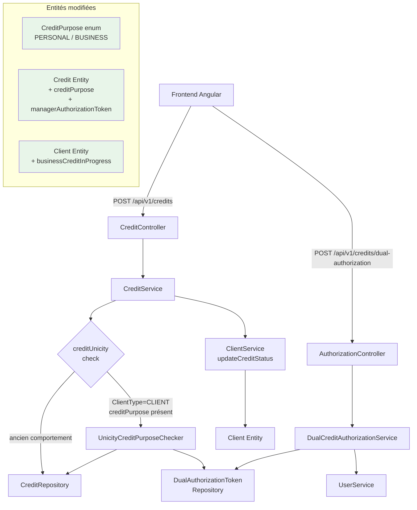
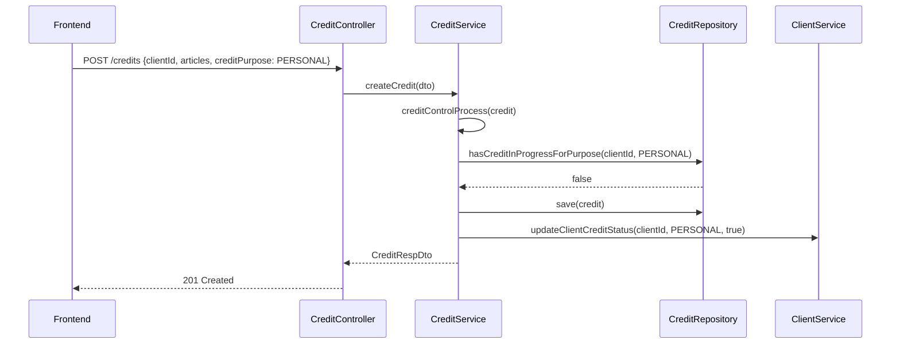
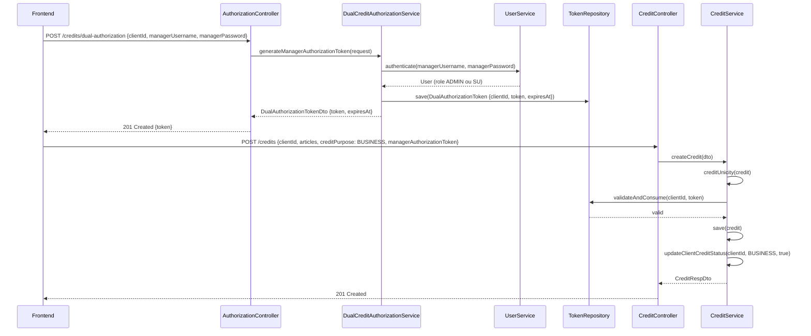

# Design Document

## Overview

Cette fonctionnalité permet à un client de détenir simultanément deux crédits actifs : un crédit **PERSONNEL** et un crédit **PROFESSIONNEL**, à condition qu'un manager autorise explicitement le second. Sans autorisation, la règle d'unicité existante reste en vigueur (un seul crédit en cours par client). La distinction se fait via un champ `creditPurpose` (enum `CreditPurpose`) ajouté à l'entité `Credit`.

Le système d'autorisation manager s'appuie sur un token d'autorisation à usage unique (`DualAuthorizationToken`) généré à la demande et validé lors de la création du second crédit. Ce pattern est cohérent avec les champs `operationConsentCode` et `syncConsentCode` déjà présents sur `Credit`. La compatibilité ascendante est totale : tout crédit existant sans `creditPurpose` est traité comme `PERSONAL`.

---

## Architecture



---

## Diagrammes de séquence

### Flux 1 : Création d'un premier crédit (PERSONAL, comportement inchangé)



### Flux 2 : Autorisation manager + création du crédit BUSINESS



---

## Components and Interfaces

### `CreditPurpose` (nouveau enum)

**Objectif** : Distinguer les deux types de crédits simultanés.

```java
public enum CreditPurpose {
    PERSONAL,   // Crédit personnel (comportement actuel, valeur par défaut)
    BUSINESS    // Crédit professionnel (nécessite autorisation manager si PERSONAL en cours)
}
```

**Règles** :
- Toute valeur `null` est traitée comme `PERSONAL` (compatibilité ascendante)
- Seul `BUSINESS` déclenche la vérification d'autorisation manager

---

### `Credit` (entité modifiée)

**Ajouts** :
```java
@Enumerated(EnumType.STRING)
@Column(name = "credit_purpose", columnDefinition = "VARCHAR(20) DEFAULT 'PERSONAL'")
private CreditPurpose creditPurpose = CreditPurpose.PERSONAL;

@Column(name = "manager_authorization_token")
private String managerAuthorizationToken;
```

---

### `Client` (entité modifiée)

**Ajout** :
```java
@Column(name = "business_credit_in_progress", columnDefinition = "boolean default false")
private boolean businessCreditInProgress = false;
```

`creditInProgress` continue de tracer les crédits `PERSONAL` ; `businessCreditInProgress` trace les crédits `BUSINESS`.

---

### `DualAuthorizationToken` (nouvelle entité)

```java
@Entity
public class DualAuthorizationToken extends Auditable<String> {
    @Id @GeneratedValue
    private Long id;

    private Long clientId;
    private String token;           // UUID généré
    private String authorizedBy;    // username du manager
    private LocalDateTime expiresAt;
    private boolean consumed;
    private LocalDateTime consumedAt;
}
```

Token à usage unique, TTL configurable (défaut : 30 minutes).

---

### `DualCreditAuthorizationService` (nouveau service)

```java
public interface DualCreditAuthorizationService {
    DualAuthorizationTokenDto generateManagerAuthorizationToken(ManagerAuthorizationRequest request);
    void validateAndConsumeToken(Long clientId, String token);
    boolean clientRequiresAuthorizationForNewCredit(Long clientId, CreditPurpose purpose);
}
```

---

### `CreditRepository` (méthodes ajoutées)

```java
@Query("SELECT count(*) FROM Credit c WHERE c.client.id = :clientId "
     + "AND c.creditPurpose = :purpose AND c.status IN :statuses AND c.state = :state")
Integer countByClientIdAndPurposeAndStatusIn(
    Long clientId, CreditPurpose purpose, List<CreditStatus> statuses, State state);

default boolean hasCreditInProgressForPurpose(Long clientId, CreditPurpose purpose) {
    return countByClientIdAndPurposeAndStatusIn(
        clientId, purpose,
        List.of(CreditStatus.INPROGRESS, CreditStatus.CREATED, CreditStatus.VALIDATED),
        State.ENABLED
    ) > 0;
}

// Conservé pour compatibilité (appelé depuis d'anciens endroits)
default boolean hasCreditInProgress(Long clientId) {
    return hasCreditInProgressForPurpose(clientId, CreditPurpose.PERSONAL)
        || hasCreditInProgressForPurpose(clientId, CreditPurpose.BUSINESS);
}
```

---

### `CreditService` — méthodes modifiées

```java
// Avant :
void creditUnicity(Credit credit);

// Après : tient compte du creditPurpose et valide le token si nécessaire
void creditUnicity(Credit credit);

// Méthode ajoutée dans ClientService :
Client updateClientCreditStatus(Long clientId, CreditPurpose purpose, Boolean status);
```

---

### Nouveaux endpoints REST

| Méthode | Chemin | Rôle |
|---------|--------|------|
| `POST` | `/api/v1/credits/dual-authorization` | Génère un token d'autorisation manager |

`POST /api/v1/credits` reste inchangé dans son URL — seuls les champs `creditPurpose` et `managerAuthorizationToken` sont ajoutés au payload `CreditDto`.

---

## Data Models

### `CreditDto` (modifié)

```java
@Data
public class CreditDto {
    private Long id;
    @NotNull(message = "L'identifiant du client est obligatoire !")
    private Long clientId;
    @NotNull(message = "Les articles liés au crédit sont obligatoire !")
    @Valid
    private Set<CreditArticlesDto> articles;
    private LocalDate beginDate;
    private LocalDate expectedEndDate;
    private Double totalAmount;
    private Double advance;
    private String agencyCommercial;
    private OperationType type;

    // NOUVEAU
    private CreditPurpose creditPurpose;          // null → interprété comme PERSONAL
    private String managerAuthorizationToken;     // requis si BUSINESS + PERSONAL déjà en cours
}
```

---

### `ManagerAuthorizationRequest` (nouveau)

```java
@Data
public class ManagerAuthorizationRequest {
    @NotNull
    private Long clientId;
    @NotBlank
    private String managerUsername;
    @NotBlank
    private String managerPassword;
}
```

---

### `DualAuthorizationTokenDto` (nouveau)

```java
public record DualAuthorizationTokenDto(
    String token,
    Long clientId,
    LocalDateTime expiresAt
) {}
```

---

### Migration Flyway

```sql
-- V{n}__add_dual_credit_authorization.sql

ALTER TABLE credit
  ADD COLUMN credit_purpose VARCHAR(20) DEFAULT 'PERSONAL' NOT NULL,
  ADD COLUMN manager_authorization_token VARCHAR(255);

UPDATE credit SET credit_purpose = 'PERSONAL' WHERE credit_purpose IS NULL;

ALTER TABLE client
  ADD COLUMN business_credit_in_progress BOOLEAN DEFAULT FALSE NOT NULL;

CREATE TABLE dual_authorization_token (
    id BIGSERIAL PRIMARY KEY,
    client_id BIGINT NOT NULL,
    token VARCHAR(255) NOT NULL UNIQUE,
    authorized_by VARCHAR(255) NOT NULL,
    expires_at TIMESTAMP NOT NULL,
    consumed BOOLEAN DEFAULT FALSE NOT NULL,
    consumed_at TIMESTAMP,
    created_date TIMESTAMP,
    last_modified_date TIMESTAMP,
    created_by VARCHAR(255),
    last_modified_by VARCHAR(255),
    state VARCHAR(50)
);

CREATE INDEX idx_credit_client_purpose_status
  ON credit(client_id, credit_purpose, status, state);

CREATE INDEX idx_dual_token_client_token
  ON dual_authorization_token(client_id, token);
```

---

## Algorithmes clés (Pseudocode)

### `createCredit` (modifié)

```pascal
ALGORITHM createCredit(creditDto)
INPUT: creditDto de type CreditDto
OUTPUT: CreditRespDto

BEGIN
  IF creditDto.type = CASH THEN
    RETURN createCashSale(creditDto)
  END IF

  credit ← creditMapper.toEntity(creditDto)

  IF credit.creditPurpose IS NULL THEN
    credit.creditPurpose ← PERSONAL
  END IF

  creditControlProcess(credit)
  creditUnicity(credit)

  RETURN createAndProcessCredit(credit, creditDto.clientId)
END
```

---

### `creditUnicity` (modifié)

```pascal
ALGORITHM creditUnicity(credit)
INPUT: credit de type Credit
OUTPUT: void

BEGIN
  IF NOT ClientType.CLIENT.equals(credit.clientType) THEN
    RETURN
  END IF

  purpose ← credit.creditPurpose ?? PERSONAL

  IF repository.hasCreditInProgressForPurpose(credit.clientId, purpose) THEN
    THROW CustomValidationException(
      "Le client possède déjà une vente " + purpose + " en cours !")
  END IF

  IF purpose = BUSINESS
    AND repository.hasCreditInProgressForPurpose(credit.clientId, PERSONAL) THEN
    IF credit.managerAuthorizationToken IS EMPTY THEN
      THROW CustomValidationException(
        "Une autorisation manager est requise pour un crédit professionnel simultané.")
    END IF
    dualCreditAuthorizationService.validateAndConsumeToken(
      credit.clientId, credit.managerAuthorizationToken)
  END IF
END
```

**Préconditions** :
- `credit.clientType` est défini
- `credit.client` et `credit.clientId` sont non-null

**Postconditions** :
- Pas d'exception → création autorisée
- Si `BUSINESS` avec token : le token est consommé (usage unique)

---

### `generateManagerAuthorizationToken`

```pascal
ALGORITHM generateManagerAuthorizationToken(request)
INPUT: request de type ManagerAuthorizationRequest
OUTPUT: DualAuthorizationTokenDto

BEGIN
  manager ← userService.findByUsername(request.managerUsername)
  IF manager IS NULL THEN THROW "Utilisateur introuvable" END IF

  IF NOT passwordEncoder.matches(request.managerPassword, manager.password) THEN
    THROW "Identifiants manager incorrects"
  END IF

  IF NOT (manager.role IN {ADMIN, SU}) THEN
    THROW "Seul un administrateur peut autoriser un double crédit"
  END IF

  token ← UUID.randomUUID().toString()
  expiresAt ← now() + TOKEN_TTL_MINUTES

  tokenRepository.save(DualAuthorizationToken {
    clientId: request.clientId, token, authorizedBy: manager.username,
    expiresAt, consumed: false
  })

  RETURN DualAuthorizationTokenDto { token, request.clientId, expiresAt }
END
```

**Préconditions** : credentials valides, clientId existant
**Postconditions** : token UUID persisté, non consommé, avec TTL

---

### `validateAndConsumeToken`

```pascal
ALGORITHM validateAndConsumeToken(clientId, tokenValue)
BEGIN
  authToken ← tokenRepository.findByClientIdAndToken(clientId, tokenValue)
  IF authToken IS NULL THEN THROW "Token invalide ou inexistant" END IF
  IF authToken.consumed THEN THROW "Token déjà utilisé" END IF
  IF now() > authToken.expiresAt THEN THROW "Token expiré" END IF

  authToken.consumed ← true
  authToken.consumedAt ← now()
  tokenRepository.save(authToken)
END
```

---

### `updateClientCreditStatus` (modifié dans `ClientService`)

```pascal
ALGORITHM updateClientCreditStatus(clientId, creditPurpose, status)
BEGIN
  client ← clientRepository.findById(clientId)

  IF creditPurpose = PERSONAL OR creditPurpose IS NULL THEN
    client.creditInProgress ← status
  ELSE IF creditPurpose = BUSINESS THEN
    client.businessCreditInProgress ← status
  END IF

  RETURN clientRepository.save(client)
END
```

---

## Correctness Properties

### Property 1: Unicité par purpose
Pour tout client `c` de type `CLIENT`, à tout instant, `count(credits INPROGRESS WHERE client=c AND purpose=PERSONAL) ≤ 1` ET `count(credits INPROGRESS WHERE client=c AND purpose=BUSINESS) ≤ 1`. Une deuxième tentative de création du même purpose pour le même client lève toujours une `CustomValidationException`.

**Validates: Requirements 2.1, 2.2, 2.3, 2.4**

### Property 2: Maximum 2 crédits simultanés
`count(credits INPROGRESS WHERE client=c) ≤ 2` en permanence pour tout client `c`. La combinaison (1 PERSONAL + 1 BUSINESS) est le maximum absolu autorisé.

**Validates: Requirements 2.5**

### Property 3: Compatibilité ascendante
Tout crédit existant avec `creditPurpose = null` est traité comme `PERSONAL` après migration. Pour tout crédit `c` dans la base avant migration, `c.creditPurpose = 'PERSONAL'` après exécution du script Flyway. Aucun crédit existant ne devient invalide.

**Validates: Requirements 1.2, 1.3, 1.4, 1.6**

### Property 4: Token usage unique
Pour tout `DualAuthorizationToken t`, si `t.consumed = true` alors toute tentative ultérieure de validation avec `t.token` lève une `CustomValidationException`. Un token ne peut être consommé qu'une seule fois.

**Validates: Requirements 4.5, 4.7**

### Property 5: Token expiration
Pour tout `DualAuthorizationToken t`, si `now() > t.expiresAt` alors la validation échoue (`CustomValidationException`), quelle que soit la valeur de `consumed`. Le délai d'expiration s'applique indépendamment de l'état du token.

**Validates: Requirements 4.6**

### Property 6: Autorisation exclusive manager
Un `DualAuthorizationToken` ne peut être généré que si l'utilisateur authentifié a le rôle `ADMIN` ou `SU` (définis dans `UserProfilConstant`). Tout utilisateur avec un autre rôle reçoit une erreur.

**Validates: Requirements 3.4, 3.5**

### Property 7: Cohérence Client
`client.businessCreditInProgress = true` si et seulement si un crédit `BUSINESS` avec `status IN (INPROGRESS, CREATED, VALIDATED)` existe pour ce client. La valeur est mise à `false` dès que ce crédit atteint `SETTLED` ou est supprimé (soft delete).

**Validates: Requirements 6.4, 6.6, 6.7**

### Property 8: Crédit BUSINESS sans PERSONAL actif ne nécessite pas de token
Un crédit `BUSINESS` peut être créé sans token manager si le client n'a pas de crédit `PERSONAL` en cours. La contrainte d'autorisation ne s'applique que lorsqu'un `PERSONAL` est simultanément actif.

**Validates: Requirements 5.1, 5.2**

---

## Error Handling

### Scénario 1 : Second crédit du même purpose

**Condition** : `hasCreditInProgressForPurpose(clientId, purpose) = true` pour le même `purpose`
**Réponse** : `HTTP 400` — `"Le client X possède déjà une vente PERSONAL/BUSINESS en cours !"`
**Récupération** : Clôturer le crédit existant de ce purpose avant d'en créer un nouveau

---

### Scénario 2 : BUSINESS sans token alors qu'un PERSONAL est en cours

**Condition** : `creditPurpose = BUSINESS` + `hasCreditInProgressForPurpose(clientId, PERSONAL) = true` + `managerAuthorizationToken` absent
**Réponse** : `HTTP 400` — `"Une autorisation manager est requise pour créer un crédit professionnel simultané."`
**Récupération** : Appeler `POST /credits/dual-authorization` pour obtenir un token

---

### Scénario 3 : Token expiré

**Condition** : `now() > authToken.expiresAt`
**Réponse** : `HTTP 400` — `"Le token d'autorisation a expiré."`
**Récupération** : Générer un nouveau token

---

### Scénario 4 : Token déjà consommé

**Condition** : `authToken.consumed = true`
**Réponse** : `HTTP 400` — `"Ce token d'autorisation a déjà été utilisé."`
**Récupération** : Générer un nouveau token

---

### Scénario 5 : Rôle insuffisant pour générer un token

**Condition** : Utilisateur authentifié avec rôle ∉ `{ADMIN, SU}`
**Réponse** : `HTTP 400` — `"Seul un administrateur peut autoriser un double crédit."`
**Récupération** : Utiliser les credentials d'un compte ADMIN ou SU (voir `UserProfilConstant`)

---

## Testing Strategy

### Tests unitaires

- `CreditServiceTest.createCredit_withNullPurpose_defaultsToPERSONAL()`
- `CreditServiceTest.creditUnicity_PERSONAL_alreadyInProgress_throws()`
- `CreditServiceTest.creditUnicity_BUSINESS_withValidToken_succeeds()`
- `CreditServiceTest.creditUnicity_BUSINESS_withoutToken_personalInProgress_throws()`
- `CreditServiceTest.creditUnicity_BUSINESS_noPersonalInProgress_noTokenRequired()`
- `DualCreditAuthorizationServiceTest.generateToken_nonAdminUser_throws()`
- `DualCreditAuthorizationServiceTest.validateToken_consumed_throws()`
- `DualCreditAuthorizationServiceTest.validateToken_expired_throws()`
- `DualCreditAuthorizationServiceTest.validateToken_valid_consumesToken()`
- `ClientServiceTest.updateCreditStatus_PERSONAL_updatesCorrectField()`
- `ClientServiceTest.updateCreditStatus_BUSINESS_updatesCorrectField()`

### Tests par propriétés (Property-Based Testing)

**Librairie** : JUnit 5 + jqwik

```java
// Propriété 1 : un crédit du même purpose est toujours refusé si un existe déjà
@Property
void uniciteParPurpose(@ForAll CreditPurpose purpose, @ForAll @Positive Long clientId) {
    // Créer un crédit pour purpose
    // Tenter d'en créer un second → doit toujours lever CustomValidationException
}

// Propriété 2 : un token est toujours rejeté après son TTL
@Property
void tokenExpireApresDelai(@ForAll @IntRange(min = 1, max = 60) int minutesApresTTL) {
    DualAuthorizationToken token = createTokenWithTTL(TOKEN_TTL_MINUTES);
    advanceClock(TOKEN_TTL_MINUTES + minutesApresTTL);
    assertThrows(CustomValidationException.class,
        () -> service.validateAndConsumeToken(clientId, token.getToken()));
}

// Propriété 3 : un token consommé est toujours rejeté
@Property
void tokenConsommeEstToujoursRejete(@ForAll String validToken) {
    // Première consommation → succès
    // Deuxième consommation → toujours exception
}
```

### Tests d'intégration

- `DualCreditAuthorizationIntegrationTest` : scénario complet (token + crédit BUSINESS)
- `CreditRepositoryTest.hasCreditInProgressForPurpose` : validation requête JPA par purpose
- Test Flyway : vérifier que les crédits existants ont `credit_purpose = 'PERSONAL'` après migration

---

## Considérations de performance

- Ajouter l'index `(client_id, credit_purpose, status, state)` sur la table `credit` pour les requêtes de comptage par purpose.
- `businessCreditInProgress` sur `Client` évite une requête de comptage à chaque affichage — cohérent avec le pattern existant `creditInProgress`.
- Purge planifiée des `DualAuthorizationToken` expirés ou consommés de plus de 24h (table à faible volumétrie).

---

## Considérations de sécurité

- `POST /credits/dual-authorization` doit être exposé exclusivement via HTTPS (TLS) car il reçoit le mot de passe manager.
- Le token UUID v4 offre 122 bits d'entropie — résistant aux attaques par force brute.
- Les tokens expirés sont conservés pour audit (traçabilité : qui a autorisé, pour quel client, quand).
- L'action de génération de token doit être tracée dans les logs d'audit applicatif.

---

## Modifications frontend (extrait)

### `credit-add.component.html`

```html
<!-- Finalité du crédit — visible uniquement pour les crédits à terme -->
<div class="form-group" *ngIf="saleType === 'CREDIT'">
  <label>Finalité du crédit</label>
  <div class="btn-group btn-group-toggle" data-toggle="buttons">
    <label class="btn btn-outline-secondary" [class.active]="creditPurpose === 'PERSONAL'">
      <input type="radio" formControlName="creditPurpose" value="PERSONAL"> Personnel
    </label>
    <label class="btn btn-outline-secondary" [class.active]="creditPurpose === 'BUSINESS'">
      <input type="radio" formControlName="creditPurpose" value="BUSINESS"> Professionnel
    </label>
  </div>
</div>

<!-- Autorisation manager — visible si BUSINESS et client a un PERSONAL actif -->
<div class="alert alert-warning" *ngIf="requiresManagerAuthorization">
  <strong>Autorisation manager requise</strong>
  <p>Ce client possède déjà un crédit personnel en cours.
     Un responsable doit autoriser ce crédit professionnel.</p>
  <button type="button" class="btn btn-warning" (click)="openManagerAuthorizationModal()">
    Obtenir une autorisation
  </button>
  <span *ngIf="managerAuthorizationToken" class="badge badge-success ml-2">
    ✓ Autorisé
  </span>
</div>
```

---

## Dépendances

- **Backend** : aucune nouvelle dépendance externe — Spring Security, Spring Data JPA, Flyway existants
- **Frontend** : Angular Reactive Forms existants — aucun nouveau package
- **Base de données** : PostgreSQL — migrations Flyway
- **Tests PBT** : jqwik (à ajouter dans `pom.xml` si absent)
- **Pattern réutilisé** : `operationConsentCode` / `syncConsentCode` sur `Credit` comme modèle pour `managerAuthorizationToken`
