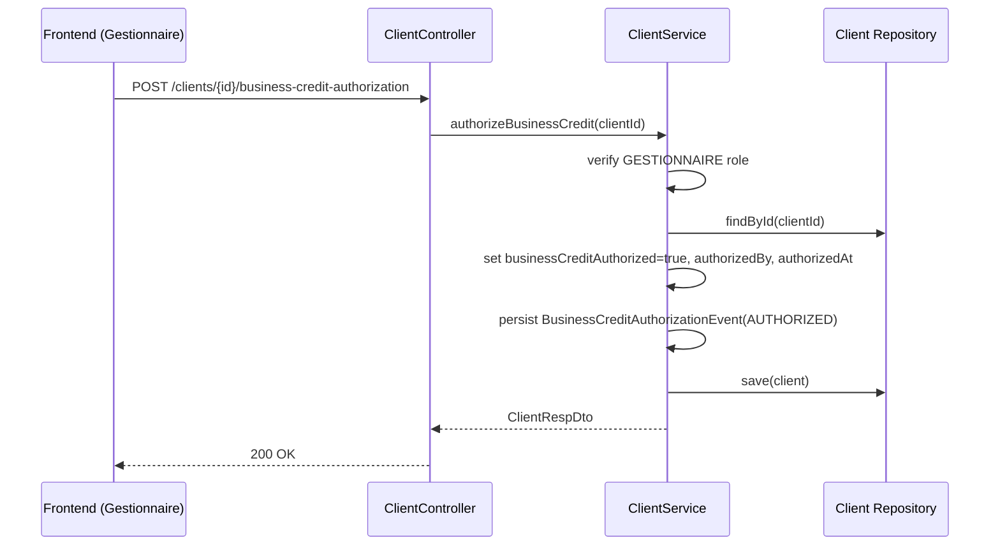
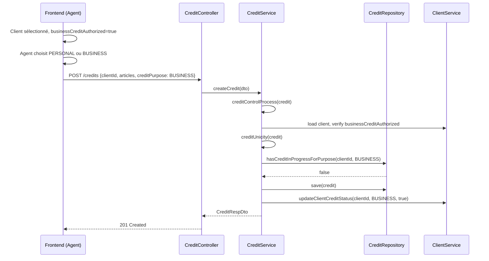
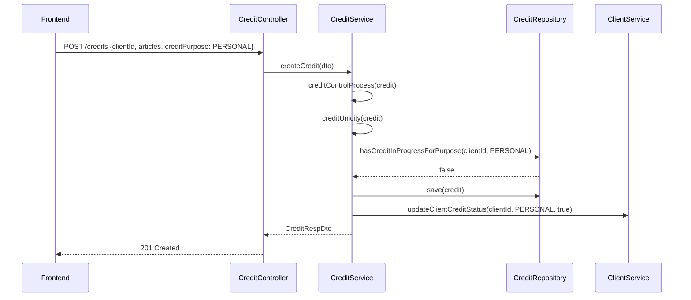
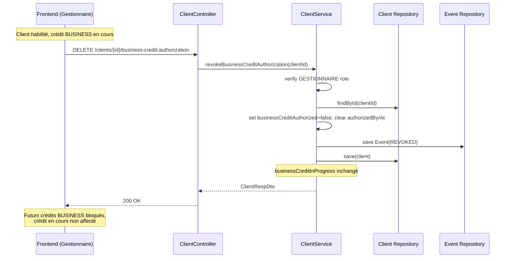

# Design Document

## Overview

Cette fonctionnalité permet à un client de détenir simultanément deux crédits actifs : un crédit **PERSONNEL** et un crédit **PROFESSIONNEL**, à condition qu'un **GESTIONNAIRE** ait préalablement habilité le client. Sans habilitation, la règle d'unicité existante reste en vigueur (un seul crédit en cours par client). La distinction se fait via un champ `creditPurpose` (enum `CreditPurpose`) ajouté à l'entité `Credit`.

L'habilitation business est **persistante** sur le profil client (`businessCreditAuthorized`), avec traçabilité de l'habilitation courante (`businessCreditAuthorizedBy`, `businessCreditAuthorizedAt`) et un **historique immuable** de toutes les habilitations et révocations (`BusinessCreditAuthorizationEvent`). Elle est accordée ou retirée par le GESTIONNAIRE depuis la liste ou la fiche client.

La **révocation est toujours possible** tant que le client est habilité, y compris si un crédit BUSINESS est en cours. Elle n'affecte pas le crédit en cours : elle empêche uniquement la création de futurs crédits BUSINESS.

**Règle Option A** : tout crédit `BUSINESS` exige `businessCreditAuthorized = true`, indépendamment de la présence d'un crédit `PERSONAL` en cours.

La compatibilité ascendante est totale : tout crédit existant sans `creditPurpose` est traité comme `PERSONAL`.

---

## Architecture

```mermaid
graph TD
    FE[Frontend Angular] -->|POST /api/v1/credits| CC[CreditController]
    FE -->|POST/DELETE /api/v1/clients/{id}/business-credit-authorization| CLC[ClientController]

    CC --> CS[CreditService]
    CLC --> CLS[ClientService]

    CS --> CU{creditUnicity\ncheck}
    CU -->|ClientType=CLIENT| UC[UnicityCreditPurposeChecker]
    CU -->|ancien comportement| CR[CreditRepository]

    UC --> CR
    UC -->|BUSINESS| AUTH{businessCreditAuthorized ?}

    CLS --> CL[Client Entity]

    FE -->|GET /api/v1/clients/{id}/business-credit-authorization/history| CLC

    CLS --> HIST[BusinessCreditAuthorizationEvent\nRepository]

    subgraph "Entités modifiées"
        CP[CreditPurpose enum\nPERSONAL / BUSINESS]
        CR2[Credit Entity\n+ creditPurpose]
        CL2[Client Entity\n+ businessCreditAuthorized\n+ businessCreditInProgress\n+ authorizedBy/At]
        EV[BusinessCreditAuthorizationEvent\nAUTHORIZED / REVOKED]
    end

    style CP fill:#e8f5e9
    style CR2 fill:#e8f5e9
    style CL2 fill:#e8f5e9
```

---

## Diagrammes de séquence

### Flux 1 : Habilitation business par le GESTIONNAIRE



### Flux 2 : Création d'une vente à crédit avec choix de finalité



### Flux 3 : Création d'un crédit PERSONAL (comportement inchangé)



### Flux 4 : Révocation avec crédit BUSINESS en cours



---

## Components and Interfaces

### `CreditPurpose` (nouveau enum)

**Objectif** : Distinguer les deux types de crédits simultanés.

```java
public enum CreditPurpose {
    PERSONAL,   // Crédit personnel (comportement actuel, valeur par défaut)
    BUSINESS    // Crédit professionnel (nécessite businessCreditAuthorized sur le client)
}
```

**Règles** :
- Toute valeur `null` est traitée comme `PERSONAL` (compatibilité ascendante)
- Seul `BUSINESS` déclenche la vérification de `businessCreditAuthorized`

---

### `Credit` (entité modifiée)

**Ajout** :
```java
@Enumerated(EnumType.STRING)
@Column(name = "credit_purpose", columnDefinition = "VARCHAR(20) DEFAULT 'PERSONAL'")
private CreditPurpose creditPurpose = CreditPurpose.PERSONAL;
```

Pas de champ `managerAuthorizationToken` — l'habilitation est portée par le client.

---

### `Client` (entité modifiée)

**Ajouts** :
```java
@Column(name = "business_credit_in_progress", columnDefinition = "boolean default false")
private boolean businessCreditInProgress = false;

@Column(name = "business_credit_authorized", columnDefinition = "boolean default false")
private boolean businessCreditAuthorized = false;

@Column(name = "business_credit_authorized_by")
private String businessCreditAuthorizedBy;

@Column(name = "business_credit_authorized_at")
private LocalDateTime businessCreditAuthorizedAt;
```

`creditInProgress` continue de tracer les crédits `PERSONAL` ; `businessCreditInProgress` trace les crédits `BUSINESS` ; `businessCreditAuthorized` reflète l'état courant et n'est modifié que par action GESTIONNAIRE explicite.

---

### `BusinessCreditAuthorizationAction` (nouveau enum)

```java
public enum BusinessCreditAuthorizationAction {
    AUTHORIZED,
    REVOKED
}
```

---

### `BusinessCreditAuthorizationEvent` (nouvelle entité)

```java
@Entity
@Table(name = "business_credit_authorization_event")
public class BusinessCreditAuthorizationEvent extends Auditable<String> {
    @Id @GeneratedValue
    private Long id;

    private Long clientId;

    @Enumerated(EnumType.STRING)
    private BusinessCreditAuthorizationAction action;

    private String performedBy;
    private LocalDateTime performedAt;
}
```

Enregistrements **immuable** : insert-only, jamais mis à jour ni supprimés.

---

### `ClientService` — nouvelles méthodes

```java
ClientRespDto authorizeBusinessCredit(Long clientId);
ClientRespDto revokeBusinessCreditAuthorization(Long clientId);
List<BusinessCreditAuthorizationEventDto> getBusinessCreditAuthorizationHistory(Long clientId);
```

**Règles `authorizeBusinessCredit`** :
- Vérifier profil `GESTIONNAIRE` via `UserProfilConstant.GESTIONNAIRE`
- Rejeter si client introuvable ou déjà autorisé
- Poser `businessCreditAuthorized = true`, `authorizedBy`, `authorizedAt`
- Persister un `BusinessCreditAuthorizationEvent` avec `action = AUTHORIZED`
- Logger l'événement d'audit

**Règles `revokeBusinessCreditAuthorization`** :
- Vérifier profil `GESTIONNAIRE`
- Rejeter si client non autorisé
- Poser `businessCreditAuthorized = false`, effacer `authorizedBy` et `authorizedAt`
- Persister un `BusinessCreditAuthorizationEvent` avec `action = REVOKED`
- **Ne pas** vérifier ni modifier `businessCreditInProgress` ni le crédit BUSINESS en cours
- Logger l'événement d'audit

---

### `CreditRepository` (méthodes ajoutées)

```java
@Query("SELECT count(*) FROM Credit c WHERE c.client.id = :clientId "
     + "AND c.creditPurpose = :purpose AND c.status IN :statuses AND c.state = :state")
Integer countByClientIdAndPurposeAndStatusIn(
    Long clientId, CreditPurpose purpose, List<CreditStatus> statuses, State state);

default boolean hasCreditInProgressForPurpose(Long clientId, CreditPurpose purpose) {
    return countByClientIdAndPurposeAndStatusIn(
        clientId, purpose,
        List.of(CreditStatus.INPROGRESS, CreditStatus.CREATED, CreditStatus.VALIDATED),
        State.ENABLED
    ) > 0;
}

default boolean hasCreditInProgress(Long clientId) {
    return hasCreditInProgressForPurpose(clientId, CreditPurpose.PERSONAL)
        || hasCreditInProgressForPurpose(clientId, CreditPurpose.BUSINESS);
}
```

---

### `CreditService` — méthodes modifiées

```java
void creditUnicity(Credit credit);
Client updateClientCreditStatus(Long clientId, CreditPurpose purpose, Boolean status);
```

---

### Nouveaux endpoints REST

| Méthode | Chemin | Rôle | Description |
|---------|--------|------|-------------|
| `POST` | `/api/v1/clients/{clientId}/business-credit-authorization` | GESTIONNAIRE | Habilite le client au crédit business |
| `DELETE` | `/api/v1/clients/{clientId}/business-credit-authorization` | GESTIONNAIRE | Retire l'habilitation (même si BUSINESS en cours) |
| `GET` | `/api/v1/clients/{clientId}/business-credit-authorization/history` | GESTIONNAIRE | Historique des habilitations/révocations |

`POST /api/v1/credits` reste inchangé dans son URL — seul le champ `creditPurpose` est ajouté au payload `CreditDto`.

---

## Data Models

### `CreditDto` (modifié)

```java
@Data
public class CreditDto {
    private Long id;
    @NotNull(message = "L'identifiant du client est obligatoire !")
    private Long clientId;
    @NotNull(message = "Les articles liés au crédit sont obligatoire !")
    @Valid
    private Set<CreditArticlesDto> articles;
    private LocalDate beginDate;
    private LocalDate expectedEndDate;
    private Double totalAmount;
    private Double advance;
    private String agencyCommercial;
    private OperationType type;

    // NOUVEAU
    private CreditPurpose creditPurpose;   // null → interprété comme PERSONAL
}
```

---

### `ClientDto` / `ClientRespDto` (modifiés)

```java
// Champs ajoutés (exposés en lecture ; non modifiables via PUT client standard)
private boolean businessCreditAuthorized;
private String businessCreditAuthorizedBy;
private LocalDateTime businessCreditAuthorizedAt;
private boolean businessCreditInProgress;
```

L'habilitation business ne se modifie pas via le formulaire client standard — uniquement via les endpoints dédiés.

---

### `BusinessCreditAuthorizationEventDto` (nouveau)

```java
public record BusinessCreditAuthorizationEventDto(
    Long id,
    Long clientId,
    BusinessCreditAuthorizationAction action,
    String performedBy,
    LocalDateTime performedAt
) {}
```

---

### Migration Flyway

```sql
-- V{n}__add_dual_credit_authorization.sql

ALTER TABLE credit
  ADD COLUMN credit_purpose VARCHAR(20) DEFAULT 'PERSONAL' NOT NULL;

UPDATE credit SET credit_purpose = 'PERSONAL' WHERE credit_purpose IS NULL;

ALTER TABLE client
  ADD COLUMN business_credit_in_progress BOOLEAN DEFAULT FALSE NOT NULL,
  ADD COLUMN business_credit_authorized BOOLEAN DEFAULT FALSE NOT NULL,
  ADD COLUMN business_credit_authorized_by VARCHAR(255),
  ADD COLUMN business_credit_authorized_at TIMESTAMP;

CREATE TABLE business_credit_authorization_event (
    id BIGSERIAL PRIMARY KEY,
    client_id BIGINT NOT NULL,
    action VARCHAR(20) NOT NULL,
    performed_by VARCHAR(255) NOT NULL,
    performed_at TIMESTAMP NOT NULL,
    created_date TIMESTAMP,
    last_modified_date TIMESTAMP,
    created_by VARCHAR(255),
    last_modified_by VARCHAR(255),
    state VARCHAR(50)
);

CREATE INDEX idx_bca_event_client_performed
  ON business_credit_authorization_event(client_id, performed_at DESC);

CREATE INDEX idx_credit_client_purpose_status
  ON credit(client_id, credit_purpose, status, state);
```

---

## Algorithmes clés (Pseudocode)

### `authorizeBusinessCredit`

```pascal
ALGORITHM authorizeBusinessCredit(clientId)
INPUT: clientId de type Long
OUTPUT: ClientRespDto

BEGIN
  currentUser ← securityContext.getCurrentUser()
  IF NOT currentUser.is(GESTIONNAIRE) THEN
    THROW ForbiddenException("Seul un gestionnaire peut habiliter un client au crédit business.")
  END IF

  client ← clientRepository.findById(clientId)
  IF client IS NULL THEN THROW "Client introuvable" END IF

  IF client.businessCreditAuthorized = true THEN
    THROW CustomValidationException("Ce client est déjà habilité au crédit business.")
  END IF

  client.businessCreditAuthorized ← true
  client.businessCreditAuthorizedBy ← currentUser.username
  client.businessCreditAuthorizedAt ← now()
  eventRepository.save(BusinessCreditAuthorizationEvent {
    clientId, action: AUTHORIZED, performedBy: currentUser.username, performedAt: now()
  })
  auditLog("BUSINESS_CREDIT_AUTHORIZED", clientId, currentUser.username)

  RETURN clientMapper.toRespDto(clientRepository.save(client))
END
```

---

### `revokeBusinessCreditAuthorization`

```pascal
ALGORITHM revokeBusinessCreditAuthorization(clientId)
BEGIN
  currentUser ← securityContext.getCurrentUser()
  IF NOT currentUser.is(GESTIONNAIRE) THEN THROW ForbiddenException END IF

  client ← clientRepository.findById(clientId)
  IF client IS NULL THEN THROW "Client introuvable" END IF

  IF client.businessCreditAuthorized = false THEN
    THROW CustomValidationException("Ce client n'est pas habilité au crédit business.")
  END IF

  client.businessCreditAuthorized ← false
  client.businessCreditAuthorizedBy ← NULL
  client.businessCreditAuthorizedAt ← NULL
  eventRepository.save(BusinessCreditAuthorizationEvent {
    clientId, action: REVOKED, performedBy: currentUser.username, performedAt: now()
  })
  auditLog("BUSINESS_CREDIT_REVOKED", clientId, currentUser.username)
  // businessCreditInProgress et crédit BUSINESS en cours : non modifiés

  RETURN clientMapper.toRespDto(clientRepository.save(client))
END
```

---

### `creditUnicity` (modifié)

```pascal
ALGORITHM creditUnicity(credit)
INPUT: credit de type Credit
OUTPUT: void

BEGIN
  IF NOT ClientType.CLIENT.equals(credit.clientType) THEN
    RETURN
  END IF

  purpose ← credit.creditPurpose ?? PERSONAL
  client ← credit.client

  IF repository.hasCreditInProgressForPurpose(credit.clientId, purpose) THEN
    THROW CustomValidationException(
      "Le client possède déjà une vente " + purpose + " en cours !")
  END IF

  IF purpose = BUSINESS THEN
    IF NOT client.businessCreditAuthorized THEN
      THROW CustomValidationException(
        "Ce client n'est pas habilité pour un crédit professionnel.")
    END IF
  END IF
END
```

**Préconditions** :
- `credit.clientType` est défini
- `credit.client` et `credit.clientId` sont non-null

**Postconditions** :
- Pas d'exception → création autorisée

---

### `updateClientCreditStatus` (modifié dans `ClientService`)

```pascal
ALGORITHM updateClientCreditStatus(clientId, creditPurpose, status)
BEGIN
  client ← clientRepository.findById(clientId)

  IF creditPurpose = PERSONAL OR creditPurpose IS NULL THEN
    client.creditInProgress ← status
  ELSE IF creditPurpose = BUSINESS THEN
    client.businessCreditInProgress ← status
  END IF

  RETURN clientRepository.save(client)
END
```

---

## Correctness Properties

### Property 1: Unicité par purpose
Pour tout client `c` de type `CLIENT`, à tout instant, `count(credits actifs WHERE client=c AND purpose=PERSONAL) ≤ 1` ET `count(credits actifs WHERE client=c AND purpose=BUSINESS) ≤ 1`.

**Validates: Requirements 2.1, 2.2, 2.3, 2.4**

### Property 2: Maximum 2 crédits simultanés
`count(credits actifs WHERE client=c) ≤ 2` en permanence. La combinaison (1 PERSONAL + 1 BUSINESS) est le maximum absolu autorisé.

**Validates: Requirements 2.5**

### Property 3: Compatibilité ascendante
Tout crédit existant avec `creditPurpose = null` est traité comme `PERSONAL` après migration.

**Validates: Requirements 1.2, 1.3, 1.4**

### Property 4: Habilitation exclusive GESTIONNAIRE
Seul un utilisateur avec profil `GESTIONNAIRE` peut modifier `businessCreditAuthorized`.

**Validates: Requirements 3.2, 4.5**

### Property 5: BUSINESS exige habilitation (Option A)
Toute création de crédit `BUSINESS` échoue si `businessCreditAuthorized = false`, qu'un crédit `PERSONAL` soit ou non en cours.

**Validates: Requirements 5.1, 5.2, 5.5**

### Property 6: Révocation indépendante du crédit en cours
La révocation met `businessCreditAuthorized = false` sans modifier `businessCreditInProgress` ni le crédit BUSINESS actif. Un crédit BUSINESS en cours peut coexister avec `businessCreditAuthorized = false`.

**Validates: Requirements 4.8, 4.9**

### Property 7: Historique immuable
Chaque habilitation et révocation produit exactement un enregistrement `BusinessCreditAuthorizationEvent` insert-only. L'historique complet est consultable par client.

**Validates: Requirements 3.2, 4.2, 4b.3, 4b.4**

### Property 8: Cohérence flags Client
`client.businessCreditInProgress = true` si et seulement si un crédit `BUSINESS` actif existe. `client.businessCreditAuthorized` n'est modifié que par action GESTIONNAIRE explicite.

**Validates: Requirements 6.8, 6.9, 6.11**

---

## Error Handling

### Scénario 1 : Second crédit du même purpose

**Condition** : `hasCreditInProgressForPurpose(clientId, purpose) = true`
**Réponse** : `HTTP 400` — `"Le client X possède déjà une vente PERSONAL/BUSINESS en cours !"`

---

### Scénario 2 : BUSINESS sans habilitation client

**Condition** : `creditPurpose = BUSINESS` + `businessCreditAuthorized = false`
**Réponse** : `HTTP 400` — `"Ce client n'est pas habilité pour un crédit professionnel."`
**Récupération** : Un GESTIONNAIRE doit habiliter le client via la fiche client

---

### Scénario 3 : Révocation avec BUSINESS en cours

**Condition** : `businessCreditAuthorized = true` + `businessCreditInProgress = true`
**Réponse** : `HTTP 200` — habilitation retirée, crédit en cours non affecté
**Effet** : futurs crédits BUSINESS refusés ; le crédit BUSINESS actif se poursuit normalement

---

### Scénario 4 : Action GESTIONNAIRE par un non-gestionnaire

**Condition** : Utilisateur authentifié sans profil `GESTIONNAIRE`
**Réponse** : `HTTP 403` — `"Seul un gestionnaire peut habiliter un client au crédit business."`

---

### Scénario 5 : Double habilitation

**Condition** : `businessCreditAuthorized = true` lors d'un nouvel appel authorize
**Réponse** : `HTTP 400` — `"Ce client est déjà habilité au crédit business."`

---

## Testing Strategy

### Tests unitaires

- `CreditServiceTest.createCredit_withNullPurpose_defaultsToPERSONAL()`
- `CreditServiceTest.creditUnicity_PERSONAL_alreadyInProgress_throws()`
- `CreditServiceTest.creditUnicity_BUSINESS_alreadyInProgress_throws()`
- `CreditServiceTest.creditUnicity_BUSINESS_notAuthorized_throws()`
- `CreditServiceTest.creditUnicity_BUSINESS_authorized_succeeds()`
- `CreditServiceTest.creditUnicity_BUSINESS_authorized_noPersonalRequired()`
- `CreditServiceTest.creditUnicity_nonClientType_skipsCheck()`
- `ClientServiceTest.authorizeBusinessCredit_gestionnaire_succeeds()`
- `ClientServiceTest.authorizeBusinessCredit_nonGestionnaire_throws()`
- `ClientServiceTest.authorizeBusinessCredit_alreadyAuthorized_throws()`
- `ClientServiceTest.revokeBusinessCredit_businessInProgress_succeeds_andPreservesInProgressFlag()`
- `ClientServiceTest.revokeBusinessCredit_success_clearsFields_andPersistsEvent()`
- `ClientServiceTest.authorizeBusinessCredit_persistsHistoryEvent()`
- `ClientServiceTest.getAuthorizationHistory_returnsOrderedEvents()`
- `ClientServiceTest.updateCreditStatus_PERSONAL_updatesCorrectField()`
- `ClientServiceTest.updateCreditStatus_BUSINESS_updatesCorrectField()`

### Tests par propriétés (Property-Based Testing)

**Librairie** : JUnit 5 + jqwik

```java
@Property
void uniciteParPurpose(@ForAll CreditPurpose purpose, @ForAll @Positive Long clientId) {
    // Créer un crédit pour purpose → seconde tentative lève CustomValidationException
}

@Property
void businessExigeHabilitation(@ForAll @Positive Long clientId) {
    // client.businessCreditAuthorized = false → création BUSINESS toujours rejetée
}

@Property
void revocationPreserveBusinessEnCours(@ForAll @Positive Long clientId) {
    // businessCreditInProgress = true → revoke réussit, flag inProgress inchangé
}

@Property
void historiqueAppendOnly(@ForAll List<BusinessCreditAuthorizationAction> actions) {
    // chaque authorize/revoke ajoute un event, jamais de modification
}
```

### Tests d'intégration

- `BusinessCreditAuthorizationIntegrationTest` : habilitation → création BUSINESS → révocation avec BUSINESS en cours → nouvelle création BUSINESS refusée → clôture → réhabilitation
- `DualCreditIntegrationTest` : PERSONAL + BUSINESS simultanés pour client habilité
- `CreditRepositoryTest.hasCreditInProgressForPurpose` : validation requête JPA par purpose
- Test Flyway : vérifier que les crédits existants ont `credit_purpose = 'PERSONAL'` après migration

---

## Considérations de performance

- Index `(client_id, credit_purpose, status, state)` sur la table `credit` pour les requêtes de comptage par purpose.
- `businessCreditInProgress` et `businessCreditAuthorized` sur `Client` évitent des requêtes de comptage à chaque affichage — cohérent avec le pattern existant `creditInProgress`.

---

## Considérations de sécurité

- Les endpoints d'habilitation/révocation sont protégés par le profil `GESTIONNAIRE` (session JWT existante, pas de re-saisie de mot de passe).
- La validation backend à la création de crédit empêche tout contournement frontend de l'habilitation.
- Les événements d'habilitation et de révocation sont tracés dans les logs d'audit applicatif et persistés dans `business_credit_authorization_event`.

---

## Modifications frontend (extrait)

### Fiche / liste client — action GESTIONNAIRE

```html
<!-- Visible si ROLE_VALIDATE_CREDIT -->
<button *ngIf="!client.businessCreditAuthorized"
        (click)="authorizeBusinessCredit(client)">
  Autoriser crédit business
</button>

<span *ngIf="client.businessCreditAuthorized" class="badge badge-success">
  Crédit business autorisé
  <small *ngIf="client.businessCreditAuthorizedBy">
    par {{ client.businessCreditAuthorizedBy }}
    le {{ client.businessCreditAuthorizedAt | date:'dd/MM/yyyy' }}
  </small>
</span>

<button *ngIf="client.businessCreditAuthorized"
        (click)="revokeBusinessCredit(client)">
  Retirer l'autorisation business
</button>

<p *ngIf="client.businessCreditAuthorized && client.businessCreditInProgress"
   class="text-muted">
  Un crédit business est en cours. La révocation n'y mettra pas fin,
  mais empêchera de nouveaux crédits business.
</p>

<!-- Historique -->
<div class="authorization-history" *ngIf="authorizationHistory?.length">
  <h6>Historique habilitations business</h6>
  <ul>
    <li *ngFor="let event of authorizationHistory">
      <span [class]="event.action === 'AUTHORIZED' ? 'text-success' : 'text-danger'">
        {{ event.action === 'AUTHORIZED' ? 'Habilité' : 'Révoqué' }}
      </span>
      par {{ event.performedBy }} le {{ event.performedAt | date:'dd/MM/yyyy HH:mm' }}
    </li>
  </ul>
</div>
```

### Formulaire de vente à crédit

```html
<!-- Finalité — visible uniquement si client habilité ET vente à crédit -->
<div class="form-group" *ngIf="saleType === 'CREDIT' && selectedClient?.businessCreditAuthorized">
  <label>Finalité du crédit</label>
  <div class="btn-group btn-group-toggle">
    <label class="btn btn-outline-secondary" [class.active]="creditPurpose === 'PERSONAL'">
      <input type="radio" formControlName="creditPurpose" value="PERSONAL"> Personnel
    </label>
    <label class="btn btn-outline-secondary" [class.active]="creditPurpose === 'BUSINESS'">
      <input type="radio" formControlName="creditPurpose" value="BUSINESS"> Professionnel
    </label>
  </div>
</div>
```

---

## Dépendances

- **Backend** : aucune nouvelle dépendance externe — Spring Security, Spring Data JPA, Flyway existants
- **Frontend** : Angular Reactive Forms existants — aucun nouveau package
- **Base de données** : PostgreSQL — migrations Flyway
- **Tests PBT** : jqwik (à ajouter dans `pom.xml` si absent)

---

## Éléments supprimés par rapport à la spec initiale

| Élément initial | Raison de suppression |
|-----------------|----------------------|
| `DualAuthorizationToken` (entité + table) | Remplacé par habilitation persistante sur `Client` |
| `DualCreditAuthorizationService` | Logique intégrée dans `ClientService` + validation dans `CreditService` |
| `AuthorizationController` + endpoint `/dual-authorization` | Remplacé par endpoints sur `ClientController` |
| Modale mot de passe manager à la vente | Friction inutile ; session GESTIONNAIRE suffit pour l'habilitation |
| `managerAuthorizationToken` sur `Credit` | Plus de token jetable |
| Job de purge des tokens | Plus de tokens à purger |
